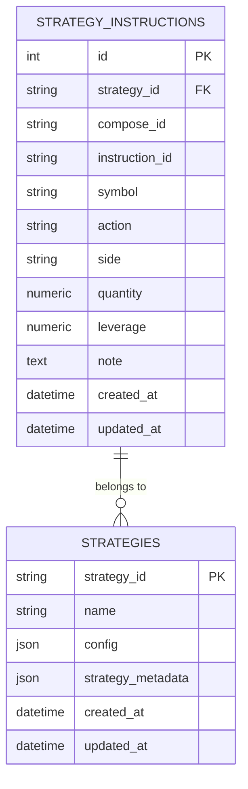
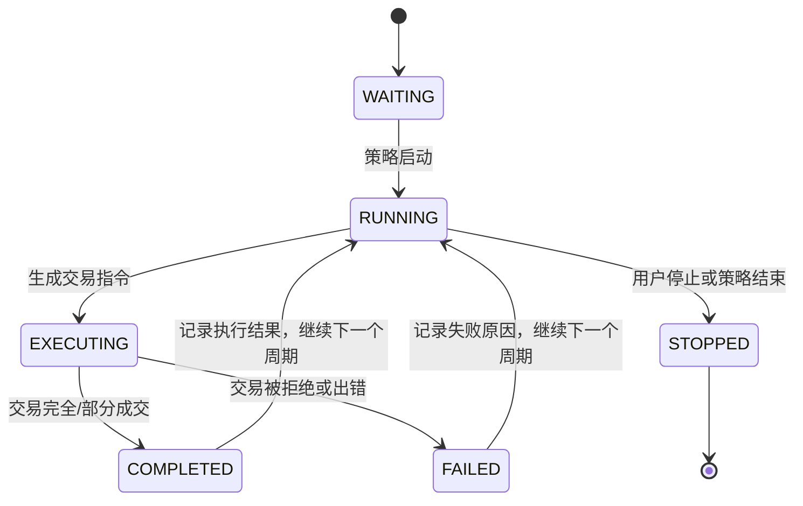
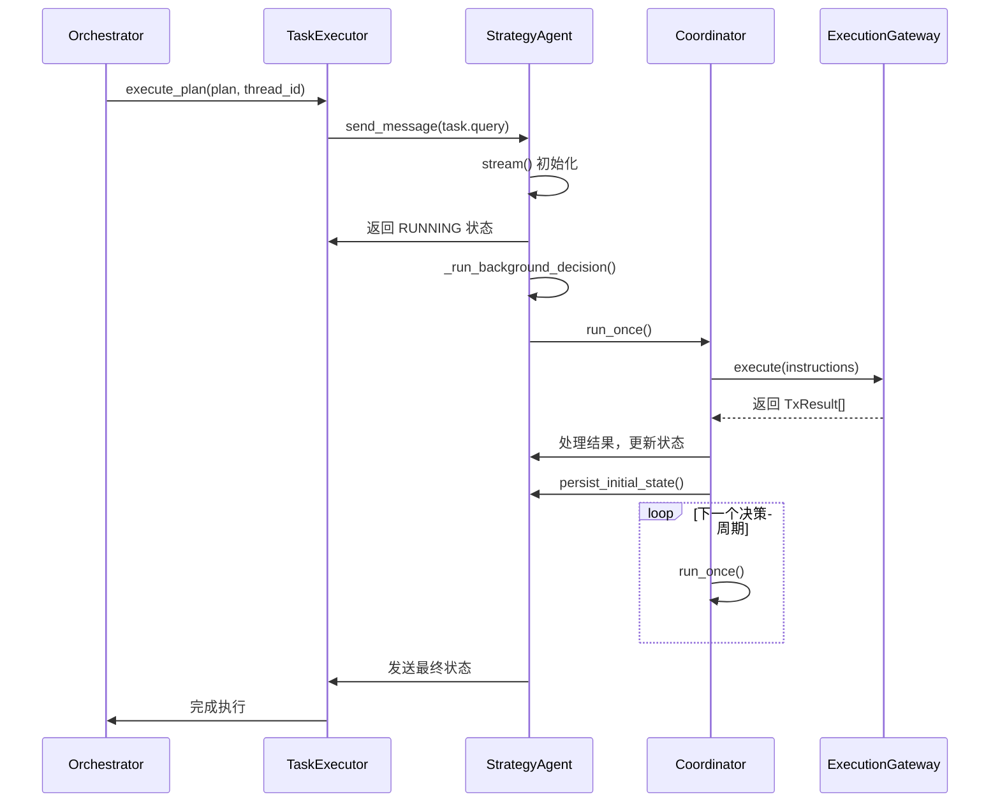

# 策略指令

<cite>
**本文档引用的文件**
- [strategy_instruction.py](file://python/valuecell/server/db/models/strategy_instruction.py)
- [coordinator.py](file://python/valuecell/agents/common/trading/_internal/coordinator.py)
- [executor.py](file://python/valuecell/core/task/executor.py)
- [strategy_service.py](file://python/valuecell/server/services/strategy_service.py)
- [base_agent.py](file://python/valuecell/agents/common/trading/base_agent.py)
- [stream_controller.py](file://python/valuecell/agents/common/trading/_internal/stream_controller.py)
- [models.py](file://python/valuecell/agents/common/trading/models.py)
</cite>

## 目录
1. [简介](#简介)
2. [策略指令模型](#策略指令模型)
3. [指令状态机与生命周期](#指令状态机与生命周期)
4. [与任务执行器的交互流程](#与任务执行器的交互流程)
5. [指令持久化与可追溯性](#指令持久化与可追溯性)
6. [高并发指令处理的数据库优化](#高并发指令处理的数据库优化)

## 简介
策略指令（StrategyInstruction）模型是ValueCell系统中智能体生成交易决策的核心数据结构。该模型负责存储由智能体在每个决策周期（compose cycle）中生成的交易指令，包括买入、卖出等操作。这些指令不仅包含交易的基本要素如交易标的（symbol）、数量（quantity）和价格限制（price_limit），还通过状态机管理指令的执行生命周期，并与任务执行器（TaskExecutor）协同工作，确保交易指令能够被正确执行和持久化。本文档将深入探讨策略指令模型的设计、状态转换逻辑、与系统其他组件的交互以及在高并发场景下的性能优化方案。

## 策略指令模型
策略指令模型定义了智能体生成的交易指令的数据结构和语义。该模型位于`python/valuecell/server/db/models/strategy_instruction.py`文件中，是一个SQLAlchemy ORM模型，映射到数据库中的`strategy_instructions`表。

### 核心字段语义
策略指令模型包含以下核心字段，用于完整描述一条交易指令：

- **strategy_id**: 字符串类型，表示运行时策略的唯一标识符。该字段是外键，关联到`strategies`表，确保指令归属于特定的策略实例。
- **compose_id**: 字符串类型，表示构成周期（compose cycle）的唯一标识符。每个决策周期都会生成一个唯一的compose_id，用于将一组相关的指令关联起来。
- **instruction_id**: 字符串类型，表示确定性的指令ID。该ID在策略的生命周期内是唯一的，用于精确追踪和引用单条指令。
- **symbol**: 字符串类型，表示交易标的的符号（如股票代码、加密货币对等）。该字段被索引以支持快速查询。
- **action**: 字符串类型，表示LLM生成的原始动作（如"open_long"、"close_short"、"noop"）。这是智能体决策的直接输出。
- **side**: 字符串类型，表示推导出的执行方向（"BUY"或"SELL"）。该字段由系统根据`action`字段计算得出，用于指导交易执行。
- **quantity**: 数值类型，表示订单数量。该字段可以为null，表示在执行时需要动态计算。
- **leverage**: 数值类型，表示杠杆倍数。适用于支持杠杆交易的市场。
- **note**: 文本类型，表示可选的指令备注。通常包含智能体生成的决策理由（rationale）。
- **created_at**: 日期时间类型，表示指令创建时间，带有时区信息，由数据库自动填充。
- **updated_at**: 日期时间类型，表示指令最后更新时间，带有时区信息，每次更新时由数据库自动更新。

**图表来源**
- [strategy_instruction.py](file://python/valuecell/server/db/models/strategy_instruction.py#L21-L74)

**本节来源**
- [strategy_instruction.py](file://python/valuecell/server/db/models/strategy_instruction.py#L21-L74)

## 指令状态机与生命周期
策略指令的执行遵循一个明确的状态机模型，确保了交易过程的可靠性和可预测性。虽然指令本身的状态在`StrategyInstruction`模型中没有直接体现，但其生命周期由相关的`StrategyStatus`和`TxStatus`枚举以及`StreamController`和`DecisionCoordinator`组件共同管理。

### 状态定义
系统定义了多个状态枚举来管理策略和交易的生命周期：

- **StrategyStatus (策略状态)**: 定义了策略实例的宏观状态。
  - `RUNNING`: 策略正在运行中。
  - `STOPPED`: 策略已停止，这是一个终止状态。
- **TxStatus (交易状态)**: 定义了单个交易指令的执行状态。
  - `PENDING`: 交易待处理。
  - `FILLED`: 交易已完全成交。
  - `PARTIAL`: 交易部分成交。
  - `REJECTED`: 交易被拒绝。
  - `ERROR`: 交易执行出错。

### 状态转换逻辑
指令的状态转换是策略执行流程的一部分，其逻辑如下：

1.  **初始化 (INITIAL)**: 当智能体生成一条新的交易指令时，它处于待执行状态。此时，`StrategyStatus`为`RUNNING`，而交易指令本身尚未被发送到执行网关。
2.  **执行中 (EXECUTING)**: `DecisionCoordinator`调用`execution_gateway.execute()`方法，将指令发送到交易执行网关。此时，系统开始监控交易的执行结果。
3.  **已完成 (COMPLETED)**: 交易执行网关返回`TxResult`。如果`TxResult.status`为`FILLED`或`PARTIAL`，则认为该指令已成功执行。执行结果（如平均成交价、手续费等）会被记录到`strategy_instruction_details`表中。
4.  **已取消/失败 (CANCELLED/FAILED)**: 如果`TxResult.status`为`REJECTED`或`ERROR`，则该指令执行失败。`DecisionCoordinator`会将失败原因（`TxResult.reason`）附加到原始决策理由（`rationale`）中，并将该指令从本次决策周期的指令列表中移除，以确保历史记录的准确性。

异常处理机制主要体现在`DecisionCoordinator`中。在执行指令后，系统会遍历所有`TxResult`，收集失败的指令ID和原因。这些失败信息会被格式化为警告消息，并追加到AI生成的`rationale`末尾，以便在前端向用户展示。同时，失败的指令不会被持久化到历史记录中，保证了策略历史的纯净性。

**图表来源**
- [models.py](file://python/valuecell/agents/common/trading/models.py#L401)
- [coordinator.py](file://python/valuecell/agents/common/trading/_internal/coordinator.py#L182-L208)
- [stream_controller.py](file://python/valuecell/agents/common/trading/_internal/stream_controller.py#L67-L95)

**本节来源**
- [models.py](file://python/valuecell/agents/common/trading/models.py#L401)
- [coordinator.py](file://python/valuecell/agents/common/trading/_internal/coordinator.py#L182-L208)
- [stream_controller.py](file://python/valuecell/agents/common/trading/_internal/stream_controller.py#L67-L95)

## 与任务执行器的交互流程
策略指令的生成和执行是整个任务执行流程的一部分，它与`TaskExecutor`组件紧密协作。`TaskExecutor`是ValueCell系统中负责执行计划和任务的核心服务。

### 交互流程
1.  **计划执行**: `Orchestrator`组件根据用户请求生成一个`ExecutionPlan`，该计划包含一个或多个`Task`。
2.  **任务执行**: `TaskExecutor`接收到`ExecutionPlan`后，会遍历其中的每个`Task`。
3.  **调用智能体**: 对于与策略相关的任务，`TaskExecutor`会通过`RemoteConnections`获取到`StrategyAgent`的客户端，并调用其`stream`方法。
4.  **启动决策循环**: `StrategyAgent`的`stream`方法会启动一个后台决策循环（`_run_background_decision`），并立即返回一个初始的`RUNNING`状态，以保持HTTP流的响应性。
5.  **协调与执行**: 后台的`DecisionCoordinator`会执行完整的决策流程：获取市场数据、生成特征、调用LLM生成指令、执行交易。在这个过程中，`StreamController`会确保策略状态在持久化层被正确标记为`RUNNING`。
6.  **结果返回**: 交易执行的结果（`TxResult`）会通过事件服务（`EventResponseService`）路由回`TaskExecutor`，最终通过流式响应返回给前端。

**图表来源**
- [executor.py](file://python/valuecell/core/task/executor.py#L112-L454)
- [base_agent.py](file://python/valuecell/agents/common/trading/base_agent.py#L125-L256)
- [coordinator.py](file://python/valuecell/agents/common/trading/_internal/coordinator.py#L105-L200)

**本节来源**
- [executor.py](file://python/valuecell/core/task/executor.py#L112-L454)
- [base_agent.py](file://python/valuecell/agents/common/trading/base_agent.py#L125-L256)
- [coordinator.py](file://python/valuecell/agents/common/trading/_internal/coordinator.py#L105-L200)

## 指令持久化与可追溯性
指令的持久化是实现策略可追溯性的基石。通过将每一条指令及其执行结果存储在数据库中，系统能够完整地重建策略的历史行为。

### 可追溯性实现
- **完整历史记录**: `strategy_instructions`表记录了所有生成的指令，而`strategy_instruction_details`表则记录了每条指令的执行详情（如成交价、手续费、盈亏等）。通过`strategy_id`和`compose_id`，可以按时间顺序回溯策略的每一个决策周期。
- **决策理由保存**: 指令的`note`字段保存了智能体生成的决策理由，这为理解过去决策的逻辑提供了宝贵的上下文。
- **状态变更追踪**: `created_at`和`updated_at`字段精确记录了指令的创建和修改时间，有助于分析策略的执行节奏。
- **组合周期关联**: `compose_id`将同一决策周期内的所有指令关联起来，使得分析一个完整决策的输入和输出成为可能。

这种设计使得用户能够查询任意策略在任意时间点的状态和历史，对于策略的复盘、审计和优化至关重要。

**本节来源**
- [strategy_instruction.py](file://python/valuecell/server/db/models/strategy_instruction.py#L21-L74)
- [strategy_service.py](file://python/valuecell/server/services/strategy_service.py#L302-L415)

## 高并发指令处理的数据库优化
为了支持高并发场景下的指令处理，数据库设计和查询逻辑进行了多项优化。

### 优化方案
1.  **索引优化**: 关键字段如`strategy_id`、`compose_id`、`instruction_id`和`symbol`都建立了数据库索引，确保了基于这些字段的查询具有O(log n)的时间复杂度。
2.  **唯一约束**: 在`strategy_id`和`instruction_id`上建立了唯一约束（`uq_strategy_instruction_id`），防止了指令的重复插入，保证了数据的完整性。
3.  **批量操作**: 在读取策略详情时，`strategy_service.py`中的`get_strategy_detail`方法会先批量获取所有指令，再通过`get_details_by_instruction_ids`一次性获取所有执行详情，减少了数据库的往返次数。
4.  **高效查询**: 使用`get_instructions_by_compose`等专用查询方法，避免了全表扫描，直接定位到特定构成周期的指令。
5.  **数据类型优化**: 使用`Numeric`类型精确存储数量和杠杆，避免了浮点数精度问题；使用`DateTime(timezone=True)`确保了时间戳的准确性。

这些优化措施共同确保了系统在处理大量并发策略和高频交易指令时，依然能够保持良好的性能和数据一致性。

**本节来源**
- [strategy_instruction.py](file://python/valuecell/server/db/models/strategy_instruction.py#L61-L67)
- [strategy_service.py](file://python/valuecell/server/services/strategy_service.py#L314-L316)