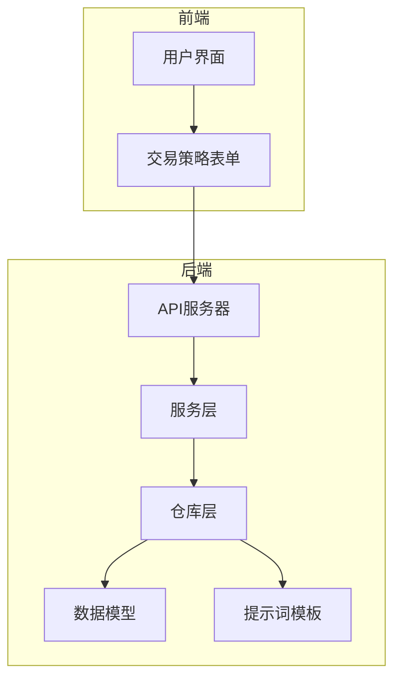
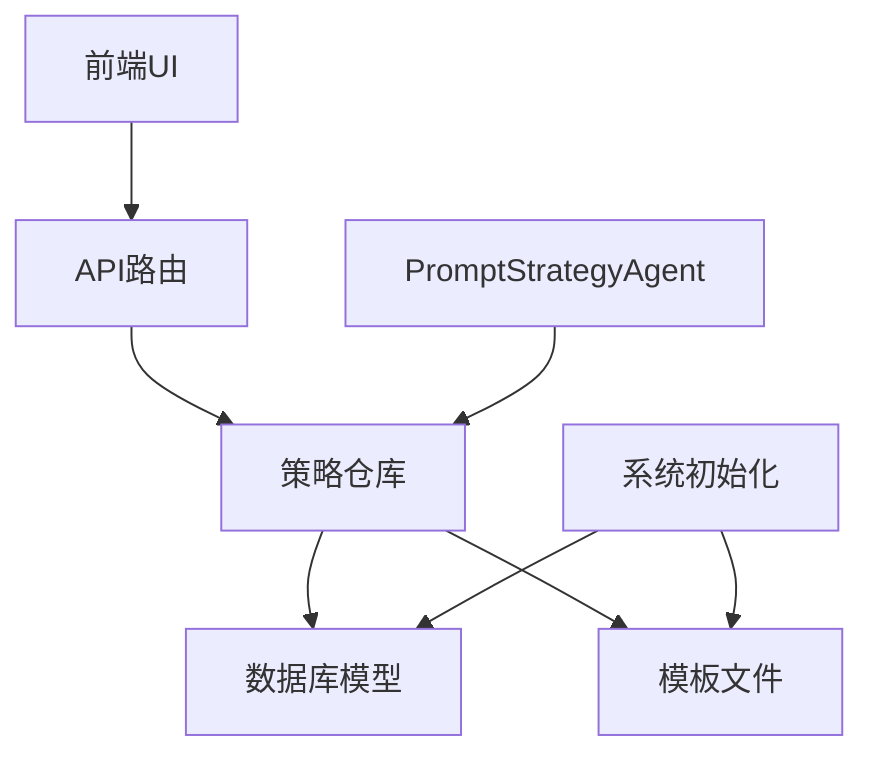
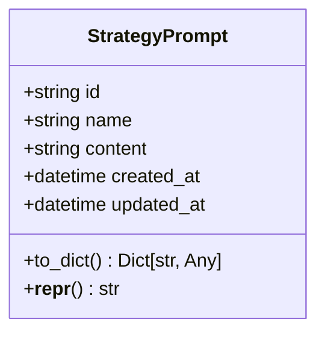
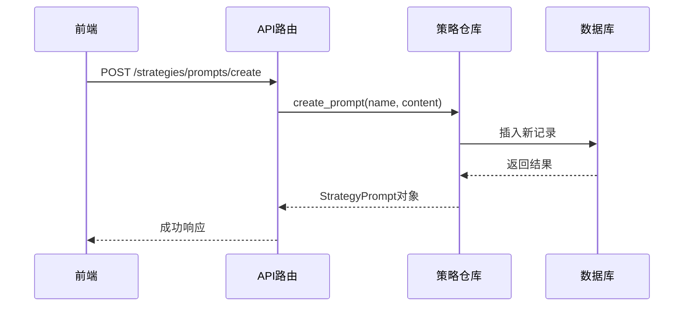
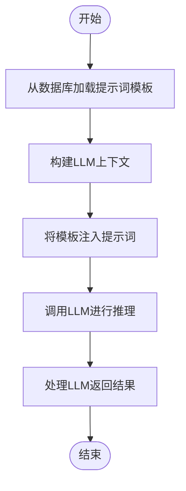
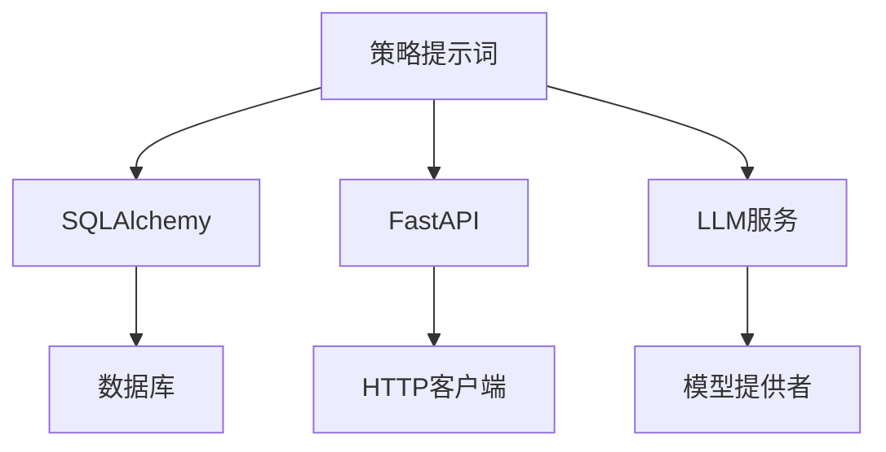

# 策略提示词

<cite>
**本文档中引用的文件**  
- [strategy_prompt.py](file://python/valuecell/server/db/models/strategy_prompt.py)
- [strategy_prompts.py](file://python/valuecell/server/api/routers/strategy_prompts.py)
- [strategy_repository.py](file://python/valuecell/server/db/repositories/strategy_repository.py)
- [core.py](file://python/valuecell/agents/prompt_strategy_agent/core.py)
- [composer.py](file://python/valuecell/agents/common/trading/decision/prompt_based/composer.py)
- [default.txt](file://python/valuecell/agents/prompt_strategy_agent/templates/default.txt)
- [aggressive.txt](file://python/valuecell/agents/prompt_strategy_agent/templates/aggressive.txt)
</cite>

## 目录
1. [简介](#简介)
2. [项目结构](#项目结构)
3. [核心组件](#核心组件)
4. [架构概述](#架构概述)
5. [详细组件分析](#详细组件分析)
6. [依赖分析](#依赖分析)
7. [性能考虑](#性能考虑)
8. [故障排除指南](#故障排除指南)
9. [结论](#结论)

## 简介
策略提示词（StrategyPrompt）模型是ValueCell系统中的核心组件，用于存储与特定交易策略关联的LLM提示词模板。该模型支持策略的个性化定制，通过可复用的提示词模板实现不同风险偏好和交易风格的策略行为。系统在初始化时会自动加载预定义的模板（如"default.txt"和"aggressive.txt"）并存入数据库，为用户提供开箱即用的策略选项。策略提示词与PromptStrategyAgent深度集成，通过模板注入机制驱动LLM推理流程，实现基于自然语言指令的智能交易决策。

## 项目结构
策略提示词功能分布在系统的多个层级中，包括后端数据库模型、API路由、服务层以及前端组件。核心逻辑位于Python后端，而用户界面则通过前端React应用提供交互。

**Diagram sources**
- [strategy_prompt.py](file://python/valuecell/server/db/models/strategy_prompt.py)
- [strategy_prompts.py](file://python/valuecell/server/api/routers/strategy_prompts.py)
- [strategy_repository.py](file://python/valuecell/server/db/repositories/strategy_repository.py)

**Section sources**
- [strategy_prompt.py](file://python/valuecell/server/db/models/strategy_prompt.py)
- [strategy_prompts.py](file://python/valuecell/server/api/routers/strategy_prompts.py)

## 核心组件
策略提示词模型的核心组件包括数据库模型`StrategyPrompt`、API路由`create_strategy_prompts_router`、仓库方法`list_prompts`和`create_prompt`，以及与`PromptBasedStrategyAgent`的集成逻辑。该模型通过`id`、`name`、`content`等字段存储提示词模板，并在系统初始化时从文件系统加载默认模板。前端通过`trading-strategy-form.tsx`组件提供用户界面，允许用户选择现有模板或创建新的提示词。

**Section sources**
- [strategy_prompt.py](file://python/valuecell/server/db/models/strategy_prompt.py)
- [strategy_prompts.py](file://python/valuecell/server/api/routers/strategy_prompts.py)
- [strategy_repository.py](file://python/valuecell/server/db/repositories/strategy_repository.py)
- [trading-strategy-form.tsx](file://frontend/src/components/valuecell/form/trading-strategy-form.tsx)

## 架构概述
策略提示词系统的架构分为四层：表示层（前端UI）、应用层（FastAPI路由）、领域服务层（仓库和策略服务）以及数据层（SQLAlchemy模型和文件系统）。当系统启动时，`init_db.py`会检查并加载预定义的提示词模板到数据库中。用户可以通过API创建、列出提示词，而`PromptBasedStrategyAgent`在运行时会根据策略配置加载相应的提示词模板并注入LLM推理流程。

**Diagram sources**
- [strategy_prompt.py](file://python/valuecell/server/db/models/strategy_prompt.py)
- [strategy_prompts.py](file://python/valuecell/server/api/routers/strategy_prompts.py)
- [strategy_repository.py](file://python/valuecell/server/db/repositories/strategy_repository.py)
- [init_db.py](file://python/valuecell/server/db/init_db.py)
- [core.py](file://python/valuecell/agents/prompt_strategy_agent/core.py)

## 详细组件分析

### 策略提示词模型分析
`StrategyPrompt`模型是存储提示词模板的核心数据结构，它定义了提示词的基本属性和生命周期。

**Diagram sources**
- [strategy_prompt.py](file://python/valuecell/server/db/models/strategy_prompt.py#L16-L47)

**Section sources**
- [strategy_prompt.py](file://python/valuecell/server/db/models/strategy_prompt.py#L1-L48)

### API与服务集成分析
策略提示词的API提供了创建和列出提示词的功能，这些功能通过策略仓库与数据库模型进行交互。

**Diagram sources**
- [strategy_prompts.py](file://python/valuecell/server/api/routers/strategy_prompts.py#L47-L69)
- [strategy_repository.py](file://python/valuecell/server/db/repositories/strategy_repository.py#L550-L565)

### 提示词加载与注入流程
`PromptBasedStrategyAgent`通过`LlmComposer`将存储的提示词模板注入LLM推理流程，实现策略行为的定制化。

**Diagram sources**
- [core.py](file://python/valuecell/agents/prompt_strategy_agent/core.py#L19-L54)
- [composer.py](file://python/valuecell/agents/common/trading/decision/prompt_based/composer.py#L90-L120)

## 依赖分析
策略提示词系统依赖于SQLAlchemy进行数据库操作，FastAPI提供RESTful API，以及LLM服务进行推理。系统通过`get_strategy_repository`全局实例管理数据库会话，确保资源的有效利用。

**Diagram sources**
- [strategy_prompt.py](file://python/valuecell/server/db/models/strategy_prompt.py)
- [strategy_prompts.py](file://python/valuecell/server/api/routers/strategy_prompts.py)
- [composer.py](file://python/valuecell/agents/common/trading/decision/prompt_based/composer.py)

**Section sources**
- [strategy_repository.py](file://python/valuecell/server/db/repositories/strategy_repository.py#L634-L648)

## 性能考虑
策略提示词系统的性能主要受数据库查询和LLM推理延迟的影响。系统通过会话管理优化数据库访问，并通过缓存机制减少对LLM的频繁调用。提示词模板的加载是一次性操作，在系统初始化时完成，避免了运行时的文件I/O开销。

## 故障排除指南
常见问题包括提示词模板无法加载、API调用失败和LLM推理超时。检查日志中的错误信息，确保数据库连接正常，模板文件存在且格式正确。对于LLM相关问题，验证API密钥和模型配置。

**Section sources**
- [init_db.py](file://python/valuecell/server/db/init_db.py#L503-L585)
- [strategy_prompts.py](file://python/valuecell/server/api/routers/strategy_prompts.py#L56-L67)

## 结论
策略提示词模型为ValueCell系统提供了灵活的策略定制能力，通过结构化的模板管理和高效的注入机制，实现了策略行为的可重现性和可配置性。该设计支持快速迭代和A/B测试不同的交易策略，为用户提供了强大的个性化工具。