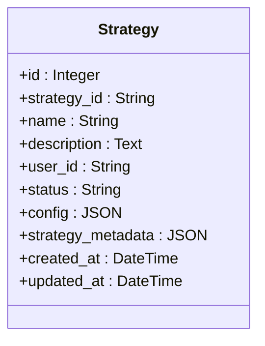
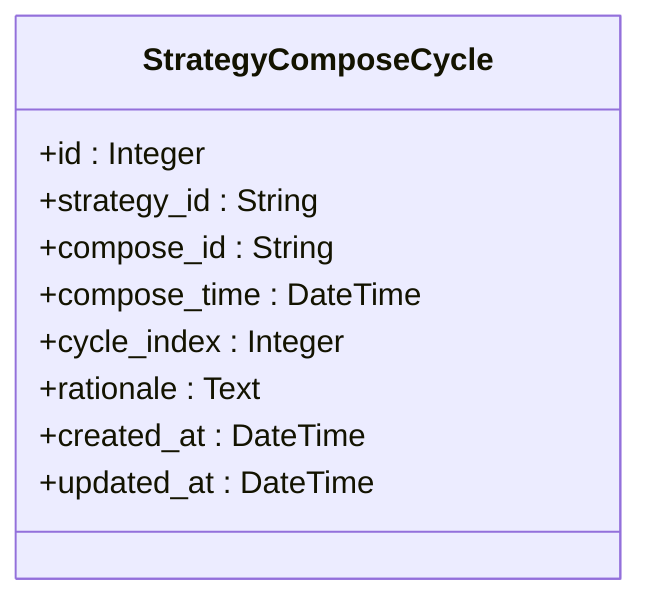
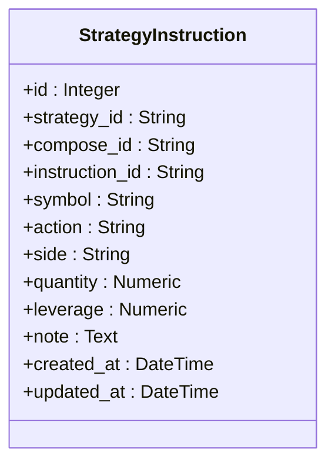
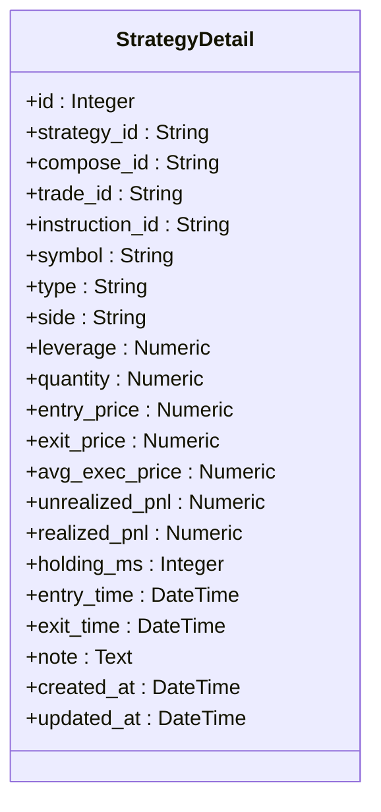
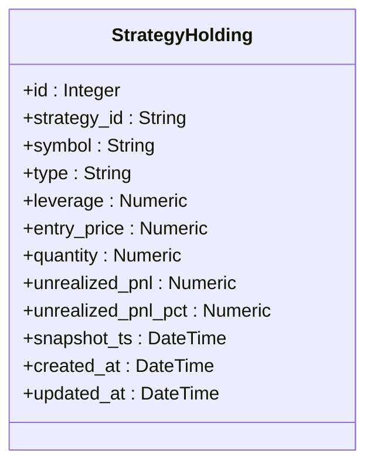
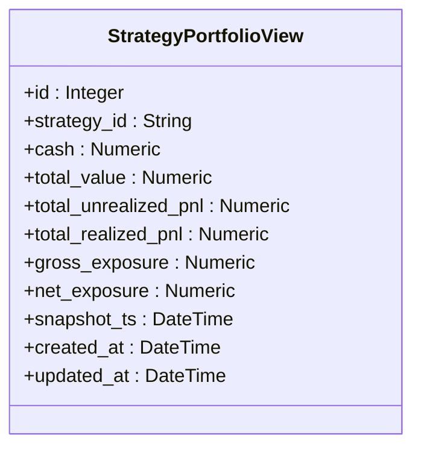
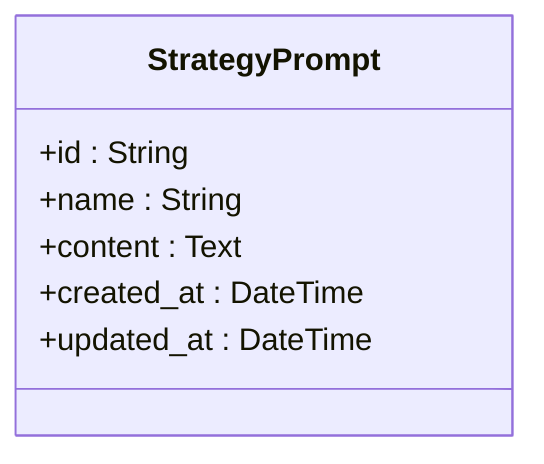
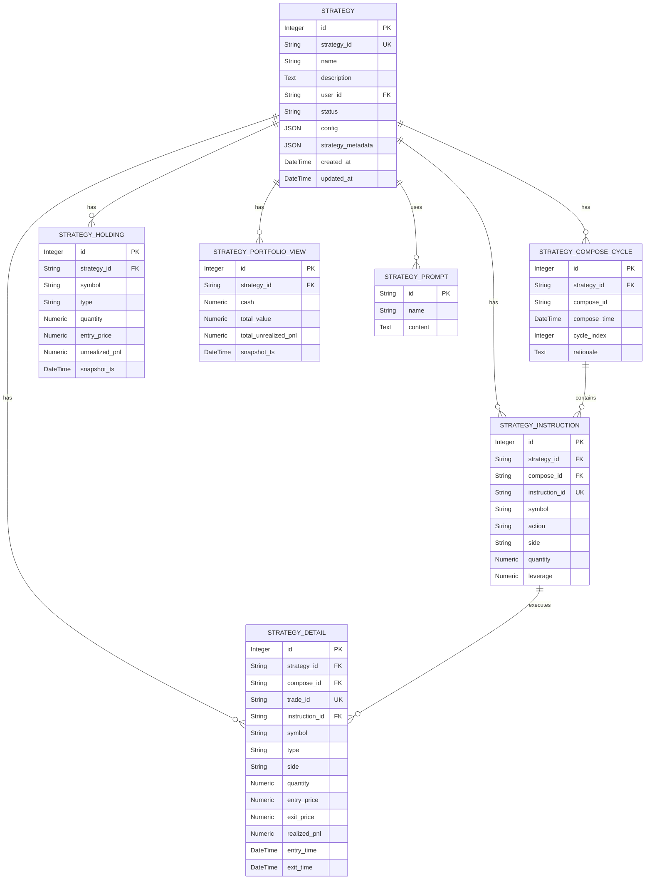
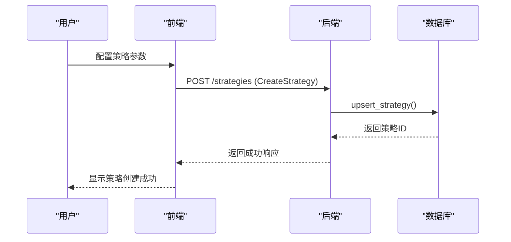

# 策略模型

<cite>
**本文档引用的文件**
- [strategy.py](file://python/valuecell/server/db/models/strategy.py)
- [strategy_detail.py](file://python/valuecell/server/db/models/strategy_detail.py)
- [strategy_holding.py](file://python/valuecell/server/db/models/strategy_holding.py)
- [strategy_instruction.py](file://python/valuecell/server/db/models/strategy_instruction.py)
- [strategy_prompt.py](file://python/valuecell/server/db/models/strategy_prompt.py)
- [strategy_portfolio.py](file://python/valuecell/server/db/models/strategy_portfolio.py)
- [strategy_compose_cycle.py](file://python/valuecell/server/db/models/strategy_compose_cycle.py)
- [strategy_repository.py](file://python/valuecell/server/db/repositories/strategy_repository.py)
- [strategy.py](file://python/valuecell/server/api/routers/strategy.py)
- [strategy_service.py](file://python/valuecell/server/services/strategy_service.py)
- [strategy.py](file://python/valuecell/server/api/schemas/strategy.py)
- [trading-strategy-form.tsx](file://frontend/src/components/valuecell/form/trading-strategy-form.tsx)
- [strategy.ts](file://frontend/src/types/strategy.ts)
</cite>

## 目录
1. [简介](#简介)
2. [核心数据结构](#核心数据结构)
3. [策略主模型](#策略主模型)
4. [策略子模型](#策略子模型)
5. [数据库关系图](#数据库关系图)
6. [数据流与业务流程](#数据流与业务流程)
7. [查询性能优化](#查询性能优化)
8. [结论](#结论)

## 简介

本策略模型文档详细阐述了ValueCell系统中策略（Strategy）及其相关子模型的完整数据结构。策略模型是系统的核心，用于管理由策略代理（StrategyAgent）创建和执行的交易策略。该模型通过主模型`Strategy`与多个细节表建立外键关联，实现了灵活的策略配置、持久化存储和状态管理。

策略模型的设计支持多种策略类型，包括基于提示词的策略（PromptBasedStrategy）和网格策略（GridStrategy），并能够记录策略的完整生命周期，从创建、执行到回溯分析。模型通过`strategy_id`作为全局唯一标识符，将策略的元数据、配置、持仓、交易指令和绩效数据统一关联。

**Section sources**
- [strategy.py](file://python/valuecell/server/db/models/strategy.py#L1-L74)

## 核心数据结构

策略模型的核心是一个主从（Master-Detail）架构。`Strategy`表作为主表，存储策略的全局信息和状态。多个细节表（Detail Tables）通过`strategy_id`外键与主表关联，分别记录不同维度的策略数据。

这种设计实现了关注点分离（Separation of Concerns）：
- **主表（Strategy）**：负责策略的生命周期管理、所有权和全局配置。
- **细节表**：负责存储特定领域的详细数据，如交易记录、持仓快照、执行指令等。

所有模型均继承自`Base`类，使用SQLAlchemy ORM进行定义。关键数据类型包括：
- `String`：用于存储标识符、名称和状态。
- `JSON`：用于存储灵活的配置和元数据。
- `Numeric`：用于存储高精度的金融数值，如价格、数量和盈亏。
- `DateTime(timezone=True)`：用于存储带有时区的时间戳，确保时间数据的准确性。

**Section sources**
- [base.py](file://python/valuecell/server/db/models/base.py#L1-L11)

## 策略主模型

`Strategy`模型是整个策略体系的根实体，代表一个由策略代理创建的交易策略实例。

**Diagram sources**
- [strategy.py](file://python/valuecell/server/db/models/strategy.py#L15-L74)

### 字段业务含义

| 字段 | 业务含义 |
| :--- | :--- |
| `id` | 数据库自增主键，用于内部引用。 |
| `strategy_id` | 策略的运行时唯一标识符，是与其他所有细节表关联的关键外键。 |
| `name` | 用户自定义的策略名称，用于在UI中显示。 |
| `description` | 策略的可选描述，提供额外信息。 |
| `user_id` | 策略所有者的用户ID，用于权限控制和数据隔离。 |
| `status` | 策略的当前状态，如"running"（运行中）或"stopped"（已停止）。 |
| `config` | 存储用户请求的原始配置，包含LLM模型、交易所和交易配置。 |
| `strategy_metadata` | 存储策略运行时的附加元数据，如代理名称、模型提供商、停止原因等。 |
| `created_at` | 策略创建的时间戳。 |
| `updated_at` | 策略最后更新的时间戳，由数据库自动维护。 |

### 数据验证规则

- `strategy_id`：必须唯一且非空，并建立索引以保证查询性能。
- `status`：默认值为"running"，确保新创建的策略处于运行状态。
- `created_at` 和 `updated_at`：使用数据库函数`func.now()`自动设置，确保时间戳的准确性。

### 状态转换逻辑

策略的状态主要通过API进行管理。`stop_strategy`端点可以将策略状态从"running"更新为"stopped"。状态转换是幂等的，即重复调用不会产生副作用。状态信息也用于前端的策略列表过滤和显示。

**Section sources**
- [strategy.py](file://python/valuecell/server/db/models/strategy.py#L15-L74)
- [strategy.py](file://python/valuecell/server/api/routers/strategy.py#L487-L524)

## 策略子模型

策略子模型用于存储与主策略相关的详细数据，每个子模型都通过`strategy_id`外键与`Strategy`主表关联。

### 策略组合周期（StrategyComposeCycle）

`StrategyComposeCycle`模型代表策略的一次组合周期（compose cycle）。每次策略代理进行决策时，都会创建一个组合周期。

**Diagram sources**
- [strategy_compose_cycle.py](file://python/valuecell/server/db/models/strategy_compose_cycle.py#L21-L76)

- `compose_id`：组合周期的唯一标识符，用于关联该周期内的所有指令和交易。
- `cycle_index`：周期的1-based索引，用于按顺序排列决策周期。
- `rationale`：可选的LLM推理文本，解释该周期的决策原因。

### 策略指令（StrategyInstruction）

`StrategyInstruction`模型代表在一次组合周期中产生的指令。这些指令是LLM决策的直接输出。

**Diagram sources**
- [strategy_instruction.py](file://python/valuecell/server/db/models/strategy_instruction.py#L22-L75)

- `action`：LLM的动作，如"open_long"、"close_short"或"noop"。
- `side`：推导出的执行方向，"BUY"或"SELL"。
- `instruction_id`：指令的确定性ID，确保唯一性。

### 策略细节（StrategyDetail）

`StrategyDetail`模型记录了与策略相关的具体交易或持仓细节。它是最详细的交易记录表。

**Diagram sources**
- [strategy_detail.py](file://python/valuecell/server/db/models/strategy_detail.py#L25-L166)

- `trade_id`：交易的唯一标识符，与`strategy_id`共同构成唯一约束。
- `avg_exec_price`：填充的平均执行价格。
- `realized_pnl`：交易关闭时实现的盈亏。

### 策略持仓（StrategyHolding）

`StrategyHolding`模型存储策略在特定时间点的持仓快照。它提供了一个简化的持仓视图。

**Diagram sources**
- [strategy_holding.py](file://python/valuecell/server/db/models/strategy_holding.py#L24-L112)

- `snapshot_ts`：快照的时间戳，与`strategy_id`和`symbol`共同构成唯一约束。
- 该表不存储已关闭的仓位，仅反映当前的持仓状态。

### 策略投资组合视图（StrategyPortfolioView）

`StrategyPortfolioView`模型存储策略在特定时间点的聚合投资组合快照，包括现金、总价值和盈亏。

**Diagram sources**
- [strategy_portfolio.py](file://python/valuecell/server/db/models/strategy_portfolio.py#L25-L122)

- `total_value`：投资组合的总价值（权益）。
- `snapshot_ts`：快照的时间戳，与`strategy_id`共同构成唯一约束。

### 策略提示词（StrategyPrompt）

`StrategyPrompt`模型存储可重用的策略提示词文本，支持用户创建和管理自定义提示。

**Diagram sources**
- [strategy_prompt.py](file://python/valuecell/server/db/models/strategy_prompt.py#L16-L48)

- `id`：使用UUID生成的主键，格式为"prompt-{uuid}"。
- 该表目前不包含版本控制或权限管理。

**Section sources**
- [strategy_compose_cycle.py](file://python/valuecell/server/db/models/strategy_compose_cycle.py#L21-L76)
- [strategy_instruction.py](file://python/valuecell/server/db/models/strategy_instruction.py#L22-L75)
- [strategy_detail.py](file://python/valuecell/server/db/models/strategy_detail.py#L25-L166)
- [strategy_holding.py](file://python/valuecell/server/db/models/strategy_holding.py#L24-L112)
- [strategy_portfolio.py](file://python/valuecell/server/db/models/strategy_portfolio.py#L25-L122)
- [strategy_prompt.py](file://python/valuecell/server/db/models/strategy_prompt.py#L16-L48)

## 数据库关系图

下图展示了策略模型及其与用户、资产（通过symbol体现）和交易周期之间的关联。

**Diagram sources**
- [strategy.py](file://python/valuecell/server/db/models/strategy.py#L15-L74)
- [strategy_compose_cycle.py](file://python/valuecell/server/db/models/strategy_compose_cycle.py#L21-L76)
- [strategy_instruction.py](file://python/valuecell/server/db/models/strategy_instruction.py#L22-L75)
- [strategy_detail.py](file://python/valuecell/server/db/models/strategy_detail.py#L25-L166)
- [strategy_holding.py](file://python/valuecell/server/db/models/strategy_holding.py#L24-L112)
- [strategy_portfolio.py](file://python/valuecell/server/db/models/strategy_portfolio.py#L25-L122)
- [strategy_prompt.py](file://python/valuecell/server/db/models/strategy_prompt.py#L16-L48)

## 数据流与业务流程

### 策略创建流程

1.  **前端配置**：用户在前端通过`TradingStrategyForm`组件配置策略参数，包括策略类型、名称、初始资金、最大杠杆、交易符号和提示词模板ID。
2.  **API调用**：前端将配置数据作为`CreateStrategy`对象发送到后端API。
3.  **持久化**：后端的`StrategyRepository`接收到请求后，调用`upsert_strategy`方法，将策略信息（包括`config`和`strategy_metadata`）持久化到`strategies`表中。

**Diagram sources**
- [trading-strategy-form.tsx](file://frontend/src/components/valuecell/form/trading-strategy-form.tsx#L24-L211)
- [strategy.py](file://python/valuecell/server/api/routers/strategy.py#L42-L211)
- [strategy_repository.py](file://python/valuecell/server/db/repositories/strategy_repository.py#L76-L128)

### 策略执行流程

1.  **决策周期**：策略代理启动一个组合周期，创建`StrategyComposeCycle`记录。
2.  **生成指令**：LLM根据市场数据和提示词生成交易指令，每条指令被记录为`StrategyInstruction`。
3.  **执行交易**：执行引擎处理指令，进行实际交易，并将交易结果记录为`StrategyDetail`。
4.  **更新快照**：在周期结束时，系统更新`StrategyHolding`和`StrategyPortfolioView`的快照。

### 策略回溯流程

1.  **获取详情**：前端调用`GET /strategies/detail`端点，传入`strategy_id`。
2.  **服务层聚合**：`StrategyService.get_strategy_detail`方法被调用，它通过`StrategyRepository`获取所有组合周期、指令和交易细节。
3.  **数据关联**：服务层将`StrategyComposeCycle`、`StrategyInstruction`和`StrategyDetail`的数据进行关联和聚合，形成一个包含完整决策和执行历史的响应。
4.  **返回结果**：聚合后的数据通过API返回给前端，用于在UI中展示策略的详细回溯信息。

**Section sources**
- [strategy.py](file://python/valuecell/server/api/routers/strategy.py#L330-L356)
- [strategy_service.py](file://python/valuecell/server/services/strategy_service.py#L302-L415)
- [strategy_repository.py](file://python/valuecell/server/db/repositories/strategy_repository.py#L448-L510)

## 查询性能优化

策略模型的查询性能通过以下方式优化：

1.  **索引优化**：
    - 所有外键字段（如`strategy_id`、`compose_id`）和常用查询字段（如`status`、`user_id`）都建立了数据库索引。
    - `strategy_id`和`trade_id`在`StrategyDetail`表上构成唯一约束，确保了查询的高效性。

2.  **数据聚合**：
    - 使用`StrategyPortfolioView`和`StrategyHolding`表存储聚合快照，避免了在查询时进行复杂的实时计算。
    - `get_strategy_holding_price_curve` API通过预聚合的投资组合快照来生成收益曲线，显著提高了查询速度。

3.  **分页与过滤**：
    - `get_strategies`端点支持通过`user_id`、`status`和模糊搜索进行过滤，减少了返回的数据量。
    - `limit`参数用于限制返回的策略数量，防止一次性加载过多数据。

4.  **服务层缓存**：
    - `StrategyService`中的方法（如`get_strategy_performance`）会从多个表中聚合数据，但通过一次性的数据库查询和内存中的数据处理，减少了数据库的往返次数。

**Section sources**
- [strategy.py](file://python/valuecell/server/api/routers/strategy.py#L43-L211)
- [strategy_service.py](file://python/valuecell/server/services/strategy_service.py#L200-L301)

## 结论

ValueCell的策略模型通过一个精心设计的主从架构，实现了对交易策略的全面、灵活和高效的管理。`Strategy`主模型作为核心，通过外键关联多个细节表，将策略的配置、状态、执行历史和绩效数据有机地组织在一起。这种设计不仅支持复杂的业务逻辑，如多周期决策和持仓管理，还通过索引、数据聚合和优化的查询逻辑确保了良好的查询性能。该模型为策略的创建、执行、监控和回溯分析提供了坚实的数据基础。