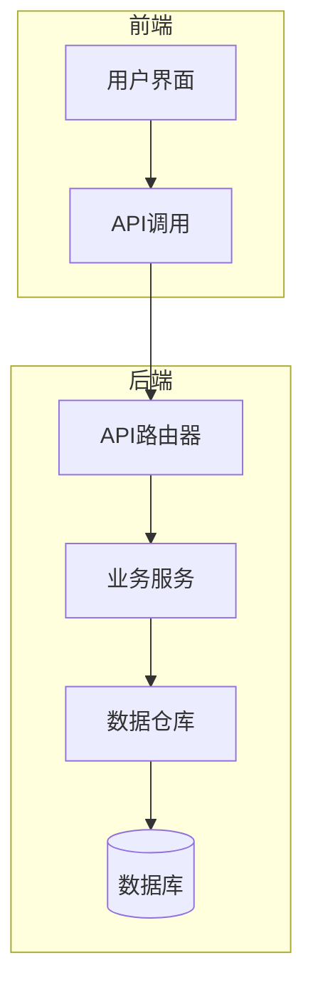
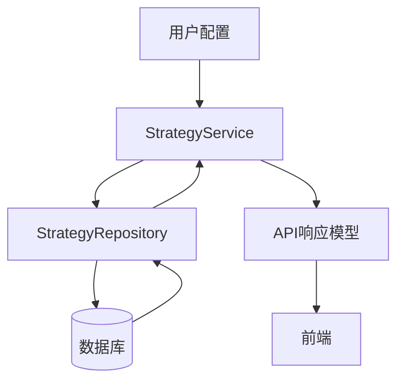
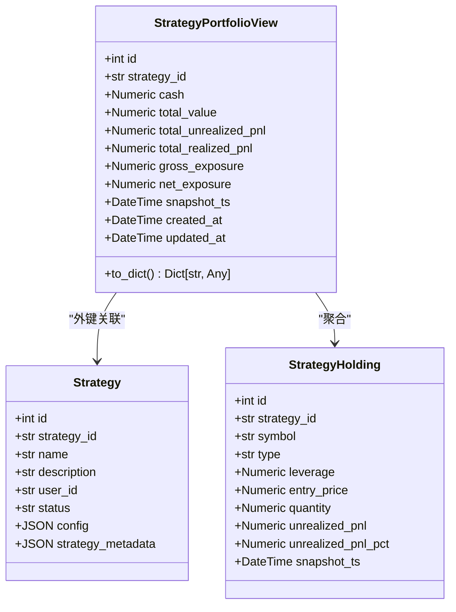
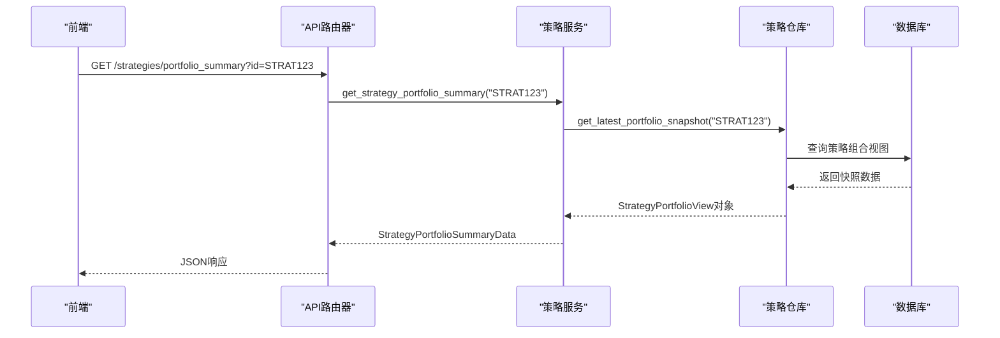
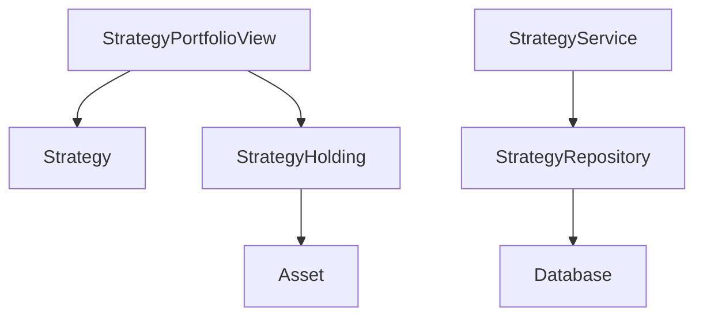

# 策略组合

<cite>
**本文档引用的文件**
- [strategy_portfolio.py](file://python/valuecell/server/db/models/strategy_portfolio.py)
- [strategy.py](file://python/valuecell/server/db/models/strategy.py)
- [asset.py](file://python/valuecell/server/db/models/asset.py)
- [strategy_repository.py](file://python/valuecell/server/db/repositories/strategy_repository.py)
- [strategy_service.py](file://python/valuecell/server/services/strategy_service.py)
- [strategy.py](file://python/valuecell/server/api/routers/strategy.py)
- [strategy.py](file://python/valuecell/server/api/schemas/strategy.py)
- [in_memory.py](file://python/valuecell/agents/common/trading/portfolio/in_memory.py)
- [default.txt](file://python/valuecell/agents/prompt_strategy_agent/templates/default.txt)
- [core.py](file://python/valuecell/agents/prompt_strategy_agent/core.py)
</cite>

## 目录
1. [简介](#简介)
2. [项目结构](#项目结构)
3. [核心组件](#核心组件)
4. [架构概述](#架构概述)
5. [详细组件分析](#详细组件分析)
6. [依赖分析](#依赖分析)
7. [性能考虑](#性能考虑)
8. [故障排除指南](#故障排除指南)
9. [结论](#结论)
10. [附录](#附录)（如有必要）

## 简介
本文档详细阐述了ValueCell系统中策略组合（StrategyPortfolio）模型的设计与实现。该模型作为量化交易系统的核心组成部分，负责定义和管理投资策略的资产配置、风险敞口及再平衡规则。文档将深入解析模型的关键字段如portfolio_id、strategy_id、asset_class、allocation_weight、rebalance_threshold的业务逻辑，阐明其与资产模型（Asset）的关联关系，以及在动态调仓中的作用。通过实际配置示例，说明如何利用该模型实现多资产策略配置，并分析其在策略回测与实盘执行中的数据访问模式，最后提供查询性能优化建议。

## 项目结构
ValueCell项目采用分层架构，主要分为前端（frontend）和后端（python）两大部分。后端Python代码库中，`server/db/models`目录定义了核心数据模型，包括`strategy_portfolio.py`（策略组合视图）、`strategy.py`（策略主表）和`asset.py`（资产模型）。`server/db/repositories`目录提供了对这些模型的数据库访问接口，而`server/services`和`server/api/routers`则分别实现了业务逻辑和API路由。前端代码位于`frontend/src`目录，通过API与后端交互，展示策略组合信息。

**图表来源**
- [strategy.py](file://python/valuecell/server/api/routers/strategy.py#L1-L451)
- [strategy_service.py](file://python/valuecell/server/services/strategy_service.py#L1-L217)
- [strategy_repository.py](file://python/valuecell/server/db/repositories/strategy_repository.py#L1-L648)

**章节来源**
- [strategy.py](file://python/valuecell/server/api/routers/strategy.py#L1-L451)
- [project_structure](#project_structure)

## 核心组件
策略组合模型的核心在于`StrategyPortfolioView`类，它存储了特定时间点下策略的聚合投资组合快照，包括现金余额、总价值和未实现盈亏等关键指标。该模型与`Strategy`主表通过`strategy_id`外键关联，确保了策略配置与实际持仓数据的一致性。`StrategyHolding`模型则记录了按符号划分的详细持仓信息，两者共同构成了完整的投资组合视图。

**章节来源**
- [strategy_portfolio.py](file://python/valuecell/server/db/models/strategy_portfolio.py#L1-L122)
- [strategy_holding.py](file://python/valuecell/server/db/models/strategy_holding.py#L1-L112)

## 架构概述
策略组合模型的架构设计遵循了高内聚、低耦合的原则。`StrategyPortfolioView`作为聚合根，通过`strategy_id`与`Strategy`实体建立关联，同时与`Asset`模型通过`symbol`字段间接关联，实现了策略与底层资产的连接。数据流从用户配置开始，经由`StrategyService`处理，最终通过`StrategyRepository`持久化到数据库。查询时，`StrategyService`从`StrategyRepository`获取数据，并将其转换为前端所需的`StrategyPortfolioSummaryData`等API响应模型。

**图表来源**
- [strategy_service.py](file://python/valuecell/server/services/strategy_service.py#L1-L217)
- [strategy_repository.py](file://python/valuecell/server/db/repositories/strategy_repository.py#L1-L648)
- [strategy.py](file://python/valuecell/server/api/schemas/strategy.py#L1-L276)

## 详细组件分析

### 策略组合模型分析
`StrategyPortfolioView`模型是策略组合的核心，它记录了策略在特定时间点的聚合状态。其关键字段包括：
- `strategy_id`: 策略的运行时标识符，作为与`Strategy`主表关联的外键。
- `cash`: 快照时刻的现金余额。
- `total_value`: 投资组合的总价值（股权）。
- `total_unrealized_pnl`: 总未实现盈亏。
- `gross_exposure`和`net_exposure`: 分别表示总风险敞口和净风险敞口。
- `snapshot_ts`: 快照时间戳，用于时间序列分析。

该模型通过`add_portfolio_snapshot`方法由`StrategyRepository`创建，并通过`get_latest_portfolio_snapshot`等方法进行查询。它与`StrategyHolding`模型协同工作，前者提供宏观视图，后者提供微观细节。

#### 类图

**图表来源**
- [strategy_portfolio.py](file://python/valuecell/server/db/models/strategy_portfolio.py#L24-L122)
- [strategy.py](file://python/valuecell/server/db/models/strategy.py#L15-L44)
- [strategy_holding.py](file://python/valuecell/server/db/models/strategy_holding.py#L24-L112)

#### 序列图

**图表来源**
- [strategy.py](file://python/valuecell/server/api/routers/strategy.py#L232-L266)
- [strategy_service.py](file://python/valuecell/server/services/strategy_service.py#L29-L37)
- [strategy_repository.py](file://python/valuecell/server/db/repositories/strategy_repository.py#L278-L283)

**章节来源**
- [strategy_portfolio.py](file://python/valuecell/server/db/models/strategy_portfolio.py#L1-L122)
- [strategy_service.py](file://python/valuecell/server/services/strategy_service.py#L1-L217)

### 资产模型关联分析
`StrategyPortfolioView`模型通过`symbol`字段与`Asset`模型建立间接关联。当策略持有某个资产时，`StrategyHolding`表中会记录该资产的`symbol`，而`Asset`表则存储了该资产的详细信息，如名称、类型、当前价格等。这种设计实现了策略组合与基础资产数据的解耦，使得资产信息的更新不会直接影响历史持仓记录。

**章节来源**
- [asset.py](file://python/valuecell/server/db/models/asset.py#L1-L128)
- [strategy_holding.py](file://python/valuecell/server/db/models/strategy_holding.py#L1-L112)

## 依赖分析
策略组合模型的依赖关系清晰明了。`StrategyPortfolioView`直接依赖于`Strategy`模型，通过`strategy_id`外键建立强关联。它与`Asset`模型的依赖是间接的，通过`StrategyHolding`中的`symbol`字段实现。在服务层，`StrategyService`依赖于`StrategyRepository`来访问数据，而`StrategyRepository`又依赖于数据库连接。这种分层依赖确保了系统的可维护性和可测试性。

**图表来源**
- [strategy_portfolio.py](file://python/valuecell/server/db/models/strategy_portfolio.py#L32-L38)
- [asset.py](file://python/valuecell/server/db/models/asset.py#L29-L35)
- [strategy_holding.py](file://python/valuecell/server/db/models/strategy_holding.py#L45-L50)
- [strategy_repository.py](file://python/valuecell/server/db/repositories/strategy_repository.py#L14-L22)

**章节来源**
- [strategy_portfolio.py](file://python/valuecell/server/db/models/strategy_portfolio.py#L1-L122)
- [strategy_repository.py](file://python/valuecell/server/db/repositories/strategy_repository.py#L1-L648)

## 性能考虑
在策略回测与实盘执行中，对策略组合数据的访问模式主要为时间序列查询和最新状态查询。对于时间序列分析，系统会调用`get_portfolio_snapshots`方法获取指定策略的历史快照，这可能涉及大量数据的读取。对于实时监控，系统频繁调用`get_latest_portfolio_snapshot`获取最新状态，这对查询性能要求较高。为了优化性能，建议在`strategy_id`和`snapshot_ts`字段上建立复合索引，并考虑对历史数据进行归档或聚合。

**章节来源**
- [strategy_repository.py](file://python/valuecell/server/db/repositories/strategy_repository.py#L233-L257)
- [strategy_service.py](file://python/valuecell/server/services/strategy_service.py#L29-L37)

## 故障排除指南
当遇到策略组合数据显示异常时，应首先检查`StrategyPortfolioView`表中是否存在对应`strategy_id`的记录。如果记录缺失，可能是`add_portfolio_snapshot`方法未被正确调用。如果数据显示不一致，应检查`StrategyHolding`和`StrategyPortfolioView`的快照时间戳（`snapshot_ts`）是否同步。此外，还需确认`StrategyRepository`的事务处理是否正常，以避免数据写入失败。

**章节来源**
- [strategy_repository.py](file://python/valuecell/server/db/repositories/strategy_repository.py#L168-L197)
- [strategy_portfolio.py](file://python/valuecell/server/db/models/strategy_portfolio.py#L57-L62)

## 结论
策略组合（StrategyPortfolio）模型是ValueCell量化交易系统中至关重要的组成部分，它通过`StrategyPortfolioView`实体提供了策略投资组合的聚合视图。该模型设计合理，通过与`Strategy`和`Asset`模型的关联，实现了策略配置、持仓明细和基础资产信息的有机整合。其数据访问模式清晰，既支持实时监控也支持历史回测。通过合理的索引和数据管理策略，可以确保系统在高并发场景下的性能表现。未来可考虑引入更复杂的再平衡规则和风险敞口限制，以满足更高级的量化策略需求。