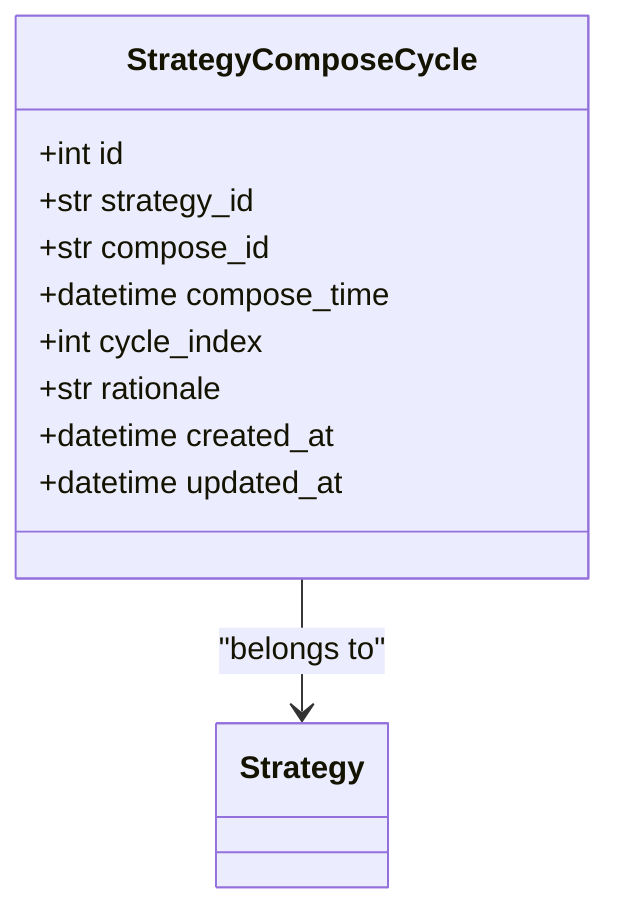
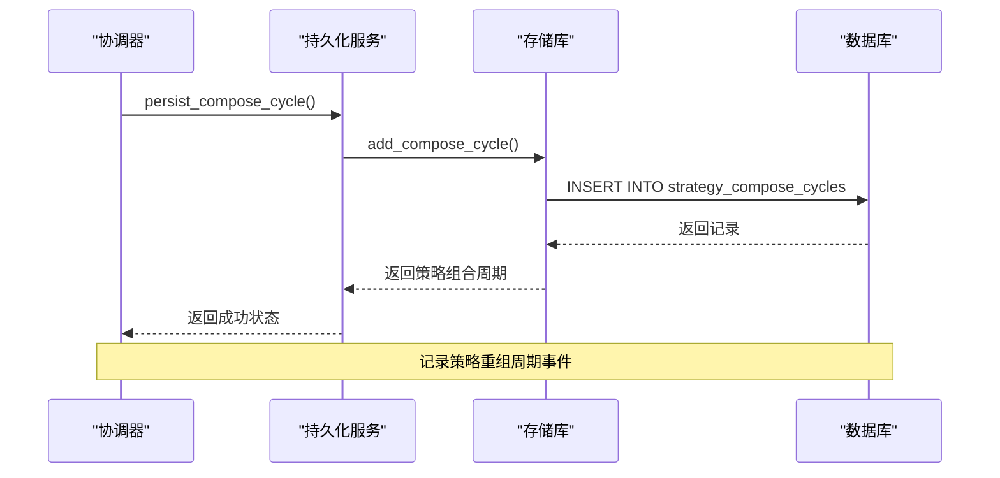
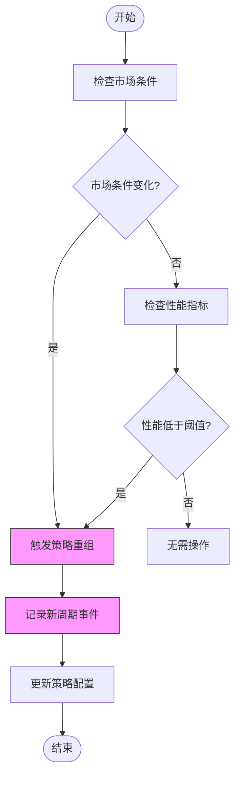
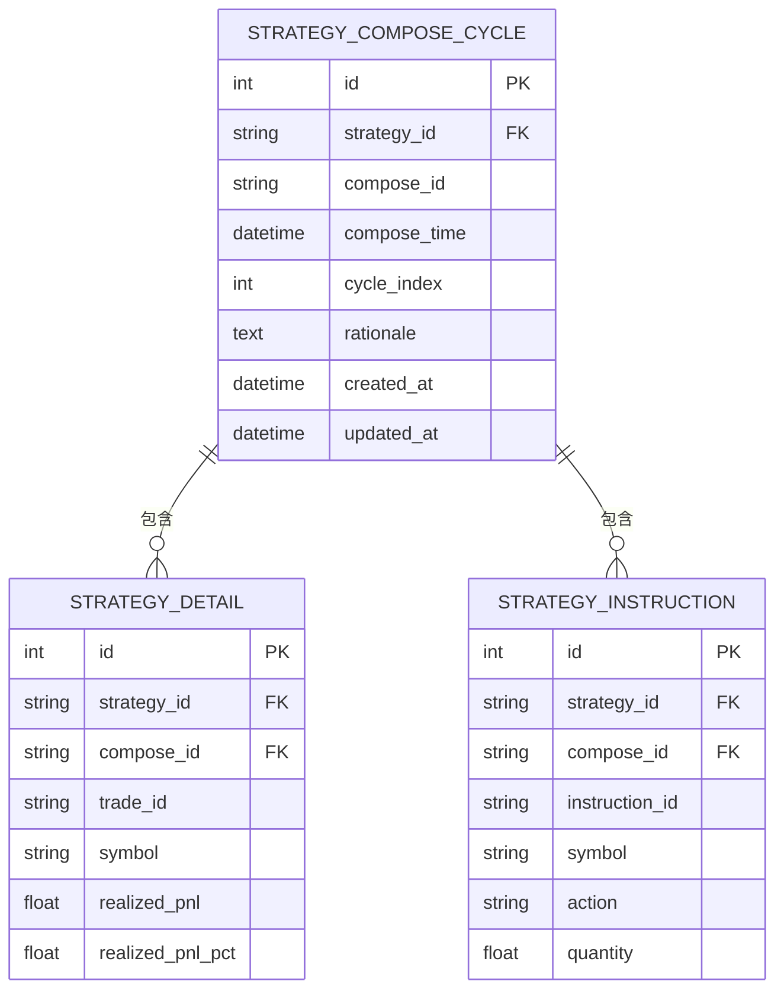
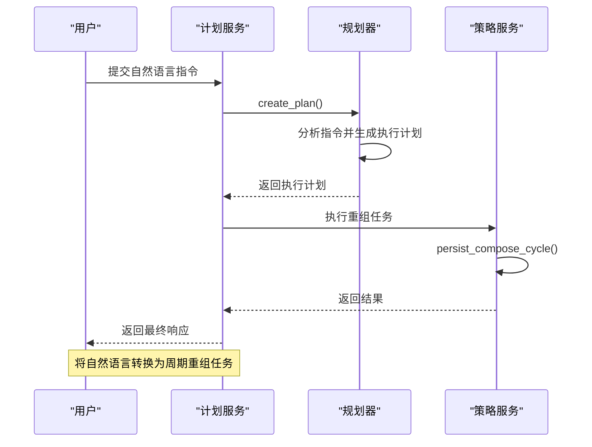
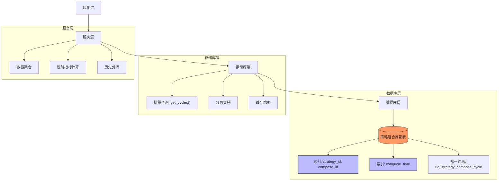

# 策略组合周期

<cite>
**本文档引用的文件**   
- [strategy_compose_cycle.py](file://python/valuecell/server/db/models/strategy_compose_cycle.py)
- [strategy_repository.py](file://python/valuecell/server/db/repositories/strategy_repository.py)
- [strategy_persistence.py](file://python/valuecell/server/services/strategy_persistence.py)
- [strategy_service.py](file://python/valuecell/server/services/strategy_service.py)
- [strategy.py](file://python/valuecell/server/api/routers/strategy.py)
- [plan.py](file://python/valuecell/core/plan/planner.py)
- [service.py](file://python/valuecell/core/plan/service.py)
- [strategy-compose-list.tsx](file://frontend/src/app/agent/components/strategy-items/strategy-compose-list.tsx)
</cite>

## 目录
1. [简介](#简介)
2. [核心数据模型](#核心数据模型)
3. [周期事件记录机制](#周期事件记录机制)
4. [自动化策略优化](#自动化策略优化)
5. [周期状态跟踪与历史分析](#周期状态跟踪与历史分析)
6. [与计划服务集成](#与计划服务集成)
7. [数据存储与查询优化](#数据存储与查询优化)

## 简介
策略组合周期（StrategyComposeCycle）模型是ValueCell系统中用于记录和管理策略周期性重组事件的核心组件。该模型通过结构化的数据记录，追踪策略在运行过程中的每一次重组，为策略的自动化优化、性能分析和历史回溯提供了坚实的基础。每个重组周期都包含详细的元数据，如触发原因、性能指标和时间戳，使得系统能够基于市场条件或预设的性能阈值自动触发重组，从而实现策略的动态调整和持续优化。

## 核心数据模型
策略组合周期模型定义了记录策略重组事件所需的核心字段，包括唯一标识、时间戳、索引和可选的推理信息。

**图表来源**
- [strategy_compose_cycle.py](file://python/valuecell/server/db/models/strategy_compose_cycle.py#L20-L75)

**本节来源**
- [strategy_compose_cycle.py](file://python/valuecell/server/db/models/strategy_compose_cycle.py#L1-L76)

## 周期事件记录机制
该机制负责捕获和持久化策略的每一次重组事件，确保所有关键信息都被准确记录。

**图表来源**
- [strategy_persistence.py](file://python/valuecell/server/services/strategy_persistence.py#L304-L334)
- [strategy_repository.py](file://python/valuecell/server/db/repositories/strategy_repository.py#L382-L409)

**本节来源**
- [strategy_persistence.py](file://python/valuecell/server/services/strategy_persistence.py#L304-L334)
- [strategy_repository.py](file://python/valuecell/server/db/repositories/strategy_repository.py#L382-L409)

## 自动化策略优化
系统利用策略组合周期模型实现自动化优化，根据预设条件或市场变化自动触发策略重组。

**图表来源**
- [strategy_persistence.py](file://python/valuecell/server/services/strategy_persistence.py#L304-L334)
- [strategy_service.py](file://python/valuecell/server/services/strategy_service.py#L303-L414)

**本节来源**
- [strategy_persistence.py](file://python/valuecell/server/services/strategy_persistence.py#L304-L334)
- [strategy_service.py](file://python/valuecell/server/services/strategy_service.py#L303-L414)

## 周期状态跟踪与历史分析
该功能支持对策略周期的完整生命周期进行跟踪，并提供历史数据分析能力，以支持策略的迭代优化。

**图表来源**
- [strategy_compose_cycle.py](file://python/valuecell/server/db/models/strategy_compose_cycle.py#L20-L75)
- [strategy_repository.py](file://python/valuecell/server/db/repositories/strategy_repository.py#L448-L467)
- [strategy_service.py](file://python/valuecell/server/services/strategy_service.py#L303-L414)

**本节来源**
- [strategy_compose_cycle.py](file://python/valuecell/server/db/models/strategy_compose_cycle.py#L20-L75)
- [strategy_repository.py](file://python/valuecell/server/db/repositories/strategy_repository.py#L448-L467)
- [strategy_service.py](file://python/valuecell/server/services/strategy_service.py#L303-L414)

## 与计划服务集成
策略组合周期模型与计划服务（PlanService）深度集成，能够将自然语言指令转换为具体的周期重组任务。

**图表来源**
- [service.py](file://python/valuecell/core/plan/service.py#L87-L112)
- [planner.py](file://python/valuecell/core/plan/planner.py#L132-L174)
- [strategy_persistence.py](file://python/valuecell/server/services/strategy_persistence.py#L304-L334)

**本节来源**
- [service.py](file://python/valuecell/core/plan/service.py#L87-L112)
- [planner.py](file://python/valuecell/core/plan/planner.py#L132-L174)
- [strategy_persistence.py](file://python/valuecell/server/services/strategy_persistence.py#L304-L334)

## 数据存储与查询优化
针对大规模周期数据，系统实施了高效的存储和查询优化策略，确保性能和可扩展性。

**图表来源**
- [strategy_repository.py](file://python/valuecell/server/db/repositories/strategy_repository.py#L448-L467)
- [strategy_compose_cycle.py](file://python/valuecell/server/db/models/strategy_compose_cycle.py#L62-L64)
- [strategy_service.py](file://python/valuecell/server/services/strategy_service.py#L303-L414)

**本节来源**
- [strategy_repository.py](file://python/valuecell/server/db/repositories/strategy_repository.py#L448-L467)
- [strategy_compose_cycle.py](file://python/valuecell/server/db/models/strategy_compose_cycle.py#L62-L64)
- [strategy_service.py](file://python/valuecell/server/services/strategy_service.py#L303-L414)