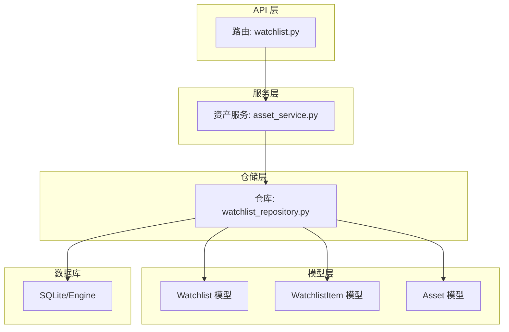
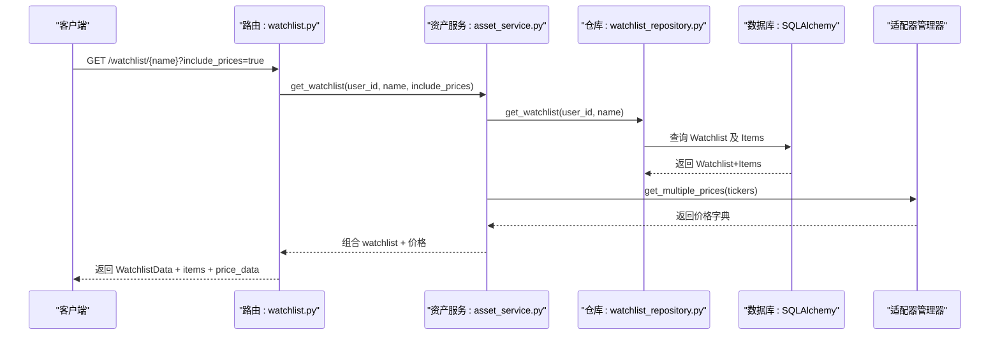
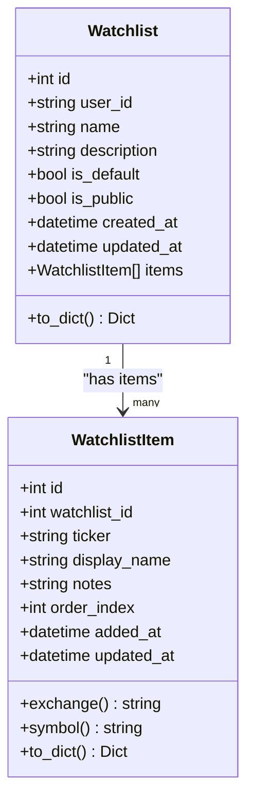
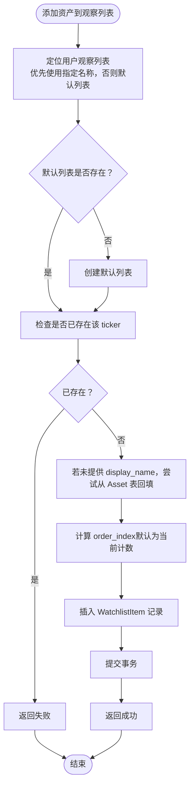
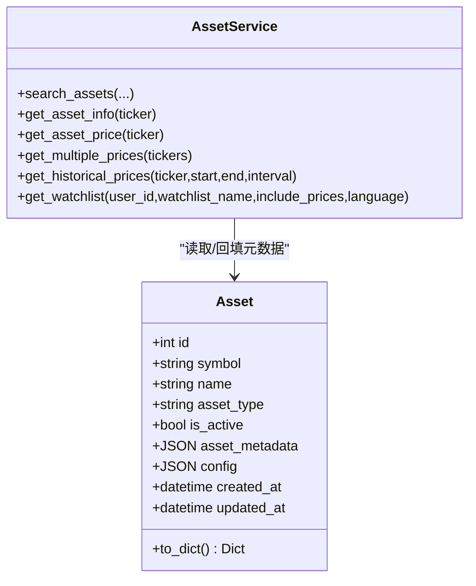
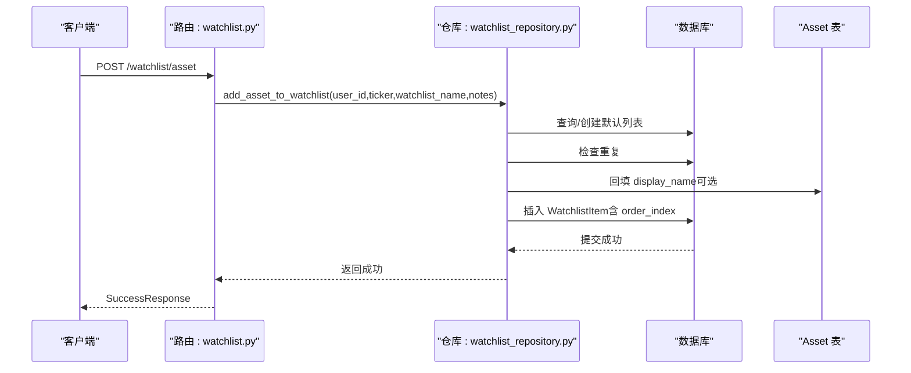
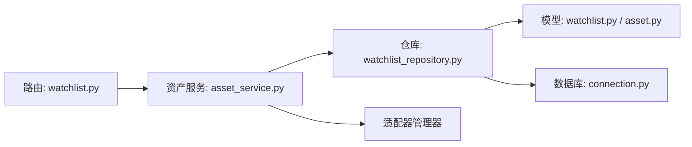

# 观察列表模型

<cite>
**本文引用的文件**
- [python/valuecell/server/db/models/watchlist.py](file://python/valuecell/server/db/models/watchlist.py)
- [python/valuecell/server/db/repositories/watchlist_repository.py](file://python/valuecell/server/db/repositories/watchlist_repository.py)
- [python/valuecell/server/api/routers/watchlist.py](file://python/valuecell/server/api/routers/watchlist.py)
- [python/valuecell/server/api/schemas/watchlist.py](file://python/valuecell/server/api/schemas/watchlist.py)
- [python/valuecell/server/db/models/asset.py](file://python/valuecell/server/db/models/asset.py)
- [python/valuecell/server/services/assets/asset_service.py](file://python/valuecell/server/services/assets/asset_service.py)
- [python/valuecell/adapters/assets/types.py](file://python/valuecell/adapters/assets/types.py)
- [python/valuecell/adapters/assets/manager.py](file://python/valuecell/adapters/assets/manager.py)
- [python/valuecell/server/db/connection.py](file://python/valuecell/server/db/connection.py)
</cite>

## 目录
1. [引言](#引言)
2. [项目结构](#项目结构)
3. [核心组件](#核心组件)
4. [架构总览](#架构总览)
5. [详细组件分析](#详细组件分析)
6. [依赖分析](#依赖分析)
7. [性能考虑](#性能考虑)
8. [故障排查指南](#故障排查指南)
9. [结论](#结论)
10. [附录](#附录)

## 引言
本文件系统性阐述 ValueCell 平台中的“观察列表（Watchlist）”数据模型设计与实现，覆盖字段定义、用户关联关系、资产条目管理机制；解释如何通过 Asset 模型支持多类型金融资产（如股票、加密货币等）的统一跟踪；说明列表排序、更新频率与实时数据同步的实现方式；并提供典型使用场景（如用户添加股票到观察列表后的数据流处理），最后给出高并发读写下的性能优化策略建议。

## 项目结构
观察列表相关代码主要分布在以下模块：
- 数据库模型层：watchlist 表与 watchlist_items 关联表
- 仓储层：对 watchlist 的增删改查与业务逻辑封装
- API 层：对外暴露的 REST 接口，支持搜索资产、获取/创建/删除观察列表、添加/移除资产、更新备注等
- 服务层：资产服务整合价格查询、国际化格式化与观察列表组合返回
- 类型与适配器：标准化资产类型、交易所、价格数据结构与内存 Watchlist 管理器

图表来源
- [python/valuecell/server/api/routers/watchlist.py](file://python/valuecell/server/api/routers/watchlist.py#L1-L120)
- [python/valuecell/server/services/assets/asset_service.py](file://python/valuecell/server/services/assets/asset_service.py#L1-L120)
- [python/valuecell/server/db/repositories/watchlist_repository.py](file://python/valuecell/server/db/repositories/watchlist_repository.py#L1-L120)
- [python/valuecell/server/db/models/watchlist.py](file://python/valuecell/server/db/models/watchlist.py#L1-L120)
- [python/valuecell/server/db/models/asset.py](file://python/valuecell/server/db/models/asset.py#L1-L128)
- [python/valuecell/server/db/connection.py](file://python/valuecell/server/db/connection.py#L1-L103)

章节来源
- [python/valuecell/server/api/routers/watchlist.py](file://python/valuecell/server/api/routers/watchlist.py#L1-L120)
- [python/valuecell/server/db/models/watchlist.py](file://python/valuecell/server/db/models/watchlist.py#L1-L120)
- [python/valuecell/server/db/models/asset.py](file://python/valuecell/server/db/models/asset.py#L1-L128)
- [python/valuecell/server/db/connection.py](file://python/valuecell/server/db/connection.py#L1-L103)

## 核心组件
- Watchlist 模型：表示用户的观察列表，包含名称、描述、默认/公开状态、时间戳以及与 WatchlistItem 的一对多关系。
- WatchlistItem 模型：表示观察列表中的单个资产条目，存储标准化的“交易所:符号”格式、显示名、用户备注、展示顺序与时间戳。
- WatchlistRepository：封装数据库操作，包括创建、查询、删除观察列表，以及添加/移除资产、更新备注、检查资产是否在列表中等。
- AssetService：面向 API 的高层服务，负责资产搜索、详情、实时/历史价格、批量价格、以及将观察列表与价格数据组合返回。
- 路由层：FastAPI 路由，提供观察列表 CRUD、资产搜索与价格接口，并将请求转发至服务层。
- 类型与适配器：标准化资产类型、交易所、价格数据结构；内存 Watchlist 管理器用于演示与测试，不参与持久化。

章节来源
- [python/valuecell/server/db/models/watchlist.py](file://python/valuecell/server/db/models/watchlist.py#L25-L196)
- [python/valuecell/server/db/repositories/watchlist_repository.py](file://python/valuecell/server/db/repositories/watchlist_repository.py#L1-L120)
- [python/valuecell/server/services/assets/asset_service.py](file://python/valuecell/server/services/assets/asset_service.py#L1-L120)
- [python/valuecell/server/api/routers/watchlist.py](file://python/valuecell/server/api/routers/watchlist.py#L1-L120)
- [python/valuecell/adapters/assets/types.py](file://python/valuecell/adapters/assets/types.py#L1-L120)

## 架构总览
观察列表的数据流从 API 路由进入，经由资产服务与仓储层访问数据库或外部适配器，最终返回给前端或调用方。价格数据通过资产服务统一格式化并按需返回。

图表来源
- [python/valuecell/server/api/routers/watchlist.py](file://python/valuecell/server/api/routers/watchlist.py#L218-L302)
- [python/valuecell/server/services/assets/asset_service.py](file://python/valuecell/server/services/assets/asset_service.py#L543-L621)
- [python/valuecell/server/db/repositories/watchlist_repository.py](file://python/valuecell/server/db/repositories/watchlist_repository.py#L355-L397)

## 详细组件分析

### Watchlist 数据模型与字段定义
- Watchlist 字段
  - 主键 id
  - user_id：字符串，标识拥有者，便于扩展多租户或匿名用户
  - name、description：列表名称与描述
  - is_default、is_public：默认列表与公开标志
  - created_at、updated_at：时间戳，自动维护
  - items：一对多关系，指向 WatchlistItem
  - 唯一约束：user_id + name
- WatchlistItem 字段
  - 主键 id
  - watchlist_id：外键，级联删除
  - ticker：标准化格式“EXCHANGE:SYMBOL”，支持多市场/多类型
  - display_name：显示名，可为空时回退为 symbol
  - notes：用户备注
  - order_index：展示顺序索引
  - added_at、updated_at：时间戳
  - 唯一约束：watchlist_id + ticker
- 辅助属性
  - exchange、symbol：从 ticker 中解析出交易所与符号

图表来源
- [python/valuecell/server/db/models/watchlist.py](file://python/valuecell/server/db/models/watchlist.py#L25-L196)

章节来源
- [python/valuecell/server/db/models/watchlist.py](file://python/valuecell/server/db/models/watchlist.py#L25-L196)

### 用户关联关系与资产条目管理
- 用户关联：通过 Watchlist.user_id 与 WatchlistItem.watchlist_id 建立用户与观察列表、列表与条目的关联。
- 资产条目管理：
  - 添加资产：支持指定 watchlist_name 或使用默认列表；若未提供 display_name，则尝试从 Asset 表回填；order_index 默认为当前数量。
  - 移除资产：按 watchlist_id + ticker 定位条目并删除。
  - 更新备注：按 watchlist_id + ticker 定位条目并更新 notes。
  - 检查存在：按 watchlist_id + ticker 判断资产是否已在列表中。
- 排序：按 order_index 升序返回条目；Watchlist 内部也提供重排方法（基于 ticker 序列）。

图表来源
- [python/valuecell/server/db/repositories/watchlist_repository.py](file://python/valuecell/server/db/repositories/watchlist_repository.py#L222-L303)

章节来源
- [python/valuecell/server/db/repositories/watchlist_repository.py](file://python/valuecell/server/db/repositories/watchlist_repository.py#L222-L303)

### 多类型金融资产的统一跟踪
- 标准化 ticker：采用“EXCHANGE:SYMBOL”的统一格式，例如“NASDAQ:AAPL”、“CRYPTO:BTC”等，便于跨市场/跨类型统一管理。
- 资产类型与交易所：通过 AssetType、Exchange 等枚举与 Asset 模型的 asset_type、market_info 等字段，支持股票、加密货币、指数等多种资产类型。
- 适配器与数据源：通过适配器管理器（AdapterManager）对接不同数据源（如 yfinance、akshare 等），实现跨源的价格与信息获取。
- 实时与历史价格：AssetService 提供 get_asset_price、get_multiple_prices、get_historical_prices 等方法，统一格式化输出，支持本地化货币/百分比等。

图表来源
- [python/valuecell/server/db/models/asset.py](file://python/valuecell/server/db/models/asset.py#L1-L128)
- [python/valuecell/server/services/assets/asset_service.py](file://python/valuecell/server/services/assets/asset_service.py#L1-L120)

章节来源
- [python/valuecell/server/db/models/asset.py](file://python/valuecell/server/db/models/asset.py#L1-L128)
- [python/valuecell/server/services/assets/asset_service.py](file://python/valuecell/server/services/assets/asset_service.py#L120-L270)
- [python/valuecell/adapters/assets/types.py](file://python/valuecell/adapters/assets/types.py#L1-L120)

### 列表排序、更新频率与实时数据同步
- 列表排序：
  - 数据库侧：查询 WatchlistItem 时按 order_index 升序返回。
  - 内存侧：Watchlist.reorder_assets 支持根据提供的 ticker 序列重新设置 order 并排序。
- 更新频率：
  - 观察列表本身无内置定时刷新；价格数据通过 API 请求时按需拉取。
  - 批量价格接口 get_multiple_prices 支持一次请求多个资产的价格，减少往返次数。
- 实时数据同步：
  - 当前实现通过 API 调用触发价格获取；未见内置 WebSocket/长轮询推送机制。
  - 若需实时推送，可在路由层引入 SSE 或 WebSocket，结合适配器的增量更新能力进行扩展。

章节来源
- [python/valuecell/server/db/repositories/watchlist_repository.py](file://python/valuecell/server/db/repositories/watchlist_repository.py#L355-L397)
- [python/valuecell/server/services/assets/asset_service.py](file://python/valuecell/server/services/assets/asset_service.py#L271-L344)
- [python/valuecell/adapters/assets/manager.py](file://python/valuecell/adapters/assets/manager.py#L976-L999)

### 典型使用场景：用户添加股票到观察列表后的数据流
- 步骤概览
  1) 客户端调用添加资产接口，携带 ticker、watchlist_name（可选）、notes。
  2) 路由层接收请求并调用 WatchlistRepository.add_asset_to_watchlist。
  3) 仓储层定位用户观察列表（默认或指定名称），若不存在则创建默认列表。
  4) 仓储层检查是否已存在该 ticker，若不存在则插入 WatchlistItem，并回填 display_name（若未提供）。
  5) 返回成功响应。
- 注意事项
  - 若 Asset 表中存在对应 symbol 的记录，可回填 display_name。
  - order_index 默认为当前条目数量，确保稳定排序。

图表来源
- [python/valuecell/server/api/routers/watchlist.py](file://python/valuecell/server/api/routers/watchlist.py#L345-L383)
- [python/valuecell/server/db/repositories/watchlist_repository.py](file://python/valuecell/server/db/repositories/watchlist_repository.py#L222-L303)

章节来源
- [python/valuecell/server/api/routers/watchlist.py](file://python/valuecell/server/api/routers/watchlist.py#L345-L383)
- [python/valuecell/server/db/repositories/watchlist_repository.py](file://python/valuecell/server/db/repositories/watchlist_repository.py#L222-L303)

## 依赖分析
- 模块耦合
  - 路由层依赖资产服务与仓库实例。
  - 服务层依赖适配器管理器与仓库，避免直接访问数据库。
  - 仓库层依赖 SQLAlchemy 模型与数据库引擎。
- 外部依赖
  - 数据库：SQLAlchemy + SQLite（静态池配置）。
  - 适配器：多种数据源（如 yfinance、akshare 等）。
- 循环依赖
  - 服务层通过延迟导入避免循环依赖（watchlist_repository）。

图表来源
- [python/valuecell/server/api/routers/watchlist.py](file://python/valuecell/server/api/routers/watchlist.py#L1-L120)
- [python/valuecell/server/services/assets/asset_service.py](file://python/valuecell/server/services/assets/asset_service.py#L1-L120)
- [python/valuecell/server/db/repositories/watchlist_repository.py](file://python/valuecell/server/db/repositories/watchlist_repository.py#L1-L120)
- [python/valuecell/server/db/connection.py](file://python/valuecell/server/db/connection.py#L1-L103)

章节来源
- [python/valuecell/server/api/routers/watchlist.py](file://python/valuecell/server/api/routers/watchlist.py#L1-L120)
- [python/valuecell/server/services/assets/asset_service.py](file://python/valuecell/server/services/assets/asset_service.py#L1-L120)
- [python/valuecell/server/db/repositories/watchlist_repository.py](file://python/valuecell/server/db/repositories/watchlist_repository.py#L1-L120)
- [python/valuecell/server/db/connection.py](file://python/valuecell/server/db/connection.py#L1-L103)

## 性能考虑
- 数据库层面
  - 使用唯一约束避免重复项，减少冗余写入。
  - 查询时按索引过滤（user_id、watchlist_id、ticker），降低扫描成本。
  - 批量价格查询：通过 get_multiple_prices 一次性获取多资产价格，减少网络往返。
- 会话与连接
  - SQLite 使用 StaticPool，适合单进程/轻量场景；高并发建议使用更健壮的数据库与连接池。
  - 仓储层在每次操作后关闭会话，避免资源泄漏。
- API 层
  - 将耗时操作（如价格查询）放入线程池执行，避免阻塞主协程。
- 缓存与推送
  - 对高频读取的观察列表可引入应用层缓存（如 Redis）并设置合理过期策略。
  - 如需实时推送，可在路由层增加 SSE/WS，结合适配器的增量更新事件驱动刷新。

[本节为通用指导，无需列出具体文件来源]

## 故障排查指南
- 常见错误与处理
  - 创建观察列表失败：检查唯一约束冲突（user_id + name），或捕获完整性异常并回滚。
  - 添加资产失败：确认 watchlist 是否存在，ticker 是否已存在，或数据库异常导致回滚。
  - 获取价格失败：检查适配器是否可用、ticker 是否有效、语言参数是否正确。
- 日志与调试
  - 服务层广泛使用日志记录错误堆栈，便于定位问题。
  - API 层对异常进行统一包装，返回明确的错误信息与状态码。
- 数据一致性
  - 仓储层在同一会话内完成查询与写入，避免对象分离问题。
  - 对于需要返回的对象，使用 expunge 避免会话持有导致的后续问题。

章节来源
- [python/valuecell/server/db/repositories/watchlist_repository.py](file://python/valuecell/server/db/repositories/watchlist_repository.py#L31-L120)
- [python/valuecell/server/services/assets/asset_service.py](file://python/valuecell/server/services/assets/asset_service.py#L120-L270)
- [python/valuecell/server/api/routers/watchlist.py](file://python/valuecell/server/api/routers/watchlist.py#L120-L217)

## 结论
观察列表模型通过标准化的“交易所:符号”格式与清晰的用户-列表-条目三层关系，实现了对多类型金融资产的统一跟踪。仓储层提供了完善的 CRUD 与业务逻辑封装，服务层负责与适配器交互并统一格式化输出。当前实现以按需请求为主，具备良好的扩展性；若需实时推送与高并发场景，可进一步引入缓存与消息推送机制。

[本节为总结性内容，无需列出具体文件来源]

## 附录
- API 端点概览（与观察列表相关）
  - GET /watchlist/asset/search：资产搜索（支持类型/交易所/国家过滤）
  - GET /watchlist/asset/{ticker}：资产详情
  - GET /watchlist/asset/{ticker}/price：实时价格
  - GET /watchlist/asset/{ticker}/price/historical：历史价格
  - GET /watchlist：获取用户所有观察列表
  - GET /watchlist/{watchlist_name}：获取指定观察列表（可选包含价格）
  - POST /watchlist：创建观察列表
  - POST /watchlist/asset：添加资产到观察列表
  - DELETE /watchlist/asset/{ticker}：从观察列表移除资产
  - DELETE /watchlist/{watchlist_name}：删除观察列表
  - PUT /watchlist/asset/{ticker}/notes：更新资产备注

章节来源
- [python/valuecell/server/api/routers/watchlist.py](file://python/valuecell/server/api/routers/watchlist.py#L1-L580)
- [python/valuecell/server/api/schemas/watchlist.py](file://python/valuecell/server/api/schemas/watchlist.py#L1-L202)