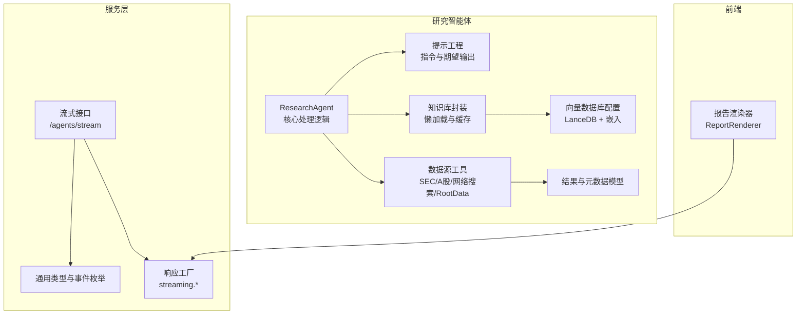
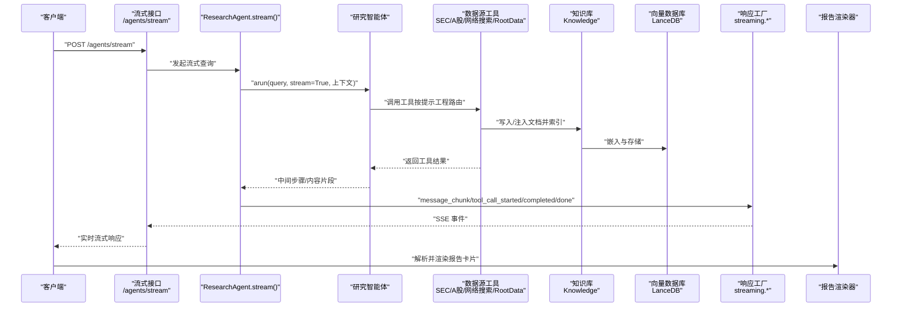
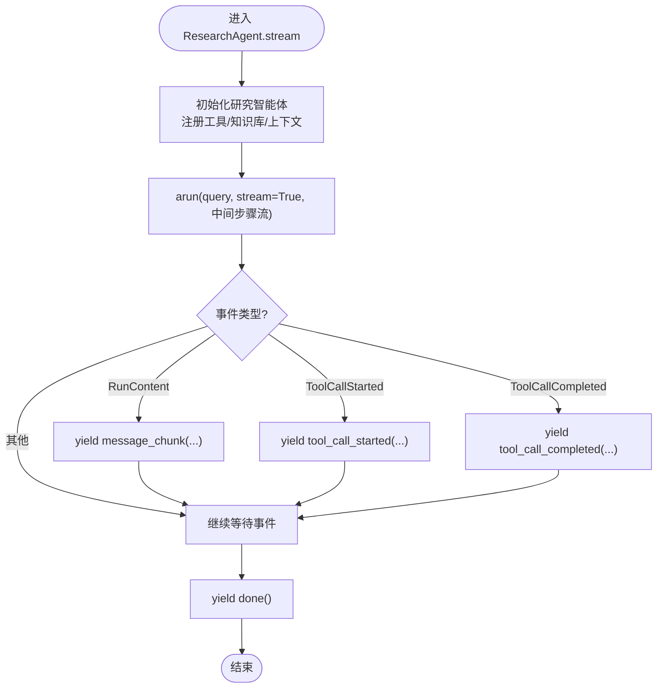
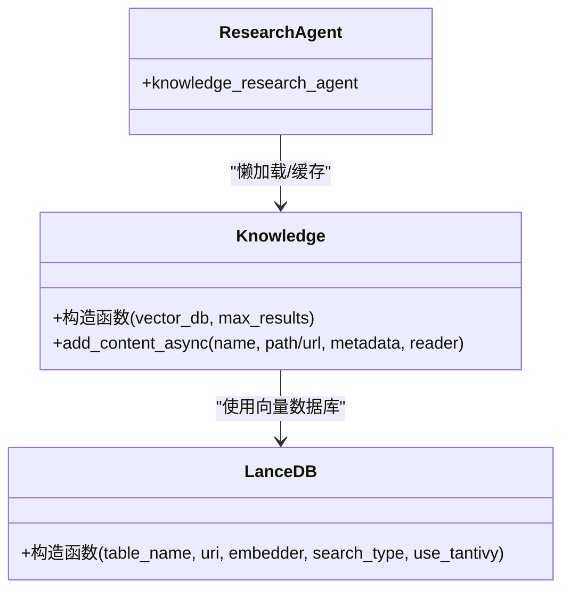
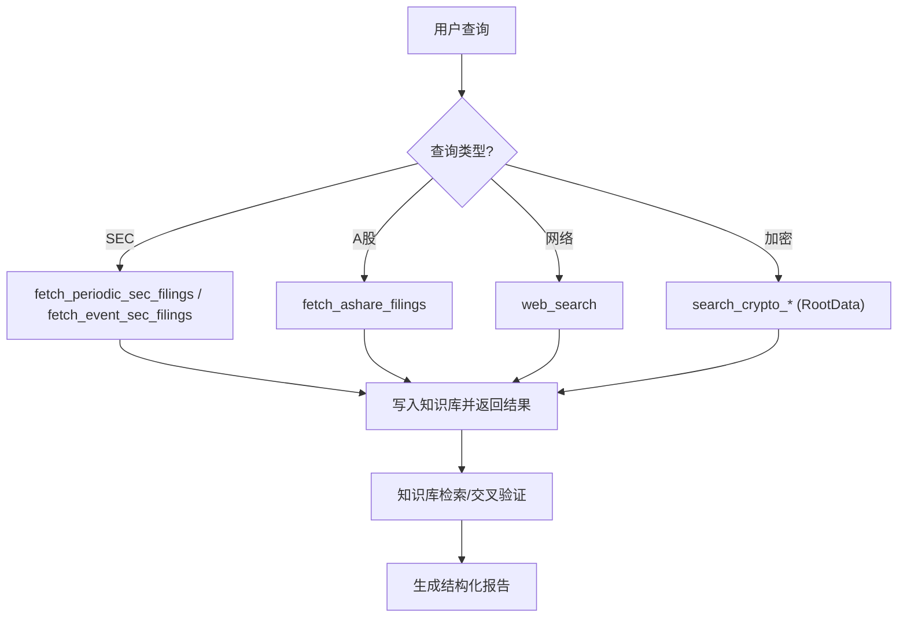
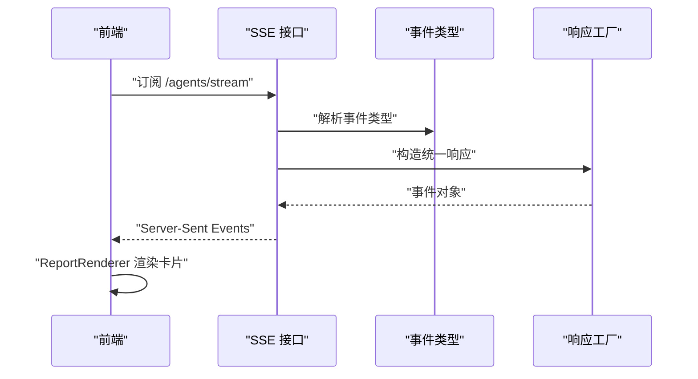
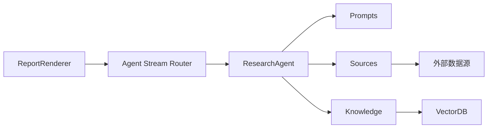

# DeepResearch Agent

<cite>
**本文引用的文件**
- [python/valuecell/agents/research_agent/core.py](file://python/valuecell/agents/research_agent/core.py)
- [python/valuecell/agents/research_agent/prompts.py](file://python/valuecell/agents/research_agent/prompts.py)
- [python/valuecell/agents/research_agent/knowledge.py](file://python/valuecell/agents/research_agent/knowledge.py)
- [python/valuecell/agents/research_agent/vdb.py](file://python/valuecell/agents/research_agent/vdb.py)
- [python/valuecell/agents/research_agent/sources.py](file://python/valuecell/agents/research_agent/sources.py)
- [python/valuecell/agents/research_agent/schemas.py](file://python/valuecell/agents/research_agent/schemas.py)
- [python/valuecell/agents/sources/rootdata.py](file://python/valuecell/agents/sources/rootdata.py)
- [python/valuecell/core/types.py](file://python/valuecell/core/types.py)
- [python/valuecell/core/agent/responses.py](file://python/valuecell/core/agent/responses.py)
- [python/valuecell/server/api/routers/agent_stream.py](file://python/valuecell/server/api/routers/agent_stream.py)
- [frontend/src/components/valuecell/renderer/report-renderer.tsx](file://frontend/src/components/valuecell/renderer/report-renderer.tsx)
- [docs/CORE_ARCHITECTURE.md](file://docs/CORE_ARCHITECTURE.md)
- [docs/CONTRIBUTE_AN_AGENT.md](file://docs/CONTRIBUTE_AN_AGENT.md)
- [python/valuecell/agents/research_agent/tests/test_fault_tolerance.py](file://python/valuecell/agents/research_agent/tests/test_fault_tolerance.py)
</cite>

## 目录
1. [简介](#简介)
2. [项目结构](#项目结构)
3. [核心组件](#核心组件)
4. [架构总览](#架构总览)
5. [详细组件分析](#详细组件分析)
6. [依赖关系分析](#依赖关系分析)
7. [性能考量](#性能考量)
8. [故障排查指南](#故障排查指南)
9. [结论](#结论)
10. [附录](#附录)

## 简介
DeepResearch Agent 是一个面向金融研究的智能体，专注于通过知识库（Knowledge Base）与向量数据库（VDB）进行金融数据检索与分析，并与外部数据源（如 SEC Filings、CNINFO（A股）、RootData 加密项目/VC/人物）集成，提供可溯源、可解释的研究报告。其核心能力包括：
- 自然语言查询解析与多步推理链构建
- 基于 SEC、A股与加密数据源的事实检索与交叉验证
- 结构化输出与可溯源引用
- 流式响应与前端报告渲染

## 项目结构
本节聚焦与 DeepResearch Agent 直接相关的后端模块与前端渲染组件，帮助读者快速定位关键实现位置。

图表来源
- [python/valuecell/agents/research_agent/core.py](file://python/valuecell/agents/research_agent/core.py#L30-L68)
- [python/valuecell/agents/research_agent/prompts.py](file://python/valuecell/agents/research_agent/prompts.py#L1-L180)
- [python/valuecell/agents/research_agent/sources.py](file://python/valuecell/agents/research_agent/sources.py#L129-L243)
- [python/valuecell/agents/research_agent/knowledge.py](file://python/valuecell/agents/research_agent/knowledge.py#L15-L44)
- [python/valuecell/agents/research_agent/vdb.py](file://python/valuecell/agents/research_agent/vdb.py#L23-L53)
- [python/valuecell/agents/research_agent/schemas.py](file://python/valuecell/agents/research_agent/schemas.py#L1-L42)
- [python/valuecell/server/api/routers/agent_stream.py](file://python/valuecell/server/api/routers/agent_stream.py#L1-L39)
- [python/valuecell/core/types.py](file://python/valuecell/core/types.py#L64-L101)
- [python/valuecell/core/agent/responses.py](file://python/valuecell/core/agent/responses.py#L92-L139)
- [frontend/src/components/valuecell/renderer/report-renderer.tsx](file://frontend/src/components/valuecell/renderer/report-renderer.tsx#L1-L49)

章节来源
- [python/valuecell/agents/research_agent/core.py](file://python/valuecell/agents/research_agent/core.py#L30-L68)
- [python/valuecell/agents/research_agent/prompts.py](file://python/valuecell/agents/research_agent/prompts.py#L1-L180)
- [python/valuecell/agents/research_agent/sources.py](file://python/valuecell/agents/research_agent/sources.py#L129-L243)
- [python/valuecell/agents/research_agent/knowledge.py](file://python/valuecell/agents/research_agent/knowledge.py#L15-L44)
- [python/valuecell/agents/research_agent/vdb.py](file://python/valuecell/agents/research_agent/vdb.py#L23-L53)
- [python/valuecell/agents/research_agent/schemas.py](file://python/valuecell/agents/research_agent/schemas.py#L1-L42)
- [python/valuecell/server/api/routers/agent_stream.py](file://python/valuecell/server/api/routers/agent_stream.py#L1-L39)
- [python/valuecell/core/types.py](file://python/valuecell/core/types.py#L64-L101)
- [python/valuecell/core/agent/responses.py](file://python/valuecell/core/agent/responses.py#L92-L139)
- [frontend/src/components/valuecell/renderer/report-renderer.tsx](file://frontend/src/components/valuecell/renderer/report-renderer.tsx#L1-L49)

## 核心组件
- ResearchAgent：封装研究智能体的主处理逻辑，负责初始化提示工程、工具集、知识库与上下文，提供流式响应。
- 提示工程（prompts.py）：定义“知识型研究助手”的指令、工具使用规范、日期映射规则、检索与分析步骤、输出格式与语言规则。
- 数据源工具（sources.py）：封装 SEC、A股、网络搜索与 RootData 的工具函数，统一写入知识库并返回结构化结果。
- 知识库与向量数据库（knowledge.py、vdb.py）：懒加载嵌入与 LanceDB，创建 Knowledge 实例并支持 Markdown/PDF 内容注入。
- 通用类型与响应工厂（core/types.py、core/agent/responses.py）：定义流式事件类型、消息块、工具调用事件与完成信号。
- 流式接口（server/api/routers/agent_stream.py）：提供 SSE 接口，将 ResearchAgent 的事件转换为统一的流式响应。
- 报告渲染器（frontend/src/components/valuecell/renderer/report-renderer.tsx）：解析后端报告内容并渲染为可点击卡片，支持打开详情。

章节来源
- [python/valuecell/agents/research_agent/core.py](file://python/valuecell/agents/research_agent/core.py#L30-L68)
- [python/valuecell/agents/research_agent/prompts.py](file://python/valuecell/agents/research_agent/prompts.py#L1-L180)
- [python/valuecell/agents/research_agent/sources.py](file://python/valuecell/agents/research_agent/sources.py#L129-L243)
- [python/valuecell/agents/research_agent/knowledge.py](file://python/valuecell/agents/research_agent/knowledge.py#L15-L44)
- [python/valuecell/agents/research_agent/vdb.py](file://python/valuecell/agents/research_agent/vdb.py#L23-L53)
- [python/valuecell/core/types.py](file://python/valuecell/core/types.py#L64-L101)
- [python/valuecell/core/agent/responses.py](file://python/valuecell/core/agent/responses.py#L92-L139)
- [python/valuecell/server/api/routers/agent_stream.py](file://python/valuecell/server/api/routers/agent_stream.py#L1-L39)
- [frontend/src/components/valuecell/renderer/report-renderer.tsx](file://frontend/src/components/valuecell/renderer/report-renderer.tsx#L1-L49)

## 架构总览
DeepResearch Agent 的工作流由“提示工程 + 工具调用 + 知识库检索 + 结果合成”构成，并通过流式接口与前端渲染器串联。

图表来源
- [python/valuecell/agents/research_agent/core.py](file://python/valuecell/agents/research_agent/core.py#L70-L98)
- [python/valuecell/agents/research_agent/prompts.py](file://python/valuecell/agents/research_agent/prompts.py#L1-L180)
- [python/valuecell/agents/research_agent/sources.py](file://python/valuecell/agents/research_agent/sources.py#L129-L243)
- [python/valuecell/agents/research_agent/knowledge.py](file://python/valuecell/agents/research_agent/knowledge.py#L15-L44)
- [python/valuecell/agents/research_agent/vdb.py](file://python/valuecell/agents/research_agent/vdb.py#L23-L53)
- [python/valuecell/core/agent/responses.py](file://python/valuecell/core/agent/responses.py#L92-L139)
- [python/valuecell/server/api/routers/agent_stream.py](file://python/valuecell/server/api/routers/agent_stream.py#L1-L39)
- [frontend/src/components/valuecell/renderer/report-renderer.tsx](file://frontend/src/components/valuecell/renderer/report-renderer.tsx#L1-L49)

## 详细组件分析

### ResearchAgent 主处理逻辑（core.py）
- 初始化阶段
  - 注册工具集：定期/事件 SEC 文件、A股文件、网络搜索、RootData 项目/VC/人物搜索。
  - 懒加载知识库：若无嵌入或向量库不可用，则降级为“仅工具模式”，禁用知识库搜索。
  - 配置上下文：启用历史会话、时间戳、摘要与依赖上下文注入。
  - 可选配置：EDGAR 身份（SEC_EMAIL），用于访问 SEC 文档。
- 流式执行
  - 通过研究智能体运行 arun，开启中间步骤流式输出。
  - 将事件映射为统一的流式响应：消息块、工具调用开始、工具调用完成、完成信号。
- 错误与健壮性
  - 当嵌入不可用时，测试覆盖了降级路径与事件分支，确保流式响应仍能产出完整生命周期事件。

图表来源
- [python/valuecell/agents/research_agent/core.py](file://python/valuecell/agents/research_agent/core.py#L70-L98)
- [python/valuecell/core/agent/responses.py](file://python/valuecell/core/agent/responses.py#L92-L139)

章节来源
- [python/valuecell/agents/research_agent/core.py](file://python/valuecell/agents/research_agent/core.py#L30-L68)
- [python/valuecell/agents/research_agent/core.py](file://python/valuecell/agents/research_agent/core.py#L70-L98)
- [python/valuecell/agents/research_agent/tests/test_fault_tolerance.py](file://python/valuecell/agents/research_agent/tests/test_fault_tolerance.py#L183-L230)

### 提示工程设计（prompts.py）
- 指令与原则
  - 明确目标：准确、可溯源、可操作地回答用户关于公司财务、披露与表现的问题。
  - 回答原则：事实优先、避免臆测、严格相关性、必要时提出下一步行动建议。
- 工具清单与使用指南
  - 定期/事件 SEC 文件、A股文件、知识库搜索、网络搜索（含站点过滤与时间范围编码）。
  - 使用预算、默认参数、路由矩阵（事实型/事件型/探索型）、A股参数规则。
- 日期与映射规则
  - 区分“提交日期”与“报告期”，明确财政/日历周期差异与默认策略。
- 检索与分析步骤
  - 先澄清再检索，优先事实型数据，随后知识库交叉验证，最后合成与解释。
- 输出格式与语言规则
  - 面向事实型、分析型与探索型问题的不同结构化输出风格，强调可溯源引用与无障碍表达。

章节来源
- [python/valuecell/agents/research_agent/prompts.py](file://python/valuecell/agents/research_agent/prompts.py#L1-L180)
- [python/valuecell/agents/research_agent/prompts.py](file://python/valuecell/agents/research_agent/prompts.py#L182-L259)

### 知识库与向量数据库（knowledge.py、vdb.py）
- 向量数据库配置
  - 延迟初始化：仅在请求时尝试创建嵌入器与 LanceDB，失败则返回 None，允许“仅工具模式”运行。
  - 混合检索：Hybrid 搜索，关闭 Tantivy，表名固定。
- 知识库封装
  - 懒加载与缓存：首次创建后复用实例，最大返回条数可控。
  - 内容注入：支持 Markdown/PDF 读取器，异步写入知识库并建立索引。
- 健壮性
  - 当嵌入不可用或 LanceDB 初始化失败时，记录警告并降级为工具模式。

图表来源
- [python/valuecell/agents/research_agent/vdb.py](file://python/valuecell/agents/research_agent/vdb.py#L23-L53)
- [python/valuecell/agents/research_agent/knowledge.py](file://python/valuecell/agents/research_agent/knowledge.py#L15-L44)

章节来源
- [python/valuecell/agents/research_agent/vdb.py](file://python/valuecell/agents/research_agent/vdb.py#L23-L53)
- [python/valuecell/agents/research_agent/knowledge.py](file://python/valuecell/agents/research_agent/knowledge.py#L15-L44)
- [python/valuecell/agents/research_agent/tests/test_fault_tolerance.py](file://python/valuecell/agents/research_agent/tests/test_fault_tolerance.py#L1-L80)

### 数据源工具与外部集成（sources.py、rootdata.py）
- SEC 文件
  - 定期/事件两类抓取，支持年/季度过滤与最新限制，自动写入知识库并返回结构化结果。
- A股文件
  - 通过 CNINFO API 获取公告列表与PDF链接，规范化参数（仅英文报告类型），按标题提取季度并写入知识库。
- 网络搜索
  - 默认使用 Perplexity Sonar，可选 Google Gemini 搜索（需配置环境变量）。
- RootData 集成
  - 支持浏览器交互搜索项目/VC/人物，Playwright 提取 SSR 数据，HTML 解析作为回退方案。
  - 提供项目详情、VC详情、人物详情等数据模型与工具函数。

图表来源
- [python/valuecell/agents/research_agent/sources.py](file://python/valuecell/agents/research_agent/sources.py#L129-L243)
- [python/valuecell/agents/research_agent/sources.py](file://python/valuecell/agents/research_agent/sources.py#L622-L710)
- [python/valuecell/agents/sources/rootdata.py](file://python/valuecell/agents/sources/rootdata.py#L1-L120)
- [python/valuecell/agents/sources/rootdata.py](file://python/valuecell/agents/sources/rootdata.py#L565-L800)

章节来源
- [python/valuecell/agents/research_agent/sources.py](file://python/valuecell/agents/research_agent/sources.py#L129-L243)
- [python/valuecell/agents/research_agent/sources.py](file://python/valuecell/agents/research_agent/sources.py#L622-L710)
- [python/valuecell/agents/sources/rootdata.py](file://python/valuecell/agents/sources/rootdata.py#L1-L120)
- [python/valuecell/agents/sources/rootdata.py](file://python/valuecell/agents/sources/rootdata.py#L565-L800)

### 结果与元数据模型（schemas.py）
- SEC/AShare 文件结果与元数据：包含文档类型、公司、报告期、提交日期等字段，便于溯源与交叉引用。
- 用于知识库注入与后续检索的结构化载体。

章节来源
- [python/valuecell/agents/research_agent/schemas.py](file://python/valuecell/agents/research_agent/schemas.py#L1-L42)

### 流式响应与前端渲染（core/types.py、core/agent/responses.py、server/api/routers/agent_stream.py、frontend/report-renderer.tsx）
- 统一事件类型
  - 消息块、工具调用开始/完成、推理开始/完成、任务完成/失败等。
- 响应工厂
  - 提供 message_chunk、tool_call_started/completed、done/failed 等工厂方法，保证前后端一致的事件语义。
- 流式接口
  - /agents/stream 返回 SSE，将 ResearchAgent 的事件映射为统一的流式响应。
- 前端渲染
  - ReportRenderer 解析后端报告内容（标题、创建时间、数据），渲染为可点击卡片，支持打开详情。

图表来源
- [python/valuecell/core/types.py](file://python/valuecell/core/types.py#L64-L101)
- [python/valuecell/core/agent/responses.py](file://python/valuecell/core/agent/responses.py#L92-L139)
- [python/valuecell/server/api/routers/agent_stream.py](file://python/valuecell/server/api/routers/agent_stream.py#L1-L39)
- [frontend/src/components/valuecell/renderer/report-renderer.tsx](file://frontend/src/components/valuecell/renderer/report-renderer.tsx#L1-L49)

章节来源
- [python/valuecell/core/types.py](file://python/valuecell/core/types.py#L64-L101)
- [python/valuecell/core/agent/responses.py](file://python/valuecell/core/agent/responses.py#L92-L139)
- [python/valuecell/server/api/routers/agent_stream.py](file://python/valuecell/server/api/routers/agent_stream.py#L1-L39)
- [frontend/src/components/valuecell/renderer/report-renderer.tsx](file://frontend/src/components/valuecell/renderer/report-renderer.tsx#L1-L49)

## 依赖关系分析
- 组件耦合
  - ResearchAgent 依赖提示工程、工具集、知识库与上下文；知识库依赖向量数据库；工具集依赖外部数据源。
- 外部依赖
  - SEC：edgar 库；A股：CNINFO API；RootData：Playwright/HTTPX/BeautifulSoup；向量库：LanceDB；模型：Agno/Provider。
- 循环依赖
  - 未发现直接循环依赖；各模块职责清晰，通过工具函数与懒加载降低耦合。

图表来源
- [python/valuecell/agents/research_agent/core.py](file://python/valuecell/agents/research_agent/core.py#L30-L68)
- [python/valuecell/agents/research_agent/prompts.py](file://python/valuecell/agents/research_agent/prompts.py#L1-L180)
- [python/valuecell/agents/research_agent/sources.py](file://python/valuecell/agents/research_agent/sources.py#L129-L243)
- [python/valuecell/agents/research_agent/knowledge.py](file://python/valuecell/agents/research_agent/knowledge.py#L15-L44)
- [python/valuecell/agents/research_agent/vdb.py](file://python/valuecell/agents/research_agent/vdb.py#L23-L53)
- [python/valuecell/server/api/routers/agent_stream.py](file://python/valuecell/server/api/routers/agent_stream.py#L1-L39)
- [frontend/src/components/valuecell/renderer/report-renderer.tsx](file://frontend/src/components/valuecell/renderer/report-renderer.tsx#L1-L49)

章节来源
- [python/valuecell/agents/research_agent/core.py](file://python/valuecell/agents/research_agent/core.py#L30-L68)
- [python/valuecell/agents/research_agent/sources.py](file://python/valuecell/agents/research_agent/sources.py#L129-L243)
- [python/valuecell/agents/research_agent/knowledge.py](file://python/valuecell/agents/research_agent/knowledge.py#L15-L44)
- [python/valuecell/agents/research_agent/vdb.py](file://python/valuecell/agents/research_agent/vdb.py#L23-L53)
- [python/valuecell/server/api/routers/agent_stream.py](file://python/valuecell/server/api/routers/agent_stream.py#L1-L39)
- [frontend/src/components/valuecell/renderer/report-renderer.tsx](file://frontend/src/components/valuecell/renderer/report-renderer.tsx#L1-L49)

## 性能考量
- 延迟初始化与降级
  - 嵌入与向量库仅在需要时创建，失败时自动降级为工具模式，避免阻塞启动。
- 批量与预算
  - 提示工程建议批量参数、限制工具调用次数，减少外部 API 调用开销。
- 检索策略
  - 混合检索与最大返回条数控制，平衡召回与延迟。
- 流式传输
  - SSE 分段传输，前端逐步渲染，提升用户体验与感知性能。

[本节为通用指导，不直接分析具体文件]

## 故障排查指南
- 嵌入不可用或向量库初始化失败
  - 现象：知识库被禁用，仅工具模式运行。
  - 排查：检查嵌入提供商配置、API Key、LanceDB URI；查看日志警告。
- SEC 身份未配置
  - 现象：EDGAR 身份未设置，但不影响工具调用。
  - 排查：设置 SEC_EMAIL 环境变量以启用身份。
- RootData 依赖缺失
  - 现象：Playwright 未安装或浏览器不可用。
  - 排查：安装 Playwright 并执行浏览器安装命令；或使用 HTML 解析回退。
- 流式响应异常
  - 现象：前端未收到事件或渲染异常。
  - 排查：确认 /agents/stream 接口可用、事件类型正确、前端 ReportRenderer 正常解析。

章节来源
- [python/valuecell/agents/research_agent/vdb.py](file://python/valuecell/agents/research_agent/vdb.py#L23-L53)
- [python/valuecell/agents/research_agent/knowledge.py](file://python/valuecell/agents/research_agent/knowledge.py#L15-L44)
- [python/valuecell/agents/research_agent/core.py](file://python/valuecell/agents/research_agent/core.py#L60-L68)
- [python/valuecell/agents/sources/rootdata.py](file://python/valuecell/agents/sources/rootdata.py#L1-L120)
- [python/valuecell/server/api/routers/agent_stream.py](file://python/valuecell/server/api/routers/agent_stream.py#L1-L39)
- [frontend/src/components/valuecell/renderer/report-renderer.tsx](file://frontend/src/components/valuecell/renderer/report-renderer.tsx#L1-L49)

## 结论
DeepResearch Agent 通过“提示工程 + 工具调用 + 知识库检索 + 结构化输出”的闭环，实现了从自然语言到可溯源研究报告的自动化流程。其设计强调：
- 可靠性：嵌入/向量库不可用时的优雅降级
- 可扩展性：统一工具接口与懒加载知识库
- 可解释性：严格的工具使用规范与引用规则
- 可视化：流式接口与前端渲染器协同

[本节为总结，不直接分析具体文件]

## 附录
- 开发者贡献指南要点
  - 实现 BaseAgent 子类并在 core.py 中实现 stream() 方法，使用 streaming.* 发送消息块、工具调用事件与完成信号。
- 架构文档要点
  - 协调器（Orchestrator）负责预处理、规划、执行与流式输出，Decouple 生产者/消费者，支持断线重连与人类确认。

章节来源
- [docs/CONTRIBUTE_AN_AGENT.md](file://docs/CONTRIBUTE_AN_AGENT.md#L68-L109)
- [docs/CORE_ARCHITECTURE.md](file://docs/CORE_ARCHITECTURE.md#L160-L179)