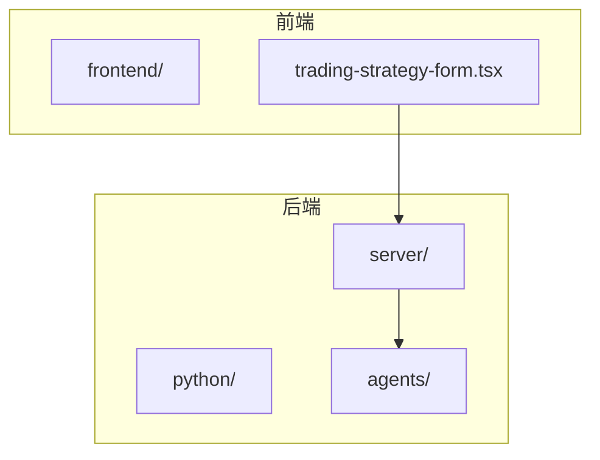
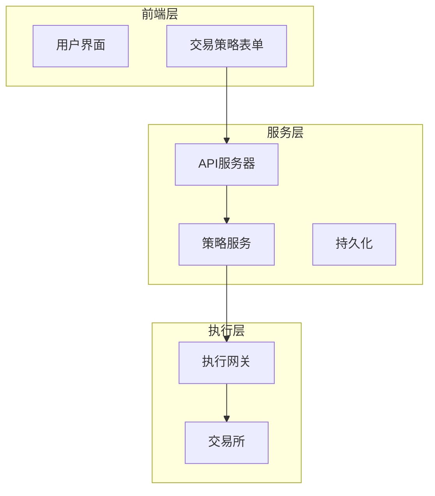
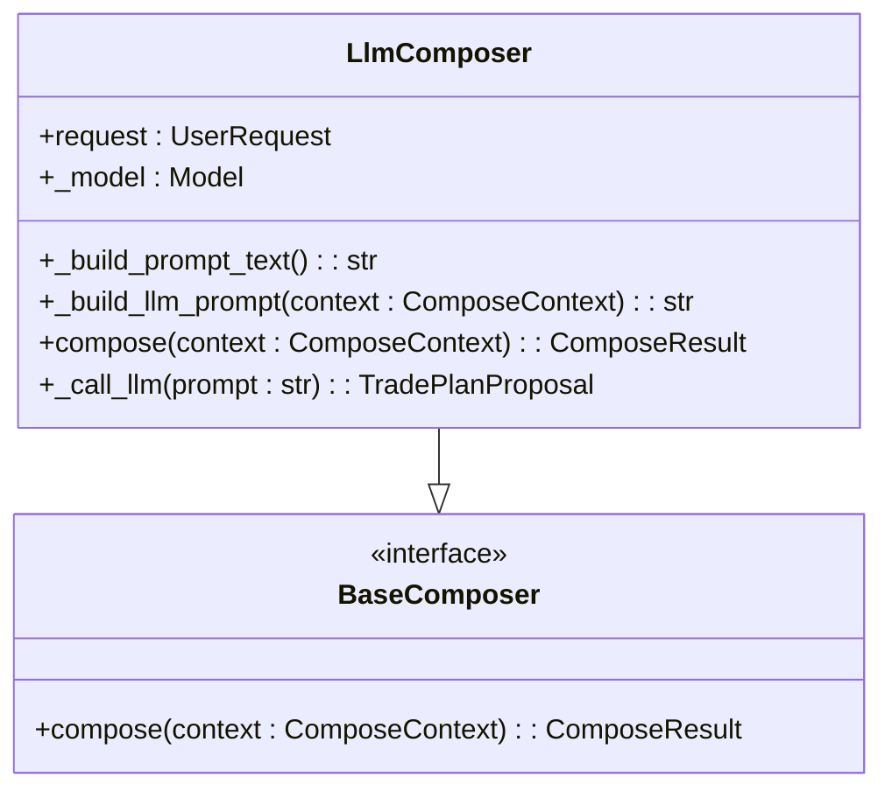
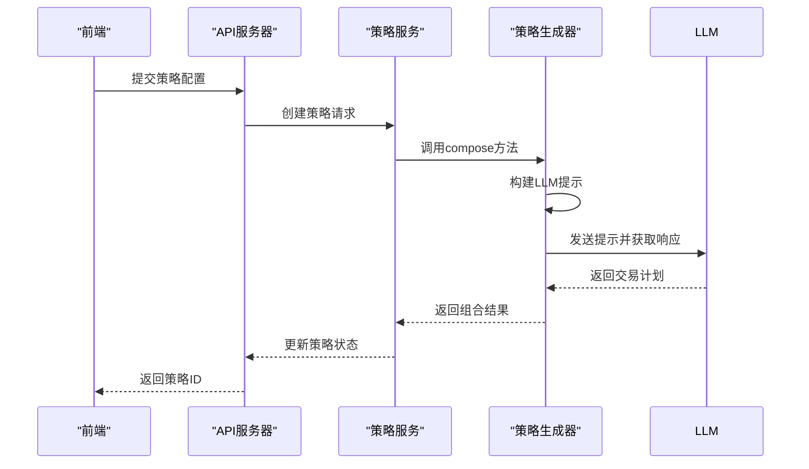
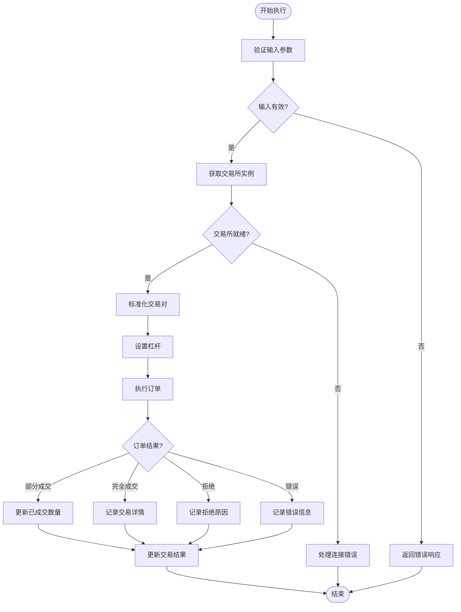
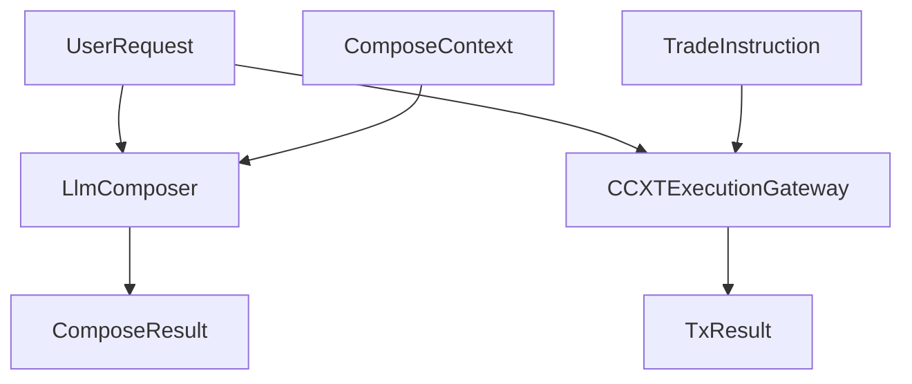

# Strategy Agent

<cite>
**本文档引用的文件**   
- [core.py](file://python/valuecell/agents/prompt_strategy_agent/core.py)
- [composer.py](file://python/valuecell/agents/common/trading/decision/prompt_based/composer.py)
- [ccxt_trading.py](file://python/valuecell/agents/common/trading/execution/ccxt_trading.py)
- [base_agent.py](file://python/valuecell/agents/common/trading/base_agent.py)
- [models.py](file://python/valuecell/agents/common/trading/models.py)
- [strategy_service.py](file://python/valuecell/server/services/strategy_service.py)
- [strategy_agent.py](file://python/valuecell/server/api/routers/strategy_agent.py)
- [strategy_autoresume.py](file://python/valuecell/server/services/strategy_autoresume.py)
- [trading-strategy-form.tsx](file://frontend/src/components/valuecell/form/trading-strategy-form.tsx)
- [default.txt](file://python/valuecell/agents/prompt_strategy_agent/templates/default.txt)
- [aggressive.txt](file://python/valuecell/agents/prompt_strategy_agent/templates/aggressive.txt)
- [insane.txt](file://python/valuecell/agents/prompt_strategy_agent/templates/insane.txt)
</cite>

## 目录
1. [简介](#简介)
2. [项目结构](#项目结构)
3. [核心组件](#核心组件)
4. [架构概述](#架构概述)
5. [详细组件分析](#详细组件分析)
6. [依赖分析](#依赖分析)
7. [性能考虑](#性能考虑)
8. [故障排除指南](#故障排除指南)
9. [结论](#结论)

## 简介
Strategy Agent 是一个基于提示词的交易策略生成系统，它利用大型语言模型（LLM）根据用户定义的风险偏好模板（如保守、激进）生成可执行的交易策略。该系统通过 `composer.py` 中的策略组合逻辑与 `ccxt_trading.py` 中的交易所执行集成，实现了从用户输入到策略指令生成再到模拟或实盘交易执行的完整流程。此外，系统还支持策略持久化和自动恢复机制，并与前端 `trading-strategy-form.tsx` 交互以创建和管理策略。

## 项目结构
该项目的结构清晰地分为前端和后端两大部分。前端位于 `frontend/` 目录下，主要负责用户界面的展示和交互；后端则位于 `python/` 目录下，包含了策略生成、执行以及服务端逻辑的核心代码。

**Diagram sources**
- [trading-strategy-form.tsx](file://frontend/src/components/valuecell/form/trading-strategy-form.tsx)
- [strategy_agent.py](file://python/valuecell/server/api/routers/strategy_agent.py)

**Section sources**
- [trading-strategy-form.tsx](file://frontend/src/components/valuecell/form/trading-strategy-form.tsx)
- [strategy_agent.py](file://python/valuecell/server/api/routers/strategy_agent.py)

## 核心组件
Strategy Agent 的核心组件包括策略生成器（Composer）、执行网关（Execution Gateway）和基础代理类（Base Agent）。这些组件协同工作，确保策略能够从概念转化为实际的交易操作。

**Section sources**
- [composer.py](file://python/valuecell/agents/common/trading/decision/prompt_based/composer.py)
- [ccxt_trading.py](file://python/valuecell/agents/common/trading/execution/ccxt_trading.py)
- [base_agent.py](file://python/valuecell/agents/common/trading/base_agent.py)

## 架构概述
整个系统的架构可以分为三层：前端层、服务层和执行层。前端层负责接收用户输入并展示结果；服务层处理业务逻辑，包括策略生成和状态管理；执行层则直接与交易所API交互，完成交易指令的发送和执行。

**Diagram sources**
- [trading-strategy-form.tsx](file://frontend/src/components/valuecell/form/trading-strategy-form.tsx)
- [strategy_service.py](file://python/valuecell/server/services/strategy_service.py)
- [ccxt_trading.py](file://python/valuecell/agents/common/trading/execution/ccxt_trading.py)

## 详细组件分析

### 策略生成器分析
策略生成器是 Strategy Agent 的大脑，它基于用户提供的风险偏好模板生成具体的交易决策。不同的模板文件（如 `default.txt`、`aggressive.txt` 和 `insane.txt`）定义了不同风险级别的交易行为。

#### 对于对象导向的组件：

**Diagram sources**
- [composer.py](file://python/valuecell/agents/common/trading/decision/prompt_based/composer.py)

#### 对于API/服务组件：

**Diagram sources**
- [strategy_agent.py](file://python/valuecell/server/api/routers/strategy_agent.py)
- [composer.py](file://python/valuecell/agents/common/trading/decision/prompt_based/composer.py)

**Section sources**
- [composer.py](file://python/valuecell/agents/common/trading/decision/prompt_based/composer.py)
- [strategy_agent.py](file://python/valuecell/server/api/routers/strategy_agent.py)

### 执行网关分析
执行网关负责将生成的交易指令发送到指定的交易所进行实际交易。它使用 CCXT 库来统一访问多个交易所的API，支持现货、期货和永续合约等多种交易类型。

#### 对于复杂逻辑组件：

**Diagram sources**
- [ccxt_trading.py](file://python/valuecell/agents/common/trading/execution/ccxt_trading.py)

**Section sources**
- [ccxt_trading.py](file://python/valuecell/agents/common/trading/execution/ccxt_trading.py)

## 依赖分析
Strategy Agent 的各个组件之间存在紧密的依赖关系。例如，`LlmComposer` 依赖于 `UserRequest` 模型来获取用户配置，而 `CCXTExecutionGateway` 则依赖于 `TradeInstruction` 模型来执行交易指令。

**Diagram sources**
- [models.py](file://python/valuecell/agents/common/trading/models.py)
- [composer.py](file://python/valuecell/agents/common/trading/decision/prompt_based/composer.py)
- [ccxt_trading.py](file://python/valuecell/agents/common/trading/execution/ccxt_trading.py)

**Section sources**
- [models.py](file://python/valuecell/agents/common/trading/models.py)

## 性能考虑
在设计 Strategy Agent 时，性能是一个重要的考量因素。系统采用了异步编程模型，以提高并发处理能力和响应速度。同时，通过缓存机制减少了对远程API的频繁调用，从而降低了延迟和网络开销。

## 故障排除指南
当遇到问题时，首先检查日志文件中的错误信息。常见的问题包括API密钥无效、网络连接失败或交易所限制。确保所有配置项都正确无误，并且有足够的资金余额来进行交易。

**Section sources**
- [base_agent.py](file://python/valuecell/agents/common/trading/base_agent.py)
- [ccxt_trading.py](file://python/valuecell/agents/common/trading/execution/ccxt_trading.py)

## 结论
Strategy Agent 是一个功能强大且灵活的交易策略生成系统，它结合了先进的自然语言处理技术和金融市场的专业知识。通过合理的架构设计和高效的代码实现，该系统能够为用户提供可靠的投资组合管理解决方案。