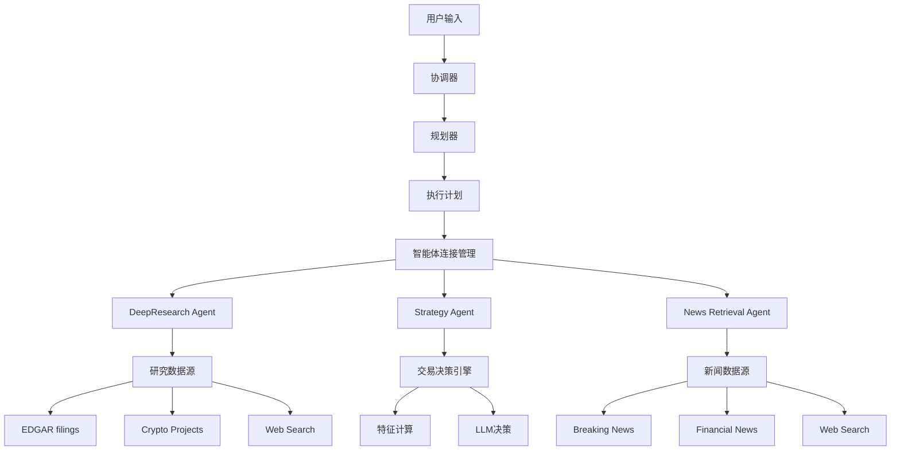
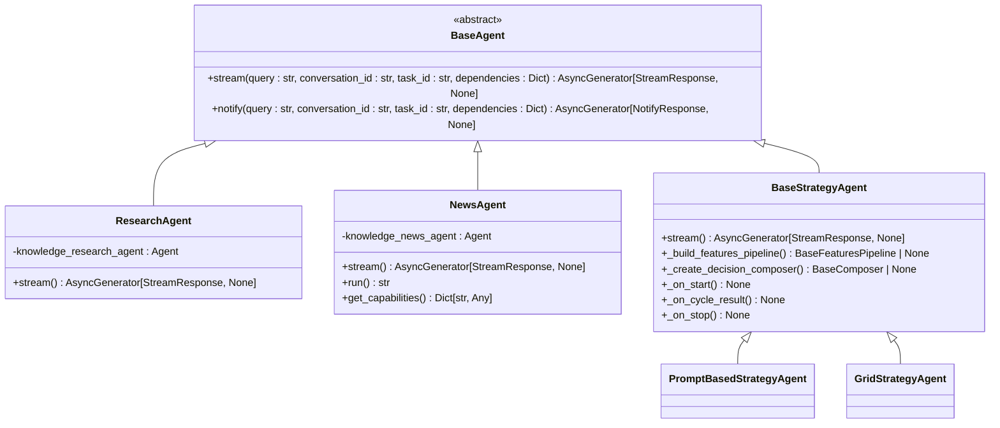
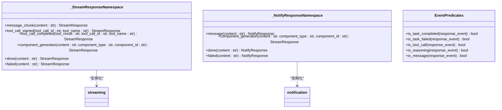
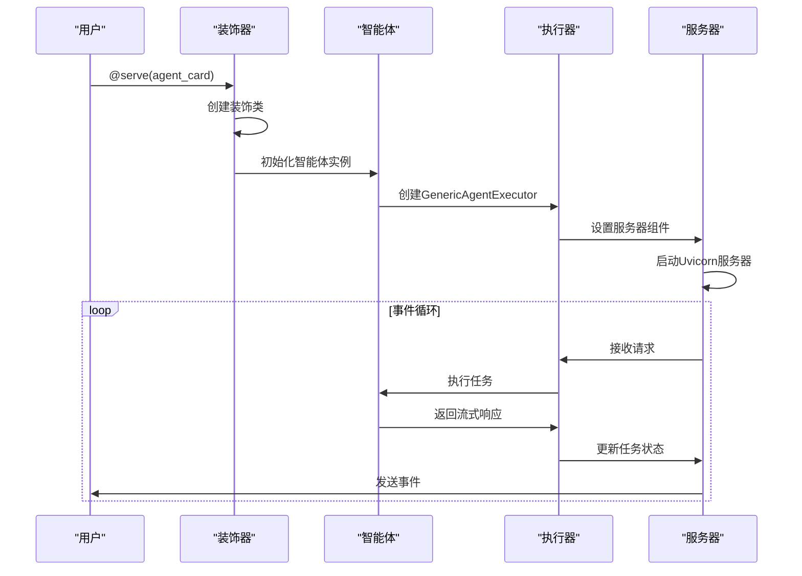
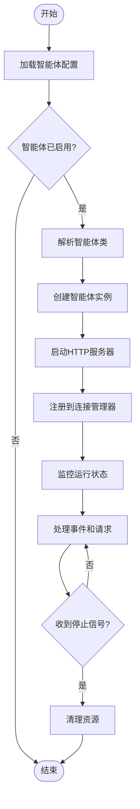
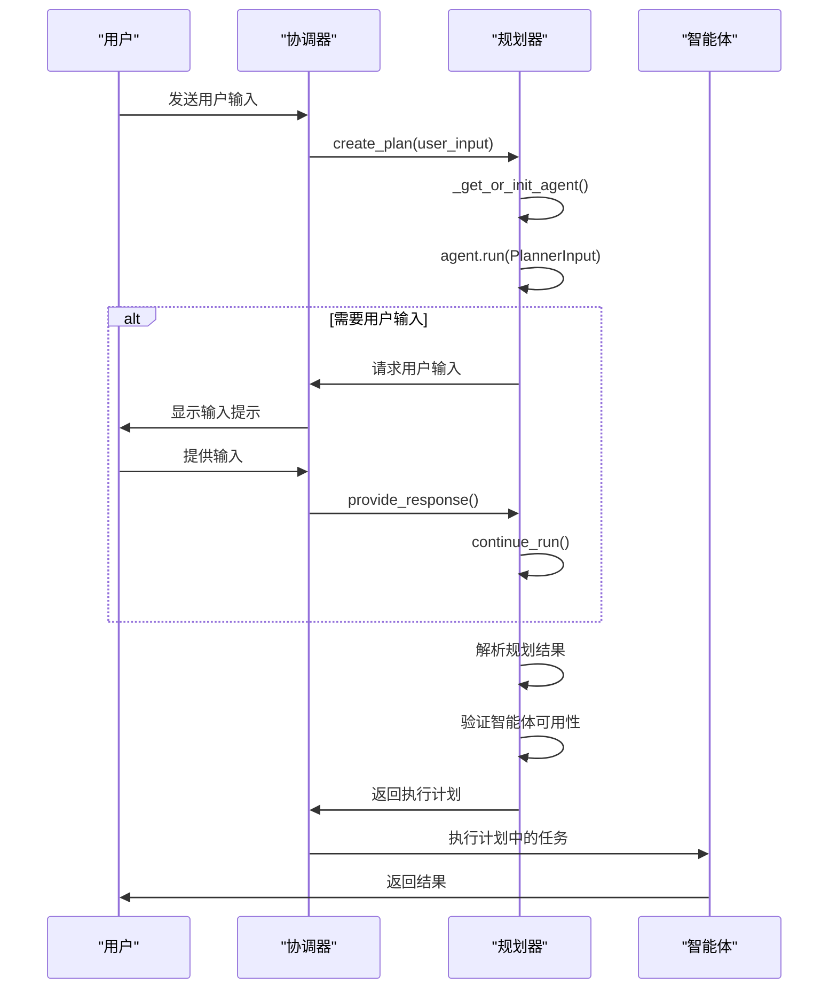

# 智能体系统

<cite>
**本文档中引用的文件**   
- [decorator.py](file://python/valuecell/core/agent/decorator.py)
- [card.py](file://python/valuecell/core/agent/card.py)
- [connect.py](file://python/valuecell/core/agent/connect.py)
- [types.py](file://python/valuecell/core/types.py)
- [planner.py](file://python/valuecell/core/plan/planner.py)
- [orchestrator.py](file://python/valuecell/core/coordinate/orchestrator.py)
- [responses.py](file://python/valuecell/core/agent/responses.py)
- [research_agent.py](file://python/valuecell/agents/research_agent/core.py)
- [news_agent.py](file://python/valuecell/agents/news_agent/core.py)
- [prompt_strategy_agent.py](file://python/valuecell/agents/prompt_strategy_agent/core.py)
- [base_agent.py](file://python/valuecell/agents/common/trading/base_agent.py)
- [grid_agent.py](file://python/valuecell/agents/grid_agent/grid_agent.py)
- [rootdata.py](file://python/valuecell/agents/sources/rootdata.py)
</cite>

## 目录
1. [引言](#引言)
2. [智能体架构概述](#智能体架构概述)
3. [核心组件分析](#核心组件分析)
4. [智能体实现细节](#智能体实现细节)
5. [智能体装饰器与连接工具](#智能体装饰器与连接工具)
6. [智能体协作与规划器](#智能体协作与规划器)
7. [结论](#结论)

## 引言
智能体系统是一个复杂的分布式架构，旨在通过多个专业化的智能体协同工作来处理各种任务。该系统基于异步事件驱动模型，支持流式响应和通知机制。核心设计原则包括模块化、可扩展性和松耦合。每个智能体都具有特定的职责和能力，能够独立运行并通过标准化接口进行通信。系统通过规划器智能选择合适的智能体来执行任务，并支持人类在环路中的交互模式，确保决策过程的透明性和可控性。

## 智能体架构概述

**图源**
- [orchestrator.py](file://python/valuecell/core/coordinate/orchestrator.py#L68-L644)
- [planner.py](file://python/valuecell/core/plan/planner.py#L75-L430)

## 核心组件分析

### 智能体类型系统
系统定义了统一的智能体类型系统，所有智能体都继承自`BaseAgent`抽象基类。该类定义了智能体必须实现的核心接口，包括流式处理和通知功能。

**图源**
- [types.py](file://python/valuecell/core/types.py#L449-L504)
- [research_agent.py](file://python/valuecell/agents/research_agent/core.py#L30-L99)
- [news_agent.py](file://python/valuecell/agents/news_agent/core.py#L17-L134)
- [base_agent.py](file://python/valuecell/agents/common/trading/base_agent.py#L31-L373)

### 响应系统
响应系统提供了统一的响应工厂，用于生成不同类型的流式响应和通知响应。这些工厂方法简化了智能体的开发，确保响应格式的一致性。

**图源**
- [responses.py](file://python/valuecell/core/agent/responses.py#L16-L307)

## 智能体实现细节

### DeepResearch Agent
DeepResearch Agent是一个专门用于金融数据分析和研究的智能体。它集成了多种数据源，包括SEC文件、加密项目信息和网络搜索功能。

**职责**
- 从EDGAR系统获取上市公司文件
- 搜索加密货币项目、风险投资机构和相关人员
- 执行网络搜索以获取最新信息
- 综合分析多源数据并生成研究报告

**内部组件**
- `knowledge_research_agent`: 基于Agno框架的AI代理，负责协调各种工具和知识库
- `fetch_periodic_sec_filings`: 获取定期SEC文件的工具
- `fetch_event_sec_filings`: 获取事件驱动的SEC文件的工具
- `web_search`: 通用网络搜索工具
- `search_crypto_projects`: 搜索加密项目的工具

**工作流程**
1. 接收用户查询
2. 初始化研究代理和相关工具
3. 配置EDGAR身份（如果提供了SEC_EMAIL环境变量）
4. 执行异步流式处理，将中间结果和最终结果返回给客户端
5. 处理工具调用事件，包括开始和完成状态
6. 生成完成信号，结束流式传输

**Section sources**
- [research_agent.py](file://python/valuecell/agents/research_agent/core.py#L30-L99)

### Strategy Agent
Strategy Agent是一个用于交易策略执行的智能体。它提供了灵活的架构，允许用户自定义特征计算和决策逻辑。

**职责**
- 执行交易策略的决策循环
- 管理策略的生命周期（启动、运行、停止）
- 持久化策略状态和结果
- 处理错误和异常情况

**内部组件**
- `BaseStrategyAgent`: 抽象基类，定义了策略智能体的核心接口和生命周期管理
- `StreamController`: 流控制器，负责管理流式传输的状态和持久化
- `StrategyRuntime`: 策略运行时，封装了策略执行的核心逻辑
- `DecisionCycleResult`: 决策周期结果，包含交易执行结果和相关元数据

**工作流程**
1. 解析和验证用户请求
2. 创建策略运行时实例
3. 发出初始运行状态
4. 在后台任务中执行决策循环
5. 每个决策周期包括：特征计算、决策生成、交易执行
6. 周期间隔休眠，等待下一个决策周期
7. 处理停止信号，关闭所有头寸并持久化最终状态

**Section sources**
- [base_agent.py](file://python/valuecell/agents/common/trading/base_agent.py#L31-L373)

### News Retrieval Agent
News Retrieval Agent是一个专门用于获取和分析新闻的智能体。它集成了多种新闻源，能够提供实时的新闻更新。

**职责**
- 获取突发新闻
- 获取金融和市场新闻
- 执行通用网络搜索
- 分析新闻内容并生成摘要

**内部组件**
- `knowledge_news_agent`: 基于Agno框架的AI代理，负责协调新闻获取工具
- `get_breaking_news`: 获取突发新闻的工具
- `get_financial_news`: 获取金融新闻的工具
- `web_search`: 通用网络搜索工具

**工作流程**
1. 接收用户查询
2. 初始化新闻代理和相关工具
3. 执行异步流式处理，将新闻内容分块返回
4. 处理工具调用事件，包括开始和完成状态
5. 生成完成信号，结束流式传输
6. 提供同步运行接口，返回完整的新闻内容

**Section sources**
- [news_agent.py](file://python/valuecell/agents/news_agent/core.py#L17-L134)

## 智能体装饰器与连接工具

### 智能体装饰器
智能体装饰器是系统的核心机制之一，它将普通的Python类转换为可服务的智能体。装饰器负责添加服务器功能、创建执行器和管理生命周期。

**关键功能**
- `_serve`: 创建装饰器函数，接受智能体卡片作为参数
- `GenericAgentExecutor`: 通用执行器，处理任务创建、流式响应和错误处理
- `create_wrapped_agent`: 创建包装后的智能体实例，准备服务

**Section sources**
- [decorator.py](file://python/valuecell/core/agent/decorator.py#L36-L285)

### 智能体连接工具
智能体连接工具负责管理智能体的连接和生命周期。它提供了统一的接口来启动、停止和管理智能体。

**关键功能**
- `RemoteConnections`: 远程连接管理器，负责加载智能体配置和管理连接
- `AgentContext`: 智能体上下文，存储连接状态、URL和配置
- `start_agent`: 启动智能体，建立连接并可选地启动通知监听器
- `stop_agent`: 停止智能体，清理所有资源

**Section sources**
- [connect.py](file://python/valuecell/core/agent/connect.py#L203-L674)

## 智能体协作与规划器

### 规划器工作流程
规划器是系统的智能中枢，负责分析用户输入并生成执行计划。它使用LLM-based规划代理来理解用户请求，并将其分解为可执行的任务。

**关键功能**
- `ExecutionPlanner`: 执行规划器，负责创建执行计划
- `UserInputRequest`: 用户输入请求，支持人类在环路中的交互
- `tool_get_agent_description`: 获取智能体描述的工具
- `tool_get_enabled_agents`: 获取启用的智能体列表的工具

**Section sources**
- [planner.py](file://python/valuecell/core/plan/planner.py#L75-L430)

### 智能体协作模式
智能体之间通过协调器进行协作。协调器负责管理整个执行流程，包括规划、执行和状态管理。

**协作模式**
1. **规划阶段**: 规划器分析用户输入，生成包含多个任务的执行计划
2. **执行阶段**: 协调器按顺序执行计划中的任务，每个任务由相应的智能体处理
3. **状态管理**: 协调器维护执行上下文，处理中断和恢复
4. **错误处理**: 协调器捕获和处理执行过程中的错误，确保系统的稳定性

**智能体选择机制**
- 规划器根据任务需求选择最合适的智能体
- 智能体能力通过`AgentCard`进行描述和注册
- 规划器使用`tool_get_agent_description`和`tool_get_enabled_agents`工具来获取智能体信息
- 选择过程考虑智能体的能力、可用性和任务匹配度

**Section sources**
- [orchestrator.py](file://python/valuecell/core/coordinate/orchestrator.py#L68-L644)

## 结论
智能体系统通过精心设计的架构实现了高度的模块化和可扩展性。核心组件包括智能体装饰器、连接工具、规划器和协调器，它们共同构成了一个强大的分布式智能系统。每个智能体都有明确的职责和能力，能够独立运行并通过标准化接口进行通信。系统支持流式响应和通知机制，确保了实时性和交互性。规划器作为系统的智能中枢，能够智能地选择和协调智能体来执行复杂任务。整体架构体现了现代AI系统的设计原则，为构建复杂的智能应用提供了坚实的基础。