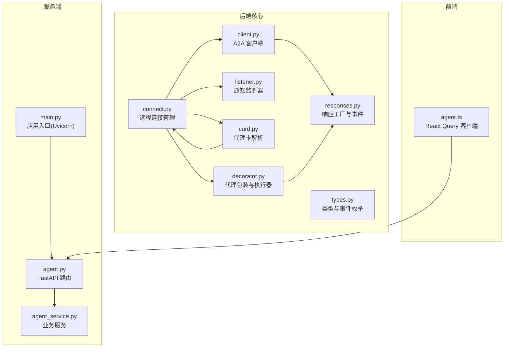
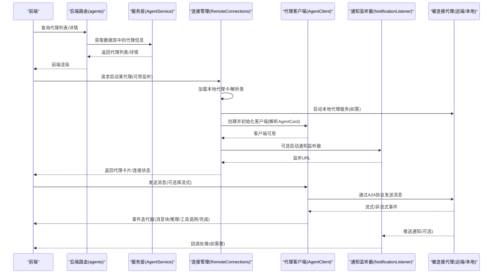
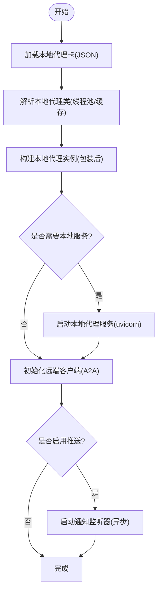
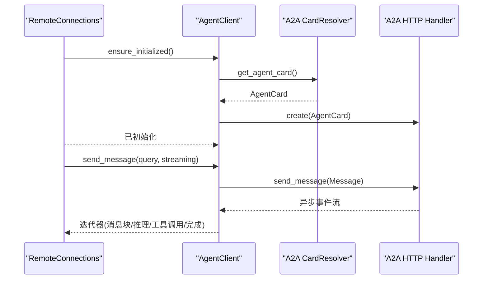
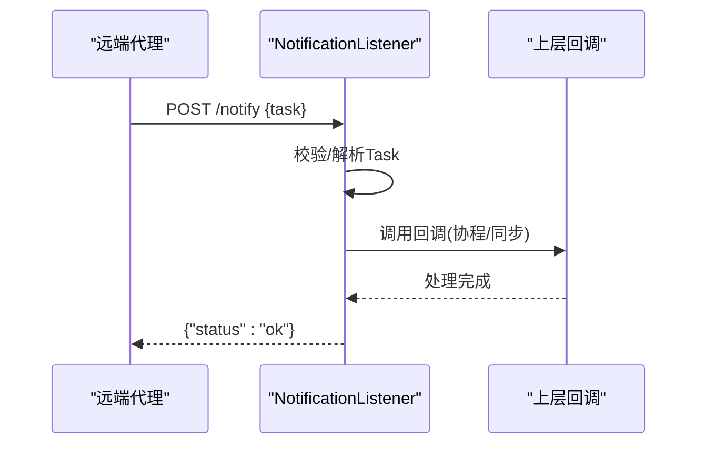
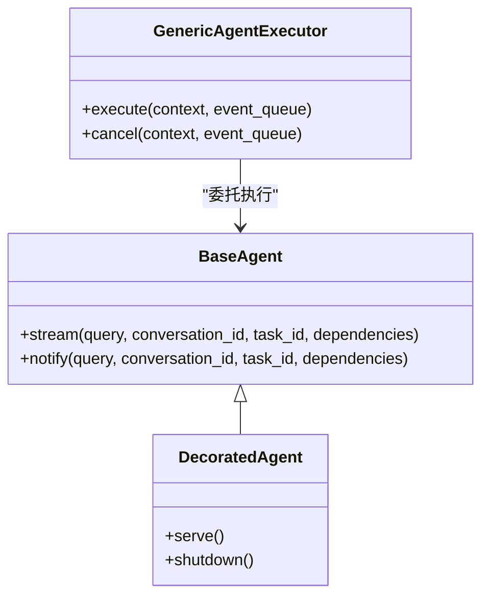
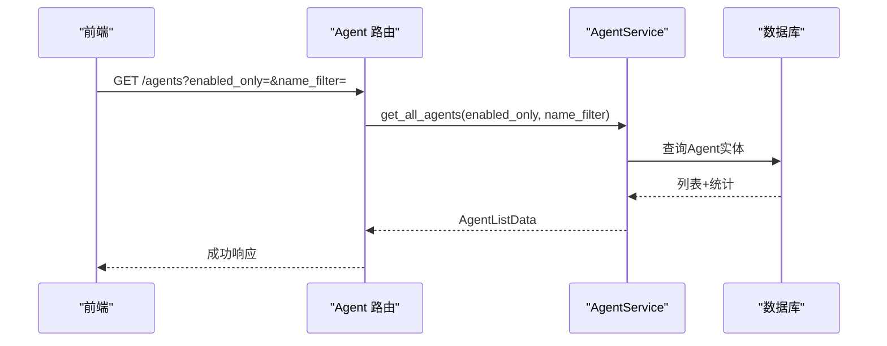
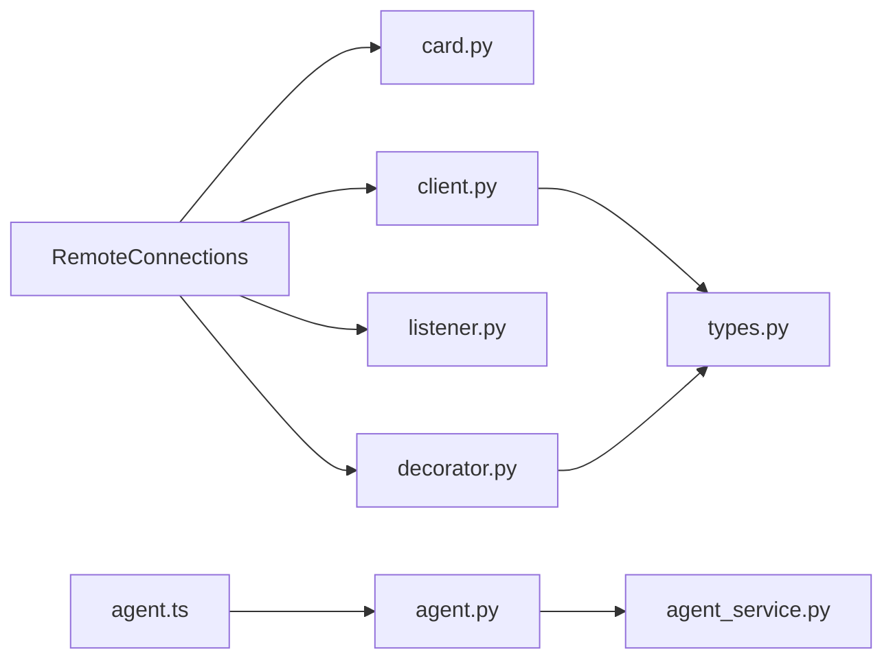

# 智能体连接

<cite>
**本文引用的文件**
- [connect.py](file://python/valuecell/core/agent/connect.py)
- [client.py](file://python/valuecell/core/agent/client.py)
- [listener.py](file://python/valuecell/core/agent/listener.py)
- [responses.py](file://python/valuecell/core/agent/responses.py)
- [decorator.py](file://python/valuecell/core/agent/decorator.py)
- [card.py](file://python/valuecell/core/agent/card.py)
- [types.py](file://python/valuecell/core/types.py)
- [grid_agent.json](file://python/configs/agent_cards/grid_agent.json)
- [prompt_strategy_agent.json](file://python/configs/agent_cards/prompt_strategy_agent.json)
- [agent.py](file://python/valuecell/server/api/routers/agent.py)
- [agent_service.py](file://python/valuecell/server/services/agent_service.py)
- [main.py](file://python/valuecell/server/main.py)
- [agent.ts](file://frontend/src/api/agent.ts)
</cite>

## 目录
1. [简介](#简介)
2. [项目结构](#项目结构)
3. [核心组件](#核心组件)
4. [架构总览](#架构总览)
5. [详细组件分析](#详细组件分析)
6. [依赖关系分析](#依赖关系分析)
7. [性能考量](#性能考量)
8. [故障排查指南](#故障排查指南)
9. [结论](#结论)
10. [附录](#附录)

## 简介
本文件系统性梳理“智能体连接”子系统，覆盖从本地代理类解析、远程代理客户端、通知监听器、响应模型与事件分类、到服务端 API 与前端对接的完整链路。目标是帮助开发者快速理解如何加载本地代理配置、启动本地代理实例、建立与远端代理的通信、接收推送通知，并在前后端之间稳定流转消息与状态。

## 项目结构
该子系统横跨后端 Python 核心模块（连接、客户端、监听器、响应、装饰器、卡片）、数据库服务层（AgentService）、FastAPI 路由层以及前端 API 客户端。

图表来源
- [connect.py](file://python/valuecell/core/agent/connect.py#L1-L684)
- [client.py](file://python/valuecell/core/agent/client.py#L1-L139)
- [listener.py](file://python/valuecell/core/agent/listener.py#L1-L96)
- [responses.py](file://python/valuecell/core/agent/responses.py#L1-L307)
- [decorator.py](file://python/valuecell/core/agent/decorator.py#L1-L285)
- [card.py](file://python/valuecell/core/agent/card.py#L1-L91)
- [types.py](file://python/valuecell/core/types.py#L1-L504)
- [agent.py](file://python/valuecell/server/api/routers/agent.py#L1-L180)
- [agent_service.py](file://python/valuecell/server/services/agent_service.py#L1-L202)
- [main.py](file://python/valuecell/server/main.py#L1-L99)
- [agent.ts](file://frontend/src/api/agent.ts#L1-L57)

章节来源
- [connect.py](file://python/valuecell/core/agent/connect.py#L1-L684)
- [client.py](file://python/valuecell/core/agent/client.py#L1-L139)
- [listener.py](file://python/valuecell/core/agent/listener.py#L1-L96)
- [responses.py](file://python/valuecell/core/agent/responses.py#L1-L307)
- [decorator.py](file://python/valuecell/core/agent/decorator.py#L1-L285)
- [card.py](file://python/valuecell/core/agent/card.py#L1-L91)
- [types.py](file://python/valuecell/core/types.py#L1-L504)
- [agent.py](file://python/valuecell/server/api/routers/agent.py#L1-L180)
- [agent_service.py](file://python/valuecell/server/services/agent_service.py#L1-L202)
- [main.py](file://python/valuecell/server/main.py#L1-L99)
- [agent.ts](file://frontend/src/api/agent.ts#L1-L57)

## 核心组件
- 远程连接管理器：负责加载本地代理卡、解析本地代理类、启动本地代理服务、创建并初始化远端代理客户端、可选启动通知监听器。
- 代理客户端：基于 A2A 的 Card 解析与请求发送，支持流式与非流式两种模式。
- 通知监听器：基于 Uvicorn 的 HTTP 服务，接收来自远端代理的推送通知并回调上层处理。
- 响应工厂与事件：提供统一的流式/通知响应构造方法与事件类型判断工具。
- 代理装饰器与执行器：为实现 BaseAgent 的类注入 serve/shutdown 生命周期与通用执行器，将用户代理的输出映射为任务状态与中间事件。
- 代理卡解析：从本地 JSON 配置中提取并标准化 AgentCard 字段，兼容缺失字段与扩展元数据。
- 类型与事件：定义流式/通知/任务状态/通用事件等枚举与响应模型，统一前后端交互契约。
- 服务端 API 与服务层：提供查询/启用/禁用代理的接口，配合数据库模型返回列表与详情。
- 前端 API 客户端：通过 React Query 访问后端代理接口，支持查询代理列表与启用状态变更。

章节来源
- [connect.py](file://python/valuecell/core/agent/connect.py#L1-L684)
- [client.py](file://python/valuecell/core/agent/client.py#L1-L139)
- [listener.py](file://python/valuecell/core/agent/listener.py#L1-L96)
- [responses.py](file://python/valuecell/core/agent/responses.py#L1-L307)
- [decorator.py](file://python/valuecell/core/agent/decorator.py#L1-L285)
- [card.py](file://python/valuecell/core/agent/card.py#L1-L91)
- [types.py](file://python/valuecell/core/types.py#L1-L504)
- [agent.py](file://python/valuecell/server/api/routers/agent.py#L1-L180)
- [agent_service.py](file://python/valuecell/server/services/agent_service.py#L1-L202)
- [agent.ts](file://frontend/src/api/agent.ts#L1-L57)

## 架构总览
下图展示从“前端发起请求”到“远端代理响应”的端到端流程，包括本地代理实例化、客户端初始化、通知监听器与事件分发。

图表来源
- [agent.py](file://python/valuecell/server/api/routers/agent.py#L1-L180)
- [agent_service.py](file://python/valuecell/server/services/agent_service.py#L1-L202)
- [connect.py](file://python/valuecell/core/agent/connect.py#L348-L684)
- [client.py](file://python/valuecell/core/agent/client.py#L33-L139)
- [listener.py](file://python/valuecell/core/agent/listener.py#L1-L96)
- [responses.py](file://python/valuecell/core/agent/responses.py#L1-L307)
- [agent.ts](file://frontend/src/api/agent.ts#L1-L57)

## 详细组件分析

### 组件A：远程连接管理器（RemoteConnections）
职责
- 加载本地代理卡（JSON）并解析为 AgentCard
- 解析本地代理类（支持缓存与线程池导入）
- 启动本地代理服务（通过装饰器包装后的类实例）
- 创建并初始化远端代理客户端（A2A 协议）
- 可选启动通知监听器（Uvicorn），并将回调注入客户端推送配置
- 提供查询运行中/可用代理、停止代理、关闭所有资源等能力

关键流程
- 预加载本地代理类：在事件循环之外使用线程池导入，避免 Windows 导入锁导致的死锁；失败时回退同步导入
- 启动本地代理：延迟构建实例，确保在事件循环上下文中进行包装与启动
- 初始化客户端：重试机制，确保本地代理服务就绪后再连接
- 启动监听器：自动分配空闲端口，异步启动 Uvicorn 服务

图表来源
- [connect.py](file://python/valuecell/core/agent/connect.py#L148-L684)

章节来源
- [connect.py](file://python/valuecell/core/agent/connect.py#L1-L684)

### 组件B：代理客户端（AgentClient）
职责
- 基于 A2A 的 ClientFactory 与 CardResolver，解析远端代理的 AgentCard
- 支持流式与非流式消息发送，返回异步迭代器
- 可选配置推送通知（当监听器启用时）

要点
- 初始化时创建 httpx.AsyncClient 并设置超时
- 当存在推送通知 URL 时，配置推送参数并切换为轮询模式
- send_message 将用户输入封装为 Message 并交由底层生成器消费，最终统一关闭生成器

图表来源
- [client.py](file://python/valuecell/core/agent/client.py#L33-L139)

章节来源
- [client.py](file://python/valuecell/core/agent/client.py#L1-L139)

### 组件C：通知监听器（NotificationListener）
职责
- 作为 Uvicorn HTTP 服务，监听 /notify 路由
- 校验请求体为 Task 结构，调用回调函数（支持协程/同步）
- 返回 JSON 响应，记录日志

注意
- 监听器启动方式支持同步与异步两种，异步启动用于与主事件循环协作
- 回调函数签名接受 Task 对象，便于上层处理任务状态变化或业务逻辑

图表来源
- [listener.py](file://python/valuecell/core/agent/listener.py#L1-L96)

章节来源
- [listener.py](file://python/valuecell/core/agent/listener.py#L1-L96)

### 组件D：响应工厂与事件（responses）
职责
- 提供流式/通知两类响应工厂方法，便于代理按事件类型产出内容
- 提供事件类型判断工具，区分任务完成/失败、工具调用、推理、消息等

典型用法
- 代理在执行过程中通过工厂方法产出不同事件，客户端/监听器据此更新 UI 或触发后续动作
- 事件类型与响应模型在 types 中定义，保证前后端一致性

章节来源
- [responses.py](file://python/valuecell/core/agent/responses.py#L1-L307)
- [types.py](file://python/valuecell/core/types.py#L1-L504)

### 组件E：代理装饰器与执行器（decorator）
职责
- 为实现 BaseAgent 的类注入 serve()/shutdown() 生命周期
- 创建通用执行器，将代理输出映射为任务状态更新与中间事件
- 支持 notify/stream 两种模式，分别对应主动推送与用户发起的对话

要点
- 执行器根据事件类型更新任务状态，支持工具调用、推理、组件生成等事件
- 对异常进行捕获并标记任务失败，最后完成任务生命周期

图表来源
- [decorator.py](file://python/valuecell/core/agent/decorator.py#L1-L285)
- [types.py](file://python/valuecell/core/types.py#L449-L504)

章节来源
- [decorator.py](file://python/valuecell/core/agent/decorator.py#L1-L285)
- [types.py](file://python/valuecell/core/types.py#L449-L504)

### 组件F：代理卡解析（card）
职责
- 从本地 JSON 文件中解析出 AgentCard，填充缺失字段（描述、能力、默认输入/输出模式、版本）
- 支持按名称查找本地代理卡，过滤 disabled 项

章节来源
- [card.py](file://python/valuecell/core/agent/card.py#L1-L91)

### 组件G：服务端 API 与服务层（agent.py, agent_service.py）
职责
- 提供查询代理列表、按名称/ID 查询、启用/禁用代理的接口
- 服务层负责数据库查询、过滤隐藏代理、统计总数与启用数

图表来源
- [agent.py](file://python/valuecell/server/api/routers/agent.py#L1-L180)
- [agent_service.py](file://python/valuecell/server/services/agent_service.py#L1-L202)

章节来源
- [agent.py](file://python/valuecell/server/api/routers/agent.py#L1-L180)
- [agent_service.py](file://python/valuecell/server/services/agent_service.py#L1-L202)

### 组件H：前端 API 客户端（agent.ts）
职责
- 使用 React Query 访问后端代理接口
- 支持查询代理列表、按名称查询、启用/禁用代理并刷新缓存

章节来源
- [agent.ts](file://frontend/src/api/agent.ts#L1-L57)

## 依赖关系分析
- RemoteConnections 依赖：
  - card.py：解析本地代理卡
  - client.py：初始化远端客户端
  - listener.py：启动通知监听器
  - decorator.py：包装本地代理类并启动服务
  - types.py：事件与响应类型
- AgentClient 依赖：
  - a2a.types/a2a.client：A2A 规范的 CardResolver/ClientFactory
  - httpx.AsyncClient：异步 HTTP 客户端
  - types.RemoteAgentResponse：远端事件元组类型
- NotificationListener 依赖：
  - uvicorn/starlette：HTTP 服务框架
  - a2a.types.Task：推送任务结构
- 服务端依赖：
  - FastAPI 路由器 + SQLAlchemy 模型 + 服务层
- 前端依赖：
  - TanStack React Query + 自定义 apiClient

图表来源
- [connect.py](file://python/valuecell/core/agent/connect.py#L1-L684)
- [client.py](file://python/valuecell/core/agent/client.py#L1-L139)
- [listener.py](file://python/valuecell/core/agent/listener.py#L1-L96)
- [responses.py](file://python/valuecell/core/agent/responses.py#L1-L307)
- [decorator.py](file://python/valuecell/core/agent/decorator.py#L1-L285)
- [card.py](file://python/valuecell/core/agent/card.py#L1-L91)
- [types.py](file://python/valuecell/core/types.py#L1-L504)
- [agent.py](file://python/valuecell/server/api/routers/agent.py#L1-L180)
- [agent_service.py](file://python/valuecell/server/services/agent_service.py#L1-L202)
- [agent.ts](file://frontend/src/api/agent.ts#L1-L57)

## 性能考量
- 导入性能与并发安全
  - 使用线程池导入本地代理类，避免阻塞事件循环；同时维护类缓存减少重复导入
  - 在 Windows 上避免导入锁竞争，提供超时与回退策略
- 客户端初始化与重试
  - 本地代理启动后进行有限次重试，指数退避，降低冷启动抖动
- 通知监听器
  - 异步启动 Uvicorn 服务，主线程不阻塞；监听器仅在代理声明支持推送时启用
- 前后端交互
  - 流式响应优先，非流式仅返回首个事件，减少网络与内存压力

章节来源
- [connect.py](file://python/valuecell/core/agent/connect.py#L148-L684)
- [client.py](file://python/valuecell/core/agent/client.py#L33-L139)
- [listener.py](file://python/valuecell/core/agent/listener.py#L1-L96)

## 故障排查指南
常见问题与定位建议
- 无法解析代理类
  - 检查本地代理卡中的 metadata.local_agent_class 是否正确
  - 查看导入缓存命中情况与线程池错误日志
  - 参考路径：[connect.py](file://python/valuecell/core/agent/connect.py#L80-L146)
- 客户端初始化失败
  - 确认远端代理 URL 正确且可达
  - 查看 A2A CardResolver 抛出的异常信息
  - 参考路径：[client.py](file://python/valuecell/core/agent/client.py#L33-L139)
- 本地代理未启动或启动失败
  - 检查 serve() 生命周期与装饰器包装
  - 关注执行器对异常的捕获与任务失败上报
  - 参考路径：[decorator.py](file://python/valuecell/core/agent/decorator.py#L125-L285)
- 通知监听器未收到推送
  - 确认客户端已配置推送 URL 且监听器已启动
  - 检查 /notify 路由是否被正确注册与访问
  - 参考路径：[client.py](file://python/valuecell/core/agent/client.py#L33-L139)、[listener.py](file://python/valuecell/core/agent/listener.py#L1-L96)
- 前端代理列表为空或状态异常
  - 检查数据库中代理 enabled 与隐藏策略
  - 使用后端接口验证返回数据
  - 参考路径：[agent_service.py](file://python/valuecell/server/services/agent_service.py#L1-L202)、[agent.py](file://python/valuecell/server/api/routers/agent.py#L1-L180)、[agent.ts](file://frontend/src/api/agent.ts#L1-L57)

章节来源
- [connect.py](file://python/valuecell/core/agent/connect.py#L148-L684)
- [client.py](file://python/valuecell/core/agent/client.py#L33-L139)
- [listener.py](file://python/valuecell/core/agent/listener.py#L1-L96)
- [decorator.py](file://python/valuecell/core/agent/decorator.py#L125-L285)
- [agent_service.py](file://python/valuecell/server/services/agent_service.py#L1-L202)
- [agent.py](file://python/valuecell/server/api/routers/agent.py#L1-L180)
- [agent.ts](file://frontend/src/api/agent.ts#L1-L57)

## 结论
“智能体连接”子系统以 A2A 协议为核心，结合本地代理类解析、客户端初始化、通知监听与统一响应模型，形成从配置到运行、从服务端到前端的闭环。通过线程池导入、重试与异步监听等机制，系统在复杂多代理场景下具备良好的稳定性与可扩展性。建议在生产环境关注导入锁、网络超时与任务失败的可观测性，持续优化事件分发与前端渲染性能。

## 附录
- 本地代理卡示例
  - [grid_agent.json](file://python/configs/agent_cards/grid_agent.json#L1-L22)
  - [prompt_strategy_agent.json](file://python/configs/agent_cards/prompt_strategy_agent.json#L1-L33)
- 应用入口与服务启动
  - [main.py](file://python/valuecell/server/main.py#L1-L99)