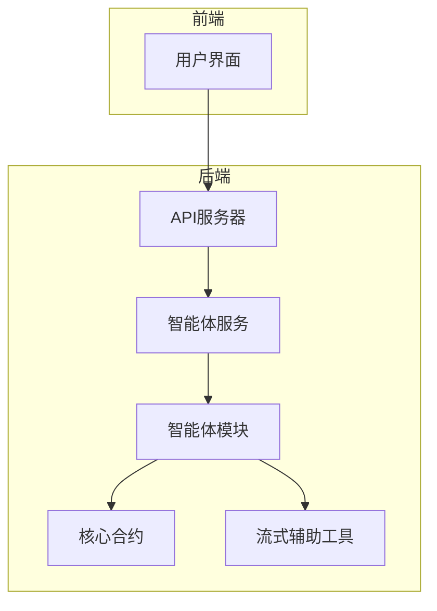
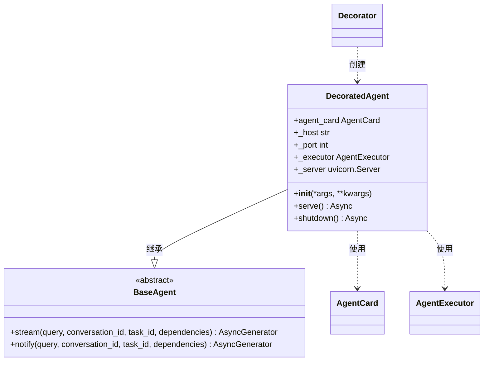
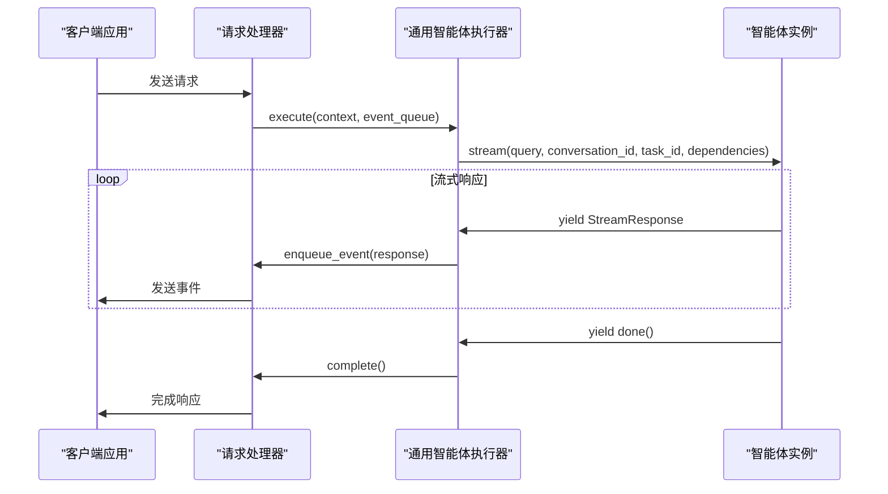
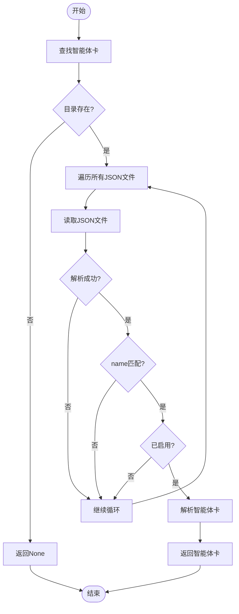
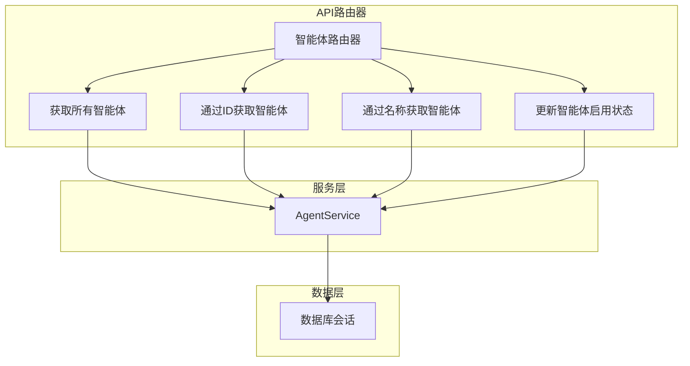
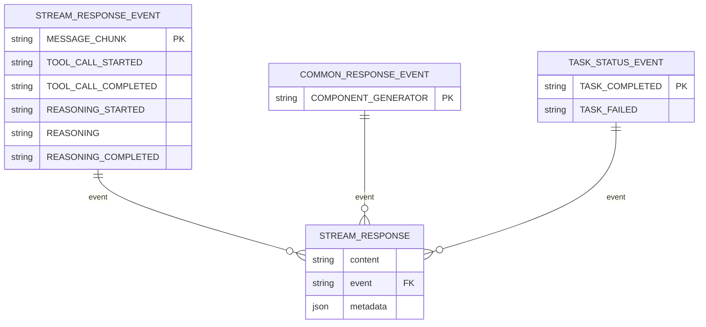

# 自定义智能体开发

<cite>
**本文档引用的文件**   
- [CONTRIBUTE_AN_AGENT.md](file://docs/CONTRIBUTE_AN_AGENT.md)
- [base_agent.py](file://python/valuecell/agents/common/trading/base_agent.py)
- [decorator.py](file://python/valuecell/core/agent/decorator.py)
- [card.py](file://python/valuecell/core/agent/card.py)
- [agent_service.py](file://python/valuecell/server/services/agent_service.py)
- [types.py](file://python/valuecell/core/types.py)
- [responses.py](file://python/valuecell/core/agent/responses.py)
- [model.py](file://python/valuecell/utils/model.py)
- [grid_agent.py](file://python/valuecell/agents/grid_agent/grid_agent.py)
- [core.py](file://python/valuecell/agents/research_agent/core.py)
- [core.py](file://python/valuecell/agents/news_agent/core.py)
- [prompts.py](file://python/valuecell/agents/research_agent/prompts.py)
</cite>

## 目录
1. [简介](#简介)
2. [智能体架构概述](#智能体架构概述)
3. [创建新智能体](#创建新智能体)
4. [定义智能体能力卡](#定义智能体能力卡)
5. [继承基类并实现核心逻辑](#继承基类并实现核心逻辑)
6. [智能体注册与运行时集成](#智能体注册与运行时集成)
7. [通过Agent Service暴露给前端](#通过agent-service暴露给前端)
8. [输入输出模式与流式响应处理](#输入输出模式与流式响应处理)
9. [与系统服务交互的最佳实践](#与系统服务交互的最佳实践)
10. [完整示例：研究智能体](#完整示例研究智能体)

## 简介
本文档提供了从零开始创建自定义智能体的完整指南。基于ValueCell多智能体金融平台的架构，详细说明了如何使用`@agent`装饰器定义智能体能力卡（capability card），包括名称、描述、支持的组件类型等元数据配置。结合`CONTRIBUTE_AN_AGENT.md`中的步骤，展示了如何继承`base_agent.py`中的基类并实现核心处理逻辑。文档还解释了智能体注册机制、运行时集成方式以及如何通过`agent_service.py`暴露给前端。提供了具体代码示例，演示了如何定义输入输出模式、处理流式响应以及与系统其他服务（如任务管理、会话存储）交互的最佳实践。

**Section sources**
- [CONTRIBUTE_AN_AGENT.md](file://docs/CONTRIBUTE_AN_AGENT.md)

## 智能体架构概述
ValueCell平台的智能体系统采用模块化设计，核心组件包括API后端、智能体模块、核心合约和流式辅助工具。API后端由`valuecell.server`（基于FastAPI/uvicorn）实现，是系统的入口点。智能体位于`valuecell.agents.<agent_name>`目录下，每个智能体都有一个`__main__.py`文件用于`python -m`执行。核心合约在`valuecell.core.types`中定义，规定了响应事件和数据形状。流式辅助工具在`valuecell.core.agent.stream`中提供，用于发射事件。



**Diagram sources **
- [CONTRIBUTE_AN_AGENT.md](file://docs/CONTRIBUTE_AN_AGENT.md)

## 创建新智能体
创建新智能体涉及三个核心步骤：实现智能体模块、添加智能体能力卡和添加智能体配置。首先，需要在`python/valuecell/agents/`目录下创建新的智能体目录结构。

### 创建智能体目录结构
使用以下命令创建智能体的基本目录结构：

```bash
mkdir -p python/valuecell/agents/hello_agent
touch python/valuecell/agents/hello_agent/__init__.py
touch python/valuecell/agents/hello_agent/__main__.py
touch python/valuecell/agents/hello_agent/core.py
```

### 实现智能体逻辑
在`core.py`中，通过继承`BaseAgent`并实现`stream()`方法来定义智能体的核心逻辑。该方法处理用户查询并返回流式响应。

```python
# file: valuecell/agents/hello_agent/core.py
from typing import AsyncGenerator, Optional, Dict
from valuecell.core.types import BaseAgent, StreamResponse
from valuecell.core.agent import streaming

class HelloAgent(BaseAgent):
   async def stream(
      self,
      query: str,                    # 用户查询内容
      conversation_id: str,          # 对话ID
      task_id: str,                  # 任务ID
      dependencies: Optional[Dict] = None,  # 可选上下文（语言、时区等）
   ) -> AsyncGenerator[StreamResponse, None]:
      """
      处理用户查询并返回流式响应。
      
      Args:
          query: 用户查询内容
          conversation_id: 对话的唯一标识符
          task_id: 任务的唯一标识符
          dependencies: 包含语言、时区和其他上下文的可选依赖项
      
      Yields:
          StreamResponse: 包含内容和完成状态的流式响应
      """
      # 发送几个数据块，然后结束
      yield streaming.message_chunk("思考中…")
      yield streaming.message_chunk(f"您说：{query}")
      yield streaming.done()
```

**智能体处理流程要点：**
1. **返回文本内容**：使用`streaming.message_chunk()`返回文本响应。可以发送完整消息或将消息拆分为更小的块以获得更好的流式用户体验。
2. **发送完成信号**：始终以`streaming.done()`结束，表示智能体已完成处理。

这种简单的流程实现了与UI的实时通信，可以在生成时显示响应。

### 添加智能体入口点
在`__main__.py`中，包装智能体以进行独立执行。此文件通过`uv run -m`启用启动智能体。

```python
# file: valuecell/agents/hello_agent/__main__.py
import asyncio
from valuecell.core.agent import create_wrapped_agent
from .core import HelloAgent

if __name__ == "__main__":
   agent = create_wrapped_agent(HelloAgent)
   asyncio.run(agent.serve())
```

> [!IMPORTANT]
> 始终将包装和启动逻辑放在`__main__.py`中。这种模式可以实现：
> 
> - 通过`uv run -m valuecell.agents.your_agent`一致地启动智能体
> - 后端服务器自动发现
> - 标准化的传输和事件发射

**Section sources**
- [CONTRIBUTE_AN_AGENT.md](file://docs/CONTRIBUTE_AN_AGENT.md)

## 定义智能体能力卡
智能体能力卡声明了如何发现和提供智能体。将JSON文件放置在`python/configs/agent_cards/`目录下。`name`必须与智能体类名匹配（例如，`HelloAgent`）。`url`决定了包装后的智能体会绑定到的主机/端口。

### 最小示例
```json
{
  "name": "HelloAgent",
  "url": "http://localhost:10010",
  "description": "一个回显输入的最小示例智能体。",
  "capabilities": { "streaming": true, "push_notifications": false },
  "default_input_modes": ["text"],
  "default_output_modes": ["text"],
  "version": "1.0.0",
  "skills": [
   {
     "id": "echo",
     "name": "回显",
     "description": "将用户输入作为流式数据块回显。",
     "tags": ["example", "echo"]
   }
  ]
}
```

> [!TIP]
> 
> - 文件名可以是任何名称（例如，`hello_agent.json`），但`name`必须等于智能体类名（由`create_wrapped_agent`使用）
> - 可选的`enabled: false`将禁用加载。`display_name`或`metadata`等额外字段将被忽略
> - 如果端口被占用，请更改`url`端口。包装器在启动时从该URL读取主机/端口
> - 如果看到“在智能体卡中找不到智能体配置...”，请检查`name`和JSON位置

**Section sources**
- [CONTRIBUTE_AN_AGENT.md](file://docs/CONTRIBUTE_AN_AGENT.md)

## 继承基类并实现核心逻辑
智能体通过继承`BaseAgent`抽象基类来实现。对于交易策略智能体，应继承`BaseStrategyAgent`，它提供了流生命周期、状态转换、持久化编排、错误处理和资源清理等功能。

### BaseStrategyAgent 抽象基类
`BaseStrategyAgent`定义了用户应实现的抽象方法和可选钩子：

```python
class BaseStrategyAgent(BaseAgent, ABC):
    """策略智能体的抽象基类。
    
    用户应子类化此并实现：
    - _build_features_pipeline: 定义特征计算逻辑
    - _create_decision_composer: 定义决策作曲家（可选，默认为LLM）
    - _on_start: 运行时创建后的自定义初始化（可选）
    - _on_cycle_result: 每个周期后的自定义逻辑钩子（可选）
    - _on_stop: 最终化前的自定义清理（可选）
    
    基类处理：
    - 流生命周期和状态转换
    - 持久化编排（初始状态、周期结果、最终化）
    - 错误处理和资源清理
    """
```

### 实现特征管道
通过实现`_build_features_pipeline`方法来构建策略的特征管道。返回一个`FeaturesPipeline`实现以自定义如何为每个决策周期生成市场数据和特征向量。

```python
async def _build_features_pipeline(
    self, request: UserRequest
) -> BaseFeaturesPipeline | None:
    """构建策略的特征管道。
    
    返回一个`FeaturesPipeline`实现以自定义如何为每个决策周期生成市场数据
    和特征向量。返回``None``指示运行时使用默认管道。
    
    Args:
        request: 带有策略配置的用户请求
        
    Returns:
        FeaturesPipeline实例或None以使用默认行为
    """
    return DefaultFeaturesPipeline.from_request(request)
```

### 创建决策作曲家
通过实现`_create_decision_composer`方法来构建策略的决策作曲家。可以覆盖此方法以提供自定义作曲家，或返回None以使用默认的LLM作曲家。

```python
async def _create_decision_composer(
    self, request: UserRequest
) -> BaseComposer | None:
    """构建策略的决策作曲家。
    
    覆盖以提供自定义作曲家。返回None以使用默认LLM作曲家。
    
    Args:
        request: 带有策略配置的用户请求
        
    Returns:
        作曲家实例或None以使用默认作曲家
    """
    return GridComposer(
        request=request,
        step_pct=0.001,  # 0.1%每步（更敏感）
        max_steps=3,
        base_fraction=0.08,
        use_llm_params=True,
    )
```

**Section sources**
- [base_agent.py](file://python/valuecell/agents/common/trading/base_agent.py)

## 智能体注册与运行时集成
智能体通过装饰器和注册机制集成到系统中。`create_wrapped_agent`函数是智能体注册的核心，它加载智能体卡配置并包装智能体类以提供服务器功能。

### 智能体装饰器机制
`_serve`装饰器函数包装智能体类以添加服务器功能。它创建一个`DecoratedAgent`类，该类继承自原始智能体类并添加了`serve()`方法。



**Diagram sources **
- [decorator.py](file://python/valuecell/core/agent/decorator.py)

### 通用智能体执行器
`GenericAgentExecutor`处理`BaseAgent`实现的执行生命周期，包括任务创建、流式响应和错误处理。



**Diagram sources **
- [decorator.py](file://python/valuecell/core/agent/decorator.py)

### 智能体卡解析与查找
智能体卡通过`find_local_agent_card_by_agent_name`函数从本地JSON配置文件中查找。该函数搜索`agent_cards`目录中的JSON文件，并返回第一个`name`字段匹配提供的`agent_name`的智能体卡。



**Diagram sources **
- [card.py](file://python/valuecell/core/agent/card.py)

**Section sources**
- [decorator.py](file://python/valuecell/core/agent/decorator.py)
- [card.py](file://python/valuecell/core/agent/card.py)

## 通过agent-service暴露给前端
智能体服务层处理与智能体相关的业务逻辑，并通过API路由器暴露给前端。`AgentService`类提供了获取所有智能体、获取特定智能体和更新智能体启用状态的方法。

### 智能体服务类
`AgentService`类提供了处理智能体相关操作的服务方法：

```python
class AgentService:
    """智能体相关操作的服务类。"""

    @staticmethod
    def get_all_agents(
        db: Session,
        enabled_only: bool = False,
        name_filter: Optional[str] = None,
        exclude_hidden: bool = True,
    ) -> AgentListData:
        """
        获取数据库中的所有智能体并应用可选过滤器。
        
        Args:
            db: 数据库会话
            enabled_only: 仅过滤启用的智能体
            name_filter: 按智能体名称过滤（部分匹配）
            
        Returns:
            包含智能体列表和统计信息的AgentListData
        """
        # 构建带过滤器的查询
        query = db.query(Agent)
        
        filters = []
        if enabled_only:
            filters.append(Agent.enabled)
        if name_filter:
            filters.append(
                or_(
                    Agent.name.ilike(f"%{name_filter}%"),
                    Agent.display_name.ilike(f"%{name_filter}%"),
                )
            )
        
        if filters:
            query = query.filter(and_(*filters))
        
        # 执行查询
        agents = query.order_by(Agent.created_at.desc()).all()
        
        # 转换为数据模型
        agent_data_list = []
        HIDE_UNLESS_ENABLED = {"research_agent", "news_agent"}
        for _agent_entity in agents:
            if (
                _agent_entity.agent_metadata
                and exclude_hidden
                and _agent_entity.agent_metadata.get("hidden", False)
            ):
                continue
            
            # 默认情况下，当未启用时隐藏研究/新闻智能体
            if (
                exclude_hidden
                and (_agent_entity.name in HIDE_UNLESS_ENABLED)
                and (not _agent_entity.enabled)
            ):
                continue
            
            agent = AgentData(
                id=_agent_entity.id,
                agent_name=_agent_entity.name,
                display_name=_agent_entity.display_name,
                description=_agent_entity.description,
                version=_agent_entity.version,
                enabled=_agent_entity.enabled,
                icon_url=_agent_entity.icon_url,
                agent_metadata=_agent_entity.agent_metadata,
                config=_agent_entity.config,
                created_at=_agent_entity.created_at,
                updated_at=_agent_entity.updated_at,
            )
            agent_data_list.append(agent)
        
        # 计算统计信息
        total_count = len(agent_data_list)
        enabled_count = sum(1 for agent in agent_data_list if agent.enabled)
        
        return AgentListData(
            agents=agent_data_list, total=total_count, enabled_count=enabled_count
        )
```

### 智能体API路由器
`create_agent_router`函数创建并配置智能体路由器，提供获取所有智能体、获取特定智能体和更新智能体启用状态的端点。



**Diagram sources **
- [agent_service.py](file://python/valuecell/server/services/agent_service.py)
- [agent.py](file://python/valuecell/server/api/routers/agent.py)

**Section sources**
- [agent_service.py](file://python/valuecell/server/services/agent_service.py)
- [agent.py](file://python/valuecell/server/api/routers/agent.py)

## 输入输出模式与流式响应处理
智能体通过流式响应与系统通信，使用预定义的事件类型来表示不同的响应类型。`streaming`命名空间提供了创建流式响应的工厂方法。

### 流式响应事件
流式响应支持多种事件类型，包括消息块、工具调用、推理和组件生成器。



**Diagram sources **
- [types.py](file://python/valuecell/core/types.py)
- [responses.py](file://python/valuecell/core/agent/responses.py)

### 流式响应工厂
`streaming`命名空间提供了创建不同流式响应的便捷方法：

```python
class _StreamResponseNamespace:
    """流式响应的工厂方法。
    
    提供创建StreamResponse实例的便捷方法，用于
    不同类型的流式事件，如消息块、工具调用等。
    """

    def message_chunk(self, content: str) -> StreamResponse:
        """创建消息块响应。
        
        Args:
            content: 消息内容块
            
        Returns:
            带有MESSAGE_CHUNK事件的StreamResponse
        """
        return StreamResponse(
            event=StreamResponseEvent.MESSAGE_CHUNK,
            content=content,
        )

    def tool_call_started(self, tool_call_id: str, tool_name: str) -> StreamResponse:
        """创建工具调用开始响应。
        
        Args:
            tool_call_id: 工具调用的唯一标识符
            tool_name: 被调用工具的名称
            
        Returns:
            带有TOOL_CALL_STARTED事件的StreamResponse
        """
        return StreamResponse(
            event=StreamResponseEvent.TOOL_CALL_STARTED,
            metadata=ToolCallPayload(
                tool_call_id=tool_call_id,
                tool_name=tool_name,
            ).model_dump(),
        )

    def component_generator(
        self, content: str, component_type: str, component_id: Optional[str] = None
    ) -> StreamResponse:
        """创建组件生成器响应。
        
        Args:
            content: 组件内容
            component_type: 生成的组件类型
            component_id: 可选的稳定组件ID用于替换行为。
                         如果提供，这将覆盖自动生成的item_id，
                         允许前端替换具有相同ID的组件。
                         
        Returns:
            带有COMPONENT_GENERATOR事件的StreamResponse。
        """
        metadata = {"component_type": component_type}
        if component_id is not None:
            metadata["component_id"] = component_id

        return StreamResponse(
            event=CommonResponseEvent.COMPONENT_GENERATOR,
            content=content,
            metadata=metadata,
        )

    def done(self, content: Optional[str] = None) -> StreamResponse:
        """创建任务完成响应。
        
        Args:
            content: 可选的完成消息
            
        Returns:
            带有TASK_COMPLETED事件的StreamResponse
        """
        return StreamResponse(
            content=content,
            event=TaskStatusEvent.TASK_COMPLETED,
        )
```

**Section sources**
- [types.py](file://python/valuecell/core/types.py)
- [responses.py](file://python/valuecell/core/agent/responses.py)

## 与系统服务交互的最佳实践
智能体应遵循最佳实践与系统服务交互，包括使用模型、工具和配置管理。

### 使用模型
通过`get_model_for_agent`函数加载智能体的配置模型。智能体名称必须与YAML文件名匹配（不带`.yaml`扩展名）。

```python
from valuecell.utils.model import get_model_for_agent

class HelloAgent(BaseAgent):
   def __init__(self, **kwargs):
      super().__init__(**kwargs)
      # 自动从hello_agent.yaml加载配置
      # 智能体名称"hello_agent"必须与YAML文件名匹配
      self.model = get_model_for_agent("hello_agent")
   
   async def stream(self, query, conversation_id, task_id, dependencies=None):
      # 使用配置的模型
      response = await self.model.generate(query)
      yield streaming.message_chunk(response)
      yield streaming.done()
```

### 定义工具
工具是智能体在执行期间可以调用的Python函数。通过在`Agent`实例中注册工具来定义它们。

```python
def search_stock_info(ticker: str) -> str:
    """
    按股票代码搜索股票信息。
    
    Args:
        ticker: 股票代码（例如，"AAPL"，"GOOGL"）
    
    Returns:
        股票信息字符串
    """
    # 你的工具实现
    return f"股票信息：{ticker}"

def calculate_metrics(data: dict) -> dict:
    """
    计算财务指标。
    
    Args:
        data: 包含财务数据的字典
        
    Returns:
        包含计算指标的字典
    """
    # 你的计算逻辑
    return {"pe_ratio": 25.5, "market_cap": "2.5T"}

class MyAgent(BaseAgent):
   def __init__(self, **kwargs):
      super().__init__(**kwargs)
      self.inner = Agent(
         ...
         tools=[search_stock_info, calculate_metrics],  # 注册你的工具
         ...
      )
```

### 工具最佳实践
- **清晰的文档字符串**：工具应有描述其目的和参数的描述性文档字符串
- **类型提示**：为所有参数和返回值使用类型提示
- **错误处理**：在工具中实现适当的错误处理
- **专注的功能**：每个工具应做好一件事

**Section sources**
- [CONTRIBUTE_AN_AGENT.md](file://docs/CONTRIBUTE_AN_AGENT.md)
- [model.py](file://python/valuecell/utils/model.py)

## 完整示例：研究智能体
研究智能体是一个完整的智能体实现示例，展示了如何集成多个工具、知识库和流式响应。

### 研究智能体实现
```python
class ResearchAgent(BaseAgent):
    def __init__(self, **kwargs):
        super().__init__(**kwargs)
        tools = [
            fetch_periodic_sec_filings,
            fetch_event_sec_filings,
            fetch_ashare_filings,
            web_search,
            search_crypto_projects,
            search_crypto_vcs,
            search_crypto_people,
        ]
        # 懒惰地获取知识；如果不可用则禁用搜索
        knowledge = get_knowledge()
        self.knowledge_research_agent = Agent(
            model=model_utils_mod.get_model_for_agent("research_agent"),
            instructions=[KNOWLEDGE_AGENT_INSTRUCTION],
            expected_output=KNOWLEDGE_AGENT_EXPECTED_OUTPUT,
            tools=tools,
            knowledge=knowledge,
            db=InMemoryDb(),
            # 上下文
            search_knowledge=knowledge is not None,
            add_datetime_to_context=True,
            add_history_to_context=True,
            num_history_runs=3,
            read_chat_history=True,
            enable_session_summaries=True,
            # 配置
            debug_mode=agent_debug_mode_enabled(),
        )
        # 仅当SEC_EMAIL存在时配置EDGAR身份
        sec_email = os.getenv("SEC_EMAIL")
        if sec_email:
            set_identity(sec_email)
        else:
            logger.warning(
                "未设置SEC_EMAIL；未为ResearchAgent配置EDGAR身份。"
            )

    async def stream(
        self,
        query: str,
        conversation_id: str,
        task_id: str,
        dependencies: Optional[Dict] = None,
    ) -> AsyncGenerator[StreamResponse, None]:
        response_stream = self.knowledge_research_agent.arun(
            query,
            stream=True,
            stream_intermediate_steps=True,
            session_id=conversation_id,
            add_dependencies_to_context=True,
            dependencies=build_ctx_from_dep(dependencies),
        )
        async for event in response_stream:
            if event.event == "RunContent":
                yield streaming.message_chunk(event.content)
            elif event.event == "ToolCallStarted":
                yield streaming.tool_call_started(
                    event.tool.tool_call_id, event.tool.tool_name
                )
            elif event.event == "ToolCallCompleted":
                yield streaming.tool_call_completed(
                    event.tool.result, event.tool.tool_call_id, event.tool.tool_name
                )
        logger.info("财务数据分析完成")

        yield streaming.done()
```

### 研究智能体指令
研究智能体使用详细的系统提示来指导其行为，包括目的、回答原则、工具使用指南和输出格式。

```python
KNOWLEDGE_AGENT_INSTRUCTION = """
<purpose>
您是财务研究助理。您的主要目标是使用准确、可溯源和可操作的答案满足用户对公司财务、申报或业绩的信息请求。
</purpose>

<answering_principles>
- 尽力回答用户的问题。避免说“无法做到”。优先提供建设性、尽最大努力的回应。
- 保持事实和可验证性：切勿伪造数字、引用或来源。如果某些内容未知或模糊，请明确说明并解释假设。
- 严格相关性：避免无关内容和离题。每个句子都应有助于回答用户的问题。
- 如果信息缺失，根据可用数据提供最佳部分答案，引用来源，并列出1-2个获取缺失部分的具体下一步。
- 仅在绝对必要时（即关键缺失参数会实质性改变结论）才提出最多一个简洁的澄清问题。否则，选择一个合理的默认值（例如，最新期间）并明确说明假设。
</answering_principles>

<tools>
- fetch_periodic_sec_filings(ticker_or_cik, forms, year?, quarter?, limit?): 当您需要主要来源事实（收入、净利润、MD&A文本）时使用此工具获取定期报告如10-K/10-Q。优先按年份批量处理以减少调用次数。注意：年/季度过滤器适用于filing_date（edgar行为），而不是period_of_report。如果省略年份，工具会使用`limit`（默认10）返回最新申报。如果提供季度，则必须同时提供年份。
- fetch_event_sec_filings(ticker_or_cik, forms, start_date?, end_date?, limit?): 当您需要事件驱动申报如8-K和所有权申报（3/4/5）时使用此工具。使用日期范围和限制来控制范围。
- fetch_ashare_filings(stock_code, report_types, year?, quarter?, limit?): 当您需要中国A股公司申报（年度报告、半年度报告、季度报告）时使用此工具。重要：report_types参数必须仅使用英文——使用"annual"、"semi-annual"或"quarterly"。切勿在API调用中使用中文术语如"年报"、"半年报"或"季报"。函数会因中文参数而报错。
- 知识库搜索：使用智能体的内部知识索引查找摘要、历史背景、分析师评论和先前摄取的文档。
- web_search(query): 当申报/知识库缺乏具体信息时，使用此工具获取时效性信息（新闻稿、投资者关系页面、交易所通知）。优先使用主要来源（IR/SEC/交易所）和知名媒体。在查询字符串中直接编码时间范围和站点过滤器（例如，"site:investor.apple.com"，"after:2025-01-01"）。始终引用确切的URL(s)。
</tools>
"""
```

**Section sources**
- [core.py](file://python/valuecell/agents/research_agent/core.py)
- [prompts.py](file://python/valuecell/agents/research_agent/prompts.py)