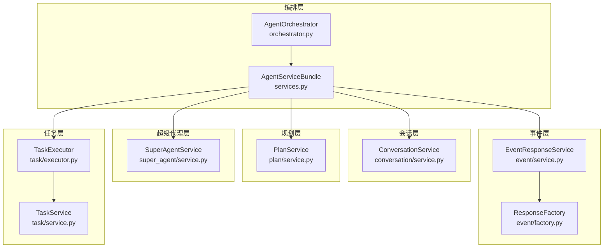
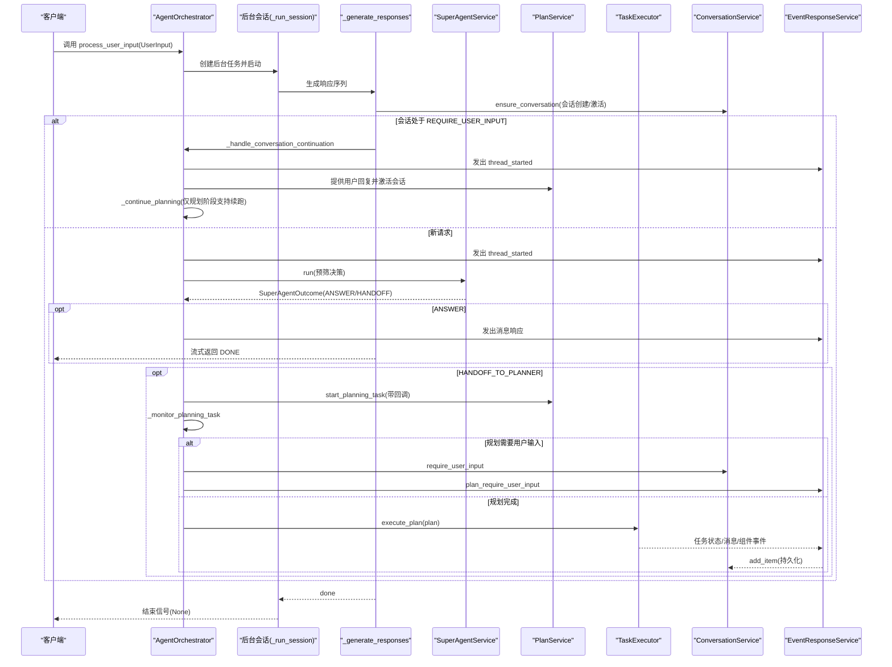
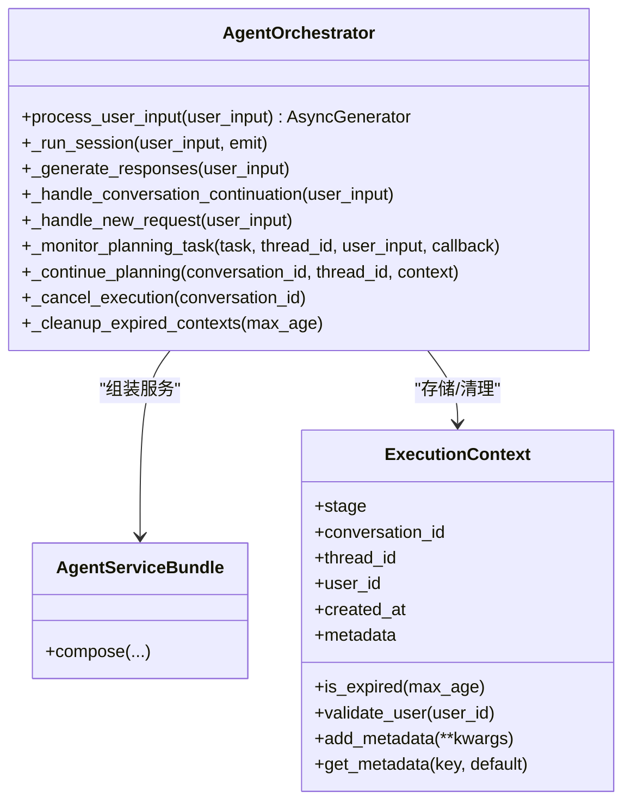
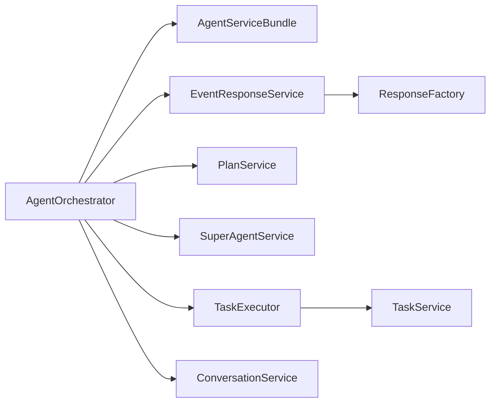
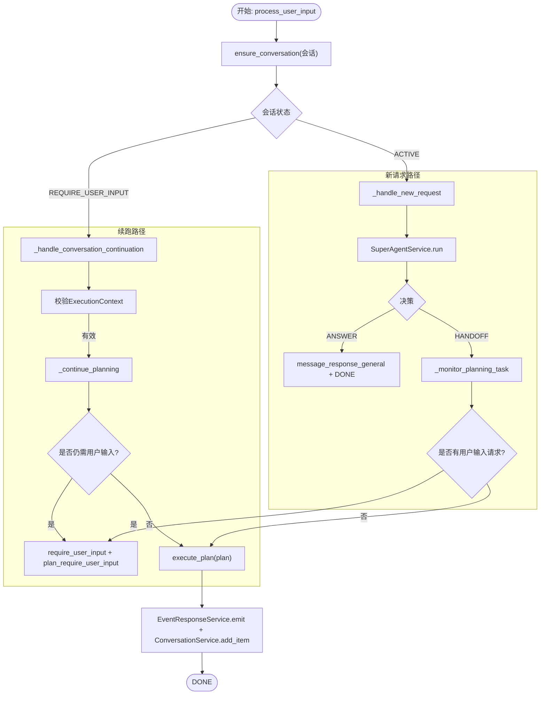

# Orchestrator

<cite>
**本文引用的文件**
- [orchestrator.py](file://python/valuecell/core/coordinate/orchestrator.py)
- [services.py](file://python/valuecell/core/coordinate/services.py)
- [types.py](file://python/valuecell/core/types.py)
- [constants.py](file://python/valuecell/core/constants.py)
- [event/service.py](file://python/valuecell/core/event/service.py)
- [event/factory.py](file://python/valuecell/core/event/factory.py)
- [conversation/service.py](file://python/valuecell/core/conversation/service.py)
- [plan/service.py](file://python/valuecell/core/plan/service.py)
- [super_agent/service.py](file://python/valuecell/core/super_agent/service.py)
- [task/service.py](file://python/valuecell/core/task/service.py)
- [task/executor.py](file://python/valuecell/core/task/executor.py)
- [test_orchestrator.py](file://python/valuecell/core/coordinate/tests/test_orchestrator.py)
- [test_orchestrator_context.py](file://python/valuecell/core/coordinate/tests/test_orchestrator_context.py)
</cite>

## 目录
1. [引言](#引言)
2. [项目结构](#项目结构)
3. [核心组件](#核心组件)
4. [架构总览](#架构总览)
5. [详细组件分析](#详细组件分析)
6. [依赖关系分析](#依赖关系分析)
7. [性能考量](#性能考量)
8. [故障排查指南](#故障排查指南)
9. [结论](#结论)
10. [附录](#附录)

## 引言
本文件面向系统架构与工程实践，聚焦 Orchestrator（编排器）在 ValueCell 中作为“系统核心协调者”的角色。它负责接收用户输入、启动处理流程、管理 Super Agent、Planner 和 Task Executor 的调用时序与状态流转；同时以异步、可重入的方式支持并发请求处理与会话持久化；并通过事件驱动模型与 Event System 解耦各子系统。本文将结合代码路径与测试用例，系统阐述其关键方法（如 process_user_input、resume_session、handle_streaming_response）的实现逻辑，并提供序列图与流程图帮助理解端到端请求生命周期，包括错误恢复、超时控制与上下文管理等设计要点。

## 项目结构
Orchestrator 所在模块位于 Python 后端的 core/coordinate 目录，围绕“服务聚合”“事件工厂”“类型定义”“常量”等基础设施组织，形成清晰的分层与职责边界：
- coordinate/orchestrator.py：编排器主体，负责用户输入处理、状态机推进、异步会话与上下文管理
- coordinate/services.py：服务装配器，统一构造 ConversationService、EventResponseService、PlanService、SuperAgentService、TaskExecutor 等依赖
- core/event/*：事件响应服务与工厂，封装事件生成、缓冲与持久化
- core/conversation/service.py：对话会话服务，提供会话创建、状态变更与历史项持久化
- core/plan/service.py：计划服务，封装规划任务、用户输入注册与等待队列
- core/super_agent/service.py：超级代理服务，封装 SuperAgent 的推理与决策
- core/task/*：任务执行器与任务服务，封装任务生命周期与远程执行
- core/types.py、core/constants.py：统一的类型与常量定义，支撑事件枚举、负载结构与运行时键值

图表来源
- [orchestrator.py](file://python/valuecell/core/coordinate/orchestrator.py#L68-L120)
- [services.py](file://python/valuecell/core/coordinate/services.py#L24-L91)
- [event/service.py](file://python/valuecell/core/event/service.py#L15-L81)
- [event/factory.py](file://python/valuecell/core/event/factory.py#L200-L320)
- [conversation/service.py](file://python/valuecell/core/conversation/service.py#L18-L116)
- [plan/service.py](file://python/valuecell/core/plan/service.py#L53-L148)
- [super_agent/service.py](file://python/valuecell/core/super_agent/service.py#L12-L27)
- [task/service.py](file://python/valuecell/core/task/service.py#L14-L68)
- [task/executor.py](file://python/valuecell/core/task/executor.py#L95-L148)

章节来源
- [orchestrator.py](file://python/valuecell/core/coordinate/orchestrator.py#L68-L120)
- [services.py](file://python/valuecell/core/coordinate/services.py#L24-L91)

## 核心组件
- AgentOrchestrator：系统核心协调者，提供 process_user_input、_run_session、_generate_responses、_handle_new_request、_monitor_planning_task、_handle_conversation_continuation、_continue_planning、_cancel_execution、_cleanup_expired_contexts 等方法，贯穿从输入到执行再到收尾的全链路。
- AgentServiceBundle：服务装配器，负责按需构造或复用 ConversationService、EventResponseService、PlanService、SuperAgentService、TaskExecutor，并确保会话对象共享一致性。
- EventResponseService + ResponseFactory：事件响应服务与工厂，统一生成、标注、缓冲与持久化各类事件（线程开始、规划需要用户输入、工具调用、消息、任务状态、完成等），并写入 ConversationService。
- ConversationService：会话管理服务，提供 ensure_conversation、activate、require_user_input、add_item 等能力，支撑会话生命周期与历史项持久化。
- PlanService：规划服务，封装 ExecutionPlanner 的调用、用户输入请求注册与轮询、Passthrough 模式（直达执行）等。
- SuperAgentService：超级代理服务，封装 SuperAgent 的推理与决策流，支持 ANSWER 或 HANDOFF_TO_PLANNER。
- TaskExecutor：任务执行器，负责单任务与计划执行、调度任务循环、状态路由、结果汇总与持久化。

章节来源
- [orchestrator.py](file://python/valuecell/core/coordinate/orchestrator.py#L68-L120)
- [services.py](file://python/valuecell/core/coordinate/services.py#L24-L91)
- [event/service.py](file://python/valuecell/core/event/service.py#L15-L81)
- [event/factory.py](file://python/valuecell/core/event/factory.py#L200-L320)
- [conversation/service.py](file://python/valuecell/core/conversation/service.py#L18-L116)
- [plan/service.py](file://python/valuecell/core/plan/service.py#L53-L148)
- [super_agent/service.py](file://python/valuecell/core/super_agent/service.py#L12-L27)
- [task/executor.py](file://python/valuecell/core/task/executor.py#L95-L148)

## 架构总览
Orchestrator 采用“事件驱动 + 服务装配 + 异步会话”的架构模式：
- 输入入口：process_user_input 接收 UserInput，立即启动后台会话任务，通过异步生成器向调用方流式返回事件。
- 会话隔离：每个调用拥有独立队列与活跃标志，消费者断开不会影响后台生产者，保证长任务与计划的独立运行。
- 状态机推进：根据会话状态（新建/续用）分别进入新请求处理或中断续跑路径；规划阶段若需要用户输入，记录 ExecutionContext 并转为 REQUIRE_USER_INPUT。
- 组件协作：Super Agent 预筛（ANSWER/HANDOFF_TO_PLANNER）→ Planner 生成 ExecutionPlan → TaskExecutor 执行计划中的任务，期间通过 EventResponseService 持久化事件。
- 上下文与清理：ExecutionContext 记录规划任务与原始输入，支持续跑；过期上下文定期清理，避免资源泄漏。

图表来源
- [orchestrator.py](file://python/valuecell/core/coordinate/orchestrator.py#L98-L175)
- [orchestrator.py](file://python/valuecell/core/coordinate/orchestrator.py#L176-L226)
- [orchestrator.py](file://python/valuecell/core/coordinate/orchestrator.py#L227-L292)
- [orchestrator.py](file://python/valuecell/core/coordinate/orchestrator.py#L292-L403)
- [orchestrator.py](file://python/valuecell/core/coordinate/orchestrator.py#L419-L511)
- [super_agent/service.py](file://python/valuecell/core/super_agent/service.py#L12-L27)
- [plan/service.py](file://python/valuecell/core/plan/service.py#L87-L113)
- [task/executor.py](file://python/valuecell/core/task/executor.py#L112-L203)
- [event/service.py](file://python/valuecell/core/event/service.py#L36-L81)
- [conversation/service.py](file://python/valuecell/core/conversation/service.py#L28-L76)

## 详细组件分析

### AgentOrchestrator 类与关键方法
- 构造与依赖注入：通过 AgentServiceBundle.compose 统一装配各服务，确保 ConversationManager 在会话相关对象间共享，避免重复初始化。
- process_user_input：异步生成器入口，内部创建后台任务 _run_session，使用本地队列与活跃标志，消费者取消时后台继续运行，体现“异步、可重入、并发安全”。
- _run_session：包装原始处理管线，捕获异常并最终发送结束信号，保证消费者侧能正确终止。
- _generate_responses：原流程抽取，负责会话创建、状态判断（新建/续用）、异常兜底与 DONE 事件发出。
- _handle_conversation_continuation：校验 ExecutionContext、更新 thread_id、提供用户回复并激活会话；当前仅支持规划阶段续跑。
- _handle_new_request：新请求主流程，先发出 thread_started，再执行 Super Agent 预筛；若 HANDOFF_TO_PLANNER，则启动规划任务并监控；若 ANSWER 则直接返回消息并结束。
- _monitor_planning_task：轮询规划任务，检测是否需要用户输入；若需要则保存上下文、设置 REQUIRE_USER_INPUT 并发出 plan_require_user_input；完成后执行 ExecutionPlan。
- _continue_planning：续跑规划阶段，重复检查用户输入需求，直到任务完成并执行计划。
- _cancel_execution/_cleanup_expired_contexts：清理过期或失败的上下文，取消规划任务、清除待定用户输入、恢复会话状态。

图表来源
- [orchestrator.py](file://python/valuecell/core/coordinate/orchestrator.py#L68-L120)
- [orchestrator.py](file://python/valuecell/core/coordinate/orchestrator.py#L149-L226)
- [orchestrator.py](file://python/valuecell/core/coordinate/orchestrator.py#L227-L511)
- [services.py](file://python/valuecell/core/coordinate/services.py#L24-L91)

章节来源
- [orchestrator.py](file://python/valuecell/core/coordinate/orchestrator.py#L98-L175)
- [orchestrator.py](file://python/valuecell/core/coordinate/orchestrator.py#L176-L226)
- [orchestrator.py](file://python/valuecell/core/coordinate/orchestrator.py#L227-L292)
- [orchestrator.py](file://python/valuecell/core/coordinate/orchestrator.py#L292-L403)
- [orchestrator.py](file://python/valuecell/core/coordinate/orchestrator.py#L419-L511)
- [orchestrator.py](file://python/valuecell/core/coordinate/orchestrator.py#L512-L644)

### Super Agent 预筛与 HANDOFF_TO_PLANNER
- SuperAgentService.run 返回字符串（推理片段）或 SuperAgentOutcome（最终决策）。当决策为 ANSWER 时，Orchestrator 直接发出消息响应并结束；当为 HANDOFF_TO_PLANNER 时，清空目标代理名并继续进入规划阶段。
- 这一设计使 Orchestrator 可以在无需 LLM 规划的情况下快速回答简单问题，提升用户体验与系统吞吐。

章节来源
- [super_agent/service.py](file://python/valuecell/core/super_agent/service.py#L12-L27)
- [orchestrator.py](file://python/valuecell/core/coordinate/orchestrator.py#L309-L381)

### Planner 与用户输入请求
- PlanService.start_planning_task 支持 Passthrough 模式（直达执行），否则委托 ExecutionPlanner.create_plan。
- _create_context_aware_callback 将用户输入请求绑定到当前会话，便于后续续跑。
- _monitor_planning_task 通过轮询检测 has_pending_request，若需要用户输入则保存 ExecutionContext、设置 REQUIRE_USER_INPUT 并发出 plan_require_user_input。

章节来源
- [plan/service.py](file://python/valuecell/core/plan/service.py#L53-L148)
- [orchestrator.py](file://python/valuecell/core/coordinate/orchestrator.py#L404-L418)
- [orchestrator.py](file://python/valuecell/core/coordinate/orchestrator.py#L419-L511)

### TaskExecutor 执行与事件持久化
- execute_plan 遍历 ExecutionPlan 中的任务，逐个执行；对计划引导语进行消息响应；对来自 Super Agent 的子代理对话发出 START/END 组件事件。
- execute_task 支持调度任务循环，计算下次执行延迟；在每次执行前后发出工具调用事件、任务状态事件；最终完成或失败后持久化任务组件状态。
- EventResponseService.emit 负责标注、缓冲与持久化，最终写入 ConversationService.add_item。

章节来源
- [task/executor.py](file://python/valuecell/core/task/executor.py#L112-L203)
- [task/executor.py](file://python/valuecell/core/task/executor.py#L231-L444)
- [event/service.py](file://python/valuecell/core/event/service.py#L36-L81)

### 事件驱动与会话持久化
- ResponseFactory 提供统一的事件构建方法（thread_started、plan_require_user_input、tool_call、message、task_*、done 等），并与 EventResponseService 协作完成持久化。
- ConversationService 提供 ensure_conversation、require_user_input、activate、add_item 等接口，保障会话状态与历史项的一致性。

章节来源
- [event/factory.py](file://python/valuecell/core/event/factory.py#L200-L320)
- [event/service.py](file://python/valuecell/core/event/service.py#L15-L81)
- [conversation/service.py](file://python/valuecell/core/conversation/service.py#L28-L116)

### 关键方法实现路径参考
- process_user_input：[orchestrator.py](file://python/valuecell/core/coordinate/orchestrator.py#L98-L175)
- _run_session：[orchestrator.py](file://python/valuecell/core/coordinate/orchestrator.py#L150-L175)
- _generate_responses：[orchestrator.py](file://python/valuecell/core/coordinate/orchestrator.py#L176-L226)
- _handle_conversation_continuation：[orchestrator.py](file://python/valuecell/core/coordinate/orchestrator.py#L227-L292)
- _handle_new_request：[orchestrator.py](file://python/valuecell/core/coordinate/orchestrator.py#L292-L403)
- _monitor_planning_task：[orchestrator.py](file://python/valuecell/core/coordinate/orchestrator.py#L419-L511)
- _continue_planning：[orchestrator.py](file://python/valuecell/core/coordinate/orchestrator.py#L531-L580)
- _cancel_execution/_cleanup_expired_contexts：[orchestrator.py](file://python/valuecell/core/coordinate/orchestrator.py#L608-L644)

## 依赖关系分析
- 耦合与内聚：Orchestrator 对外仅依赖服务装配器与事件工厂，内部通过异步队列与上下文管理实现低耦合高内聚。
- 外部依赖：RemoteConnections 用于获取代理客户端；TaskService 用于任务状态管理；SQLite 存储由 ConversationManager 管理。
- 循环依赖：未发现循环导入；服务通过工厂与装配器注入，避免直接相互引用。

图表来源
- [orchestrator.py](file://python/valuecell/core/coordinate/orchestrator.py#L68-L120)
- [services.py](file://python/valuecell/core/coordinate/services.py#L24-L91)
- [event/service.py](file://python/valuecell/core/event/service.py#L15-L81)
- [event/factory.py](file://python/valuecell/core/event/factory.py#L200-L320)
- [task/service.py](file://python/valuecell/core/task/service.py#L14-L68)

章节来源
- [services.py](file://python/valuecell/core/coordinate/services.py#L24-L91)
- [orchestrator.py](file://python/valuecell/core/coordinate/orchestrator.py#L68-L120)

## 性能考量
- 异步与并发：process_user_input 使用 asyncio.Queue 与活跃标志，消费者断开不阻塞后台任务，适合长连接与并发场景。
- 轮询间隔：_monitor_planning_task 使用固定睡眠间隔，平衡 CPU 占用与响应速度；可按需调整常量以适配不同负载。
- 缓冲与持久化：EventResponseService 使用 ResponseBuffer 与批量 add_item，减少数据库写入次数，提高吞吐。
- 上下文清理：定期清理过期 ExecutionContext，避免长时间挂起任务占用资源。

章节来源
- [orchestrator.py](file://python/valuecell/core/coordinate/orchestrator.py#L419-L511)
- [event/service.py](file://python/valuecell/core/event/service.py#L36-L81)

## 故障排查指南
- 规划阶段需要用户输入但无上下文：检查 _execution_contexts 是否存在、用户 ID 是否匹配、是否过期。
- 续跑失败：确认 ExecutionContext 中是否包含 PLANNING_TASK 与 ORIGINAL_USER_INPUT；缺失则触发 PLAN_FAILED 并清理。
- 会话状态异常：检查 ConversationService 的 activate/require_user_input 调用链，确保状态切换正确。
- 任务执行失败：查看 TaskExecutor 的异常日志与 TaskService 的 fail/update 路径，定位具体任务与原因。
- 事件未持久化：确认 EventResponseService.emit 的调用链与 ConversationService.add_item 的参数完整性。

章节来源
- [test_orchestrator.py](file://python/valuecell/core/coordinate/tests/test_orchestrator.py#L459-L502)
- [test_orchestrator.py](file://python/valuecell/core/coordinate/tests/test_orchestrator.py#L542-L569)
- [test_orchestrator_context.py](file://python/valuecell/core/coordinate/tests/test_orchestrator_context.py#L118-L175)
- [test_orchestrator_context.py](file://python/valuecell/core/coordinate/tests/test_orchestrator_context.py#L177-L220)

## 结论
Orchestrator 通过“事件驱动 + 服务装配 + 异步会话”的设计，实现了对 Super Agent、Planner、TaskExecutor 的高效编排与解耦。其异步、可重入的特性支持并发请求与长任务持续运行；ExecutionContext 与定时清理机制保障了上下文的可控与资源安全；事件工厂与会话服务确保了状态与历史的可追踪与可恢复。整体架构清晰、扩展性强，适合在复杂业务场景中持续演进。

## 附录

### 请求生命周期流程图（含错误恢复）

图表来源
- [orchestrator.py](file://python/valuecell/core/coordinate/orchestrator.py#L176-L226)
- [orchestrator.py](file://python/valuecell/core/coordinate/orchestrator.py#L227-L292)
- [orchestrator.py](file://python/valuecell/core/coordinate/orchestrator.py#L292-L403)
- [orchestrator.py](file://python/valuecell/core/coordinate/orchestrator.py#L419-L511)
- [event/service.py](file://python/valuecell/core/event/service.py#L36-L81)
- [conversation/service.py](file://python/valuecell/core/conversation/service.py#L28-L76)

### 关键数据结构与常量
- UserInput/UserInputMetadata：统一的用户输入载体，包含查询内容、目标代理名与会话元信息。
- SystemResponseEvent/StreamResponseEvent/TaskStatusEvent：事件枚举，覆盖系统级、流式与任务状态三类事件。
- ExecutionContext：轻量上下文，记录规划阶段、会话/线程标识、用户 ID、创建时间与元数据（如 PLANNING_TASK、ORIGINAL_USER_INPUT）。
- 常量：METADATA、DEPENDENCIES、USER_PROFILE、CURRENT_CONTEXT、LANGUAGE、TIMEZONE、PLANNING_TASK、ORIGINAL_USER_INPUT。

章节来源
- [types.py](file://python/valuecell/core/types.py#L11-L36)
- [types.py](file://python/valuecell/core/types.py#L38-L116)
- [types.py](file://python/valuecell/core/types.py#L116-L171)
- [constants.py](file://python/valuecell/core/constants.py#L1-L42)