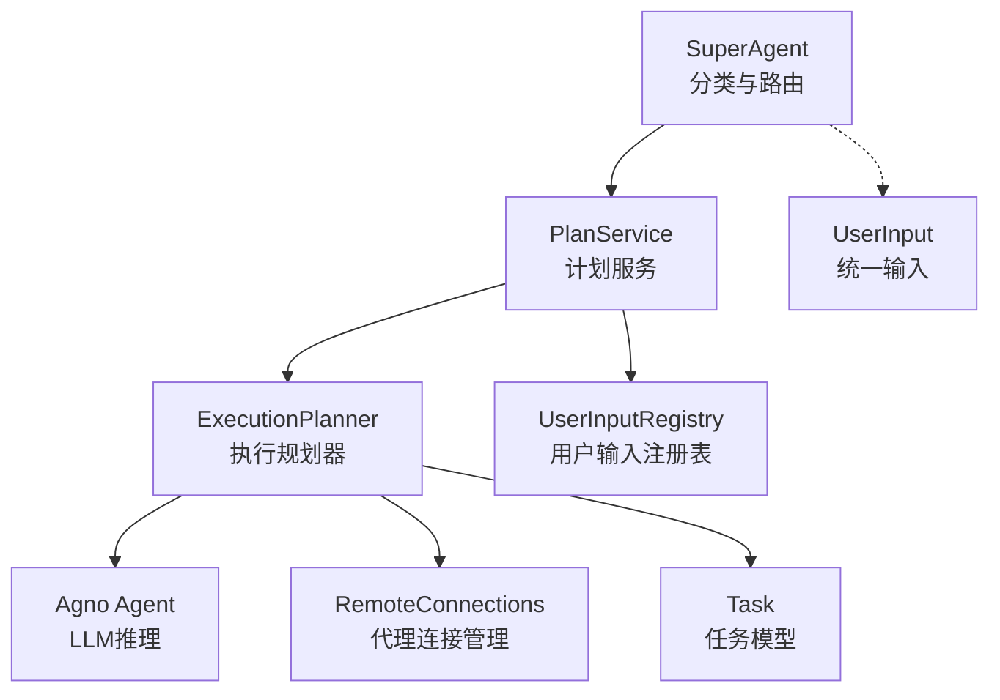
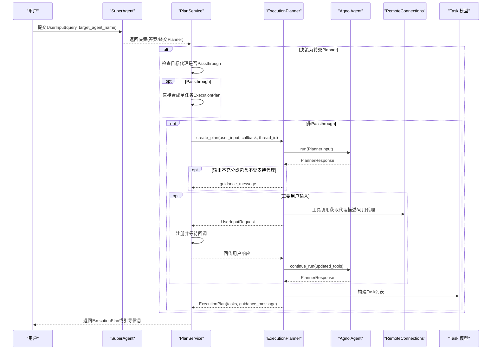
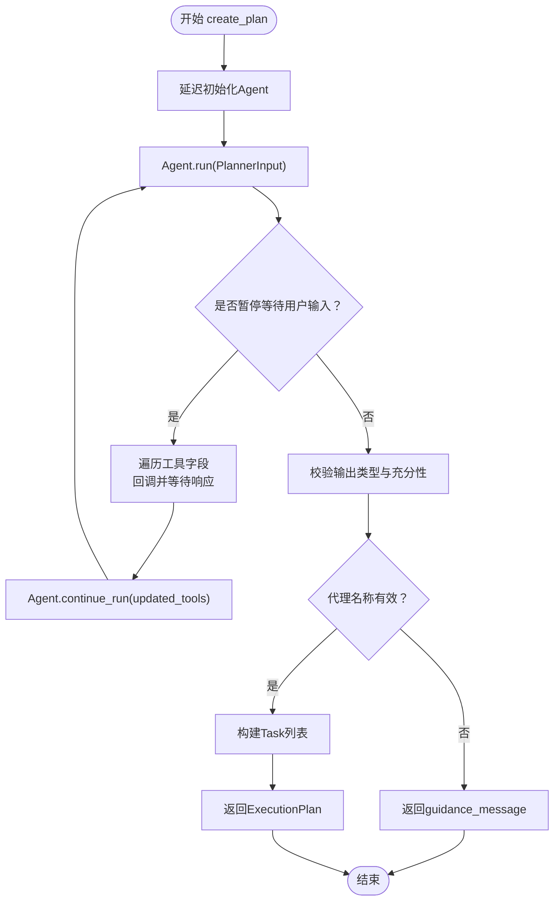
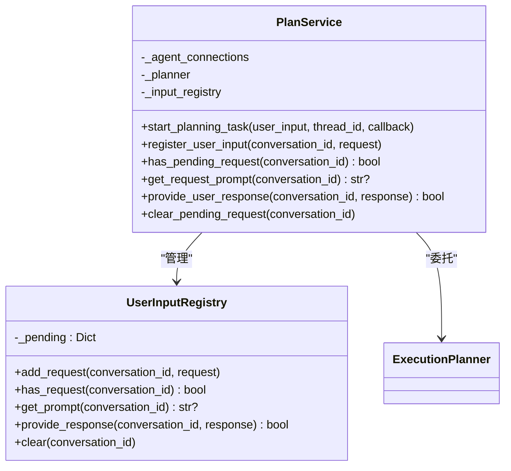
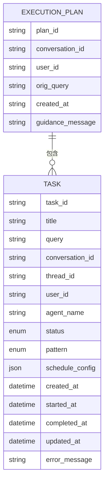
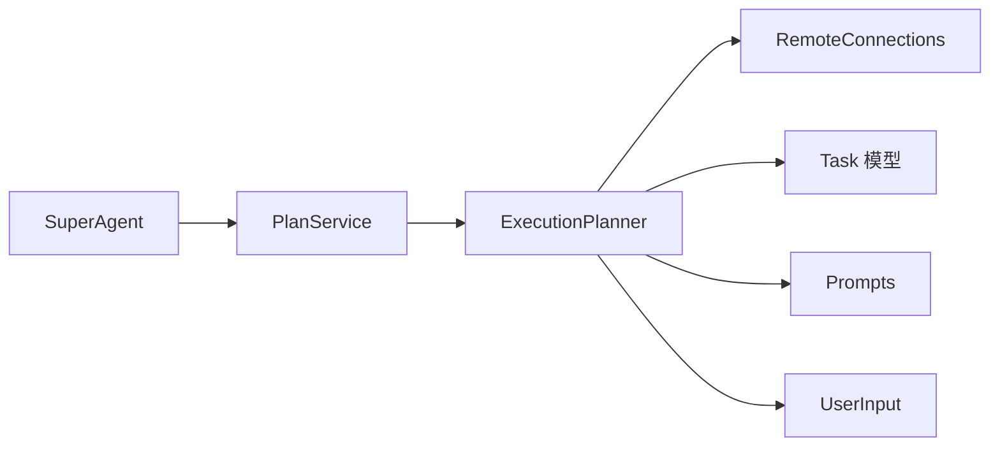

# Planner

<cite>
**本文引用的文件**
- [planner.py](file://python/valuecell/core/plan/planner.py)
- [service.py](file://python/valuecell/core/plan/service.py)
- [models.py](file://python/valuecell/core/plan/models.py)
- [prompts.py](file://python/valuecell/core/plan/prompts.py)
- [types.py](file://python/valuecell/core/types.py)
- [connect.py](file://python/valuecell/core/agent/connect.py)
- [task/models.py](file://python/valuecell/core/task/models.py)
- [super_agent/core.py](file://python/valuecell/core/super_agent/core.py)
- [super_agent/service.py](file://python/valuecell/core/super_agent/service.py)
- [test_planner.py](file://python/valuecell/core/plan/tests/test_planner.py)
- [test_service.py](file://python/valuecell/core/plan/tests/test_service.py)
</cite>

## 目录
1. [简介](#简介)
2. [项目结构](#项目结构)
3. [核心组件](#核心组件)
4. [架构总览](#架构总览)
5. [详细组件分析](#详细组件分析)
6. [依赖关系分析](#依赖关系分析)
7. [性能考量](#性能考量)
8. [故障排查指南](#故障排查指南)
9. [结论](#结论)
10. [附录](#附录)

## 简介
本文件面向Planner模块，系统性阐述其“将高层意图转化为可执行计划”的能力。重点包括：
- PlannerService如何接收Super Agent的分类结果，并在必要时调用LLM生成结构化的ExecutionPlan；
- Prompt工程策略、输出解析与格式验证流程；
- 基于models.py中PlanStep与ExecutionPlan的分步结构与依赖关系建模；
- 容错机制（计划生成失败时的重试与回退策略）；
- 调试建议与常见问题（如模糊意图导致的计划歧义处理）。

## 项目结构
Planner相关代码集中在Python后端的core/plan目录，围绕以下关键文件组织：
- planner.py：执行规划器（ExecutionPlanner），负责与LLM交互、人类在环（Human-in-the-Loop）工作流、工具调用与任务构建；
- service.py：计划服务（PlanService），协调规划生命周期、Passthrough代理路径、用户输入注册与回调；
- models.py：计划数据模型（ExecutionPlan、PlannerResponse、_TaskBrief、PlannerInput）；
- prompts.py：提示词指令与期望输出规范；
- connect.py：远程代理连接管理，为Planner提供可用代理卡片与能力信息；
- task/models.py：任务模型（Task、TaskPattern、ScheduleConfig）；
- super_agent/*：上游意图分类与路由，决定是否转交Planner；
- types.py：统一输入UserInput与事件类型等基础类型；
- tests：覆盖人类在环、错误处理、Passthrough路径等场景。

图表来源
- [planner.py](file://python/valuecell/core/plan/planner.py#L75-L430)
- [service.py](file://python/valuecell/core/plan/service.py#L53-L148)
- [connect.py](file://python/valuecell/core/agent/connect.py#L603-L674)
- [task/models.py](file://python/valuecell/core/task/models.py#L45-L149)
- [super_agent/core.py](file://python/valuecell/core/super_agent/core.py#L132-L185)
- [types.py](file://python/valuecell/core/types.py#L20-L30)

章节来源
- [planner.py](file://python/valuecell/core/plan/planner.py#L75-L430)
- [service.py](file://python/valuecell/core/plan/service.py#L53-L148)
- [models.py](file://python/valuecell/core/plan/models.py#L1-L87)
- [prompts.py](file://python/valuecell/core/plan/prompts.py#L1-L318)
- [connect.py](file://python/valuecell/core/agent/connect.py#L603-L674)
- [task/models.py](file://python/valuecell/core/task/models.py#L45-L149)
- [super_agent/core.py](file://python/valuecell/core/super_agent/core.py#L132-L185)
- [types.py](file://python/valuecell/core/types.py#L20-L30)

## 核心组件
- ExecutionPlanner：基于LLM的规划器，负责将用户请求转换为结构化任务列表；支持人类在环工作流，通过工具调用获取代理能力信息；对输出进行严格校验与过滤。
- PlanService：封装计划创建与人类在环状态管理；支持“规划器Passthrough”代理，直接合成单任务计划以绕过LLM。
- ExecutionPlan/_TaskBrief/PlannerInput/PlannerResponse：计划与任务的数据模型，定义了任务标题、查询、代理名、执行模式、调度配置以及计划的充分性与指导信息。
- RemoteConnections：提供可用代理卡片与能力信息，用于规划阶段的代理选择与调度决策。
- Task/TaskPattern/ScheduleConfig：任务模型及其调度配置，支持一次性与周期性任务。
- SuperAgent：上游意图分类器，决定是否将请求转交给Planner或直接回答。

章节来源
- [planner.py](file://python/valuecell/core/plan/planner.py#L75-L430)
- [service.py](file://python/valuecell/core/plan/service.py#L53-L148)
- [models.py](file://python/valuecell/core/plan/models.py#L1-L87)
- [connect.py](file://python/valuecell/core/agent/connect.py#L603-L674)
- [task/models.py](file://python/valuecell/core/task/models.py#L45-L149)
- [super_agent/core.py](file://python/valuecell/core/super_agent/core.py#L132-L185)

## 架构总览
Planner的整体流程如下：
- SuperAgent对用户输入进行分类，若需复杂多步骤或专用代理，则返回“转交Planner”的决策，并携带精炼后的查询；
- PlanService根据目标代理是否标记为“规划器Passthrough”决定是否直接合成单任务计划；
- 否则由ExecutionPlanner启动LLM规划Agent，按提示词规则生成PlannerResponse；
- 若规划Agent暂停等待用户输入，PlanService通过UserInputRegistry协调回调与响应；
- ExecutionPlanner对输出进行格式校验、代理有效性检查与任务构建，最终产出ExecutionPlan。

图表来源
- [super_agent/core.py](file://python/valuecell/core/super_agent/core.py#L132-L185)
- [service.py](file://python/valuecell/core/plan/service.py#L87-L148)
- [planner.py](file://python/valuecell/core/plan/planner.py#L132-L356)
- [connect.py](file://python/valuecell/core/agent/connect.py#L603-L674)
- [task/models.py](file://python/valuecell/core/task/models.py#L45-L149)

## 详细组件分析

### ExecutionPlanner：从意图到可执行计划
- 角色与职责
  - 使用LLM规划Agent将用户请求分解为结构化任务；
  - 支持人类在环（Human-in-the-Loop）：当Agent暂停请求用户输入时，通过回调传递UserInputRequest并等待响应；
  - 对Agent输出进行严格校验：确保输出符合PlannerResponse模式、代理名称在可用集合内、计划充分性；
  - 将简化的任务摘要转换为Task对象，设置会话与线程上下文，支持从Super Agent转交时的会话隔离与线程关联。
- 关键流程
  - 延迟初始化Agent：避免在缺少API密钥或模型配置时启动失败；
  - 运行规划Agent：构造PlannerInput并调用run；
  - 处理暂停与用户输入：遍历需要用户输入的工具字段，逐项回调并继续执行；
  - 输出解析与校验：验证内容类型、充分性、代理有效性，构建ExecutionPlan；
  - 任务构建：将每个_task_brief映射为Task，保留父会话ID或生成新的会话ID，保持线程ID一致。
- 工具函数
  - 获取代理描述：将AgentCard转换为提示词字符串，供规划Agent理解代理能力；
  - 获取可用代理：拼接所有可用代理的卡片描述，辅助代理选择与调度决策。

图表来源
- [planner.py](file://python/valuecell/core/plan/planner.py#L132-L356)
- [prompts.py](file://python/valuecell/core/plan/prompts.py#L1-L126)

章节来源
- [planner.py](file://python/valuecell/core/plan/planner.py#L75-L430)
- [prompts.py](file://python/valuecell/core/plan/prompts.py#L1-L318)

### PlanService：计划生命周期与Passthrough代理
- 角色与职责
  - 协调计划创建任务，支持异步调度；
  - 在目标代理标记为Passthrough时，直接合成单任务ExecutionPlan，跳过LLM规划；
  - 维护UserInputRegistry，记录并处理人类在环请求；
  - 与ExecutionPlanner解耦，便于替换或扩展。
- 关键点
  - Passthrough检测：通过RemoteConnections.is_planner_passthrough判断；
  - 异步任务：使用asyncio.create_task启动计划任务；
  - 用户输入注册：add_request/get_prompt/provide_response/clear。

图表来源
- [service.py](file://python/valuecell/core/plan/service.py#L26-L148)

章节来源
- [service.py](file://python/valuecell/core/plan/service.py#L53-L148)
- [test_service.py](file://python/valuecell/core/plan/tests/test_service.py#L1-L95)

### 数据模型：ExecutionPlan与任务结构
- ExecutionPlan
  - plan_id、conversation_id、user_id、orig_query、tasks、created_at、guidance_message；
  - 作为顶层容器承载一组Task。
- PlannerResponse/_TaskBrief
  - tasks：任务列表，每项包含title、query、agent_name、pattern、schedule_config；
  - adequate：是否具备充分信息；
  - reason/guidance_message：解释与用户指导信息。
- PlannerInput
  - target_agent_name、query：规划输入载体。
- Task/TaskPattern/ScheduleConfig
  - Task：任务实体，含状态、标题、查询、会话/线程ID、代理名、执行模式、调度配置、时间戳与错误信息；
  - TaskPattern：ONCE/RECURRING；
  - ScheduleConfig：interval_minutes/daily_time，is_valid校验。

图表来源
- [models.py](file://python/valuecell/core/plan/models.py#L1-L87)
- [task/models.py](file://python/valuecell/core/task/models.py#L45-L149)

章节来源
- [models.py](file://python/valuecell/core/plan/models.py#L1-L87)
- [task/models.py](file://python/valuecell/core/task/models.py#L45-L149)

### Prompt工程策略与输出解析
- 提示词指令（PLANNER_INSTRUCTION）
  - 优先透明代理：若用户提供目标代理，直接转发原查询并设为一次性任务；
  - 非干预偏置：最小干预，仅在明确需要时暂停或添加指导；
  - 代理选择：当缺失目标代理时，使用工具获取可用代理卡片，语义匹配后选择最佳代理；
  - 能力感知的调度：仅在代理具备监控/通知/推送能力时考虑周期性任务；
  - 特殊处理：检测重复/定时意图，必要时要求用户确认具体时间或间隔；
  - 标题与语言：标题长度限制，始终使用用户语言。
- 期望输出（PLANNER_EXPECTED_OUTPUT）
  - 默认行为：透明代理优先、默认一次性、简洁标题、agent_name来自提供的或工具返回集合；
  - 暂停条件：显式提供调度且未确认时返回adequate:false；
  - JSON格式要求：严格JSON输出，禁止markdown、反引号或注释；
  - 示例覆盖：简单透传、上下文转发、周期性确认、内联确认、定时任务、不可用请求等。
- 输出解析与格式验证
  - 类型校验：确保content为PlannerResponse实例；
  - 充分性检查：adequate为false或tasks为空时返回guidance_message；
  - 代理有效性：agent_name必须来自可用代理集合，否则视为幻觉并返回指导信息；
  - 任务构建：将_task_brief映射为Task，设置状态、会话与线程ID，必要时生成新会话ID以隔离子流程。

章节来源
- [prompts.py](file://python/valuecell/core/plan/prompts.py#L1-L318)
- [planner.py](file://python/valuecell/core/plan/planner.py#L132-L356)
- [models.py](file://python/valuecell/core/plan/models.py#L1-L87)

### 与Super Agent的协作
- SuperAgent负责对用户输入进行分类：若为简单事实类问题直接回答，否则转交Planner；
- 当SuperAgent不可用或初始化失败时，直接返回“转交Planner”的决策并携带原始或精炼查询；
- Planner接收UserInput（包含目标代理名与元数据），在无目标代理时进行代理选择与调度决策。

章节来源
- [super_agent/core.py](file://python/valuecell/core/super_agent/core.py#L132-L185)
- [super_agent/service.py](file://python/valuecell/core/super_agent/service.py#L12-L27)
- [types.py](file://python/valuecell/core/types.py#L20-L30)

## 依赖关系分析
- Planner依赖
  - RemoteConnections：获取可用代理卡片与能力信息；
  - Task模型：构建执行任务；
  - Prompts：提示词与期望输出规范；
  - UserInput：统一输入载体；
  - SuperAgent：上游分类结果。
- 反向依赖
  - PlanService对外暴露接口，内部委托ExecutionPlanner；
  - ExecutionPlanner对Agent运行时细节封装，屏蔽外部复杂度。

图表来源
- [service.py](file://python/valuecell/core/plan/service.py#L53-L148)
- [planner.py](file://python/valuecell/core/plan/planner.py#L75-L131)
- [connect.py](file://python/valuecell/core/agent/connect.py#L603-L674)
- [task/models.py](file://python/valuecell/core/task/models.py#L45-L149)
- [prompts.py](file://python/valuecell/core/plan/prompts.py#L1-L126)
- [types.py](file://python/valuecell/core/types.py#L20-L30)

章节来源
- [service.py](file://python/valuecell/core/plan/service.py#L53-L148)
- [planner.py](file://python/valuecell/core/plan/planner.py#L75-L131)
- [connect.py](file://python/valuecell/core/agent/connect.py#L603-L674)
- [task/models.py](file://python/valuecell/core/task/models.py#L45-L149)
- [prompts.py](file://python/valuecell/core/plan/prompts.py#L1-L126)
- [types.py](file://python/valuecell/core/types.py#L20-L30)

## 性能考量
- 延迟初始化Agent：避免在缺少模型配置时启动失败，减少冷启动开销；
- 工具调用缓存：RemoteConnections对本地代理类解析有缓存，降低重复导入成本；
- 异步调度：PlanService使用asyncio.create_task异步启动计划任务，提升并发吞吐；
- 会话与历史：Agent启用历史上下文与日期注入，有助于减少重复信息传输，但需注意上下文长度控制；
- 重试与回退：Agent客户端初始化具备重试逻辑，提高连接稳定性。

章节来源
- [planner.py](file://python/valuecell/core/plan/planner.py#L92-L131)
- [connect.py](file://python/valuecell/core/agent/connect.py#L473-L498)

## 故障排查指南
- 计划生成失败
  - 模型初始化失败：检查模型配置与API密钥；查看日志异常并返回guidance_message；
  - Agent运行异常：捕获异常并返回用户友好的错误提示；
  - 输出格式错误：当content非PlannerResponse或adequate为false时，返回guidance_message；
  - 不受支持的代理：当agent_name不在可用代理集合时，返回指导信息并提示可能的模型幻觉。
- 人类在环问题
  - 回调未触发：确认PlanService.register_user_input与回调正确传递；
  - 响应未送达：检查UserInputRegistry.provide_response是否被调用；
  - 请求清理：完成或取消后调用clear_pending_request。
- 调试建议
  - 开启调试模式：agent_debug_mode_enabled影响Agent调试输出；
  - 日志定位：关注“Failed to initialize planner agent”、“Planner run failed”、“Planner produced a malformed response”等关键日志；
  - 测试覆盖：参考测试用例，模拟暂停、不充分计划、不受支持代理、工具卡格式等边界情况。

章节来源
- [planner.py](file://python/valuecell/core/plan/planner.py#L132-L356)
- [service.py](file://python/valuecell/core/plan/service.py#L26-L86)
- [test_planner.py](file://python/valuecell/core/plan/tests/test_planner.py#L1-L392)
- [test_service.py](file://python/valuecell/core/plan/tests/test_service.py#L1-L95)

## 结论
Planner模块通过清晰的提示词工程、严格的输出解析与格式验证、以及完备的人类在环与代理能力感知机制，实现了从高层意图到可执行计划的稳健转化。其设计强调最小干预、可解释性与可扩展性，既可通过Passthrough代理快速落地，也可通过LLM规划实现复杂任务编排。配合完善的容错与调试手段，能够在多变的模型与代理环境中保持稳定与可控。

## 附录
- 关键术语
  - 人类在环（Human-in-the-Loop）：在Agent暂停时通过回调请求用户输入并继续执行；
  - Passthrough代理：目标代理标记为规划器Passthrough时，直接合成单任务计划；
  - 代理卡片（AgentCard）：描述代理能力与技能的结构化信息，用于规划阶段的代理选择与调度决策。