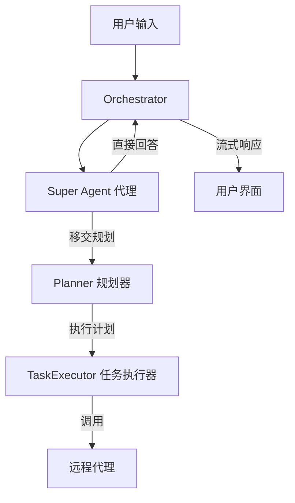
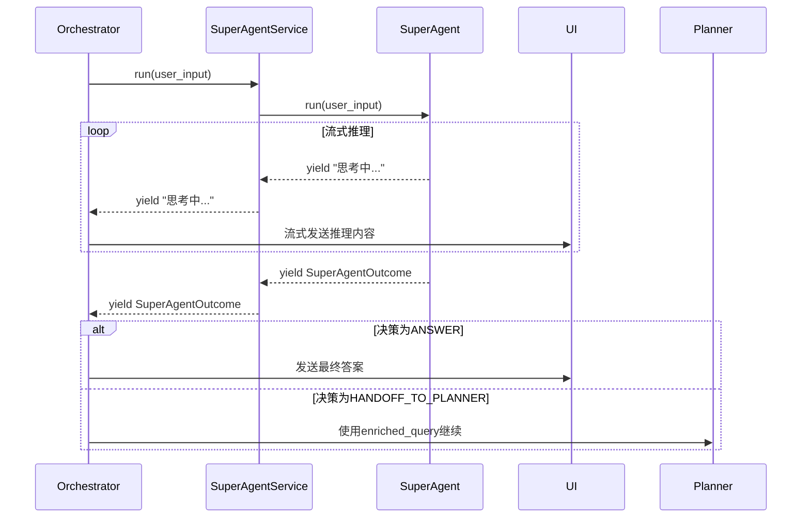

# Super Agent

<cite>
**本文档引用的文件**   
- [service.py](file://python/valuecell/core/super_agent/service.py)
- [core.py](file://python/valuecell/core/super_agent/core.py)
- [prompts.py](file://python/valuecell/core/super_agent/prompts.py)
- [orchestrator.py](file://python/valuecell/core/coordinate/orchestrator.py)
- [model.py](file://python/valuecell/utils/model.py)
- [types.py](file://python/valuecell/core/types.py)
</cite>

## 目录
1. [引言](#引言)
2. [核心架构与工作流程](#核心架构与工作流程)
3. [意图识别与分类机制](#意图识别与分类机制)
4. [与Orchestrator的交互协议](#与orchestrator的交互协议)
5. [SuperAgentService核心分析](#superagentservice核心分析)
6. [提示词模板设计与示例](#提示词模板设计与示例)
7. [模型一致性与降级策略](#模型一致性与降级策略)
8. [性能优化与缓存机制](#性能优化与缓存机制)
9. [异常处理与容错](#异常处理与容错)
10. [总结](#总结)

## 引言

Super Agent是ValueCell系统中的一个核心组件，作为请求分类与初步处理的引擎，它在用户请求进入系统后扮演着“第一道防线”的角色。其主要职责是对用户的自然语言输入进行快速的意图识别和分类，决定是直接回答简单问题，还是将复杂的请求“移交”给后续的Planner进行详细的任务规划和执行。这种设计极大地提升了系统的响应效率和资源利用率，确保了简单查询能获得即时反馈，而复杂任务则能得到充分的规划和处理。

## 核心架构与工作流程

Super Agent的运作是整个ValueCell协调流程（Orchestration）的关键起点。它并非一个孤立的模块，而是深度集成在以`AgentOrchestrator`为核心的协调架构中。其工作流程清晰地体现了系统的分层决策思想。



**图示来源**
- [orchestrator.py](file://python/valuecell/core/coordinate/orchestrator.py#L98-L147)
- [core.py](file://python/valuecell/core/super_agent/core.py#L132-L184)

**流程说明**：
1.  **入口**：用户的输入（`UserInput`）首先被`AgentOrchestrator`接收。
2.  **代理选择**：如果用户明确指定了目标代理（`target_agent_name`），Orchestrator会直接调用该代理。否则，请求将被路由到Super Agent进行初步处理。
3.  **三重决策**：Super Agent根据其内部逻辑，做出三种可能的决策：
    *   **直接回答 (ANSWER)**：对于简单、事实性的查询，Super Agent直接生成答案并返回。
    *   **移交规划 (HANDOFF_TO_PLANNER)**：对于需要多步分析、工具调用或专业代理处理的复杂请求，Super Agent会生成一个精炼的查询（`enriched_query`）并将其移交给Planner。
    *   **错误/降级**：在模型初始化失败或出现异常时，系统会优雅地降级，直接将原始查询移交给Planner。
4.  **后续处理**：一旦决策为“移交规划”，Orchestrator将继续执行Planner和TaskExecutor的流程，最终完成任务。

**本节来源**
- [orchestrator.py](file://python/valuecell/core/coordinate/orchestrator.py#L293-L382)
- [core.py](file://python/valuecell/core/super_agent/core.py#L132-L184)

## 意图识别与分类机制

Super Agent的意图识别能力并非基于复杂的机器学习模型训练，而是通过精心设计的**提示词工程（Prompt Engineering）** 和**结构化输出（Structured Output）** 来实现的。这是一种高效且可控的轻量级方法。

### 决策逻辑

其核心决策逻辑由`SuperAgentDecision`枚举定义，包含两个选项：
*   `ANSWER`：直接回答。
*   `HANDOFF_TO_PLANNER`：移交规划。

### 输出结构

为了确保输出的可解析性，Super Agent强制要求底层大语言模型（LLM）以JSON格式返回一个`SuperAgentOutcome`对象。该对象的结构如下：

| 字段 | 类型 | 描述 |
| :--- | :--- | :--- |
| `decision` | string | 决策类型，必须是`ANSWER`或`HANDOFF_TO_PLANNER`。 |
| `answer_content` | string (可选) | 当决策为`ANSWER`时，包含直接的回答内容。 |
| `enriched_query` | string (可选) | 当决策为`HANDOFF_TO_PLANNER`时，包含一个精炼、清晰的查询，用于指导Planner。 |
| `reason` | string (可选) | 决策的简要理由，用于调试和审计。 |

**本节来源**
- [core.py](file://python/valuecell/core/super_agent/core.py#L23-L32)

### 分类原则

根据`prompts.py`中的指令，分类遵循以下原则：
*   **直接回答**：适用于简单、事实性、无需外部工具或数据的查询（如“2+2等于几？”）。
*   **移交规划**：适用于以下情况：
    *   需要多步推理或分析。
    *   需要调用外部工具或API。
    *   需要专业代理（如研究代理、交易代理）来处理。
    *   包含调度或确认信息（如“每天9点提醒我”）。

**本节来源**
- [prompts.py](file://python/valuecell/core/super_agent/prompts.py#L1-L137)

## 与Orchestrator的交互协议

Super Agent与`AgentOrchestrator`之间的交互是通过`SuperAgentService`这一服务门面（Façade）来完成的。这种设计模式实现了关注点分离，Orchestrator无需关心Super Agent的内部实现细节。

### 服务接口

`SuperAgentService`类提供了一个简洁的接口：
*   **`run(user_input: UserInput)`**：这是核心方法，接收一个`UserInput`对象，并返回一个异步生成器（`AsyncIterator`），可以流式地产生字符串（用于流式推理内容）或最终的`SuperAgentOutcome`对象。

### 交互流程

1.  **调用**：Orchestrator在`_handle_new_request`方法中，当检测到请求应由Super Agent处理时，会调用`super_agent_service.run(user_input)`。
2.  **流式处理**：Orchestrator会迭代`run`方法返回的生成器。
3.  **内容分发**：
    *   对于`str`类型的产出，Orchestrator会将其作为“推理中”（reasoning）的内容，通过`EventResponseService`流式发送给前端，让用户看到思考过程。
    *   对于`SuperAgentOutcome`类型的最终产出，Orchestrator会根据`decision`字段的值，决定是直接返回答案还是继续执行Planner流程。
4.  **异常处理**：如果Super Agent运行中出现任何异常，Orchestrator会捕获并生成一个系统错误响应。



**图示来源**
- [service.py](file://python/valuecell/core/super_agent/service.py#L22-L26)
- [orchestrator.py](file://python/valuecell/core/coordinate/orchestrator.py#L327-L376)

**本节来源**
- [service.py](file://python/valuecell/core/super_agent/service.py#L12-L27)
- [orchestrator.py](file://python/valuecell/core/coordinate/orchestrator.py#L309-L381)

## SuperAgentService核心分析

`SuperAgentService`是连接Orchestrator和底层`SuperAgent`逻辑的桥梁。其核心在于依赖注入和简单的封装。

### 依赖注入

`SuperAgentService`的构造函数接受一个可选的`SuperAgent`实例。这使得服务的实现可以被轻松地替换或模拟（例如在测试中），符合依赖注入的设计原则，提高了代码的可测试性和灵活性。

### 模型调用封装

`SuperAgentService`本身不包含任何业务逻辑，它只是一个薄薄的封装层。其`run`方法直接将调用委托给内部的`_super_agent`实例，并将结果原样返回。这种设计保持了服务的纯粹性。

### 缓存机制

值得注意的是，Super Agent的“缓存”机制并非传统意义上的数据缓存，而是**模型实例的缓存**。`SuperAgent`类通过其`_get_or_init_agent`方法实现了懒加载和单例模式：
1.  **懒加载**：`Agent`实例在第一次被使用时才创建，避免了不必要的资源消耗。
2.  **单例模式**：`self.agent`属性在初始化后会被保存，后续调用将复用同一个实例，避免了重复创建的开销。
3.  **一致性检查**：该方法还会检查当前环境配置的模型是否与已创建的实例一致。如果不一致（例如用户更改了配置），则会自动重启代理以使用新模型。

**本节来源**
- [service.py](file://python/valuecell/core/super_agent/service.py#L15-L27)
- [core.py](file://python/valuecell/core/super_agent/core.py#L49-L130)

## 提示词模板设计与示例

提示词（Prompt）是Super Agent行为的“大脑”。其设计原则是**清晰、具体、可操作**。

### 设计原则

1.  **明确目的 (Purpose)**：开篇即定义Super Agent的角色和核心任务。
2.  **详尽原则 (Principles)**：列出回答时应遵循的具体原则，如“永不使用‘无法’等消极措辞”、“基于现有上下文事实作答”。
3.  **核心规则 (Core Rules)**：定义安全边界、直接回答政策、移交政策等关键规则。
4.  **决策矩阵 (Decision Matrix)**：提供一个简单的决策树，指导模型何时回答，何时移交。
5.  **输出要求 (Response Requirements)**：强制要求JSON格式输出，并详细说明每个字段的填充规则。

### 实际输入输出示例

根据`prompts.py`中的示例，以下是典型的交互：

**示例 1：直接回答**
*   **输入**: `{"query": "What is 2 + 2?"}`
*   **输出**:
    ```json
    {
        "decision": "answer",
        "answer_content": "4",
        "reason": "Simple, factual question that can be answered directly."
    }
    ```

**示例 2：移交规划**
*   **输入**: `{"query": "Monitor Tesla SEC filings and alert me daily at 09:00 with a short summary."}`
*   **输出**:
    ```json
    {
        "decision": "handoff_to_planner",
        "enriched_query": "Monitor Tesla (TSLA) SEC filings and provide a brief daily 09:00 summary with alerts.",
        "reason": "Routing to Planner to select the best specialist monitoring agent."
    }
    ```

这些示例清晰地展示了提示词如何引导模型产生结构化、可预测的输出。

**本节来源**
- [prompts.py](file://python/valuecell/core/super_agent/prompts.py#L77-L133)

## 模型一致性与降级策略

Super Agent具备处理模型配置变化和故障的健壮机制，确保了系统的稳定运行。

### 模型一致性保障

`_get_or_init_agent`方法在每次`run`被调用时都会执行。它会：
1.  获取当前环境配置中为Super Agent指定的模型（`expected_model`）。
2.  检查当前已存在的`self.agent`实例所使用的模型是否与`expected_model`完全一致（包括`id`和`provider`）。
3.  如果不一致，则记录日志并尝试用新模型重建`Agent`实例，实现自动重启。

### 降级策略

系统设计了多层降级策略，以应对各种失败场景：
1.  **模型初始化失败**：如果在首次创建`Agent`实例时无法获取或初始化模型，`_get_or_init_agent`会返回`None`。此时，`run`方法会直接生成一个`HANDOFF_TO_PLANNER`的`SuperAgentOutcome`，将原始查询移交给Planner，避免了整个流程的中断。
2.  **模型重启失败**：如果在检测到模型变更后，尝试重启`Agent`实例失败，系统会记录警告日志，并继续使用现有的`Agent`实例，保证服务的可用性。
3.  **LLM响应格式错误**：如果底层LLM返回的响应不是预期的`SuperAgentOutcome`对象，`run`方法会捕获此异常，并生成一个`ANSWER`决策，内容为解释性错误信息，引导用户检查模型配置。

**本节来源**
- [core.py](file://python/valuecell/core/super_agent/core.py#L80-L129)
- [core.py](file://python/valuecell/core/super_agent/core.py#L165-L173)
- [test_model_consistency_restart.py](file://python/valuecell/core/super_agent/tests/test_model_consistency_restart.py)

## 性能优化与缓存机制

如前所述，Super Agent的主要性能优化体现在**模型实例的缓存**上。通过懒加载和单例模式，避免了在每次请求时都创建和销毁`Agent`对象的高昂开销。

此外，整个系统架构也支持性能优化：
*   **异步非阻塞**：`run`方法是异步的，允许Orchestrator在等待Super Agent响应的同时处理其他任务。
*   **流式传输**：推理过程可以流式返回，前端可以立即显示思考过程，提升用户体验，而不是等待最终结果。

**本节来源**
- [core.py](file://python/valuecell/core/super_agent/core.py#L49-L130)

## 异常处理与容错

Super Agent的异常处理策略是其健壮性的关键。它将所有潜在的错误都转化为结构化的、用户友好的响应。

*   **内部异常**：在`run`方法的主逻辑中，有一个顶层的`try...except`块。任何未被捕获的异常都会被捕获，并生成一个`ANSWER`决策的`SuperAgentOutcome`，其中`reason`字段包含了错误信息和对用户的建议。
*   **模型信息缺失**：在处理LLM响应时，如果无法获取模型的`id`或`provider`，会使用“unknown model/provider”作为占位符，确保错误信息的完整性。
*   **防御性编程**：代码中大量使用了`getattr`和`try...except`来访问可能不存在的属性，防止因意外的`None`值或属性缺失而导致程序崩溃。

这种全面的异常处理确保了即使在最坏的情况下，系统也能向用户提供有意义的反馈，而不是直接崩溃。

**本节来源**
- [core.py](file://python/valuecell/core/super_agent/core.py#L177-L184)
- [core.py](file://python/valuecell/core/super_agent/core.py#L147-L150)

## 总结

Super Agent是ValueCell智能系统中一个精巧而高效的设计。它通过提示词工程和结构化输出，实现了对用户意图的快速、准确分类。其与Orchestrator的清晰交互协议、基于依赖注入的灵活设计、以及对模型一致性、降级和异常处理的周全考虑，共同构建了一个既强大又可靠的请求预处理引擎。它不仅提升了系统的整体效率，也为后续的复杂任务规划奠定了坚实的基础。