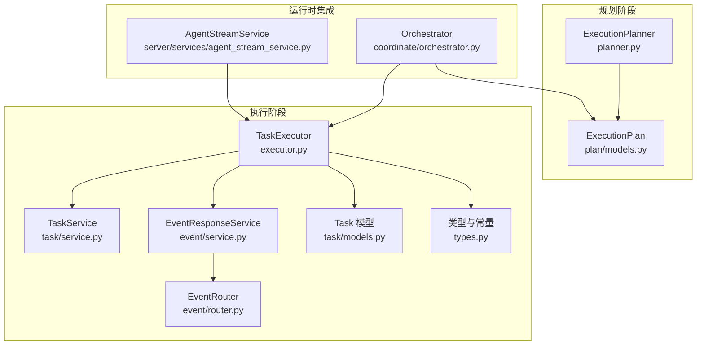
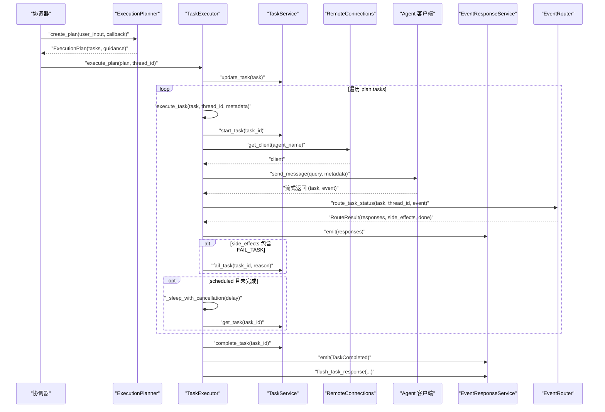
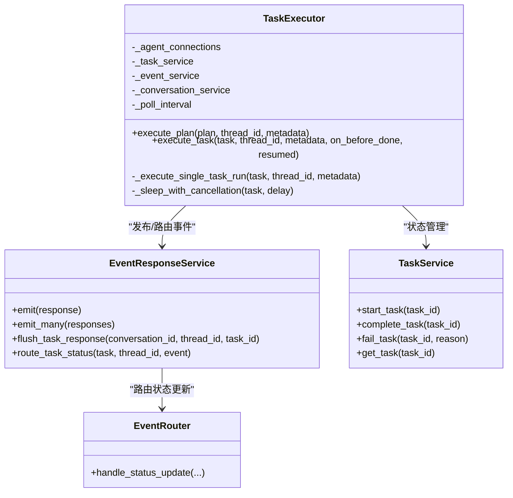
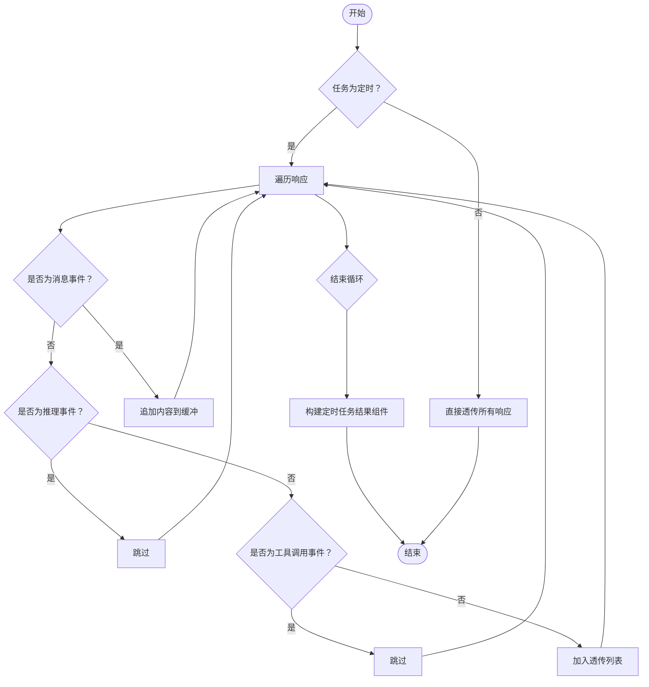
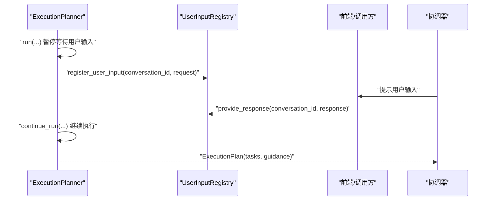
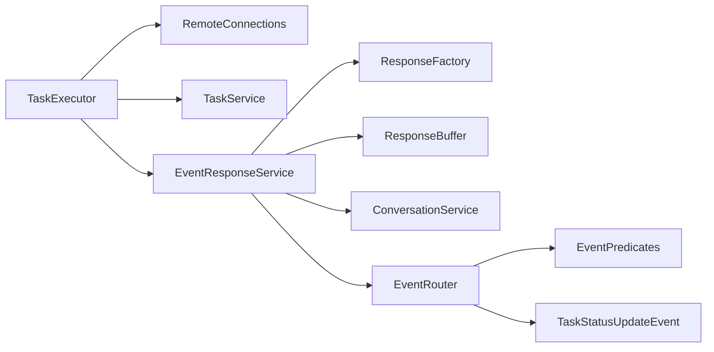

# Task Executor

<cite>
**本文引用的文件**
- [executor.py](file://python/valuecell/core/task/executor.py)
- [models.py](file://python/valuecell/core/task/models.py)
- [planner.py](file://python/valuecell/core/plan/planner.py)
- [service.py](file://python/valuecell/core/event/service.py)
- [router.py](file://python/valuecell/core/event/router.py)
- [types.py](file://python/valuecell/core/types.py)
- [test_executor.py](file://python/valuecell/core/task/tests/test_executor.py)
- [agent_stream_service.py](file://python/valuecell/server/services/agent_stream_service.py)
- [orchestrator.py](file://python/valuecell/core/coordinate/orchestrator.py)
</cite>

## 目录
1. [简介](#简介)
2. [项目结构](#项目结构)
3. [核心组件](#核心组件)
4. [架构总览](#架构总览)
5. [详细组件分析](#详细组件分析)
6. [依赖关系分析](#依赖关系分析)
7. [性能考量](#性能考量)
8. [故障排查指南](#故障排查指南)
9. [结论](#结论)
10. [附录](#附录)

## 简介
本文件系统性阐述 Task Executor 的实现与工作机制，重点覆盖以下方面：
- 如何解析 ExecutionPlan 中的任务并调度相应 Agent 或工具执行
- 执行模式：同步/异步、轮询与取消、重试与恢复
- 状态追踪、结果聚合与错误传播
- 对 Human-in-the-Loop（HITL）交互的支持：暂停、确认与干预流程
- 与 Event System 的集成：如何发布任务状态更新事件
- 性能监控指标建议与资源管理最佳实践

## 项目结构
围绕 Task Executor 的关键模块与文件如下：
- 执行器与模型：executor.py、models.py
- 规划与计划：planner.py、plan/models.py
- 事件系统：event/service.py、event/router.py、types.py
- 协调器与服务：coordinate/orchestrator.py、server/services/agent_stream_service.py
- 测试用例：task/tests/test_executor.py

图表来源
- [executor.py](file://python/valuecell/core/task/executor.py#L1-L454)
- [planner.py](file://python/valuecell/core/plan/planner.py#L1-L430)
- [service.py](file://python/valuecell/core/event/service.py#L1-L81)
- [router.py](file://python/valuecell/core/event/router.py#L1-L170)
- [models.py](file://python/valuecell/core/task/models.py#L1-L149)
- [types.py](file://python/valuecell/core/types.py#L1-L504)
- [orchestrator.py](file://python/valuecell/core/coordinate/orchestrator.py#L227-L552)
- [agent_stream_service.py](file://python/valuecell/server/services/agent_stream_service.py#L119-L152)

章节来源
- [executor.py](file://python/valuecell/core/task/executor.py#L1-L454)
- [planner.py](file://python/valuecell/core/plan/planner.py#L1-L430)
- [service.py](file://python/valuecell/core/event/service.py#L1-L81)
- [router.py](file://python/valuecell/core/event/router.py#L1-L170)
- [models.py](file://python/valuecell/core/task/models.py#L1-L149)
- [types.py](file://python/valuecell/core/types.py#L1-L504)
- [orchestrator.py](file://python/valuecell/core/coordinate/orchestrator.py#L227-L552)
- [agent_stream_service.py](file://python/valuecell/server/services/agent_stream_service.py#L119-L152)

## 核心组件
- TaskExecutor：负责执行 ExecutionPlan 中的任务，调度 Agent 客户端，处理状态事件与结果聚合，发布事件到 Event System。
- Task 模型：描述任务的状态、调度配置、手写回信息等。
- EventResponseService：统一创建、缓冲与持久化响应；路由任务状态更新。
- EventRouter：根据 TaskStatusUpdateEvent 将事件转换为具体 UI/系统响应，并可触发副作用（如标记失败）。
- 类型与常量：定义事件枚举、响应数据结构、组件类型等。

章节来源
- [executor.py](file://python/valuecell/core/task/executor.py#L95-L454)
- [models.py](file://python/valuecell/core/task/models.py#L1-L149)
- [service.py](file://python/valuecell/core/event/service.py#L1-L81)
- [router.py](file://python/valuecell/core/event/router.py#L1-L170)
- [types.py](file://python/valuecell/core/types.py#L1-L504)

## 架构总览
Task Executor 在收到 ExecutionPlan 后，逐个执行其中的任务。每个任务在执行前会更新状态、准备元数据（语言、时区、用户画像、当前上下文），随后通过 RemoteConnections 获取对应 Agent 的客户端，向其发送消息并流式接收事件。事件被 EventResponseService 路由与持久化，同时根据 TaskStatusUpdateEvent 决定是否失败、是否完成、是否继续轮询。

图表来源
- [executor.py](file://python/valuecell/core/task/executor.py#L112-L454)
- [service.py](file://python/valuecell/core/event/service.py#L1-L81)
- [router.py](file://python/valuecell/core/event/router.py#L61-L170)
- [orchestrator.py](file://python/valuecell/core/coordinate/orchestrator.py#L480-L511)

## 详细组件分析

### TaskExecutor 类与执行流程
- 初始化：注入 RemoteConnections、TaskService、EventResponseService、ConversationService、轮询间隔。
- execute_plan(plan, thread_id, metadata)：先发出规划指导消息（如有），然后遍历 plan.tasks，对每个任务调用 execute_task，并在异常时发出失败事件。
- execute_task(task, thread_id, metadata, on_before_done, resumed)：
  - 更新任务状态为运行中
  - 为定时任务发出“控制器组件”与 on_before_done 回调（用于子代理对话结束）
  - 循环执行 _execute_single_task_run，若为定时任务则在完成后计算下次延迟并睡眠轮询，期间可被取消
  - 完成后发出 TaskCompleted 事件并刷新缓冲
- _execute_single_task_run(task, thread_id, metadata)：
  - 发出“连接 Agent 工具调用”开始/完成事件
  - 获取客户端并发送消息
  - 流式消费远程响应，遇到 TaskStatusUpdateEvent 则路由到 EventRouter，按状态生成响应并可能失败
  - 收集 MESSAGE/REASONING/TOOL_CALL 等事件，最终对定时任务聚合输出为“定时任务结果组件”
- _sleep_with_cancellation(task, delay)：分段睡眠，每段检查任务是否完成，支持取消

图表来源
- [executor.py](file://python/valuecell/core/task/executor.py#L95-L454)
- [service.py](file://python/valuecell/core/event/service.py#L1-L81)
- [router.py](file://python/valuecell/core/event/router.py#L61-L170)
- [service.py](file://python/valuecell/core/task/service.py#L1-L68)

章节来源
- [executor.py](file://python/valuecell/core/task/executor.py#L112-L454)
- [service.py](file://python/valuecell/core/task/service.py#L1-L68)
- [router.py](file://python/valuecell/core/event/router.py#L61-L170)

### ScheduledTaskResultAccumulator：定时任务结果聚合
- 仅在任务为定时（RECURRING 且有效配置）时启用
- 过滤掉 MESSAGE/REASONING/TOOL_CALL 事件，保留其他响应
- 最终将收集到的消息片段拼接为“定时任务结果组件”，包含结果文本与创建时间

图表来源
- [executor.py](file://python/valuecell/core/task/executor.py#L39-L93)

章节来源
- [executor.py](file://python/valuecell/core/task/executor.py#L39-L93)

### 执行模式：同步/异步、轮询与恢复
- 异步执行：execute_plan/execute_task/_execute_single_task_run 均为异步生成器，边执行边产出响应。
- 轮询与取消：定时任务在每次执行完成后计算下一次延迟，分段睡眠（默认 0.1 秒），每段检查任务是否完成，支持取消。
- 恢复执行：服务侧在重启或恢复时，将任务置为 PENDING 并以 resumed=True 调用 execute_task，避免重复发出“控制器组件”。

章节来源
- [executor.py](file://python/valuecell/core/task/executor.py#L231-L454)
- [agent_stream_service.py](file://python/valuecell/server/services/agent_stream_service.py#L119-L152)

### 状态追踪、结果聚合与错误传播
- 状态追踪：TaskService 提供 start/complete/fail/cancel 等方法；TaskExecutor 在关键节点更新任务状态。
- 结果聚合：ScheduledTaskResultAccumulator 聚合定时任务的输出；EventResponseService 使用 ResponseBuffer 缓冲并持久化。
- 错误传播：EventRouter 将 TaskStatusUpdateEvent 转换为具体响应；当出现 FAIL_TASK 副作用时，TaskExecutor 调用 TaskService.fail_task 并同步更新对话组件状态。

章节来源
- [service.py](file://python/valuecell/core/task/service.py#L1-L68)
- [router.py](file://python/valuecell/core/event/router.py#L61-L170)
- [service.py](file://python/valuecell/core/event/service.py#L1-L81)
- [executor.py](file://python/valuecell/core/task/executor.py#L396-L443)

### Human-in-the-Loop（HITL）交互支持
- 规划阶段：ExecutionPlanner 使用 UserInputRequest 与 asyncio.Event 实现非阻塞等待用户输入；通过回调将请求传递给外部系统，外部系统在提供响应后唤醒等待者。
- 执行阶段：TaskExecutor 不直接处理用户输入请求，但通过 EventResponseService 发布“线程开始”等系统事件，协调器可在规划中断时恢复执行。

图表来源
- [planner.py](file://python/valuecell/core/plan/planner.py#L37-L77)
- [planner.py](file://python/valuecell/core/plan/planner.py#L132-L252)
- [orchestrator.py](file://python/valuecell/core/coordinate/orchestrator.py#L420-L511)

章节来源
- [planner.py](file://python/valuecell/core/plan/planner.py#L37-L77)
- [planner.py](file://python/valuecell/core/plan/planner.py#L132-L252)
- [orchestrator.py](file://python/valuecell/core/coordinate/orchestrator.py#L420-L511)

### 与 Event System 的集成
- 事件创建：ResponseFactory 生成各类响应（消息、推理、工具调用、组件生成、任务状态等）。
- 事件发布：EventResponseService.emit 将响应标注并持久化到对话历史；flush_task_response 强制刷新任务上下文的缓冲项。
- 事件路由：EventRouter.handle_status_update 将 TaskStatusUpdateEvent 映射为具体响应，并可产生副作用（如 FAIL_TASK）。

章节来源
- [service.py](file://python/valuecell/core/event/service.py#L1-L81)
- [router.py](file://python/valuecell/core/event/router.py#L61-L170)
- [types.py](file://python/valuecell/core/types.py#L1-L504)

## 依赖关系分析
- TaskExecutor 依赖 RemoteConnections 获取 Agent 客户端，依赖 TaskService 管理任务生命周期，依赖 EventResponseService 发布事件，依赖 ConversationService 管理对话上下文。
- EventResponseService 依赖 ResponseFactory 与 ResponseBuffer，内部调用 ConversationService.add_item 持久化。
- EventRouter 依赖 EventPredicates 与 a2a.types 的 TaskStatusUpdateEvent，将事件转换为 BaseResponse 并可产生 SideEffect。

图表来源
- [executor.py](file://python/valuecell/core/task/executor.py#L95-L454)
- [service.py](file://python/valuecell/core/event/service.py#L1-L81)
- [router.py](file://python/valuecell/core/event/router.py#L1-L170)
- [types.py](file://python/valuecell/core/types.py#L1-L504)

章节来源
- [executor.py](file://python/valuecell/core/task/executor.py#L95-L454)
- [service.py](file://python/valuecell/core/event/service.py#L1-L81)
- [router.py](file://python/valuecell/core/event/router.py#L1-L170)
- [types.py](file://python/valuecell/core/types.py#L1-L504)

## 性能考量
- 轮询粒度：默认轮询间隔为 0.1 秒，适合短周期定时任务；可根据业务需求调整以平衡实时性与 CPU 占用。
- 流式输出：事件按流式发布，前端可即时渲染；建议对高频消息进行节流或合并。
- 缓冲与持久化：ResponseBuffer 可减少频繁写入；flush_task_response 用于强制刷新，避免长时间阻塞。
- 客户端获取：连接失败时快速失败并记录错误，避免长时间占用；建议在上层做重试与降级策略。
- 资源管理最佳实践
  - 控制并发：限制同一会话/线程的并发任务数量
  - 超时控制：为远程调用设置合理超时
  - 日志采样：对高频事件进行日志采样，避免日志风暴
  - 指标建议
    - 任务执行时延（从 start 到 complete）
    - 任务失败率与失败原因分布
    - 定时任务延迟（实际执行时间与期望时间差）
    - 事件吞吐（每秒事件数、消息字节数）
    - 客户端连接成功率与平均连接耗时
    - 轮询等待时间分布

[本节为通用性能建议，不直接分析具体文件]

## 故障排查指南
- 任务失败
  - 现象：TaskStatusUpdateEvent 为 failed，EventRouter 生成 TaskFailedResponse 并触发 FAIL_TASK 副作用
  - 排查：查看失败原因、检查 TaskService.fail_task 是否正确调用、确认 ConversationService.update_task_component_status 同步状态
- 定时任务未执行
  - 现象：_sleep_with_cancellation 返回或任务提前完成
  - 排查：确认 calculate_next_execution_delay 返回值、TaskService.get_task 是否返回完成状态、轮询间隔是否过大
- 子代理对话组件重复
  - 现象：END 组件重复发出
  - 排查：on_before_done 仅允许一次发射 END；execute_plan 的 finally 分支不应重复发射
- 客户端连接失败
  - 现象：connect_agent 工具调用失败
  - 排查：确认 RemoteConnections.get_client 返回非空、Agent 名称有效、网络连通性

章节来源
- [executor.py](file://python/valuecell/core/task/executor.py#L396-L443)
- [router.py](file://python/valuecell/core/event/router.py#L61-L170)
- [service.py](file://python/valuecell/core/event/service.py#L1-L81)
- [test_executor.py](file://python/valuecell/core/task/tests/test_executor.py#L233-L278)

## 结论
TaskExecutor 通过清晰的异步流式执行模型，将 ExecutionPlan 的任务有序调度至各 Agent，并与 Event System 紧密集成，实现状态追踪、结果聚合与错误传播。其对定时任务的轮询与取消、对子代理对话的生命周期管理，以及对 Human-in-the-Loop 的规划阶段支持，共同构成了完整的任务执行闭环。配合合理的性能监控与资源管理策略，可稳定支撑复杂业务场景下的自动化执行。

[本节为总结性内容，不直接分析具体文件]

## 附录
- 关键接口路径参考
  - 执行计划入口：[execute_plan](file://python/valuecell/core/task/executor.py#L112-L203)
  - 单次任务执行：[_execute_single_task_run](file://python/valuecell/core/task/executor.py#L323-L443)
  - 轮询与取消：[_sleep_with_cancellation](file://python/valuecell/core/task/executor.py#L445-L454)
  - 事件路由：[handle_status_update](file://python/valuecell/core/event/router.py#L61-L170)
  - 事件发布：[emit](file://python/valuecell/core/event/service.py#L36-L41)
  - 任务状态管理：[TaskService](file://python/valuecell/core/task/service.py#L1-L68)
  - 规划与 HITL：[ExecutionPlanner](file://python/valuecell/core/plan/planner.py#L37-L252)