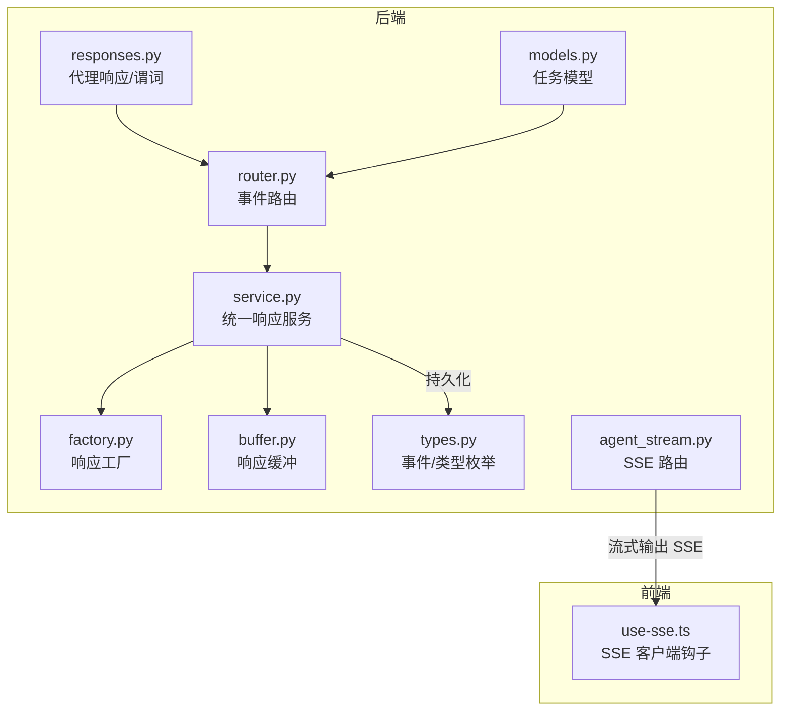
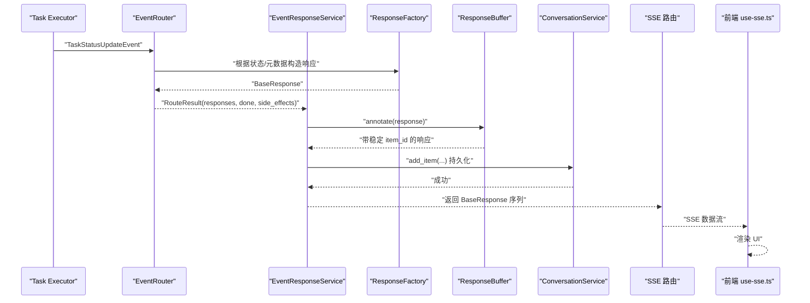
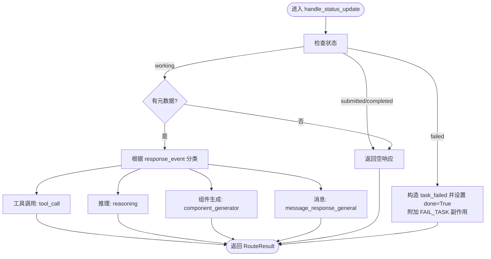
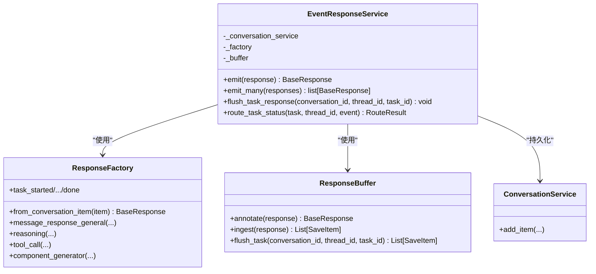
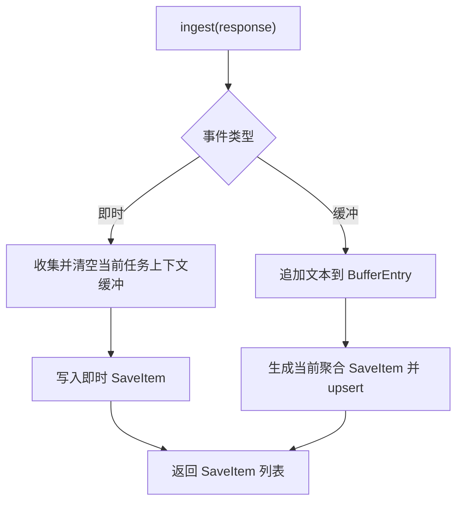
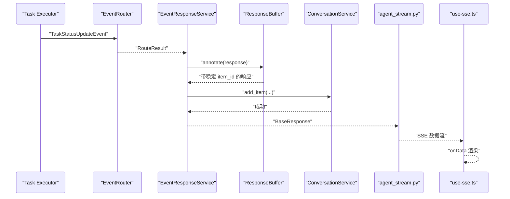
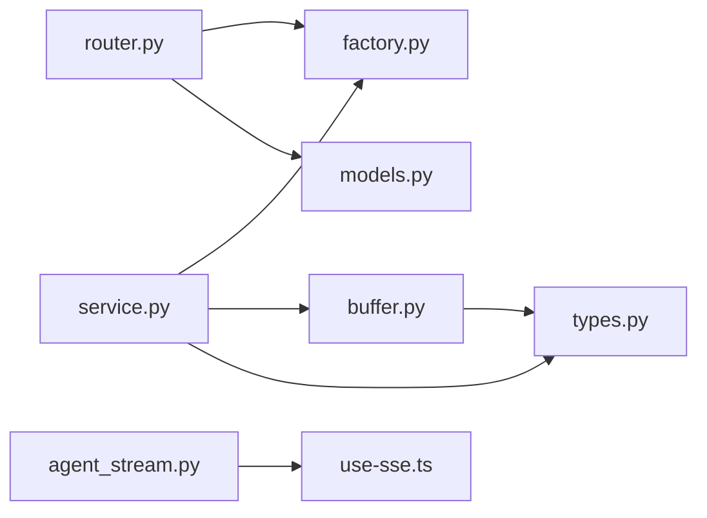

# 事件系统

<cite>
**本文引用的文件**
- [router.py](file://python/valuecell/core/event/router.py)
- [service.py](file://python/valuecell/core/event/service.py)
- [factory.py](file://python/valuecell/core/event/factory.py)
- [buffer.py](file://python/valuecell/core/event/buffer.py)
- [types.py](file://python/valuecell/core/types.py)
- [models.py](file://python/valuecell/core/task/models.py)
- [responses.py](file://python/valuecell/core/agent/responses.py)
- [agent_stream.py](file://python/valuecell/server/api/routers/agent_stream.py)
- [use-sse.ts](file://frontend/src/hooks/use-sse.ts)
- [test_event_response_service.py](file://python/valuecell/core/event/tests/test_event_response_service.py)
- [test_response_buffer.py](file://python/valuecell/core/event/tests/test_response_buffer.py)
- [test_response_factory.py](file://python/valuecell/core/event/tests/test_response_factory.py)
- [test_response_router.py](file://python/valuecell/core/event/tests/test_response_router.py)
</cite>

## 目录
1. [引言](#引言)
2. [项目结构](#项目结构)
3. [核心组件](#核心组件)
4. [架构总览](#架构总览)
5. [详细组件分析](#详细组件分析)
6. [依赖关系分析](#依赖关系分析)
7. [性能考量](#性能考量)
8. [故障排查指南](#故障排查指南)
9. [结论](#结论)
10. [附录：事件类型与数据结构清单](#附录事件类型与数据结构清单)

## 引言
本文件系统性梳理 ValueCell 内部事件系统，阐明其作为系统内部通信骨干的作用。事件系统围绕以下关键能力展开：
- 基于组件 ID 和事件类型的路由与分发（EventRouter）
- 发布/订阅接口（EventResponseService）统一管理响应生成、持久化与流式缓冲
- 标准化响应格式（ResponseFactory），确保前后端一致的数据契约
- 流式传输中的缓冲与节流（ResponseBuffer），保障前端稳定接收
- 任务执行状态到前端渲染的完整生命周期（从 Task Executor 到 UI 渲染）

通过本文件，读者可快速掌握事件类型、数据结构、监听器注册模式，并具备调试事件流的实用工具建议。

## 项目结构
事件系统位于后端 Python 模块中，核心文件分布如下：
- 路由与调度：router.py
- 统一服务入口：service.py
- 响应工厂：factory.py
- 缓冲与持久化：buffer.py
- 类型与枚举：types.py
- 任务模型：models.py
- 前端 SSE 钩子：use-sse.ts
- 后端 SSE 路由：agent_stream.py
- 代理响应构造与谓词：responses.py
- 单元测试：多个 test_*.py

图表来源
- [router.py](file://python/valuecell/core/event/router.py#L1-L170)
- [service.py](file://python/valuecell/core/event/service.py#L1-L81)
- [factory.py](file://python/valuecell/core/event/factory.py#L1-L640)
- [buffer.py](file://python/valuecell/core/event/buffer.py#L1-L325)
- [types.py](file://python/valuecell/core/types.py#L1-L200)
- [models.py](file://python/valuecell/core/task/models.py#L1-L149)
- [responses.py](file://python/valuecell/core/agent/responses.py#L1-L307)
- [agent_stream.py](file://python/valuecell/server/api/routers/agent_stream.py#L1-L64)
- [use-sse.ts](file://frontend/src/hooks/use-sse.ts#L1-L92)

章节来源
- [router.py](file://python/valuecell/core/event/router.py#L1-L170)
- [service.py](file://python/valuecell/core/event/service.py#L1-L81)
- [factory.py](file://python/valuecell/core/event/factory.py#L1-L640)
- [buffer.py](file://python/valuecell/core/event/buffer.py#L1-L325)
- [types.py](file://python/valuecell/core/types.py#L1-L200)
- [models.py](file://python/valuecell/core/task/models.py#L1-L149)
- [responses.py](file://python/valuecell/core/agent/responses.py#L1-L307)
- [agent_stream.py](file://python/valuecell/server/api/routers/agent_stream.py#L1-L64)
- [use-sse.ts](file://frontend/src/hooks/use-sse.ts#L1-L92)

## 核心组件
- EventRouter（router.py）：根据任务状态与元数据，将事件映射为具体响应，并可产生副作用（如标记任务失败）
- EventResponseService（service.py）：统一入口，负责响应创建、缓冲注解、批量持久化与按任务上下文强制刷新
- ResponseFactory（factory.py）：标准化响应对象构造，涵盖消息、推理、工具调用、组件生成等
- ResponseBuffer（buffer.py）：对流式消息进行段落级聚合，保证同一段内容的稳定 item_id；对即时事件（如工具完成、组件生成、通知消息、计划需要用户输入、线程开始）直接写入
- 类型与枚举（types.py）：定义系统/任务/流式/通知/通用事件枚举，以及统一响应数据载体
- 任务模型（models.py）：承载任务生命周期状态，驱动路由逻辑
- 代理响应与谓词（responses.py）：提供流式/通知响应工厂方法与事件分类谓词
- SSE 路由与前端钩子（agent_stream.py, use-sse.ts）：后端将响应序列化为 SSE，前端以钩子消费

章节来源
- [router.py](file://python/valuecell/core/event/router.py#L1-L170)
- [service.py](file://python/valuecell/core/event/service.py#L1-L81)
- [factory.py](file://python/valuecell/core/event/factory.py#L1-L640)
- [buffer.py](file://python/valuecell/core/event/buffer.py#L1-L325)
- [types.py](file://python/valuecell/core/types.py#L1-L200)
- [models.py](file://python/valuecell/core/task/models.py#L1-L149)
- [responses.py](file://python/valuecell/core/agent/responses.py#L1-L307)
- [agent_stream.py](file://python/valuecell/server/api/routers/agent_stream.py#L1-L64)
- [use-sse.ts](file://frontend/src/hooks/use-sse.ts#L1-L92)

## 架构总览
事件系统采用“工厂 + 路由 + 缓冲 + 持久化”的分层设计：
- 工厂层：ResponseFactory 将业务语义转换为统一响应对象
- 路由层：router.handle_status_update 将任务状态事件映射为具体响应，并可附加副作用
- 缓冲层：ResponseBuffer 对流式消息进行段落聚合，对即时事件直接写入
- 服务层：EventResponseService 统一对外暴露 emit/emit_many/flush_task_response 等接口，负责注解与持久化
- 类型层：types.py 定义事件枚举与统一数据载体，确保跨模块一致性
- 前后端对接：后端 SSE 输出，前端 use-sse.ts 订阅

图表来源
- [router.py](file://python/valuecell/core/event/router.py#L61-L170)
- [service.py](file://python/valuecell/core/event/service.py#L36-L81)
- [factory.py](file://python/valuecell/core/event/factory.py#L199-L640)
- [buffer.py](file://python/valuecell/core/event/buffer.py#L107-L216)
- [agent_stream.py](file://python/valuecell/server/api/routers/agent_stream.py#L31-L64)
- [use-sse.ts](file://frontend/src/hooks/use-sse.ts#L1-L92)

## 详细组件分析

### EventRouter：基于组件ID与事件类型的路由
- 输入：任务对象、线程ID、任务状态更新事件
- 关键逻辑：
  - 忽略 submitted/completed 状态的默认消息
  - failed 状态：构造 task_failed 响应并请求失败副作用
  - working 状态下依据元数据 response_event 分类：
    - 工具调用：tool_call
    - 推理过程：reasoning
    - 组件生成：component_generator
    - 一般消息：message_response_general
- 返回：RouteResult（包含响应列表、是否完成标志、副作用列表）

图表来源
- [router.py](file://python/valuecell/core/event/router.py#L61-L170)

章节来源
- [router.py](file://python/valuecell/core/event/router.py#L1-L170)
- [test_response_router.py](file://python/valuecell/core/event/tests/test_response_router.py#L1-L604)

### EventResponseService：发布/订阅统一入口
- 职责：
  - emit：注解响应（交给缓冲层标注稳定 item_id），持久化并返回
  - emit_many：顺序批量持久化
  - flush_task_response：按 conversation_id/thread_id/task_id 强制刷新缓冲
  - route_task_status：路由任务状态更新（无副作用）
- 依赖：
  - ResponseFactory：构造响应
  - ResponseBuffer：注解与聚合
  - ConversationService：持久化存储

图表来源
- [service.py](file://python/valuecell/core/event/service.py#L1-L81)
- [factory.py](file://python/valuecell/core/event/factory.py#L1-L640)
- [buffer.py](file://python/valuecell/core/event/buffer.py#L1-L325)

章节来源
- [service.py](file://python/valuecell/core/event/service.py#L1-L81)
- [test_event_response_service.py](file://python/valuecell/core/event/tests/test_event_response_service.py#L1-L157)

### ResponseFactory：标准化响应格式
- 功能点：
  - from_conversation_item：从已存对话项重建响应对象，自动解析枚举与 payload
  - 任务生命周期：task_started、task_completed、task_failed、done
  - 系统事件：conversation_started、thread_started、plan_require_user_input、plan_failed、system_failed
  - 流式/通知：message_response_general、reasoning、tool_call、component_generator
  - 工具结果格式化：确保前端渲染兼容的 JSON 数组
- 统一数据载体：UnifiedResponseData，包含 conversation_id、thread_id、task_id、payload、role、item_id、agent_name、metadata

章节来源
- [factory.py](file://python/valuecell/core/event/factory.py#L1-L640)
- [types.py](file://python/valuecell/core/types.py#L1-L200)
- [test_response_factory.py](file://python/valuecell/core/event/tests/test_response_factory.py#L1-L283)

### ResponseBuffer：流式传输中的缓冲与节流
- 缓冲策略：
  - 即时事件：立即写入（工具完成、组件生成、通知消息、计划需要用户输入、线程开始）
  - 缓冲事件：消息片段、推理（按段落聚合），保持稳定 item_id
- 注解规则：
  - 对 buffered 事件：若未显式设置 item_id，则由缓冲层分配稳定段落 id
  - 对 reasoning 事件：若调用方已提供 item_id，则保留（用于推理开始/进行/结束的关联）
- 刷新机制：
  - 即时事件会触发当前任务上下文的所有缓冲项写入
  - flush_task_response 可按任务强制刷新

图表来源
- [buffer.py](file://python/valuecell/core/event/buffer.py#L145-L216)

章节来源
- [buffer.py](file://python/valuecell/core/event/buffer.py#L1-L325)
- [test_response_buffer.py](file://python/valuecell/core/event/tests/test_response_buffer.py#L1-L542)

### 事件生命周期：从 Task Executor 到前端 UI 渲染
- 后端：
  - Task Executor 产生 TaskStatusUpdateEvent
  - EventRouter 将事件映射为具体响应（消息、推理、工具调用、组件生成等）
  - EventResponseService 注解并持久化，必要时强制刷新
- 前端：
  - SSE 路由将响应序列化为 SSE
  - use-sse.ts 订阅并回调处理，驱动 UI 渲染

图表来源
- [router.py](file://python/valuecell/core/event/router.py#L61-L170)
- [service.py](file://python/valuecell/core/event/service.py#L36-L81)
- [buffer.py](file://python/valuecell/core/event/buffer.py#L107-L216)
- [agent_stream.py](file://python/valuecell/server/api/routers/agent_stream.py#L31-L64)
- [use-sse.ts](file://frontend/src/hooks/use-sse.ts#L1-L92)

## 依赖关系分析
- 组件耦合：
  - EventRouter 依赖 ResponseFactory 与 Task 模型
  - EventResponseService 依赖 ResponseFactory、ResponseBuffer、ConversationService
  - ResponseBuffer 依赖 types 中的事件枚举与统一数据载体
  - 前端 use-sse.ts 依赖后端 agent_stream.py 的 SSE 输出
- 外部依赖：
  - FastAPI（SSE 路由）
  - loguru（日志）
  - pydantic（数据校验与序列化）

图表来源
- [router.py](file://python/valuecell/core/event/router.py#L1-L170)
- [service.py](file://python/valuecell/core/event/service.py#L1-L81)
- [factory.py](file://python/valuecell/core/event/factory.py#L1-L640)
- [buffer.py](file://python/valuecell/core/event/buffer.py#L1-L325)
- [types.py](file://python/valuecell/core/types.py#L1-L200)
- [models.py](file://python/valuecell/core/task/models.py#L1-L149)
- [agent_stream.py](file://python/valuecell/server/api/routers/agent_stream.py#L1-L64)
- [use-sse.ts](file://frontend/src/hooks/use-sse.ts#L1-L92)

章节来源
- [router.py](file://python/valuecell/core/event/router.py#L1-L170)
- [service.py](file://python/valuecell/core/event/service.py#L1-L81)
- [factory.py](file://python/valuecell/core/event/factory.py#L1-L640)
- [buffer.py](file://python/valuecell/core/event/buffer.py#L1-L325)
- [types.py](file://python/valuecell/core/types.py#L1-L200)
- [models.py](file://python/valuecell/core/task/models.py#L1-L149)
- [agent_stream.py](file://python/valuecell/server/api/routers/agent_stream.py#L1-L64)
- [use-sse.ts](file://frontend/src/hooks/use-sse.ts#L1-L92)

## 性能考量
- 流式聚合：
  - 使用 ResponseBuffer 对消息片段与推理进行段落级聚合，减少持久化次数，提升吞吐
- 即时事件优先：
  - 工具完成、组件生成、通知消息、计划需要用户输入、线程开始等即时事件优先写入，避免阻塞
- 稳定 item_id：
  - 通过缓冲层为消息段落分配稳定 item_id，便于前端增量渲染与最终落库
- 批量持久化：
  - emit_many 顺序处理，降低并发压力；flush_task_response 在任务结束时一次性落库，避免碎片化

[本节为通用指导，无需列出章节来源]

## 故障排查指南
- 前端无数据或断流
  - 检查后端 SSE 路由是否正常输出，确认 media type 与 headers 设置
  - 前端 use-sse.ts 是否正确初始化并连接
- 响应缺失或错位
  - 确认 ResponseBuffer 的即时事件是否触发了缓冲刷新
  - 检查 ResponseFactory 的工具结果格式化是否符合前端渲染要求
- 任务状态未生效
  - 检查 EventRouter 的路由逻辑与副作用是否被正确应用
  - 确认 ConversationService 的 add_item 是否被调用且参数正确

章节来源
- [agent_stream.py](file://python/valuecell/server/api/routers/agent_stream.py#L31-L64)
- [use-sse.ts](file://frontend/src/hooks/use-sse.ts#L1-L92)
- [buffer.py](file://python/valuecell/core/event/buffer.py#L145-L216)
- [factory.py](file://python/valuecell/core/event/factory.py#L1-L640)
- [router.py](file://python/valuecell/core/event/router.py#L61-L170)
- [service.py](file://python/valuecell/core/event/service.py#L36-L81)

## 结论
事件系统通过“工厂 + 路由 + 缓冲 + 持久化”的分层设计，实现了从任务执行到前端渲染的稳定、可扩展通信链路。ResponseFactory 提供统一响应格式，ResponseBuffer 实现流式聚合与节流，EventRouter 与 EventResponseService 则分别承担事件分类与发布/订阅职责。配合 SSE 路由与前端钩子，系统在高并发与复杂交互场景下仍能保持良好的用户体验与可观测性。

[本节为总结，无需列出章节来源]

## 附录：事件类型与数据结构清单

### 事件类型枚举
- 系统级事件（SystemResponseEvent）
  - conversation_started、thread_started、plan_require_user_input、plan_failed、system_failed、done
- 任务状态事件（TaskStatusEvent）
  - task_started、task_completed、task_failed、task_cancelled
- 流式事件（StreamResponseEvent）
  - message_chunk、tool_call_started、tool_call_completed、reasoning_started、reasoning、reasoning_completed
- 通知事件（NotifyResponseEvent）
  - message
- 通用事件（CommonResponseEvent）
  - component_generator

章节来源
- [types.py](file://python/valuecell/core/types.py#L38-L115)

### 统一响应数据载体
- UnifiedResponseData
  - 字段：conversation_id、thread_id、task_id、payload、role、item_id、agent_name、metadata
- Payload 类型
  - BaseResponseDataPayload（基础消息内容）
  - ToolCallPayload（工具调用标识与结果）
  - ComponentGeneratorResponseDataPayload（组件生成内容与类型）

章节来源
- [types.py](file://python/valuecell/core/types.py#L116-L200)
- [factory.py](file://python/valuecell/core/event/factory.py#L1-L198)

### 监听器注册模式
- 任务状态监听
  - 通过 EventResponseService.route_task_status 获取 RouteResult，再由上层编排器决定是否应用副作用
- SSE 订阅
  - 前端使用 use-sse.ts 订阅后端 agent_stream.py 的 SSE 端点，onData 中处理不同事件类型并更新 UI

章节来源
- [service.py](file://python/valuecell/core/event/service.py#L59-L63)
- [agent_stream.py](file://python/valuecell/server/api/routers/agent_stream.py#L31-L64)
- [use-sse.ts](file://frontend/src/hooks/use-sse.ts#L1-L92)