# 核心架构

<cite>
**本文档引用的文件**   
- [orchestrator.py](file://python/valuecell/core/coordinate/orchestrator.py)
- [super_agent.py](file://python/valuecell/core/super_agent/core.py)
- [planner.py](file://python/valuecell/core/plan/planner.py)
- [executor.py](file://python/valuecell/core/task/executor.py)
- [connect.py](file://python/valuecell/core/agent/connect.py)
- [types.py](file://python/valuecell/core/types.py)
- [conversation.py](file://python/valuecell/core/conversation/models.py)
- [task.py](file://python/valuecell/core/task/models.py)
- [agent.ts](file://frontend/src/api/agent.ts)
- [use-sse.ts](file://frontend/src/hooks/use-sse.ts)
- [common-agent-area.tsx](file://frontend/src/app/agent/components/agent-view/common-agent-area.tsx)
</cite>

## 目录
1. [引言](#引言)
2. [异步可重入编排系统](#异步可重入编排系统)
3. [数据流分析](#数据流分析)
4. [Human-in-the-Loop机制](#human-in-the-loop机制)
5. [流式响应管道](#流式响应管道)
6. [A2A集成](#a2a集成)
7. [错误处理与弹性设计](#错误处理与弹性设计)
8. [会话持久化](#会话持久化)
9. [服务交互图](#服务交互图)
10. [序列图](#序列图)

## 引言
ValueCell的异步、可重入编排系统是其核心架构的中枢，负责协调Super Agent、Planner和Task Executor之间的交互。该系统从用户输入开始，经过Super Agent的初步分类，通过Planner生成执行计划，最后由TaskExecutor执行任务并返回结果。本文档详细描述了这一过程，包括Human-in-the-Loop（HITL）机制、流式响应管道和A2A（Agent2Agent）集成，以及错误处理、弹性和会话持久化等设计决策。

## 异步可重入编排系统

ValueCell的编排系统以`AgentOrchestrator`为核心，实现了异步、可重入的执行模型。该系统通过`process_user_input`方法接收用户输入，并启动一个后台会话来处理请求，确保即使消费者断开连接，后台任务仍能继续执行。

编排器通过`ExecutionContext`类管理执行状态，该类存储了中断执行的轻量级元数据，包括阶段、会话标识、用户标识和时间戳。当会话需要用户输入时，编排器会保存当前上下文，并在收到用户响应后恢复执行。

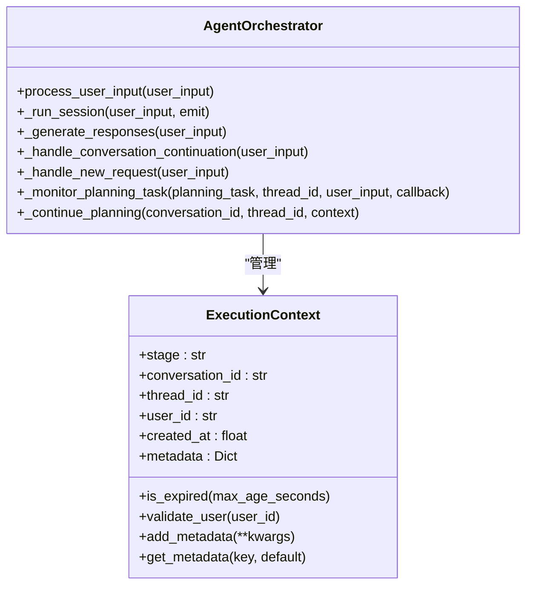

**Diagram sources**
- [orchestrator.py](file://python/valuecell/core/coordinate/orchestrator.py#L68-L644)

**Section sources**
- [orchestrator.py](file://python/valuecell/core/coordinate/orchestrator.py#L68-L644)

## 数据流分析

数据流从用户输入开始，经过Super Agent的初步分类，通过Planner生成执行计划，最后由TaskExecutor执行任务并返回结果。

### Super Agent分类
Super Agent作为轻量级代理，负责在规划前对用户意图进行分类。它通过`run`方法处理用户输入，返回`SuperAgentOutcome`对象，该对象包含决策、直接答案或转发给Planner的增强查询。

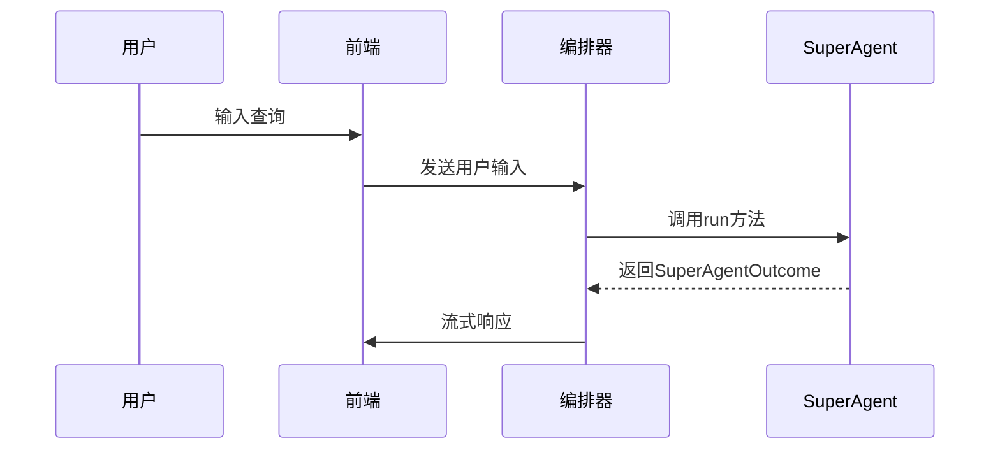

**Diagram sources**
- [super_agent.py](file://python/valuecell/core/super_agent/core.py#L35-L185)
- [orchestrator.py](file://python/valuecell/core/coordinate/orchestrator.py#L309-L381)

**Section sources**
- [super_agent.py](file://python/valuecell/core/super_agent/core.py#L35-L185)

### Planner生成执行计划
Planner使用基于LLM的规划代理将用户请求转换为结构化的`ExecutionPlan`，该计划由`Task`对象组成。Planner支持Human-in-the-Loop流程，当需要澄清时，会发出`UserInputRequest`对象。

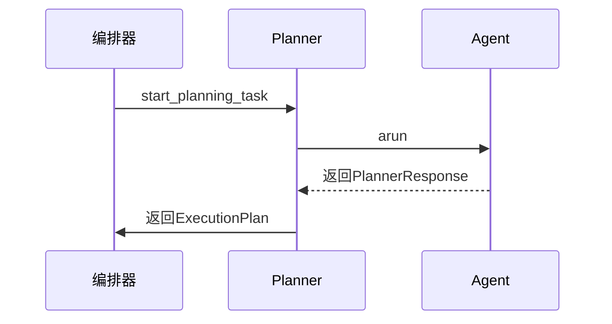

**Diagram sources**
- [planner.py](file://python/valuecell/core/plan/planner.py#L75-L430)
- [orchestrator.py](file://python/valuecell/core/coordinate/orchestrator.py#L389-L497)

**Section sources**
- [planner.py](file://python/valuecell/core/plan/planner.py#L75-L430)

### TaskExecutor执行任务
TaskExecutor负责执行计划中的任务，并持久化流式输出。它通过`execute_plan`方法遍历计划中的每个任务，并调用`execute_task`方法执行单个任务。

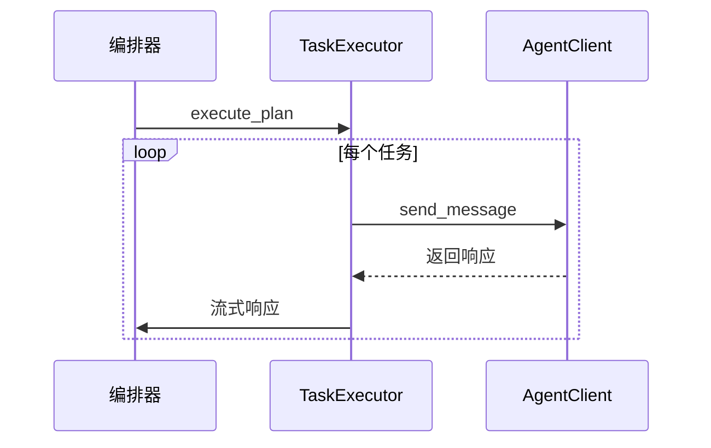

**Diagram sources**
- [executor.py](file://python/valuecell/core/task/executor.py#L95-L454)
- [orchestrator.py](file://python/valuecell/core/coordinate/orchestrator.py#L509-L510)

**Section sources**
- [executor.py](file://python/valuecell/core/task/executor.py#L95-L454)

## Human-in-the-Loop机制

Human-in-the-Loop（HITL）机制允许Planner在需要澄清时暂停执行并请求用户输入。该机制通过`UserInputRequest`类实现，该类使用`asyncio.Event`来实现非阻塞等待用户响应。

当Planner需要用户输入时，它会创建一个`UserInputRequest`对象，并通过回调函数将其传递给编排器。编排器保存当前执行上下文，并向用户发送请求。当用户提供响应后，编排器恢复执行。

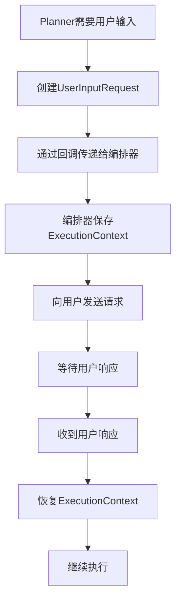

**Diagram sources**
- [planner.py](file://python/valuecell/core/plan/planner.py#L37-L73)
- [orchestrator.py](file://python/valuecell/core/coordinate/orchestrator.py#L457-L478)

**Section sources**
- [planner.py](file://python/valuecell/core/plan/planner.py#L37-L73)

## 流式响应管道

流式响应管道通过Server-Sent Events（SSE）实现，允许服务器向客户端推送实时更新。前端使用`useSSE`钩子建立SSE连接，并处理来自服务器的事件。

编排器通过`process_user_input`方法生成异步生成器，该生成器产生`BaseResponse`对象。这些响应通过`EventResponseService`进行注释和持久化，然后通过SSE发送给客户端。

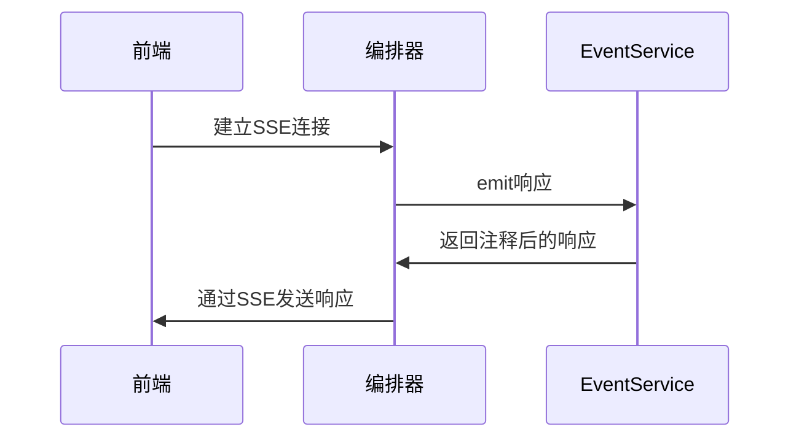

**Diagram sources**
- [orchestrator.py](file://python/valuecell/core/coordinate/orchestrator.py#L98-L147)
- [use-sse.ts](file://frontend/src/hooks/use-sse.ts#L1-L91)

**Section sources**
- [orchestrator.py](file://python/valuecell/core/coordinate/orchestrator.py#L98-L147)

## A2A集成

A2A（Agent2Agent）集成通过`RemoteConnections`类实现，该类管理远程代理的连接。它从本地JSON文件加载代理卡，创建HTTP客户端，并可选择性地启动通知监听器。

代理通过`AgentClient`进行通信，该客户端处理与远程代理的HTTP交互。`RemoteConnections`还支持在进程内启动本地代理，并管理其生命周期。

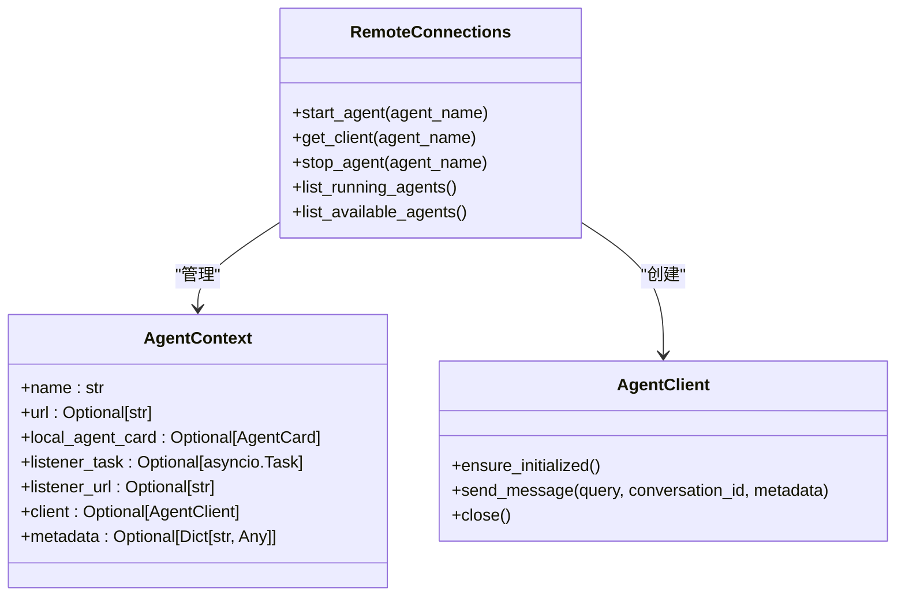

**Diagram sources**
- [connect.py](file://python/valuecell/core/agent/connect.py#L203-L674)

**Section sources**
- [connect.py](file://python/valuecell/core/agent/connect.py#L203-L674)

## 错误处理与弹性设计

系统通过多层次的错误处理机制确保弹性和可靠性。每个关键组件都有自己的错误处理策略，同时编排器负责协调整体的错误恢复。

### 编排器错误处理
编排器在`_generate_responses`方法中使用try-catch块捕获异常，并通过`system_failed`事件向用户报告错误。即使发生未处理的异常，后台任务也会继续运行，确保计划和长期运行的任务独立于SSE连接。

### Planner错误处理
Planner在`_analyze_input_and_create_tasks`方法中处理异常，当模型初始化失败或执行失败时，返回带有指导消息的空任务列表。这确保了即使Planner不可用，系统也能优雅地降级。

### TaskExecutor错误处理
TaskExecutor在`execute_task`方法中捕获异常，通过`task_failed`事件报告错误，并更新任务状态。它还实现了重试逻辑，通过`_sleep_with_cancellation`方法处理计划任务的延迟执行。

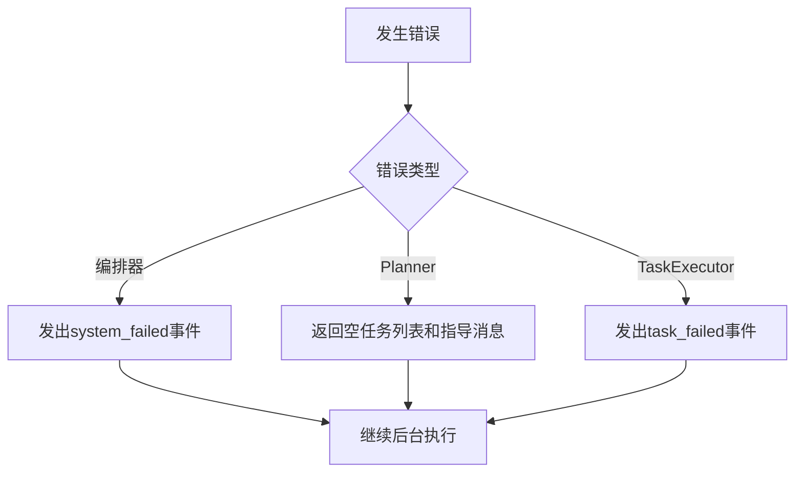

**Diagram sources**
- [orchestrator.py](file://python/valuecell/core/coordinate/orchestrator.py#L216-L225)
- [planner.py](file://python/valuecell/core/plan/planner.py#L223-L228)
- [executor.py](file://python/valuecell/core/task/executor.py#L313-L315)

**Section sources**
- [orchestrator.py](file://python/valuecell/core/coordinate/orchestrator.py#L216-L225)

## 会话持久化

会话持久化通过`ConversationService`和`ConversationStore`实现，确保用户会话状态在重启后仍然可用。`Conversation`模型存储会话的元数据，而消息项存储在单独的`ItemStore`中。

编排器通过`ensure_conversation`方法确保会话存在，并在会话状态变化时更新数据库。`EventResponseService`负责将响应持久化到会话存储中。

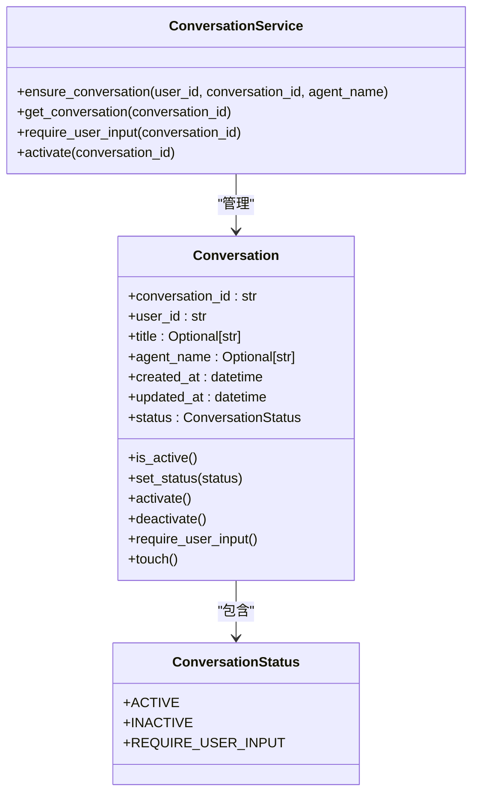

**Diagram sources**
- [conversation.py](file://python/valuecell/core/conversation/models.py#L8-L65)
- [orchestrator.py](file://python/valuecell/core/coordinate/orchestrator.py#L187-L197)

**Section sources**
- [conversation.py](file://python/valuecell/core/conversation/models.py#L8-L65)

## 服务交互图

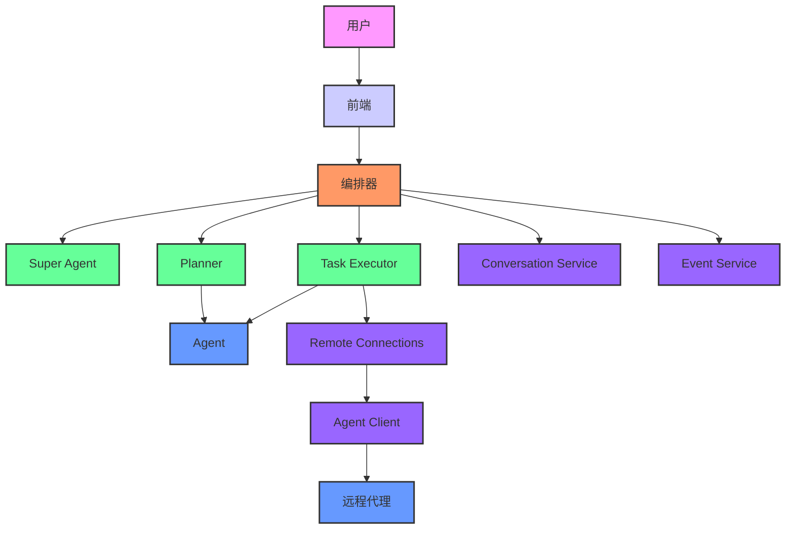

**Diagram sources**
- [orchestrator.py](file://python/valuecell/core/coordinate/orchestrator.py#L68-L644)
- [super_agent.py](file://python/valuecell/core/super_agent/core.py#L35-L185)
- [planner.py](file://python/valuecell/core/plan/planner.py#L75-L430)
- [executor.py](file://python/valuecell/core/task/executor.py#L95-L454)

## 序列图

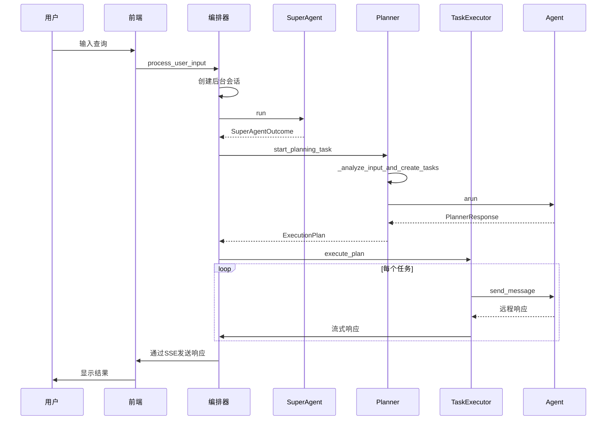

**Diagram sources**
- [orchestrator.py](file://python/valuecell/core/coordinate/orchestrator.py#L98-L147)
- [super_agent.py](file://python/valuecell/core/super_agent/core.py#L132-L185)
- [planner.py](file://python/valuecell/core/plan/planner.py#L132-L430)
- [executor.py](file://python/valuecell/core/task/executor.py#L112-L454)