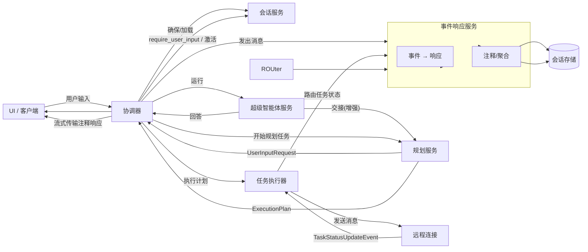
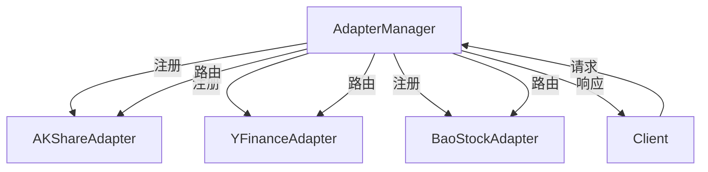

# 贡献指南

<cite>
**本文档引用的文件**  
- [CONTRIBUTE_AN_AGENT.md](file://docs/CONTRIBUTE_AN_AGENT.md)
- [CORE_ARCHITECTURE.md](file://docs/CORE_ARCHITECTURE.md)
- [CONFIGURATION_GUIDE.md](file://docs/CONFIGURATION_GUIDE.md)
- [README.md](file://README.md)
- [manager.py](file://python/valuecell/config/manager.py)
- [base.py](file://python/valuecell/adapters/assets/base.py)
- [types.py](file://python/valuecell/core/types.py)
- [base_agent.py](file://python/valuecell/agents/common/trading/base_agent.py)
- [adapter_manager.py](file://python/valuecell/adapters/assets/manager.py)
</cite>

## 目录
1. [简介](#简介)
2. [开发环境设置](#开发环境设置)
3. [创建新智能体](#创建新智能体)
4. [智能体配置](#智能体配置)
5. [添加适配器](#添加适配器)
6. [代码标准与测试](#代码标准与测试)
7. [社区协作](#社区协作)

## 简介
ValueCell 是一个社区驱动的多智能体金融平台，旨在构建全球最大的去中心化金融智能体社区。本指南将指导开发者如何为项目做出贡献，包括开发和集成新的智能体、适配器或功能模块。

项目采用 Python 作为主要开发语言，支持多平台部署。我们鼓励开发者通过 Discord 和 GitHub 与社区协作，共同推动项目发展。

**Section sources**
- [README.md](file://README.md#L38-L45)

## 开发环境设置
要开始开发，请按照以下步骤设置开发环境：

1. **克隆仓库**
```bash
git clone https://github.com/ValueCell-ai/valuecell.git
cd valuecell
```

2. **配置环境变量**
复制示例文件并添加您的 API 密钥：
```bash
cp .env.example .env
```

支持的 LLM 提供商包括 OpenRouter、SiliconFlow、Google、OpenAI 和 DeepSeek。您至少需要配置一个提供商的 API 密钥。

3. **启动应用**
```bash
# macOS / Linux
bash start.sh

# Windows (PowerShell)
.\start.ps1
```

4. **访问界面**
- **Web UI**: 在浏览器中导航到 [http://localhost:1420](http://localhost:1420)
- **日志**: 在终端中查看应用日志以获取后端服务和各个智能体的详细运行信息

**Section sources**
- [README.md](file://README.md#L156-L180)

## 创建新智能体
创建新智能体涉及三个核心步骤：实现智能体模块、添加智能体卡片和配置智能体。

### 智能体架构
ValueCell 的智能体系统采用模块化设计，核心组件包括：
- **Orchestrator (协调器)**: 协调整个生命周期，包括超级智能体分流、规划和执行
- **Super Agent (超级智能体)**: 快速分流用户输入，决定是直接回答还是交给规划器
- **Planner (规划器)**: 将自然语言用户输入转换为可执行计划
- **Task Executor (任务执行器)**: 执行每个任务，通常调用远程智能体进行工作



**Diagram sources**
- [CORE_ARCHITECTURE.md](file://docs/CORE_ARCHITECTURE.md#L19-L69)

### 实现智能体逻辑
在 `core.py` 中，继承 `BaseAgent` 并实现 `stream()` 方法：

```python
from typing import AsyncGenerator, Optional, Dict
from valuecell.core.types import BaseAgent, StreamResponse
from valuecell.core.agent import streaming

class HelloAgent(BaseAgent):
   async def stream(
      self,
      query: str,                    # 用户查询内容
      conversation_id: str,          # 会话ID
      task_id: str,                  # 任务ID
      dependencies: Optional[Dict] = None,  # 可选上下文（语言、时区等）
   ) -> AsyncGenerator[StreamResponse, None]:
      """
      处理用户查询并返回流式响应。
      
      Args:
          query: 用户查询内容
          conversation_id: 会话的唯一标识符
          task_id: 任务的唯一标识符
          dependencies: 包含语言、时区和其他上下文的可选依赖项
      
      Yields:
          StreamResponse: 包含内容和完成状态的流式响应
      """
      # 发送几个数据块，然后完成
      yield streaming.message_chunk("思考中…")
      yield streaming.message_chunk(f"您说：{query}")
      yield streaming.done()
```

**Section sources**
- [CONTRIBUTE_AN_AGENT.md](file://docs/CONTRIBUTE_AN_AGENT.md#L72-L102)

### 添加智能体入口点
在 `__main__.py` 中，包装您的智能体以进行独立执行：

```python
import asyncio
from valuecell.core.agent import create_wrapped_agent
from .core import HelloAgent

if __name__ == "__main__":
   agent = create_wrapped_agent(HelloAgent)
   asyncio.run(agent.serve())
```

**Section sources**
- [CONTRIBUTE_AN_AGENT.md](file://docs/CONTRIBUTE_AN_AGENT.md#L115-L124)

## 智能体配置
智能体配置定义了智能体如何使用模型、嵌入和运行时参数。

### 配置文件结构
在 `python/configs/agents/` 中创建 YAML 文件：

```yaml
name: "Hello Agent"
enabled: true

# 模型配置
models:
  # 主要模型
  primary:
    model_id: "anthropic/claude-haiku-4.5"
    provider: "openrouter"

# 环境变量覆盖
env_overrides:
  HELLO_AGENT_MODEL_ID: "models.primary.model_id"
  HELLO_AGENT_PROVIDER: "models.primary.provider"
```

**Section sources**
- [CONTRIBUTE_AN_AGENT.md](file://docs/CONTRIBUTE_AN_AGENT.md#L151-L166)

### 使用配置
在智能体中加载配置：

```python
from valuecell.utils.model import get_model_for_agent

class HelloAgent(BaseAgent):
   def __init__(self, **kwargs):
      super().__init__(**kwargs)
      # 自动从 hello_agent.yaml 加载配置
      # 智能体名称 "hello_agent" 必须与 YAML 文件名匹配
      self.model = get_model_for_agent("hello_agent")
   
   async def stream(self, query, conversation_id, task_id, dependencies=None):
      # 使用配置的模型
      response = await self.model.generate(query)
      yield streaming.message_chunk(response)
      yield streaming.done()
```

**Section sources**
- [CONTRIBUTE_AN_AGENT.md](file://docs/CONTRIBUTE_AN_AGENT.md#L177-L191)

## 添加适配器
适配器用于集成不同的市场数据源。ValueCell 支持多种市场数据，包括美国市场、加密货币市场、香港市场和中国市场。

### 适配器架构
适配器管理器协调多个数据源适配器，并根据资产类型和可用性路由请求。



**Diagram sources**
- [adapter_manager.py](file://python/valuecell/adapters/assets/manager.py#L33-L800)

### 实现适配器
创建适配器需要继承 `BaseDataAdapter` 抽象基类：

```python
class BaseDataAdapter(ABC):
    """所有数据源适配器的抽象基类。"""

    def __init__(self, source: DataSource, api_key: Optional[str] = None, **kwargs):
        """使用数据源和配置初始化适配器。"""
        self.source = source
        self.api_key = api_key
        self.config = kwargs
        self.logger = logging.getLogger(f"{__name__}.{source.value}")

        # 初始化适配器特定的配置
        self._initialize()

    @abstractmethod
    def _initialize(self) -> None:
        """初始化适配器特定的配置和连接。"""
        pass

    @abstractmethod
    def search_assets(self, query: AssetSearchQuery) -> List[AssetSearchResult]:
        """搜索匹配查询条件的资产。"""
        pass

    @abstractmethod
    def get_asset_info(self, ticker: str) -> Optional[Asset]:
        """获取特定资产的详细信息。"""
        pass

    @abstractmethod
    def get_real_time_price(self, ticker: str) -> Optional[AssetPrice]:
        """获取资产的实时价格数据。"""
        pass

    @abstractmethod
    def get_historical_prices(
        self,
        ticker: str,
        start_date: datetime,
        end_date: datetime,
        interval: str = "1d",
    ) -> List[AssetPrice]:
        """获取资产的历史价格数据。"""
        pass
```

**Section sources**
- [base.py](file://python/valuecell/adapters/assets/base.py#L42-L225)

## 代码标准与测试
### 代码标准
- **类型提示**: 所有函数和方法都应包含类型提示
- **文档字符串**: 函数和类应有清晰的文档字符串
- **错误处理**: 实现适当的错误处理机制
- **单一职责**: 每个模块和函数应只做一件事

### 测试流程
项目包含多个测试文件，例如：
- `python/valuecell/core/agent/tests/`: 代理相关功能的测试
- `python/valuecell/agents/research_agent/tests/`: 研究智能体的测试
- `python/valuecell/core/conversation/tests/`: 会话管理的测试

运行测试：
```bash
# 运行所有测试
pytest

# 运行特定模块的测试
pytest python/valuecell/core/agent/tests/
```

### 调试模式
使用 `AGENT_DEBUG_MODE` 启用详细的智能体行为跟踪：

```bash
# 在 .env 文件中启用
AGENT_DEBUG_MODE=true
```

这将记录提示、工具调用、中间步骤和提供商响应元数据，有助于在开发过程中调查规划决策和工具路由。

**Section sources**
- [CONTRIBUTE_AN_AGENT.md](file://docs/CONTRIBUTE_AN_AGENT.md#L488-L502)

## 社区协作
我们诚挚邀请所有开发者加入我们的 Discord 讨论组，我们定期分享社区路线图和即将推出的贡献者福利计划。

### 贡献流程
1. 在 GitHub 上创建 issue 讨论您的想法
2. Fork 仓库并创建新分支
3. 实现您的功能或修复
4. 提交 pull request
5. 参与代码审查过程

### 支持渠道
- 💬 加入我们的 [Discord](https://discord.com/invite/84Kex3GGAh)
- 📧 通过 [public@valuecell.ai](mailto:public@valuecell.ai) 发送邮件
- 🐛 提交问题报告

**Section sources**
- [README.md](file://README.md#L150-L152)
- [CONTRIBUTE_AN_AGENT.md](file://docs/CONTRIBUTE_AN_AGENT.md#L507-L509)