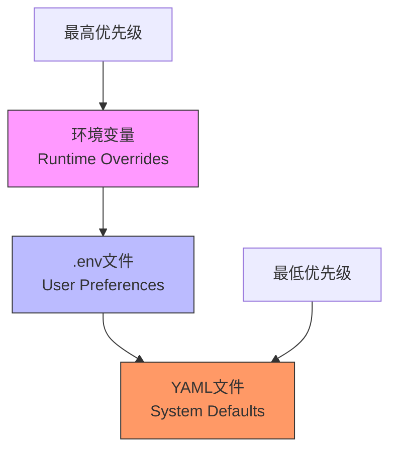
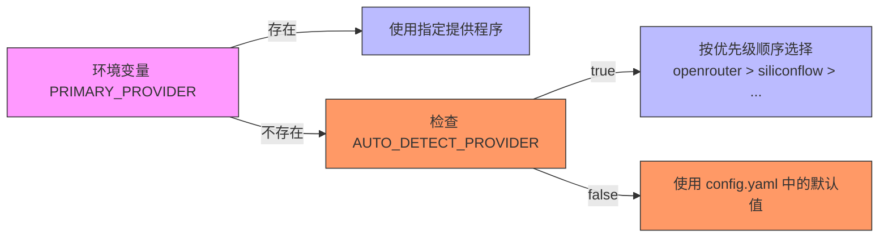
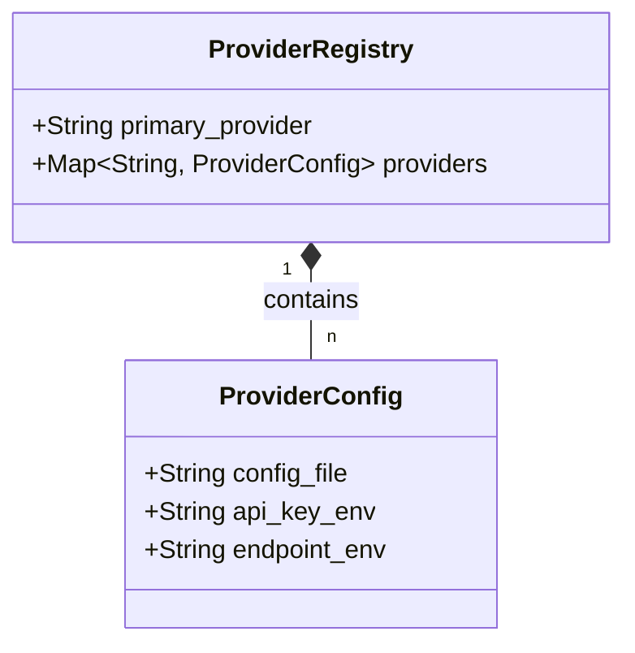
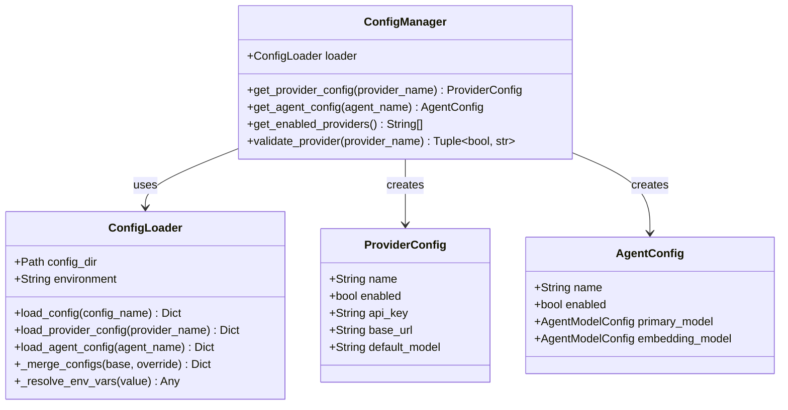

# 全局配置

<cite>
**本文档引用的文件**  
- [config.yaml](file://python/configs/config.yaml)
- [constants.py](file://python/valuecell/config/constants.py)
- [loader.py](file://python/valuecell/config/loader.py)
- [manager.py](file://python/valuecell/config/manager.py)
- [openrouter.yaml](file://python/configs/providers/openrouter.yaml)
- [research_agent.yaml](file://python/configs/agents/research_agent.yaml)
- [super_agent.yaml](file://python/configs/agents/super_agent.yaml)
- [.env.example](file://.env.example)
</cite>

## 目录
1. [配置系统概述](#配置系统概述)
2. [配置优先级与加载机制](#配置优先级与加载机制)
3. [核心配置结构解析](#核心配置结构解析)
4. [primary_provider配置详解](#primary_provider配置详解)
5. [models.defaults全局默认参数](#models.defaults全局默认参数)
6. [providers注册表配置](#providers注册表配置)
7. [agents注册表配置](#agents注册表配置)
8. [环境变量作用机制](#环境变量作用机制)
9. [完整config.yaml示例](#完整config.yaml示例)
10. [不同环境下的配置差异](#不同环境下的配置差异)
11. [配置系统底层实现](#配置系统底层实现)

## 配置系统概述

ValueCell的配置系统采用三层覆盖机制，确保系统具有高度的灵活性和可定制性。该系统通过YAML文件定义系统级默认值、提供程序能力和模型注册表，通过.env文件允许用户设置API密钥和个人偏好，通过环境变量实现运行时覆盖，特别适用于部署和CI/CD场景。这种设计哲学使得开发者可以预配置最优设置，用户可以轻松配置个人偏好，而运维人员可以在不修改代码的情况下进行动态调整。

**Section sources**
- [config.yaml](file://python/configs/config.yaml#L1-L65)
- [loader.py](file://python/valuecell/config/loader.py#L4-L25)

## 配置优先级与加载机制

配置系统的优先级从高到低依次为：环境变量、.env文件、YAML文件。环境变量具有最高优先级，用于运行时覆盖；.env文件用于用户级配置，如API密钥；YAML文件包含系统默认值，是最低优先级的配置源。配置加载器会自动合并这三个层级的配置，其中环境变量的值会覆盖.env文件中的值，而这两者又会覆盖YAML文件中的默认值。这种机制确保了配置的灵活性和安全性，允许在不同环境中进行精细化控制。



**Diagram sources**
- [loader.py](file://python/valuecell/config/loader.py#L4-L7)
- [config.yaml](file://python/configs/config.yaml#L4-L7)

**Section sources**
- [loader.py](file://python/valuecell/config/loader.py#L4-L7)
- [config.yaml](file://python/configs/config.yaml#L4-L7)

## 核心配置结构解析

核心配置文件`config.yaml`主要包含两个顶级部分：`models`和`agents`。`models`部分定义了模型提供程序的配置，包括主提供程序、全局默认参数和提供程序注册表。`agents`部分则定义了各个智能代理的配置，通过`config_file`字段指向具体的代理配置文件。这种模块化设计使得配置文件保持简洁，同时允许复杂的配置细节分散到专门的文件中，提高了可维护性和可读性。

**Section sources**
- [config.yaml](file://python/configs/config.yaml#L10-L65)

## primary_provider配置详解

`primary_provider`配置项指定了系统默认使用的模型提供程序，其默认值为"openrouter"。该配置可以通过环境变量`PRIMARY_PROVIDER`进行覆盖，实现运行时动态切换。如果未设置环境变量，系统会根据可用的API密钥自动检测并选择一个启用的提供程序。自动选择的优先级顺序为：openrouter、siliconflow、google、openai、openai-compatible、azure。这一机制确保了即使在缺少显式配置的情况下，系统也能选择一个可用的提供程序，提高了系统的健壮性和用户体验。



**Diagram sources**
- [manager.py](file://python/valuecell/config/manager.py#L113-L159)
- [config.yaml](file://python/configs/config.yaml#L13)

**Section sources**
- [manager.py](file://python/valuecell/config/manager.py#L113-L159)
- [config.yaml](file://python/configs/config.yaml#L13)

## models.defaults全局默认参数

`models.defaults`部分定义了所有模型的全局默认参数，这些参数会被各个组件继承。虽然在示例配置中该部分被注释掉了，但它可以包含如`temperature`、`max_tokens`等通用参数。当特定代理或模型未指定这些参数时，系统会自动使用这里的默认值。这种设计遵循了"约定优于配置"的原则，减少了重复配置的工作量，同时确保了系统行为的一致性。全局默认参数可以通过环境变量进行覆盖，为用户提供了一种简单的方式来调整整个系统的AI行为。

**Section sources**
- [config.yaml](file://python/configs/config.yaml#L16-L19)
- [manager.py](file://python/valuecell/config/manager.py#L309-L311)

## providers注册表配置

providers注册表在`config.yaml`中定义了所有可用的模型提供程序及其对应的配置文件和API密钥环境变量。每个提供程序都有一个`config_file`字段，指向其具体的配置文件（如`providers/openrouter.yaml`），以及一个`api_key_env`字段，指定用于存储API密钥的环境变量名称。这种注册表模式实现了配置的解耦，使得添加新的提供程序变得非常简单，只需添加一个新的YAML配置文件并在注册表中注册即可，无需修改核心代码。



**Diagram sources**
- [config.yaml](file://python/configs/config.yaml#L20-L53)
- [openrouter.yaml](file://python/configs/providers/openrouter.yaml#L1-L65)

**Section sources**
- [config.yaml](file://python/configs/config.yaml#L20-L53)

## agents注册表配置

agents注册表在`config.yaml`中定义了所有可用的智能代理及其对应的配置文件。每个代理都有一个`config_file`字段，指向其具体的配置文件（如`agents/research_agent.yaml`）。代理配置文件包含了代理的名称、启用状态、模型配置、API密钥需求和能力声明等详细信息。这种设计使得每个代理的配置都是独立和模块化的，便于维护和扩展。通过注册表，系统可以轻松地发现和加载所有可用的代理，而无需硬编码代理列表。

**Section sources**
- [config.yaml](file://python/configs/config.yaml#L55-L64)
- [research_agent.yaml](file://python/configs/agents/research_agent.yaml#L1-L48)

## 环境变量作用机制

环境变量在配置系统中扮演着至关重要的角色，主要用于运行时覆盖和动态配置。关键的环境变量包括`APP_ENVIRONMENT`，用于指定当前运行环境（如development/production），以及`API_PORT`，用于指定服务监听的端口。此外，`PRIMARY_PROVIDER`、`FALLBACK_PROVIDERS`等环境变量允许用户在不修改配置文件的情况下切换AI提供程序。系统还支持复杂的环境变量引用语法，如`${VAR_NAME:default_value}`，这使得配置值可以基于环境变量动态生成，极大地增强了配置的灵活性。

**Section sources**
- [loader.py](file://python/valuecell/config/loader.py#L60)
- [env.py](file://python/valuecell/utils/env.py#L55-L61)

## 完整config.yaml示例

以下是一个完整的`config.yaml`配置文件示例，展示了所有主要配置项的结构和用法。该文件定义了主模型提供程序为openrouter，列出了所有支持的提供程序及其配置文件和API密钥环境变量，并注册了三个核心智能代理：超级代理、研究代理和自动交易代理。注释部分展示了如何配置全局默认参数，为用户提供了一个清晰的配置模板。

```yaml
# ============================================
# ValueCell Configuration System
# ============================================
# Configuration Priority (highest to lowest):
# 1. Environment Variables (highest priority)
# 2. .env file 
# 3. YAML files (lowest priority, system defaults)
# ============================================

# Model Provider Configuration
models:
  # Primary provider
  primary_provider: "openrouter"
  
  # Global default settings
  defaults:
    # temperature: 0.7
    # max_tokens: 4096
  
  # Provider registry
  providers:
    openrouter:
      config_file: "providers/openrouter.yaml"
      api_key_env: "OPENROUTER_API_KEY"
    
    siliconflow:
      config_file: "providers/siliconflow.yaml"
      api_key_env: "SILICONFLOW_API_KEY"
    
    google:
      config_file: "providers/google.yaml"
      api_key_env: "GOOGLE_API_KEY"
    
    openai:
      config_file: "providers/openai.yaml"
      api_key_env: "OPENAI_API_KEY"
    
    openai-compatible:
      config_file: "providers/openai-compatible.yaml"
      api_key_env: "OPENAI_COMPATIBLE_API_KEY"
    
    azure:
      config_file: "providers/azure.yaml"
      api_key_env: "AZURE_OPENAI_API_KEY"
      endpoint_env: "AZURE_OPENAI_ENDPOINT"
    deepseek:
      config_file: "providers/deepseek.yaml"
      api_key_env: "DEEPSEEK_API_KEY"
    
    dashscope:
      config_file: "providers/dashscope.yaml"
      api_key_env: "DASHSCOPE_API_KEY"

# Agent Configuration
agents:
  super_agent:
    config_file: "agents/super_agent.yaml"
  
  research_agent:
    config_file: "agents/research_agent.yaml"
  
  auto_trading_agent:
    config_file: "agents/auto_trading_agent.yaml"
```

**Section sources**
- [config.yaml](file://python/configs/config.yaml#L1-L65)

## 不同环境下的配置差异

系统支持基于环境的配置覆盖，通过`APP_ENVIRONMENT`环境变量指定当前环境（默认为development）。配置加载器会优先加载`config.{environment}.yaml`文件，如果存在的话，然后将其与基础的`config.yaml`文件合并。这种机制允许为不同环境（如开发、测试、生产）定义特定的配置，例如在生产环境中使用更稳定的模型，在开发环境中启用调试模式。尽管在当前代码库中未找到具体的环境特定配置文件，但这一机制为未来的环境差异化配置提供了坚实的基础。

**Section sources**
- [loader.py](file://python/valuecell/config/loader.py#L237-L242)

## 配置系统底层实现

配置系统的底层实现主要由`loader.py`和`manager.py`两个模块构成。`ConfigLoader`类负责加载和合并来自YAML文件、.env文件和环境变量的配置，实现了三层覆盖机制。它提供了`load_config`、`load_provider_config`和`load_agent_config`等方法，用于加载不同类型的配置。`ConfigManager`类则在此基础上提供了更高层次的接口，如`get_provider_config`和`get_agent_config`，并实现了API密钥验证、提供程序能力检查等高级功能。`constants.py`文件定义了项目常量，如支持的语言、时区映射和默认货币符号，为整个系统提供了统一的常量管理。



**Diagram sources**
- [loader.py](file://python/valuecell/config/loader.py#L38-L506)
- [manager.py](file://python/valuecell/config/manager.py#L78-L465)
- [constants.py](file://python/valuecell/config/constants.py#L1-L95)

**Section sources**
- [loader.py](file://python/valuecell/config/loader.py#L38-L506)
- [manager.py](file://python/valuecell/config/manager.py#L78-L465)
- [constants.py](file://python/valuecell/config/constants.py#L1-L95)