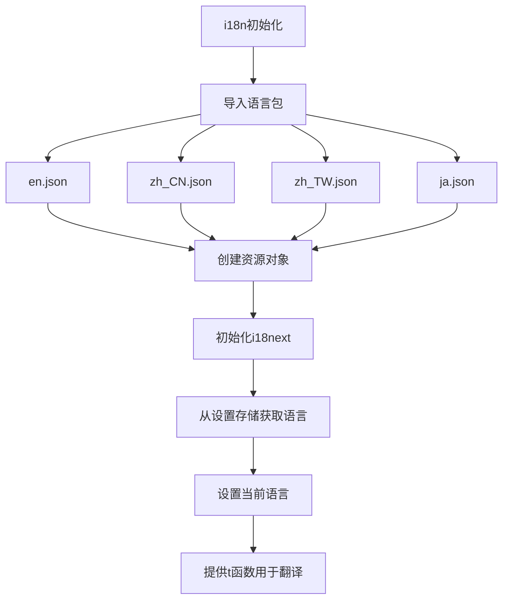
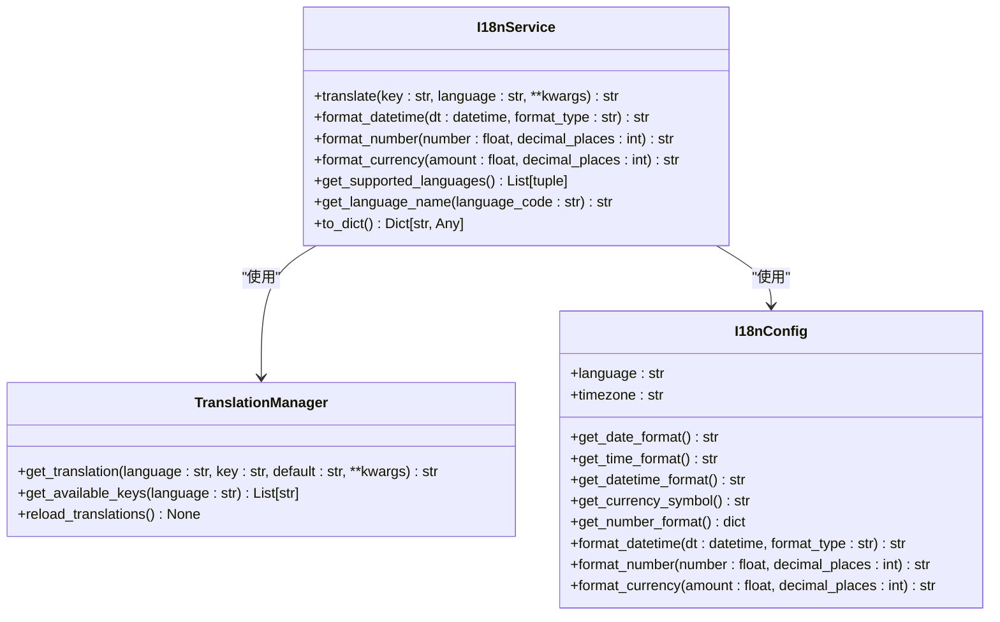
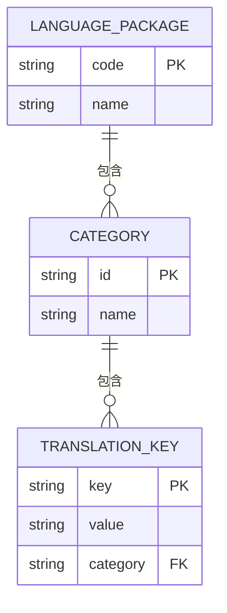
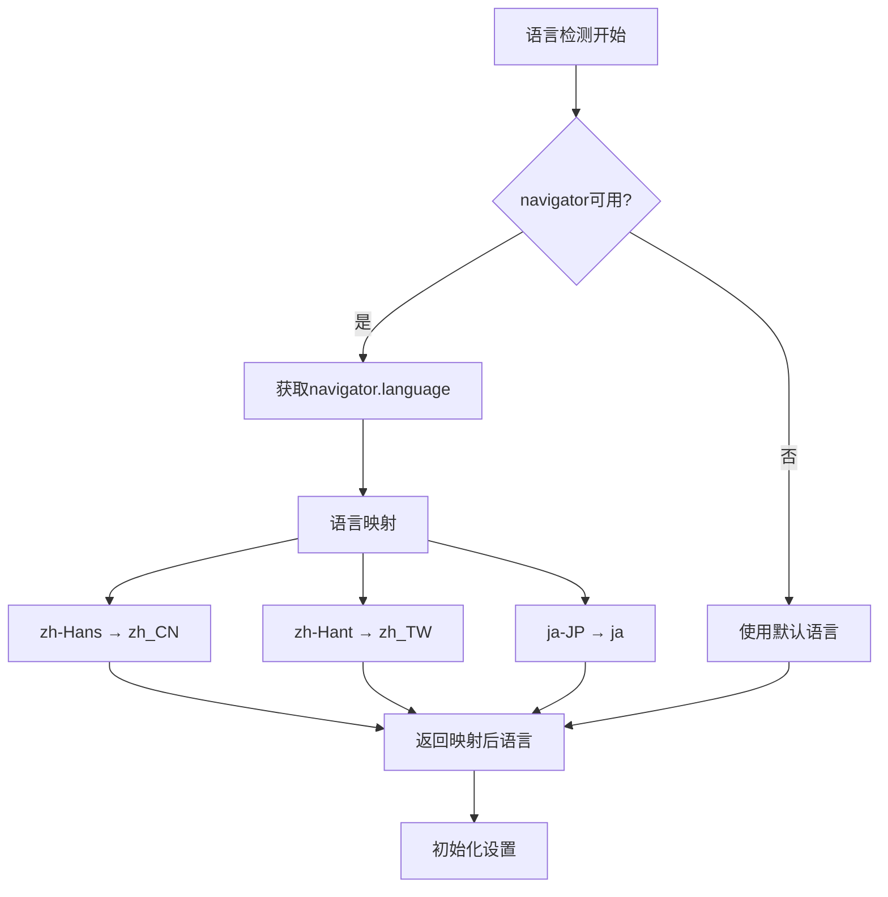
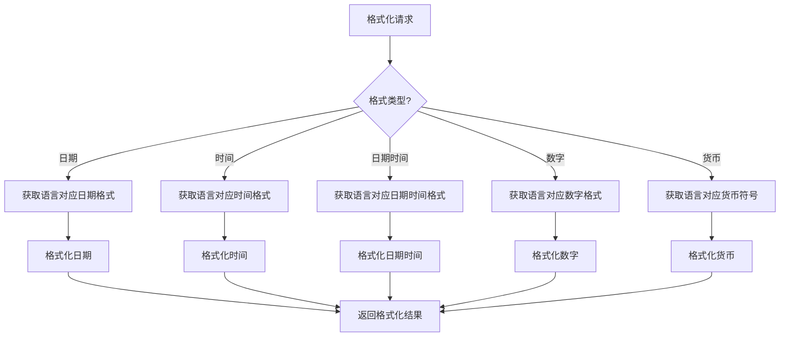
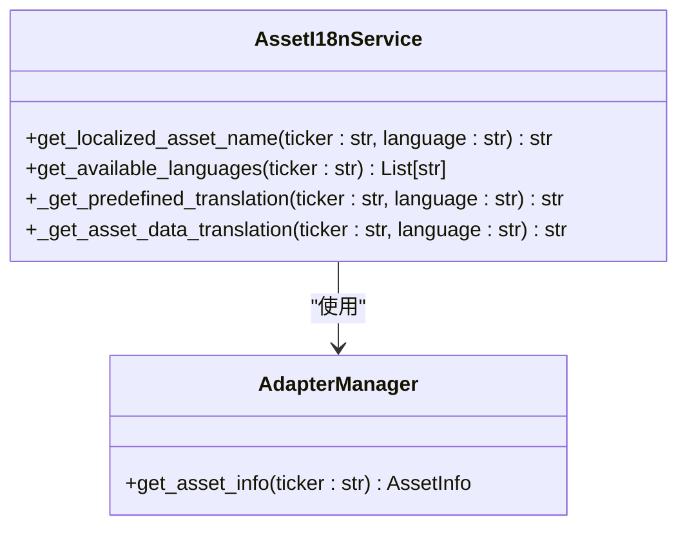
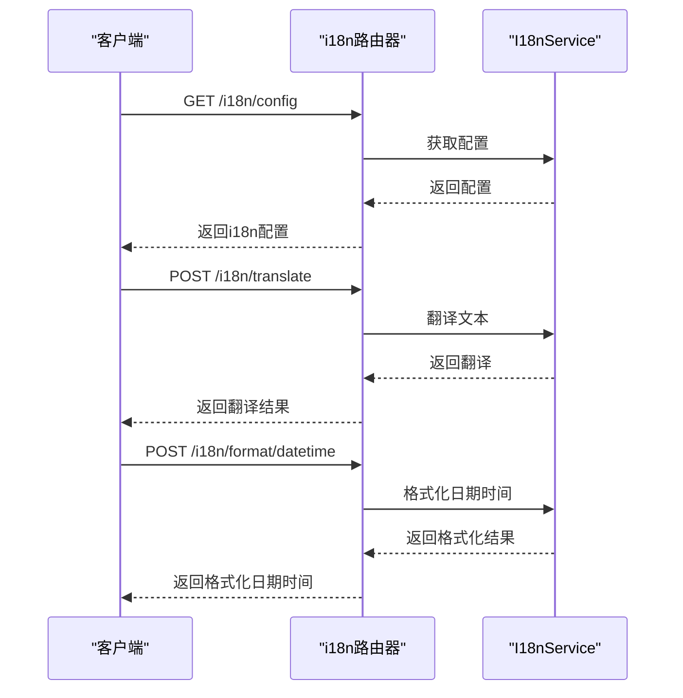
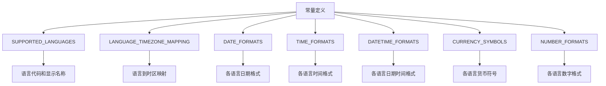
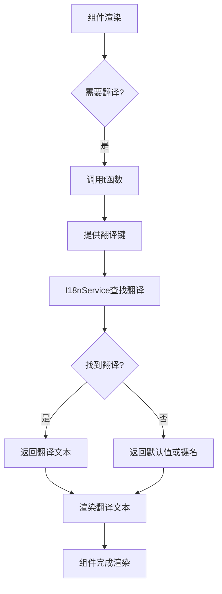

# 国际化支持

<cite>
**本文档中引用的文件**  
- [i18n/index.ts](file://frontend/src/i18n/index.ts)
- [i18n/locales/en.json](file://frontend/src/i18n/locales/en.json)
- [i18n/locales/zh_CN.json](file://frontend/src/i18n/locales/zh_CN.json)
- [i18n/locales/ja.json](file://frontend/src/i18n/locales/ja.json)
- [i18n/locales/zh_TW.json](file://frontend/src/i18n/locales/zh_TW.json)
- [settings-store.ts](file://frontend/src/store/settings-store.ts)
- [general.tsx](file://frontend/src/app/setting/general.tsx)
- [common-agent-area.tsx](file://frontend/src/app/agent/components/agent-view/common-agent-area.tsx)
- [create-strategy-modal.tsx](file://frontend/src/app/agent/components/strategy-items/modals/create-strategy-modal.tsx)
- [i18n.py](file://python/valuecell/server/api/routers/i18n.py)
- [i18n_service.py](file://python/valuecell/server/services/i18n_service.py)
- [i18n_utils.py](file://python/valuecell/utils/i18n_utils.py)
- [i18n.py](file://python/valuecell/server/config/i18n.py)
- [constants.py](file://python/valuecell/config/constants.py)
- [i18n_integration.py](file://python/valuecell/adapters/assets/i18n_integration.py)
</cite>

## 目录
1. [简介](#简介)
2. [前端国际化实现](#前端国际化实现)
3. [后端国际化服务](#后端国际化服务)
4. [语言包结构与内容](#语言包结构与内容)
5. [语言检测与自动设置](#语言检测与自动设置)
6. [日期时间与数字格式化](#日期时间与数字格式化)
7. [资产名称本地化](#资产名称本地化)
8. [API接口设计](#api接口设计)
9. [配置与常量定义](#配置与常量定义)
10. [实际使用示例](#实际使用示例)

## 简介
ValueCell平台实现了完整的国际化（i18n）支持，为全球用户提供多语言界面和本地化体验。系统支持英语、简体中文、繁体中文和日语四种语言，并根据用户语言偏好自动调整日期时间格式、数字格式、货币符号等本地化设置。国际化功能贯穿前端用户界面和后端服务，确保整个应用的一致性。

**Section sources**
- [i18n/index.ts](file://frontend/src/i18n/index.ts)
- [i18n_service.py](file://python/valuecell/server/services/i18n_service.py)

## 前端国际化实现
前端使用i18next作为国际化框架，通过模块化的方式管理多语言资源。系统在`frontend/src/i18n/index.ts`中初始化i18next，加载所有支持语言的翻译文件，并与React应用集成。



**Diagram sources**
- [i18n/index.ts](file://frontend/src/i18n/index.ts)

**Section sources**
- [i18n/index.ts](file://frontend/src/i18n/index.ts)

## 后端国际化服务
后端通过`I18nService`类提供完整的国际化服务，包括文本翻译、日期时间格式化、数字格式化和货币格式化等功能。服务使用单例模式，确保在整个应用中的一致性。



**Diagram sources**
- [i18n_service.py](file://python/valuecell/server/services/i18n_service.py)
- [i18n.py](file://python/valuecell/server/config/i18n.py)

**Section sources**
- [i18n_service.py](file://python/valuecell/server/services/i18n_service.py)

## 语言包结构与内容
系统在`frontend/src/i18n/locales/`目录下存放所有语言的JSON文件，每个文件包含完整的翻译键值对。支持的语言包括：

- `en.json`: 英语
- `zh_CN.json`: 简体中文
- `zh_TW.json`: 繁体中文
- `ja.json`: 日语

语言包采用分层结构，按功能模块组织翻译内容，如`general`、`auth`、`settings`、`strategy`等。每个翻译键支持变量插值，如`"welcome": "Welcome to {{name}}!"`。



**Diagram sources**
- [i18n/locales/en.json](file://frontend/src/i18n/locales/en.json)
- [i18n/locales/zh_CN.json](file://frontend/src/i18n/locales/zh_CN.json)
- [i18n/locales/ja.json](file://frontend/src/i18n/locales/ja.json)
- [i18n/locales/zh_TW.json](file://frontend/src/i18n/locales/zh_TW.json)

**Section sources**
- [i18n/locales/en.json](file://frontend/src/i18n/locales/en.json)

## 语言检测与自动设置
系统通过多种方式检测和设置用户语言偏好。前端在`settings-store.ts`中实现语言设置逻辑，根据浏览器语言自动选择合适的语言代码。



**Diagram sources**
- [settings-store.ts](file://frontend/src/store/settings-store.ts)

**Section sources**
- [settings-store.ts](file://frontend/src/store/settings-store.ts)

## 日期时间与数字格式化
系统根据用户语言偏好自动调整日期时间、数字和货币的显示格式。这些格式化规则在`config/constants.py`中定义，并通过`I18nConfig`类提供访问。



**Diagram sources**
- [i18n.py](file://python/valuecell/server/config/i18n.py)
- [constants.py](file://python/valuecell/config/constants.py)

**Section sources**
- [i18n.py](file://python/valuecell/server/config/i18n.py)

## 资产名称本地化
系统通过`AssetI18nService`提供资产名称的本地化支持，允许根据用户语言偏好显示资产的本地化名称。服务支持从多个数据源获取资产名称翻译。



**Diagram sources**
- [i18n_integration.py](file://python/valuecell/adapters/assets/i18n_integration.py)

**Section sources**
- [i18n_integration.py](file://python/valuecell/adapters/assets/i18n_integration.py)

## API接口设计
后端通过FastAPI提供RESTful风格的国际化API，支持获取配置、翻译文本、格式化数据等功能。API路由在`i18n.py`中定义。



**Diagram sources**
- [i18n.py](file://python/valuecell/server/api/routers/i18n.py)

**Section sources**
- [i18n.py](file://python/valuecell/server/api/routers/i18n.py)

## 配置与常量定义
国际化相关的常量和配置在`config/constants.py`中集中定义，包括支持的语言列表、语言到时区的映射、日期时间格式、货币符号等。



**Diagram sources**
- [constants.py](file://python/valuecell/config/constants.py)

**Section sources**
- [constants.py](file://python/valuecell/config/constants.py)

## 实际使用示例
在前端组件中，通过`useTranslation`钩子或直接导入`t`函数来使用国际化功能。以下是一些实际使用示例：



在`general.tsx`中，语言选择器使用翻译键显示界面文本：

```typescript
<FieldTitle className="font-medium text-base">
  {t("general.language.title")}
</FieldTitle>
<FieldDescription>
  {t("general.language.description")}
</FieldDescription>
```

在`common-agent-area.tsx`中，欢迎消息使用变量插值：

```typescript
<ChatWelcomeScreen
  title={t("agent.welcome", { name: agent.display_name })}
/>
```

在`create-strategy-modal.tsx`中，步骤指示器使用翻译键：

```typescript
const STEPS = [
  { step: 1, title: t("strategy.create.steps.aiModels") },
  { step: 2, title: t("strategy.create.steps.exchanges") },
  { step: 3, title: t("strategy.create.steps.tradingStrategy") },
];
```

**Section sources**
- [general.tsx](file://frontend/src/app/setting/general.tsx)
- [common-agent-area.tsx](file://frontend/src/app/agent/components/agent-view/common-agent-area.tsx)
- [create-strategy-modal.tsx](file://frontend/src/app/agent/components/strategy-items/modals/create-strategy-modal.tsx)