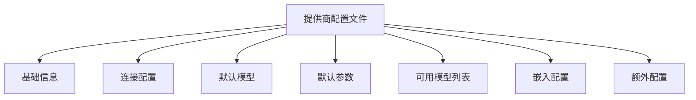
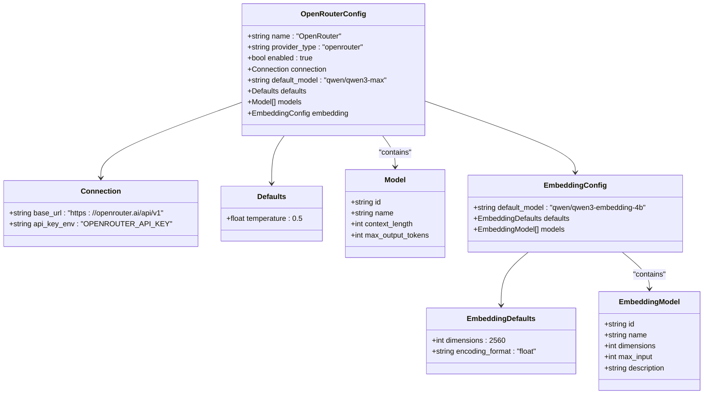
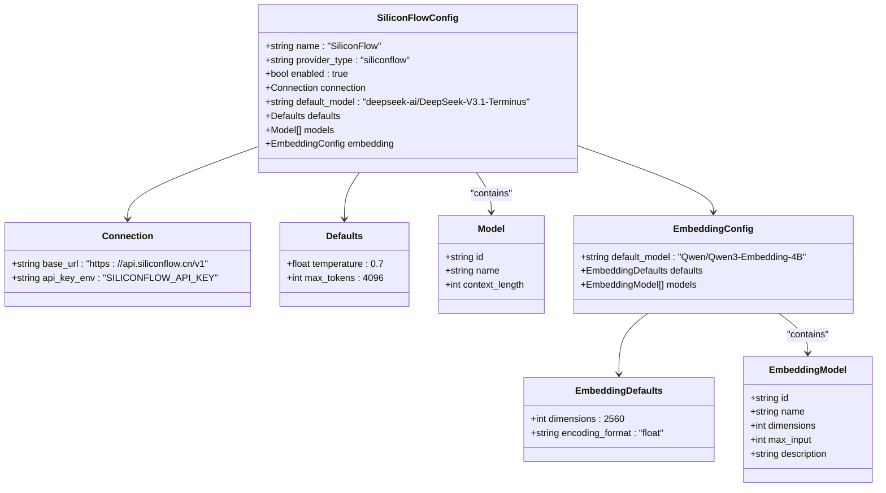
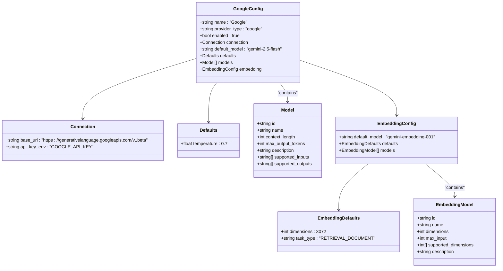
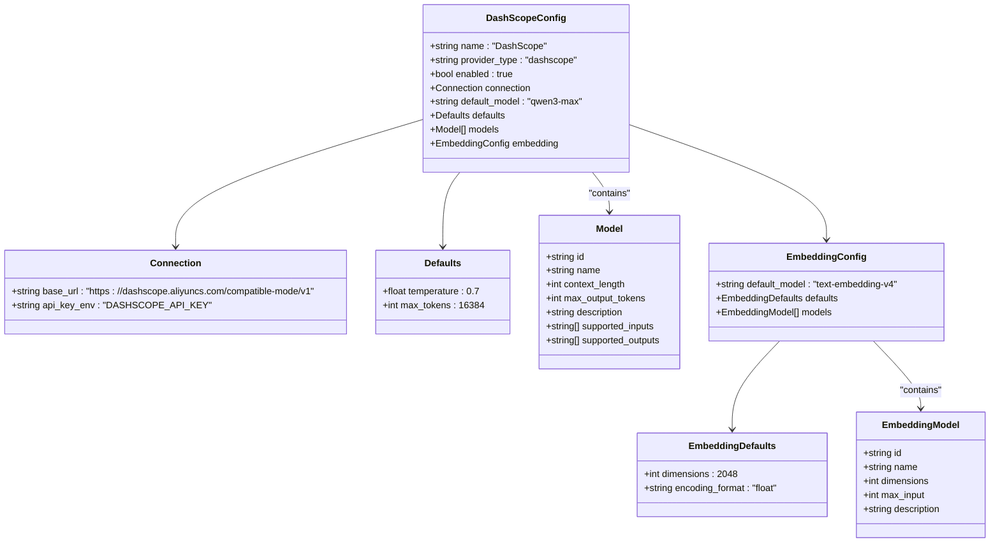

# 提供商配置

<cite>
**本文档中引用的文件**  
- [.env.example](file://.env.example)
- [python/configs/providers/openrouter.yaml](file://python/configs/providers/openrouter.yaml)
- [python/configs/providers/siliconflow.yaml](file://python/configs/providers/siliconflow.yaml)
- [python/configs/providers/google.yaml](file://python/configs/providers/google.yaml)
- [python/configs/providers/dashscope.yaml](file://python/configs/providers/dashscope.yaml)
- [python/valuecell/config/loader.py](file://python/valuecell/config/loader.py)
- [python/valuecell/config/manager.py](file://python/valuecell/config/manager.py)
- [docs/CONFIGURATION_GUIDE.md](file://docs/CONFIGURATION_GUIDE.md)
</cite>

## 目录
1. [配置系统概述](#配置系统概述)
2. [提供商配置文件结构](#提供商配置文件结构)
3. [环境变量与API密钥设置](#环境变量与api密钥设置)
4. [各提供商配置详解](#各提供商配置详解)
5. [提供商自动检测与回退机制](#提供商自动检测与回退机制)
6. [配置最佳实践](#配置最佳实践)

## 配置系统概述

ValueCell项目采用三层配置系统，确保从开发到生产的灵活部署。配置解析优先级从高到低如下：

1. **环境变量** - 运行时覆盖（例如 `OPENROUTER_API_KEY`）
2. **.env 文件** - 用户级配置（位于项目根目录）
3. **YAML 文件** - 系统默认值（位于 `python/configs/`）

这种分层结构允许用户在不修改代码的情况下设置提供商凭据，并通过环境变量在运行时进行覆盖，同时在YAML文件中维护合理的默认值。

**Section sources**
- [docs/CONFIGURATION_GUIDE.md](file://docs/CONFIGURATION_GUIDE.md#L5-L16)

## 提供商配置文件结构

每个提供商都有一个独立的YAML配置文件，位于 `configs/providers/` 目录下。配置文件包含以下主要部分：

- **基础信息**：提供商名称、类型和启用状态
- **连接配置**：API基础URL和API密钥环境变量映射
- **默认模型**：未指定模型时使用的默认模型
- **默认参数**：所有来自该提供商的模型的默认参数
- **可用模型列表**：该提供商支持的模型及其元数据
- **嵌入配置**：嵌入模型的默认设置和可用模型列表
- **额外配置**：提供商特定的配置，如额外的HTTP头



**Diagram sources**
- [docs/CONFIGURATION_GUIDE.md](file://docs/CONFIGURATION_GUIDE.md#L217-L267)

## 环境变量与API密钥设置

API密钥通过环境变量进行管理，确保安全性并避免将敏感信息提交到版本控制中。用户需要在 `.env` 文件中设置相应的API密钥，这些密钥通过YAML配置文件中的 `api_key_env` 字段与提供商配置关联。

### .env文件配置

用户应复制 `.env.example` 文件并添加自己的API密钥：

```bash
# 复制示例文件
cp .env.example .env

# 编辑.env文件并添加凭据
```

**Section sources**
- [docs/CONFIGURATION_GUIDE.md](file://docs/CONFIGURATION_GUIDE.md#L32-L48)
- [.env.example](file://.env.example#L1-L68)

## 各提供商配置详解

### OpenRouter 配置

OpenRouter是一个第三方代理，支持多种模型。其配置文件 `openrouter.yaml` 包含以下关键设置：

- **连接配置**：基础URL为 `https://openrouter.ai/api/v1`，API密钥环境变量为 `OPENROUTER_API_KEY`
- **默认模型**：`qwen/qwen3-max`
- **默认参数**：温度为0.5
- **可用模型**：包括Claude Haiku 4.5、Grok 4、Qwen3 Max等
- **嵌入模型**：支持 `qwen/qwen3-embedding-4b` 嵌入模型



**Diagram sources**
- [python/configs/providers/openrouter.yaml](file://python/configs/providers/openrouter.yaml#L1-L65)

### SiliconFlow 配置

SiliconFlow提供商配置位于 `siliconflow.yaml`，主要特点包括：

- **连接配置**：基础URL为 `https://api.siliconflow.cn/v1`（中国国内服务器），API密钥环境变量为 `SILICONFLOW_API_KEY`
- **默认模型**：`deepseek-ai/DeepSeek-V3.1-Terminus`
- **默认参数**：温度为0.7，最大令牌数为4096
- **可用模型**：包括DeepSeek V3.1 Terminus、Qwen 3.235B A22B Thinking 2507等
- **嵌入模型**：支持 `Qwen/Qwen3-Embedding-4B` 和 `BAAI/bge-m3` 嵌入模型



**Diagram sources**
- [python/configs/providers/siliconflow.yaml](file://python/configs/providers/siliconflow.yaml#L1-L71)

### Google 配置

Google提供商配置位于 `google.yaml`，关键配置如下：

- **连接配置**：基础URL为 `https://generativelanguage.googleapis.com/v1beta`，API密钥环境变量为 `GOOGLE_API_KEY`
- **默认模型**：`gemini-2.5-flash`
- **默认参数**：温度为0.7
- **可用模型**：包括Gemini 2.5 Flash和Gemini 2.5 Pro，支持文本、图像、视频和音频输入
- **嵌入模型**：支持 `gemini-embedding-001` 嵌入模型，维度可调（128-3072）



**Diagram sources**
- [python/configs/providers/google.yaml](file://python/configs/providers/google.yaml#L1-L60)

### DashScope 配置

DashScope（阿里云百炼）提供商配置位于 `dashscope.yaml`，主要特点：

- **连接配置**：基础URL为 `https://dashscope.aliyuncs.com/compatible-mode/v1`，API密钥环境变量为 `DASHSCOPE_API_KEY`
- **默认模型**：`qwen3-max`
- **默认参数**：温度为0.7，最大令牌数为16384
- **可用模型**：包括Qwen3 Max、Qwen3 Max Preview、Qwen Plus和Qwen Flash
- **嵌入模型**：支持 `text-embedding-v4` 和 `text-embedding-v3` 嵌入模型



**Diagram sources**
- [python/configs/providers/dashscope.yaml](file://python/configs/providers/dashscope.yaml#L1-L85)

## 提供商自动检测与回退机制

### 自动检测

ValueCell根据可用的API密钥自动选择主要提供商。选择优先级顺序如下（当多个提供商都有API密钥时）：

1. OpenRouter
2. SiliconFlow
3. Google
4. OpenAI
5. OpenAI-Compatible
6. Azure
7. 其他配置的提供商（包括DashScope、DeepSeek等）

用户可以通过设置 `PRIMARY_PROVIDER` 环境变量来覆盖此行为，或通过设置 `AUTO_DETECT_PROVIDER=false` 来禁用自动检测。

**Section sources**
- [docs/CONFIGURATION_GUIDE.md](file://docs/CONFIGURATION_GUIDE.md#L319-L347)
- [python/valuecell/config/manager.py](file://python/valuecell/config/manager.py#L104-L159)

### 回退机制

如果主要提供商失败，ValueCell会自动尝试回退提供商。回退链（从启用的提供商中自动填充）包括：

- 所有具有有效API密钥的提供商，除了主要提供商
- 在第一个成功创建模型时停止

用户可以通过设置 `FALLBACK_PROVIDERS` 环境变量来覆盖回退提供商，或在代理YAML中设置 `use_fallback: false` 来禁用回退。

### 提供商特定模型映射

使用回退时，代理可以为每个提供商指定要使用的模型：

```yaml
# 在代理配置中
models:
  primary:
    model_id: "anthropic/claude-haiku-4.5"
    provider: "openrouter"
    
    # 如果OpenRouter失败，为回退提供商使用这些模型
    provider_models:
      siliconflow: "zai-org/GLM-4.6"      # 类似能力
      google: "gemini-2.5-flash"          # 快速高效
```

当发生回退时：
1. 尝试使用 `anthropic/claude-haiku-4.5` 的OpenRouter
2. 如果失败，尝试使用 `zai-org/GLM-4.6` 的SiliconFlow
3. 如果失败，尝试使用 `gemini-2.5-flash` 的Google

**Section sources**
- [docs/CONFIGURATION_GUIDE.md](file://docs/CONFIGURATION_GUIDE.md#L349-L391)

## 配置最佳实践

1. **在.env中设置API密钥**
   - 切勿将API密钥提交到版本控制中
   - 使用 `.gitignore` 排除 `.env`
   - 在CI/CD中使用环境变量

2. **使用提供商回退**
   - 配置多个提供商以提高可靠性
   - 在代理中指定 `provider_models` 以实现一致的回退
   - 在部署前测试回退行为

3. **监控配置**
   - 记录配置选择决策
   - 在启动时验证配置
   - 在生产环境中缺少API密钥时发出警报

4. **版本化配置**
   - 将代理配置保留在版本控制中
   - 记录选择特定模型的原因
   - 在代码审查中审查配置更改

5. **优化成本**
   - 对简单任务使用更便宜的模型
   - 对实时应用使用更快的模型
   - 监控API使用情况并设置支出限制

**Section sources**
- [docs/CONFIGURATION_GUIDE.md](file://docs/CONFIGURATION_GUIDE.md#L597-L620)