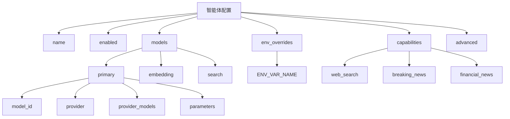
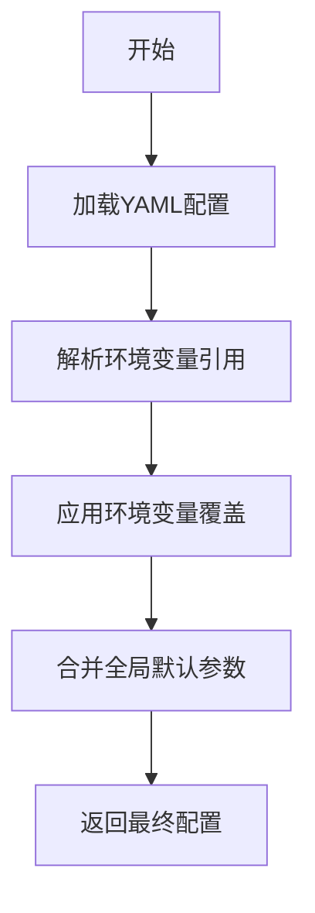

# 智能体配置

<cite>
**本文档引用的文件**  
- [research_agent.yaml](file://python/configs/agents/research_agent.yaml)
- [super_agent.yaml](file://python/configs/agents/super_agent.yaml)
- [news_agent.yaml](file://python/configs/agents/news_agent.yaml)
- [openrouter.yaml](file://python/configs/providers/openrouter.yaml)
- [loader.py](file://python/valuecell/config/loader.py)
- [manager.py](file://python/valuecell/config/manager.py)
- [model.py](file://python/valuecell/utils/model.py)
</cite>

## 目录
1. [简介](#简介)
2. [智能体配置结构](#智能体配置结构)
3. [核心配置项详解](#核心配置项详解)
4. [主模型与备用模型配置](#主模型与备用模型配置)
5. [环境变量覆盖机制](#环境变量覆盖机制)
6. [实际配置示例](#实际配置示例)
7. [配置协同工作原理](#配置协同工作原理)
8. [配置验证与调试](#配置验证与调试)

## 简介
智能体配置系统采用三层覆盖机制，允许开发者、用户和运维人员在不同层级上配置智能体行为。该系统支持通过YAML文件定义默认配置，通过.env文件设置用户偏好，并通过环境变量在运行时进行动态覆盖。这种设计使得智能体既具有良好的默认行为，又具备高度的可定制性和灵活性。

**智能体配置优先级（从高到低）：**
1. 环境变量（运行时覆盖）
2. .env文件（用户级配置）
3. YAML文件（系统默认）

**Section sources**
- [loader.py](file://python/valuecell/config/loader.py#L4-L25)

## 智能体配置结构
智能体配置文件采用YAML格式，包含多个关键部分，每个部分都有特定的用途和结构。配置文件位于`python/configs/agents/`目录下，每个智能体都有独立的配置文件。



**Diagram sources**
- [research_agent.yaml](file://python/configs/agents/research_agent.yaml#L1-L48)
- [news_agent.yaml](file://python/configs/agents/news_agent.yaml#L1-L109)
- [super_agent.yaml](file://python/configs/agents/super_agent.yaml#L1-L72)

## 核心配置项详解
智能体配置包含多个核心配置项，每个配置项都有特定的作用和使用场景。

### name
智能体的名称标识，用于在系统中识别和引用该智能体。这个名称通常与配置文件名相对应，但可以设置为更具描述性的名称。

```yaml
name: "Research Agent"
```

**Section sources**
- [research_agent.yaml](file://python/configs/agents/research_agent.yaml#L4)

### enabled
布尔值，用于控制智能体是否启用。当设置为`false`时，该智能体将不会被系统加载和使用。

```yaml
enabled: true
```

**Section sources**
- [research_agent.yaml](file://python/configs/agents/research_agent.yaml#L5)

### models.primary
主模型配置，定义了智能体用于主要推理和生成任务的模型。包含模型ID、提供商、参数和备用模型映射。

```yaml
models:
  primary:
    model_id: "google/gemini-2.5-flash"
    provider: "openrouter"
    parameters:
      temperature: 0.7
      max_tokens: 8192
```

**Section sources**
- [research_agent.yaml](file://python/configs/agents/research_agent.yaml#L11-L21)

### models.embedding
嵌入模型配置，用于知识库的向量化和检索。与主模型独立配置，允许使用专门优化的嵌入模型。

```yaml
models:
  embedding:
    model_id: "Qwen/Qwen3-Embedding-4B"
    provider: "siliconflow"
    parameters:
      dimensions: 2560
```

**Section sources**
- [research_agent.yaml](file://python/configs/agents/research_agent.yaml#L24-L33)

### models.search
搜索模型配置，专门用于实时信息检索任务。在News Agent等需要频繁进行网络搜索的智能体中特别重要。

```yaml
models:
  search:
    model_id: "perplexity/sonar"
    provider: "openrouter"
    parameters:
      max_tokens: 2048
```

**Section sources**
- [news_agent.yaml](file://python/configs/agents/news_agent.yaml#L36-L46)

### parameters
模型参数配置，允许为特定模型设置温度、最大令牌数等参数。这些参数会与全局默认参数合并。

```yaml
parameters:
  temperature: 0.7
  max_tokens: 8192
```

**Section sources**
- [research_agent.yaml](file://python/configs/agents/research_agent.yaml#L19-L21)

### env_overrides
环境变量覆盖映射，定义了哪些环境变量可以覆盖配置中的哪些路径。这是实现运行时动态配置的关键机制。

```yaml
env_overrides:
  RESEARCH_AGENT_MODEL_ID: "models.primary.model_id"
  RESEARCH_AGENT_PROVIDER: "models.primary.provider"
  RESEARCH_AGENT_TEMPERATURE: "models.primary.parameters.temperature"
```

**Section sources**
- [research_agent.yaml](file://python/configs/agents/research_agent.yaml#L36-L47)

## 主模型与备用模型配置
智能体配置系统支持主模型和备用模型的配置，以提高系统的可靠性和灵活性。

### 主模型指定
主模型通过`models.primary`字段指定，必须明确指定模型ID和提供商。系统会优先使用此配置。

```yaml
models:
  primary:
    model_id: "qwen/qwen3-max"
    provider: "openrouter"
```

**Section sources**
- [news_agent.yaml](file://python/configs/agents/news_agent.yaml#L21-L23)

### 备用模型映射
通过`provider_models`字段配置备用模型映射，当主提供商不可用时，系统会自动切换到备用提供商的对应模型。

```yaml
provider_models:
  siliconflow: "Qwen/Qwen3-235B-A22B-Thinking-2507"
  google: "gemini-2.5-flash"
```

这种配置允许智能体在不同提供商之间无缝切换，确保服务的连续性。例如，当OpenRouter服务不可用时，Research Agent可以自动切换到Siliconflow或Google的对应模型。

**Section sources**
- [research_agent.yaml](file://python/configs/agents/research_agent.yaml#L15-L17)

## 环境变量覆盖机制
环境变量覆盖机制是智能体配置系统的核心特性之一，允许在运行时动态修改配置。

### 覆盖优先级
配置系统的优先级从高到低为：
1. 环境变量
2. .env文件
3. YAML配置文件

这意味着环境变量具有最高优先级，可以覆盖其他所有配置。

### 覆盖语法
环境变量覆盖通过`env_overrides`映射实现，格式为`ENV_VAR_NAME: config.path.to.value`。

```yaml
env_overrides:
  NEWS_AGENT_MODEL_ID: "models.primary.model_id"
  NEWS_AGENT_PROVIDER: "models.primary.provider"
```

当设置了`NEWS_AGENT_MODEL_ID`环境变量时，系统会将其值应用到`models.primary.model_id`路径上。

### 类型转换
系统支持环境变量的自动类型转换，包括：
- 字符串到布尔值（"true"/"false"）
- 字符串到整数
- 字符串到浮点数

```python
def _convert_env_value(self, value: str) -> Any:
    # Boolean
    if value.lower() in ("true", "yes", "on", "1"):
        return True
    if value.lower() in ("false", "no", "off", "0"):
        return False
    
    # Integer
    try:
        return int(value)
    except ValueError:
        pass
    
    # Float
    try:
        return float(value)
    except ValueError:
        pass
    
    # String (default)
    return value
```

**Section sources**
- [loader.py](file://python/valuecell/config/loader.py#L175-L204)

## 实际配置示例
以下是几个智能体的实际配置示例，展示了不同场景下的配置方式。

### Research Agent配置
Research Agent配置示例，展示了主模型、嵌入模型和环境变量覆盖的完整配置。

```yaml
name: "Research Agent"
enabled: true

models:
  primary:
    model_id: "google/gemini-2.5-flash"
    provider: "openrouter"
    provider_models:
      siliconflow: "Qwen/Qwen3-235B-A22B-Thinking-2507"
      google: "gemini-2.5-flash"
  
  embedding:
    model_id: "Qwen/Qwen3-Embedding-4B"
    provider: "siliconflow"
    provider_models:
      google: "gemini-embedding-001"
    parameters:
      dimensions: ${EMBEDDER_DIMENSION:2560}

env_overrides:
  RESEARCH_AGENT_MODEL_ID: "models.primary.model_id"
  RESEARCH_AGENT_PROVIDER: "models.primary.provider"
  EMBEDDER_DIMENSION: "models.embedding.parameters.dimensions"
```

**Section sources**
- [research_agent.yaml](file://python/configs/agents/research_agent.yaml#L1-L48)

### News Agent配置
News Agent配置示例，展示了多模型配置（主模型和搜索模型）和能力配置。

```yaml
name: "News Agent"
enabled: true

models:
  primary:
    model_id: "qwen/qwen3-max"
    provider: "openrouter"
    provider_models:
      siliconflow: "Qwen/Qwen3-235B-A22B-Thinking-2507"
      google: "gemini-2.5-flash"
  
  search:
    model_id: "perplexity/sonar"
    provider: "openrouter"
    provider_models:
      google: "gemini-2.5-flash"

env_overrides:
  NEWS_AGENT_MODEL_ID: "models.primary.model_id"
  NEWS_SEARCH_MODEL_ID: "models.search.model_id"

capabilities:
  web_search:
    enabled: true
    provider: "perplexity"
  breaking_news:
    enabled: true
    refresh_interval: 300
```

**Section sources**
- [news_agent.yaml](file://python/configs/agents/news_agent.yaml#L1-L109)

### Super Agent配置
Super Agent配置示例，展示了能力配置和高级设置。

```yaml
name: "Super Agent"
enabled: true

env_overrides:
  SUPER_AGENT_MODEL_ID: "models.primary.model_id"
  SUPER_AGENT_TEMPERATURE: "models.primary.parameters.temperature"

capabilities:
  web_search: true
  web_crawl: true
  session_management:
    enabled: true
    max_history_runs: 5
    enable_summaries: true

advanced:
  debug_mode: false
  markdown: false
  add_datetime_to_context: true
  add_history_to_context: true
```

**Section sources**
- [super_agent.yaml](file://python/configs/agents/super_agent.yaml#L1-L72)

## 配置协同工作原理
智能体配置系统与全局配置和提供商配置协同工作，形成一个完整的配置体系。

### 配置加载流程
配置加载遵循特定的流程，确保正确应用所有覆盖。



**Diagram sources**
- [loader.py](file://python/valuecell/config/loader.py#L206-L250)

### 与全局配置的协同
智能体配置会与全局配置中的默认参数合并，形成最终的模型参数。

```python
# Merge with global defaults
global_models = self._config.get("models") or {}
global_defaults = global_models.get("defaults") or {}
merged_params = {**global_defaults, **parameters}
```

这种机制允许在全局层面设置默认参数（如温度、最大令牌数），同时允许智能体在需要时覆盖这些默认值。

**Section sources**
- [manager.py](file://python/valuecell/config/manager.py#L309-L311)

### 与提供商配置的协同
智能体配置与提供商配置协同工作，确保使用正确的API密钥和端点。

```python
# Get provider config to validate API key
provider_config = self.get_provider_config(provider)
if provider_config:
    api_key_env = provider_config.get("connection", {}).get("api_key_env")
    if api_key_env and not os.getenv(api_key_env):
        errors.append(f"API key not set: {api_key_env}")
```

当智能体指定一个提供商时，系统会自动加载该提供商的配置，验证API密钥是否设置，并使用提供商配置中的连接信息。

**Section sources**
- [loader.py](file://python/valuecell/config/loader.py#L467-L472)

## 配置验证与调试
系统提供了配置验证和调试功能，帮助用户确保配置的正确性。

### 配置验证
系统提供了验证智能体配置完整性的功能，检查必需的API密钥是否设置、模型ID是否有效等。

```python
def validate_agent_config(self, agent_name: str) -> tuple[bool, List[str]]:
    """
    Validate agent configuration
    
    Checks:
    - Required API keys are available
    - Model IDs are valid
    - Provider is configured
    """
```

**Section sources**
- [loader.py](file://python/valuecell/config/loader.py#L432-L482)

### 调试模式
可以通过环境变量启用调试模式，查看配置加载的详细日志。

```python
logger.debug(f"Resolved ${{{var_name}}} -> {resolved}")
logger.debug(f"Applied env override: {env_var}={env_value} -> {config_path}")
```

这些调试日志可以帮助用户理解配置是如何被解析和应用的，对于排查配置问题非常有帮助。

**Section sources**
- [loader.py](file://python/valuecell/config/loader.py#L89-L90)