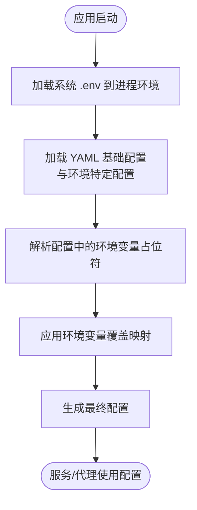
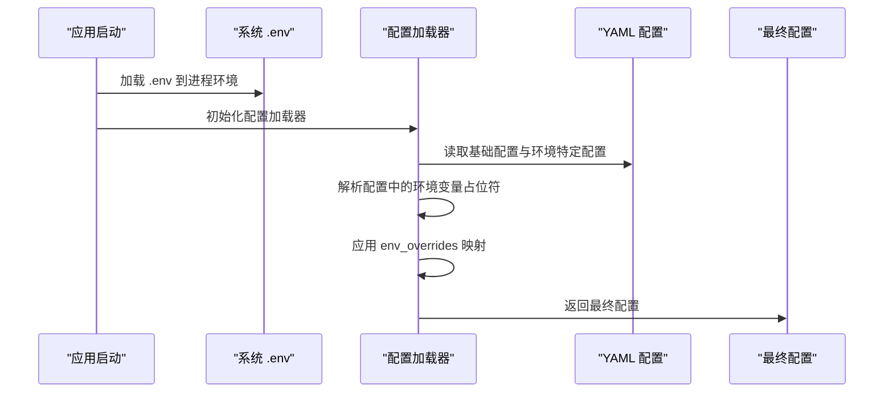

# 环境变量参考

<cite>
**本文引用的文件**
- [.env.example](file://.env.example)
- [frontend/.env.example](file://frontend/.env.example)
- [python/valuecell/server/config/settings.py](file://python/valuecell/server/config/settings.py)
- [python/valuecell/server/api/app.py](file://python/valuecell/server/api/app.py)
- [python/valuecell/utils/env.py](file://python/valuecell/utils/env.py)
- [python/valuecell/config/loader.py](file://python/valuecell/config/loader.py)
- [python/configs/config.yaml](file://python/configs/config.yaml)
- [python/configs/agents/research_agent.yaml](file://python/configs/agents/research_agent.yaml)
- [python/configs/agents/super_agent.yaml](file://python/configs/agents/super_agent.yaml)
- [python/configs/providers/openrouter.yaml](file://python/configs/providers/openrouter.yaml)
- [python/configs/providers/siliconflow.yaml](file://python/configs/providers/siliconflow.yaml)
- [python/configs/providers/google.yaml](file://python/configs/providers/google.yaml)
- [python/configs/providers/openai.yaml](file://python/configs/providers/openai.yaml)
- [docs/CONFIGURATION_GUIDE.md](file://docs/CONFIGURATION_GUIDE.md)
</cite>

## 目录
1. [简介](#简介)
2. [项目结构与配置加载流程](#项目结构与配置加载流程)
3. [环境变量总览与分类](#环境变量总览与分类)
4. [全局配置变量](#全局配置变量)
5. [提供商凭证变量](#提供商凭证变量)
6. [模型配置变量](#模型配置变量)
7. [调试变量](#调试变量)
8. [变量解析与应用流程](#变量解析与应用流程)
9. [最佳实践与故障排查](#最佳实践与故障排查)
10. [结论](#结论)

## 简介
本文件为 ValueCell 系统的环境变量参考，覆盖全局配置、提供商凭证、模型配置与调试相关变量。内容基于仓库中的示例文件与配置系统实现，详细说明每个变量的用途、格式要求、默认值与影响范围，并解释变量在配置系统中的解析与应用顺序。

## 项目结构与配置加载流程
ValueCell 的配置采用“三层优先级”机制：
- 环境变量（最高优先级）
- .env 文件（用户层）
- YAML 配置文件（系统默认）

配置加载顺序与解析要点：
- 应用启动时会加载系统级 .env 文件到进程环境变量。
- 配置加载器从 YAML 基础配置开始，合并环境特定配置，再解析其中的环境变量占位符，最后应用环境变量覆盖。
- 模型与嵌入模型等可通过环境变量进行运行时覆盖。

图表来源
- [python/valuecell/server/api/app.py](file://python/valuecell/server/api/app.py#L57-L89)
- [python/valuecell/config/loader.py](file://python/valuecell/config/loader.py#L206-L251)
- [python/valuecell/config/loader.py](file://python/valuecell/config/loader.py#L252-L368)
- [python/valuecell/config/loader.py](file://python/valuecell/config/loader.py#L67-L101)
- [python/valuecell/config/loader.py](file://python/valuecell/config/loader.py#L130-L174)

章节来源
- [python/valuecell/server/api/app.py](file://python/valuecell/server/api/app.py#L57-L89)
- [python/valuecell/config/loader.py](file://python/valuecell/config/loader.py#L206-L251)
- [python/valuecell/config/loader.py](file://python/valuecell/config/loader.py#L252-L368)
- [python/valuecell/config/loader.py](file://python/valuecell/config/loader.py#L67-L101)
- [python/valuecell/config/loader.py](file://python/valuecell/config/loader.py#L130-L174)

## 环境变量总览与分类
- 全局配置：APP_NAME、APP_VERSION、APP_ENVIRONMENT、API_DEBUG、API_HOST、API_PORT、LANG、TIMEZONE、PYTHONIOENCODING、CORS_ORIGINS、VALUECELL_DATABASE_URL
- 提供商凭证：OPENROUTER_API_KEY、SILICONFLOW_API_KEY、GOOGLE_API_KEY、OPENAI_API_KEY、OPENAI_COMPATIBLE_API_KEY、OPENAI_COMPATIBLE_BASE_URL、AZURE_OPENAI_API_KEY、AZURE_OPENAI_ENDPOINT、AZURE_OPENAI_API_VERSION、DASHSCOPE_API_KEY
- 模型配置：PRIMARY_PROVIDER、AUTO_DETECT_PROVIDER、FALLBACK_PROVIDERS、RESEARCH_AGENT_MODEL_ID、RESEARCH_AGENT_PROVIDER、RESEARCH_AGENT_TEMPERATURE、RESEARCH_AGENT_MAX_TOKENS、EMBEDDER_MODEL_ID、EMBEDDER_MODEL_PROVIDER、EMBEDDER_DIMENSION、PLANNER_MODEL_ID、SUPER_AGENT_MODEL_ID、SUPER_AGENT_PROVIDER、SUPER_AGENT_TEMPERATURE、SUPER_AGENT_MAX_TOKENS、AUTO_TRADING_AGENT_MODEL_ID、AUTO_TRADING_AGENT_PROVIDER
- 调试变量：AGENT_DEBUG_MODE

章节来源
- [.env.example](file://.env.example#L1-L68)
- [docs/CONFIGURATION_GUIDE.md](file://docs/CONFIGURATION_GUIDE.md#L394-L462)
- [python/configs/config.yaml](file://python/configs/config.yaml#L10-L65)
- [python/configs/agents/research_agent.yaml](file://python/configs/agents/research_agent.yaml#L34-L47)
- [python/configs/agents/super_agent.yaml](file://python/configs/agents/super_agent.yaml#L37-L44)
- [python/valuecell/utils/env.py](file://python/valuecell/utils/env.py#L55-L62)

## 全局配置变量
- APP_NAME
  - 类型：字符串
  - 默认值：未在示例中设置（由服务器设置类提供默认值）
  - 影响范围：应用名称显示与标识
  - 解析位置：服务器设置类读取
- APP_VERSION
  - 类型：字符串
  - 默认值：未在示例中设置（由服务器设置类提供默认值）
  - 影响范围：版本信息展示
  - 解析位置：服务器设置类读取
- APP_ENVIRONMENT
  - 类型：字符串
  - 默认值：development
  - 影响范围：选择 config.{environment}.yaml；影响配置缓存键
  - 解析位置：配置加载器初始化与服务器设置类读取
- API_DEBUG
  - 类型：布尔（字符串形式）
  - 默认值：false
  - 影响范围：启用调试模式（如日志级别提升）
  - 解析位置：服务器设置类读取
- API_HOST
  - 类型：字符串
  - 默认值：0.0.0.0
  - 影响范围：服务监听地址
  - 解析位置：服务器设置类读取
- API_PORT
  - 类型：整数
  - 默认值：8000
  - 影响范围：服务监听端口
  - 解析位置：服务器设置类读取
- LANG
  - 类型：字符串（语言标签）
  - 默认值：en-US
  - 影响范围：前端语言偏好（示例文件中注释说明主要面向前端）
  - 解析位置：示例文件
- TIMEZONE
  - 类型：字符串（时区）
  - 默认值：America/New_York
  - 影响范围：时区设置
  - 解析位置：示例文件
- PYTHONIOENCODING
  - 类型：字符串
  - 默认值：utf-8
  - 影响范围：Python I/O 编码
  - 解析位置：示例文件
- CORS_ORIGINS
  - 类型：字符串（逗号分隔）
  - 默认值：*
  - 影响范围：跨域来源控制
  - 解析位置：服务器设置类读取
- VALUECELL_DATABASE_URL
  - 类型：字符串（数据库连接串）
  - 默认值：系统应用目录下的 SQLite 文件路径
  - 影响范围：数据库连接
  - 解析位置：服务器设置类读取

章节来源
- [python/valuecell/server/config/settings.py](file://python/valuecell/server/config/settings.py#L33-L81)
- [.env.example](file://.env.example#L1-L68)

## 提供商凭证变量
以下变量用于启用与访问各模型提供商的 API。变量名与对应提供商的 YAML 配置中的 api_key_env 字段一致。

- OPENROUTER_API_KEY
  - 类型：字符串
  - 默认值：未设置
  - 影响范围：OpenRouter 提供商可用性与模型调用
  - 解析位置：OpenRouter 提供商配置
- SILICONFLOW_API_KEY
  - 类型：字符串
  - 默认值：未设置
  - 影响范围：SiliconFlow 提供商可用性与模型调用
  - 解析位置：SiliconFlow 提供商配置
- GOOGLE_API_KEY
  - 类型：字符串
  - 默认值：未设置
  - 影响范围：Google 提供商可用性与模型调用
  - 解析位置：Google 提供商配置
- OPENAI_API_KEY
  - 类型：字符串
  - 默认值：未设置
  - 影响范围：OpenAI 提供商可用性与模型调用
  - 解析位置：OpenAI 提供商配置
- OPENAI_COMPATIBLE_API_KEY
  - 类型：字符串
  - 默认值：未设置
  - 影响范围：兼容 OpenAI 接口的第三方提供商可用性与模型调用
  - 解析位置：OpenAI 兼容提供商配置
- OPENAI_COMPATIBLE_BASE_URL
  - 类型：字符串
  - 默认值：未设置
  - 影响范围：兼容 OpenAI 接口的第三方提供商基础 URL
  - 解析位置：OpenAI 兼容提供商配置
- AZURE_OPENAI_API_KEY
  - 类型：字符串
  - 默认值：未设置
  - 影响范围：Azure OpenAI 提供商可用性与模型调用
  - 解析位置：Azure 提供商配置
- AZURE_OPENAI_ENDPOINT
  - 类型：字符串
  - 默认值：未设置
  - 影响范围：Azure OpenAI 提供商基础 URL
  - 解析位置：Azure 提供商配置
- AZURE_OPENAI_API_VERSION
  - 类型：字符串
  - 默认值：2024-10-21
  - 影响范围：Azure OpenAI API 版本
  - 解析位置：Azure 提供商配置
- DASHSCOPE_API_KEY
  - 类型：字符串
  - 默认值：未设置
  - 影响范围：DashScope（阿里云通义千问）提供商可用性与模型调用
  - 解析位置：DashScope 提供商配置

章节来源
- [.env.example](file://.env.example#L40-L67)
- [python/configs/providers/openrouter.yaml](file://python/configs/providers/openrouter.yaml#L10-L13)
- [python/configs/providers/siliconflow.yaml](file://python/configs/providers/siliconflow.yaml#L10-L13)
- [python/configs/providers/google.yaml](file://python/configs/providers/google.yaml#L10-L13)
- [python/configs/providers/openai.yaml](file://python/configs/providers/openai.yaml#L10-L13)
- [python/configs/providers/openai-compatible.yaml](file://python/configs/providers/openai-compatible.yaml#L1-L70)
- [python/configs/providers/azure.yaml](file://python/configs/providers/azure.yaml#L1-L46)
- [python/configs/providers/dashscope.yaml](file://python/configs/providers/dashscope.yaml#L1-L71)

## 模型配置变量
- PRIMARY_PROVIDER
  - 类型：字符串
  - 默认值：openrouter（来自系统默认配置）
  - 影响范围：当多个提供商可用时，作为首选提供商
  - 解析位置：系统配置注册表
- AUTO_DETECT_PROVIDER
  - 类型：布尔（字符串形式）
  - 默认值：true（来自示例文档）
  - 影响范围：是否自动检测已配置的 API Key 并选择提供商
  - 解析位置：示例文档
- FALLBACK_PROVIDERS
  - 类型：字符串（逗号分隔）
  - 默认值：未设置（来自示例文档）
  - 影响范围：多提供商可用时的回退链顺序
  - 解析位置：示例文档
- RESEARCH_AGENT_MODEL_ID
  - 类型：字符串
  - 默认值：未设置（来自研究代理 YAML 的默认值）
  - 影响范围：研究代理主模型 ID（可被环境变量覆盖）
  - 解析位置：研究代理 YAML 的 env_overrides 映射
- RESEARCH_AGENT_PROVIDER
  - 类型：字符串
  - 默认值：未设置（来自研究代理 YAML 的默认值）
  - 影响范围：研究代理主模型提供商（可被环境变量覆盖）
  - 解析位置：研究代理 YAML 的 env_overrides 映射
- RESEARCH_AGENT_TEMPERATURE
  - 类型：数值（字符串形式）
  - 默认值：未设置（来自研究代理 YAML 的默认值）
  - 影响范围：研究代理主模型温度参数（可被环境变量覆盖）
  - 解析位置：研究代理 YAML 的 env_overrides 映射
- RESEARCH_AGENT_MAX_TOKENS
  - 类型：数值（字符串形式）
  - 默认值：未设置（来自研究代理 YAML 的默认值）
  - 影响范围：研究代理主模型最大令牌数（可被环境变量覆盖）
  - 解析位置：研究代理 YAML 的 env_overrides 映射
- EMBEDDER_MODEL_ID
  - 类型：字符串
  - 默认值：未设置（来自研究代理 YAML 的默认值）
  - 影响范围：嵌入模型 ID（向后兼容）
  - 解析位置：研究代理 YAML 的 env_overrides 映射
- EMBEDDER_MODEL_PROVIDER
  - 类型：字符串
  - 默认值：未设置（来自研究代理 YAML 的默认值）
  - 影响范围：嵌入模型提供商（向后兼容）
  - 解析位置：研究代理 YAML 的 env_overrides 映射
- EMBEDDER_DIMENSION
  - 类型：数值（字符串形式）
  - 默认值：2560（来自研究代理 YAML 中的占位符默认值）
  - 影响范围：嵌入维度（可被环境变量覆盖）
  - 解析位置：研究代理 YAML 的 env_overrides 映射
- PLANNER_MODEL_ID
  - 类型：字符串
  - 默认值：未设置（来自超级代理 YAML 的默认值）
  - 影响范围：规划/超级代理主模型 ID（可被环境变量覆盖）
  - 解析位置：超级代理 YAML 的 env_overrides 映射
- SUPER_AGENT_MODEL_ID
  - 类型：字符串
  - 默认值：未设置（来自超级代理 YAML 的默认值）
  - 影响范围：超级代理主模型 ID（可被环境变量覆盖）
  - 解析位置：超级代理 YAML 的 env_overrides 映射
- SUPER_AGENT_PROVIDER
  - 类型：字符串
  - 默认值：未设置（来自超级代理 YAML 的默认值）
  - 影响范围：超级代理主模型提供商（可被环境变量覆盖）
  - 解析位置：超级代理 YAML 的 env_overrides 映射
- SUPER_AGENT_TEMPERATURE
  - 类型：数值（字符串形式）
  - 默认值：未设置（来自超级代理 YAML 的默认值）
  - 影响范围：超级代理主模型温度参数（可被环境变量覆盖）
  - 解析位置：超级代理 YAML 的 env_overrides 映射
- SUPER_AGENT_MAX_TOKENS
  - 类型：数值（字符串形式）
  - 默认值：未设置（来自超级代理 YAML 的默认值）
  - 影响范围：超级代理主模型最大令牌数（可被环境变量覆盖）
  - 解析位置：超级代理 YAML 的 env_overrides 映射
- AUTO_TRADING_AGENT_MODEL_ID
  - 类型：字符串
  - 默认值：未设置（来自示例文档）
  - 影响范围：自动交易代理模型 ID（可被环境变量覆盖）
  - 解析位置：示例文档
- AUTO_TRADING_AGENT_PROVIDER
  - 类型：字符串
  - 默认值：未设置（来自示例文档）
  - 影响范围：自动交易代理模型提供商（可被环境变量覆盖）
  - 解析位置：示例文档

章节来源
- [docs/CONFIGURATION_GUIDE.md](file://docs/CONFIGURATION_GUIDE.md#L394-L462)
- [docs/CONFIGURATION_GUIDE.md](file://docs/CONFIGURATION_GUIDE.md#L465-L500)
- [python/configs/config.yaml](file://python/configs/config.yaml#L10-L65)
- [python/configs/agents/research_agent.yaml](file://python/configs/agents/research_agent.yaml#L34-L47)
- [python/configs/agents/super_agent.yaml](file://python/configs/agents/super_agent.yaml#L37-L44)

## 调试变量
- AGENT_DEBUG_MODE
  - 类型：布尔（字符串形式）
  - 默认值：false
  - 影响范围：启用代理调试模式（影响日志与行为细节）
  - 解析位置：调试工具函数读取

章节来源
- [python/valuecell/utils/env.py](file://python/valuecell/utils/env.py#L55-L62)
- [python/valuecell/server/config/settings.py](file://python/valuecell/server/config/settings.py#L41-L46)

## 变量解析与应用流程
- 系统 .env 加载
  - 后端启动时尝试加载系统级 .env 文件到进程环境变量，若失败则回退到手动解析。
- 配置加载与合并
  - 从 YAML 基础配置开始，合并环境特定配置（config.{environment}.yaml），解析配置中的环境变量占位符（${VAR} 或 ${VAR:default}），随后应用 env_overrides 映射将环境变量覆盖到指定配置路径。
- 类型转换
  - 环境变量值在应用前会进行类型转换：布尔、整数、浮点、字符串。
- 优先级
  - 环境变量 > .env 文件 > YAML 配置文件。

图表来源
- [python/valuecell/server/api/app.py](file://python/valuecell/server/api/app.py#L57-L89)
- [python/valuecell/config/loader.py](file://python/valuecell/config/loader.py#L206-L251)
- [python/valuecell/config/loader.py](file://python/valuecell/config/loader.py#L252-L368)
- [python/valuecell/config/loader.py](file://python/valuecell/config/loader.py#L67-L101)
- [python/valuecell/config/loader.py](file://python/valuecell/config/loader.py#L130-L174)

章节来源
- [python/valuecell/server/api/app.py](file://python/valuecell/server/api/app.py#L57-L89)
- [python/valuecell/config/loader.py](file://python/valuecell/config/loader.py#L206-L251)
- [python/valuecell/config/loader.py](file://python/valuecell/config/loader.py#L252-L368)
- [python/valuecell/config/loader.py](file://python/valuecell/config/loader.py#L67-L101)
- [python/valuecell/config/loader.py](file://python/valuecell/config/loader.py#L130-L174)

## 最佳实践与故障排查
- 使用示例文件
  - 建议复制根目录与前端目录的示例文件为实际 .env 文件，并根据需要填写提供商 API Key。
- 优先级与覆盖
  - 运行时通过环境变量覆盖 YAML 默认值，适用于 A/B 测试或临时切换模型。
- 提供商可用性检查
  - 若缺少必要的 API Key，配置加载器会在必要时提示所需 Key 名称，请确认 .env 文件中已正确设置。
- 数据库连接
  - 如需自定义数据库连接串，可设置 VALUECELL_DATABASE_URL；否则将使用系统应用目录下的 SQLite 文件。
- 前端 API 基础地址
  - 前端示例文件包含 VITE_API_BASE_URL，确保与后端 API 地址一致。

章节来源
- [.env.example](file://.env.example#L1-L68)
- [frontend/.env.example](file://frontend/.env.example#L1-L1)
- [python/valuecell/server/config/settings.py](file://python/valuecell/server/config/settings.py#L33-L81)
- [python/valuecell/config/loader.py](file://python/valuecell/config/loader.py#L474-L483)

## 结论
ValueCell 的环境变量体系清晰地支持“开发/测试/生产”的多环境部署与运行时覆盖。通过 PROVIDER 凭证变量启用不同提供商，通过模型配置变量对研究代理与超级代理进行精细化控制，同时通过 AGENT_DEBUG_MODE 等调试变量辅助问题定位。建议在团队内统一 .env 管理策略，并结合示例文档进行规范化的配置维护。