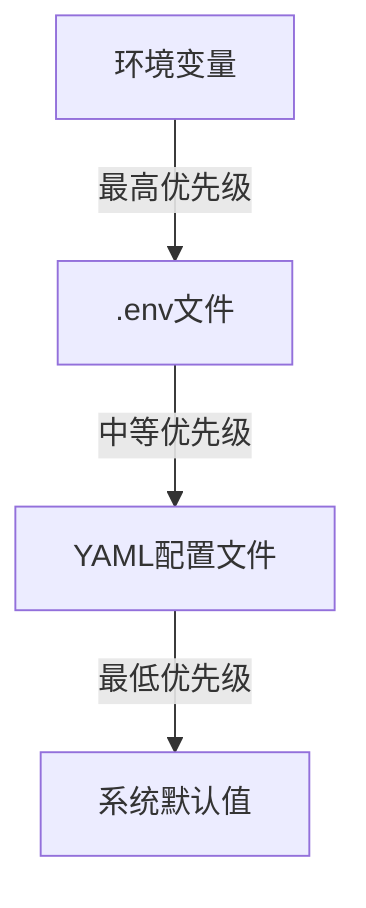
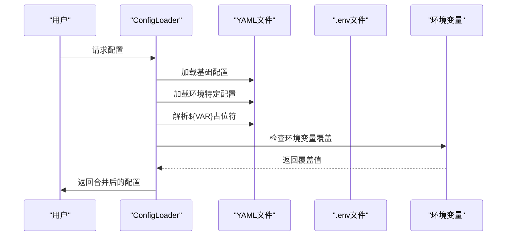
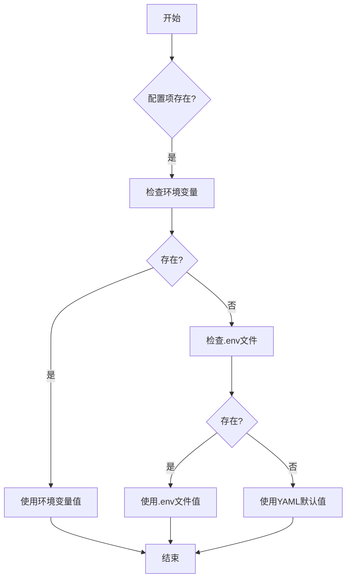
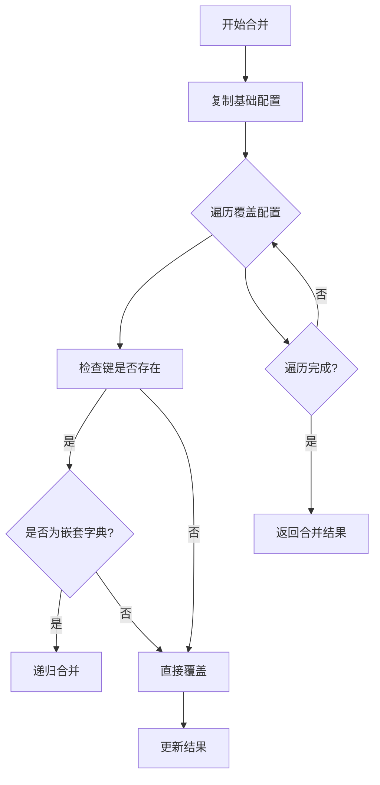
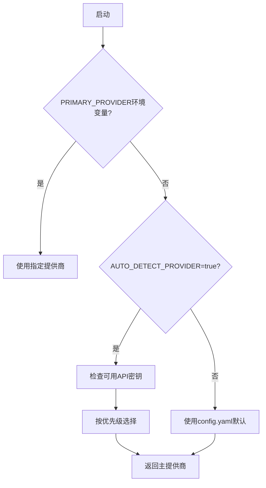
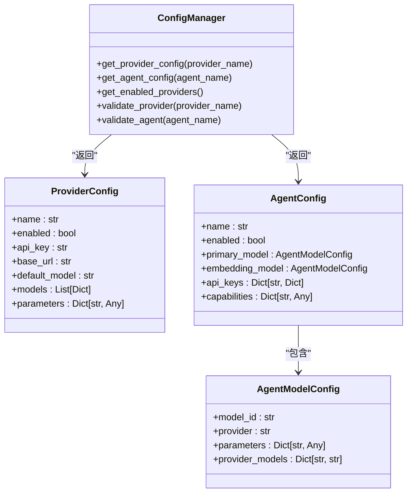
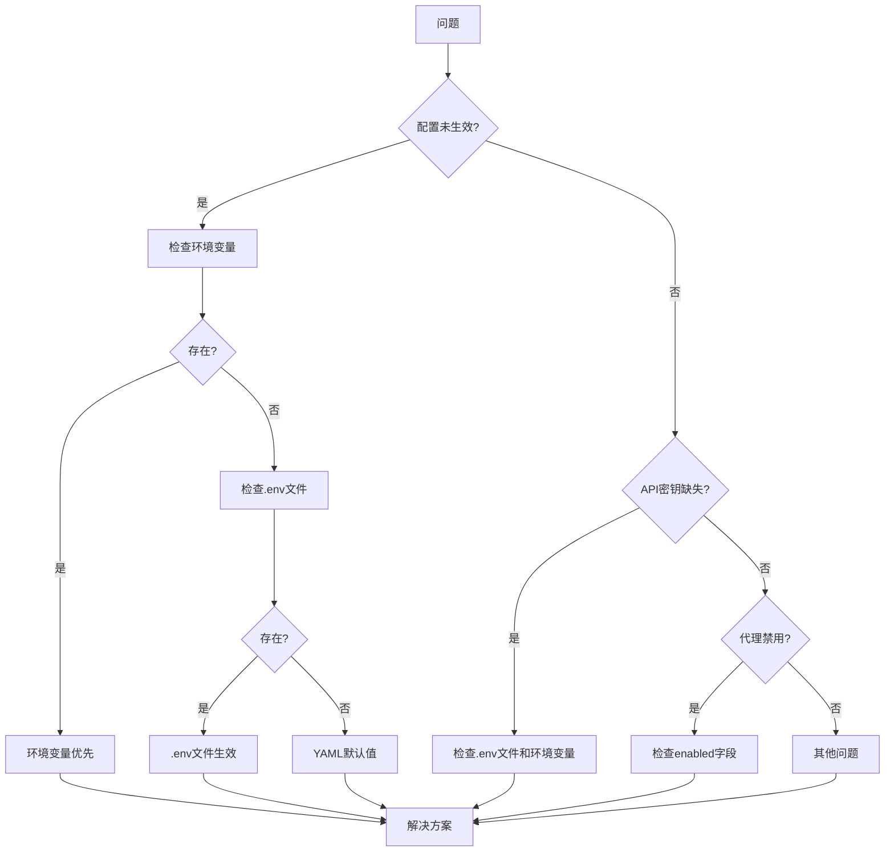
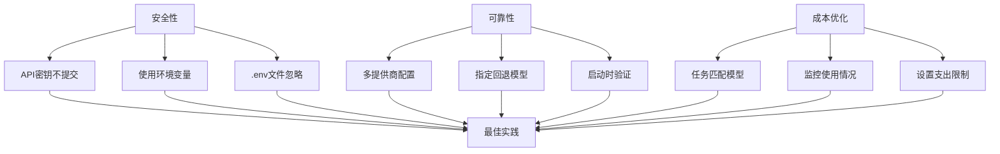

# 配置优先级

<cite>
**本文档中引用的文件**  
- [loader.py](file://python/valuecell/config/loader.py)
- [manager.py](file://python/valuecell/config/manager.py)
- [env.py](file://python/valuecell/utils/env.py)
- [.env.example](file://.env.example)
- [config.yaml](file://python/configs/config.yaml)
</cite>

## 目录
1. [简介](#简介)
2. [三层配置系统](#三层配置系统)
3. [配置加载流程](#配置加载流程)
4. [配置优先级规则](#配置优先级规则)
5. [配置解析机制](#配置解析机制)
6. [运行时动态配置](#运行时动态配置)
7. [配置管理器](#配置管理器)
8. [常见问题排查](#常见问题排查)
9. [最佳实践](#最佳实践)

## 简介

ValueCell平台采用三层配置系统，通过环境变量、.env文件和YAML配置文件的优先级机制实现灵活的配置管理。该系统允许开发者在不同环境（开发、测试、生产）中灵活调整配置，同时确保敏感信息（如API密钥）的安全性。

**Section sources**
- [loader.py](file://python/valuecell/config/loader.py#L1-L505)
- [manager.py](file://python/valuecell/config/manager.py#L1-L464)

## 三层配置系统

ValueCell的配置系统由三个层级组成，按优先级从高到低排列：

1. **环境变量**：运行时覆盖，优先级最高
2. **.env文件**：用户级配置，优先级中等
3. **YAML配置文件**：系统默认值，优先级最低

这种分层设计遵循以下原则：
- YAML文件：系统级默认值、提供商能力、模型注册表
- .env文件：用户设置API密钥和个人偏好
- 环境变量：部署/CI/CD的运行时覆盖



**Diagram sources**
- [loader.py](file://python/valuecell/config/loader.py#L4-L12)
- [.env.example](file://.env.example#L1-L68)

**Section sources**
- [loader.py](file://python/valuecell/config/loader.py#L4-L12)
- [CONFIGURATION_GUIDE.md](file://docs/CONFIGURATION_GUIDE.md#L5-L11)

## 配置加载流程

配置加载器（ConfigLoader）负责从多个源加载和合并配置，其工作流程如下：

1. 加载基础YAML配置文件
2. 加载环境特定的YAML配置文件（如config.development.yaml）
3. 解析配置中的环境变量占位符（${VAR_NAME}）
4. 应用环境变量覆盖



**Diagram sources**
- [loader.py](file://python/valuecell/config/loader.py#L206-L250)
- [manager.py](file://python/valuecell/config/manager.py#L98-L160)

**Section sources**
- [loader.py](file://python/valuecell/config/loader.py#L206-L250)
- [manager.py](file://python/valuecell/config/manager.py#L98-L160)

## 配置优先级规则

配置优先级规则决定了当同一配置项在多个层级中出现时，哪个值会被采用。优先级从高到低如下：

### 1. 环境变量（最高优先级）

环境变量具有最高优先级，可以在运行时动态修改配置。例如：

```bash
export RESEARCH_AGENT_MODEL_ID="anthropic/claude-3.5-sonnet"
```

### 2. .env文件（中等优先级）

.env文件用于存储用户级配置，如API密钥。示例内容：

```
OPENROUTER_API_KEY=sk-or-v1-xxxxxxxxxxxxx
GOOGLE_API_KEY=AIzaSyDxxxxxxxxxxxxx
PRIMARY_PROVIDER=openrouter
```

### 3. YAML配置文件（最低优先级）

YAML文件包含系统默认值，位于`python/configs/`目录下。主要配置文件包括：

- `config.yaml`：主配置文件
- `providers/`：提供商配置
- `agents/`：代理配置



**Diagram sources**
- [loader.py](file://python/valuecell/config/loader.py#L67-L100)
- [.env.example](file://.env.example#L1-L68)
- [config.yaml](file://python/configs/config.yaml#L1-L65)

**Section sources**
- [loader.py](file://python/valuecell/config/loader.py#L67-L100)
- [.env.example](file://.env.example#L1-L68)
- [config.yaml](file://python/configs/config.yaml#L1-L65)

## 配置解析机制

配置解析机制是ValueCell配置系统的核心，主要包括环境变量解析和配置合并两个关键过程。

### 环境变量解析

`_resolve_env_vars`方法递归解析配置值中的环境变量，支持以下语法：

- `${VAR_NAME}` - 必需变量
- `${VAR_NAME:default_value}` - 带默认值的变量

```mermaid
flowchart TD
A[开始解析] --> B{值是字符串?}
B --> |是| C[匹配${VAR}模式]
C --> D[提取变量名]
D --> E[从环境获取值]
E --> F{获取成功?}
F --> |是| G[替换为环境变量值]
F --> |否| H[使用默认值或空字符串]
G --> I[返回解析后值]
H --> I
B --> |否| J{值是字典?}
J --> |是| K[递归解析每个键值]
K --> I
J --> |否| L{值是列表?}
L --> |是| M[递归解析每个元素]
M --> I
L --> |否| N[返回原值]
N --> I
```

### 配置合并

`_merge_configs`方法实现深度合并两个配置字典，覆盖值优先于基础值，嵌套字典递归合并。



**Diagram sources**
- [loader.py](file://python/valuecell/config/loader.py#L67-L128)
- [manager.py](file://python/valuecell/config/manager.py#L269-L353)

**Section sources**
- [loader.py](file://python/valuecell/config/loader.py#L67-L128)
- [manager.py](file://python/valuecell/config/manager.py#L269-L353)

## 运行时动态配置

ValueCell支持通过环境变量在运行时动态修改配置，这对于A/B测试、故障排除和环境切换非常有用。

### 环境变量覆盖映射

通过`env_overrides`映射，可以将环境变量映射到配置路径，实现精确控制：

```yaml
env_overrides:
  RESEARCH_AGENT_MODEL_ID: "models.primary.model_id"
  RESEARCH_AGENT_PROVIDER: "models.primary.provider"
  RESEARCH_AGENT_TEMPERATURE: "models.primary.parameters.temperature"
```

### 运行时覆盖示例

```bash
# 临时更改研究代理的模型
RESEARCH_AGENT_MODEL_ID="anthropic/claude-3.5-sonnet" python your_script.py

# 批量测试不同模型
for model in "gpt-4o" "claude-3.5-sonnet" "gemini-2.5-flash"; do
    echo "Testing: $model"
    RESEARCH_AGENT_MODEL_ID="$model" python your_script.py
done
```

### 主要提供商自动检测

系统根据可用的API密钥自动选择主提供商，优先级顺序为：
1. OpenRouter
2. SiliconFlow
3. Google
4. OpenAI
5. OpenAI-Compatible
6. Azure

可通过环境变量覆盖：
```bash
export PRIMARY_PROVIDER=siliconflow
```



**Diagram sources**
- [manager.py](file://python/valuecell/config/manager.py#L113-L159)
- [CONFIGURATION_GUIDE.md](file://docs/CONFIGURATION_GUIDE.md#L327-L335)

**Section sources**
- [manager.py](file://python/valuecell/config/manager.py#L113-L159)
- [CONFIGURATION_GUIDE.md](file://docs/CONFIGURATION_GUIDE.md#L327-L335)

## 配置管理器

配置管理器（ConfigManager）提供高级接口，简化配置访问，包含以下核心功能：

### ProviderConfig数据类

```python
@dataclass
class ProviderConfig:
    name: str
    enabled: bool
    api_key: Optional[str]
    base_url: Optional[str]
    default_model: str
    models: List[Dict[str, Any]]
    parameters: Dict[str, Any]
```

### AgentConfig数据类

```python
@dataclass
class AgentConfig:
    name: str
    enabled: bool
    primary_model: AgentModelConfig
    embedding_model: Optional[AgentModelConfig]
    api_keys: Dict[str, Dict[str, Any]]
    capabilities: Dict[str, Any]
    extra_config: Dict[str, Any]
```

### 核心功能

1. **提供商配置获取**：`get_provider_config()`
2. **代理配置获取**：`get_agent_config()`
3. **启用提供商列表**：`get_enabled_providers()`
4. **配置验证**：`validate_provider()`和`validate_agent()`



**Diagram sources**
- [manager.py](file://python/valuecell/config/manager.py#L21-L76)
- [manager.py](file://python/valuecell/config/manager.py#L78-L464)

**Section sources**
- [manager.py](file://python/valuecell/config/manager.py#L21-L464)

## 常见问题排查

### 配置未生效

当配置更改未生效时，可能的原因和解决方案：

1. **缓存问题**：配置加载器使用缓存，重启应用或清除缓存
   ```python
   loader.clear_cache()
   ```

2. **环境变量未加载**：确保环境变量正确设置
   ```bash
   echo $OPENROUTER_API_KEY
   ```

3. **配置路径错误**：检查`env_overrides`映射路径是否正确

### API密钥未设置

错误信息："API key not set: OPENROUTER_API_KEY"

解决方案：
1. 检查`.env`文件是否包含相应密钥
2. 确认环境变量已正确导出
3. 验证密钥格式是否正确

### 代理禁用

错误信息："Agent is disabled: research_agent"

解决方案：
1. 检查代理配置文件中的`enabled`字段
2. 确认环境变量未覆盖此设置

### 优先级验证

当遇到配置问题时，按以下顺序检查：

1. 检查环境变量是否覆盖了配置
2. 检查`.env`文件中的设置
3. 查看YAML文件中的默认值
4. 确认配置加载顺序和缓存状态



**Diagram sources**
- [loader.py](file://python/valuecell/config/loader.py#L432-L482)
- [manager.py](file://python/valuecell/config/manager.py#L378-L413)

**Section sources**
- [loader.py](file://python/valuecell/config/loader.py#L432-L482)
- [manager.py](file://python/valuecell/config/manager.py#L378-L413)

## 最佳实践

### 安全性最佳实践

1. **API密钥管理**：
   - 永远不要将API密钥提交到版本控制
   - 使用`.gitignore`排除`.env`文件
   - 在CI/CD中使用环境变量

2. **配置文件保护**：
   - 敏感信息存储在环境变量中
   - 使用系统级`.env`文件存储用户配置

### 可靠性最佳实践

1. **提供商回退**：
   - 配置多个提供商以提高可靠性
   - 在代理配置中指定`provider_models`以确保一致的回退

2. **监控配置**：
   - 记录配置选择决策
   - 在启动时验证配置
   - 在生产环境中对缺失的API密钥发出警报

### 成本优化

1. **模型选择**：
   - 对简单任务使用成本较低的模型
   - 对实时应用使用更快的模型
   - 监控API使用情况并设置支出限制

2. **环境分离**：
   - 开发环境使用成本较低的模型
   - 生产环境使用高性能模型
   - 使用环境特定的配置文件



**Diagram sources**
- [CONFIGURATION_GUIDE.md](file://docs/CONFIGURATION_GUIDE.md#L597-L620)
- [loader.py](file://python/valuecell/config/loader.py#L1-L505)

**Section sources**
- [CONFIGURATION_GUIDE.md](file://docs/CONFIGURATION_GUIDE.md#L597-L620)