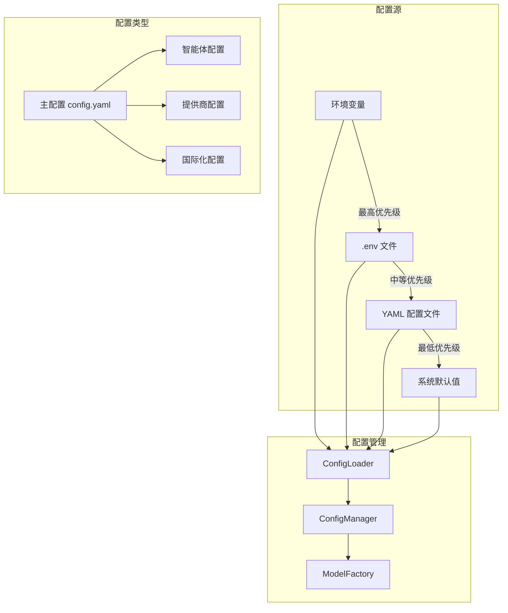
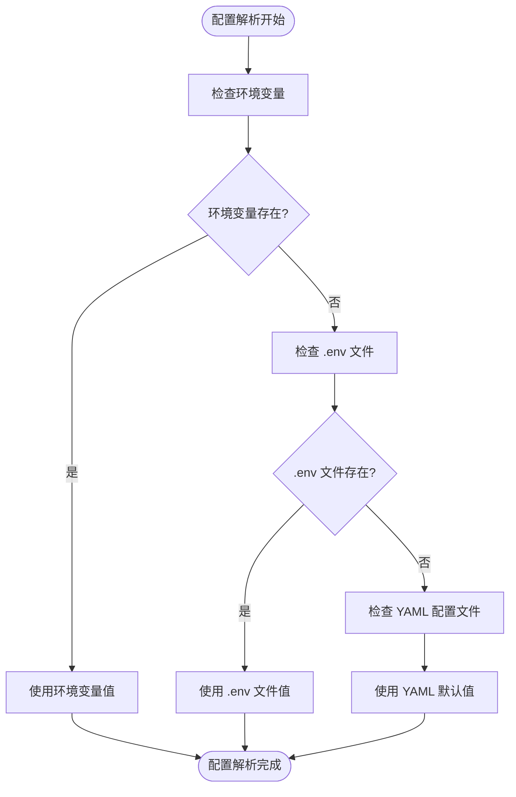
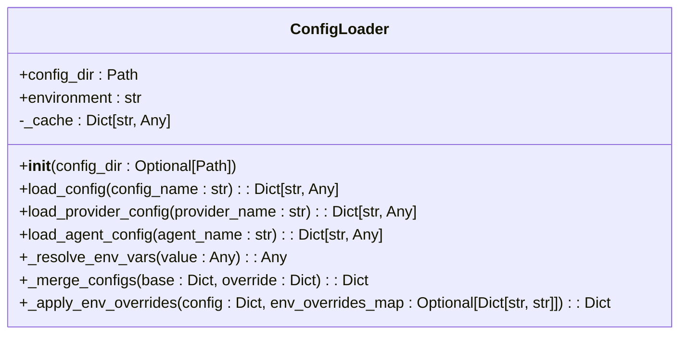
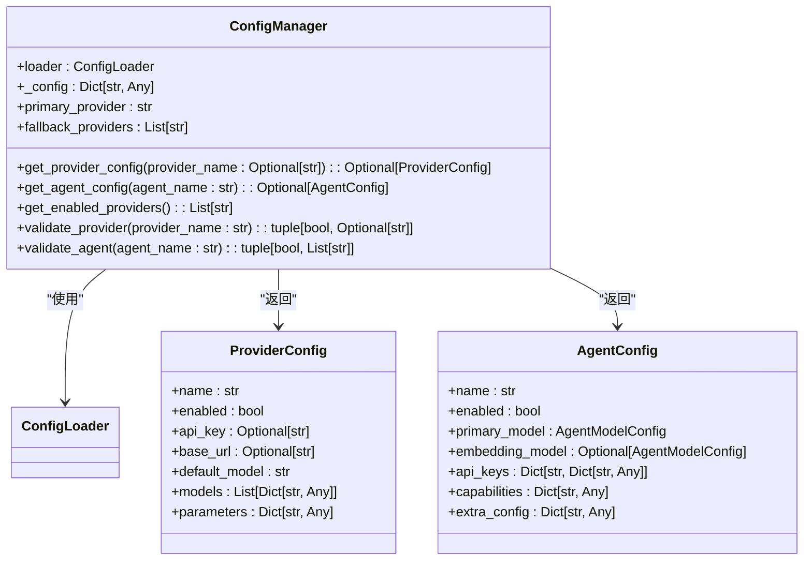
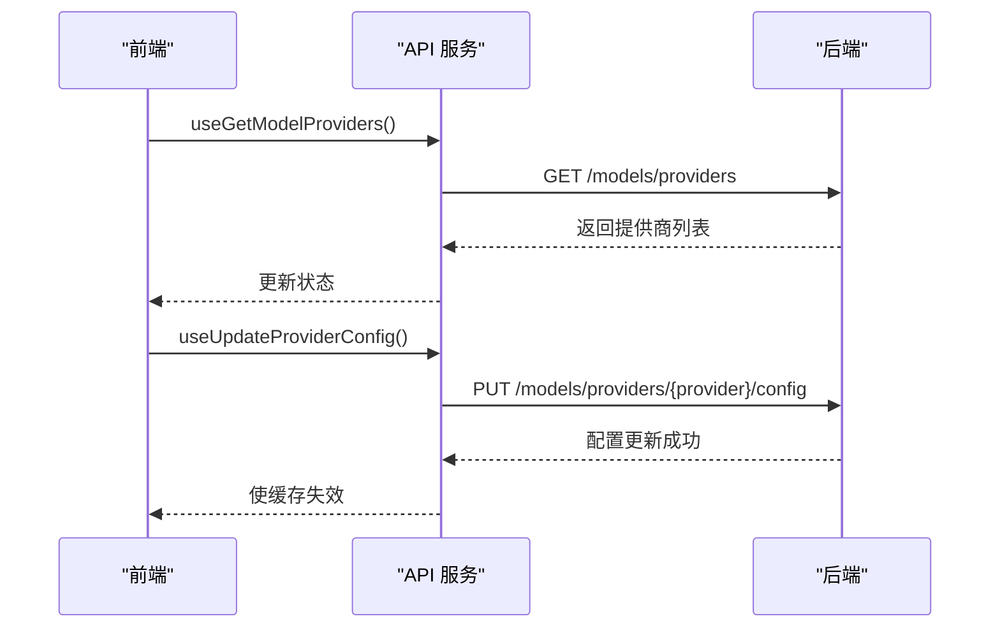
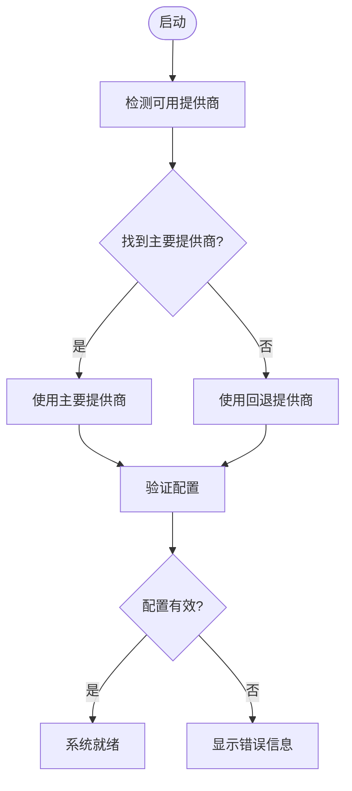

# 配置管理

<cite>
**本文档中引用的文件**  
- [config.yaml](file://python/configs/config.yaml)
- [super_agent.yaml](file://python/configs/agents/super_agent.yaml)
- [openrouter.yaml](file://python/configs/providers/openrouter.yaml)
- [loader.py](file://python/valuecell/config/loader.py)
- [manager.py](file://python/valuecell/config/manager.py)
- [constants.py](file://python/valuecell/config/constants.py)
- [settings-store.ts](file://frontend/src/store/settings-store.ts)
- [setting.ts](file://frontend/src/types/setting.ts)
- [setting.ts](file://frontend/src/api/setting.ts)
- [models.tsx](file://frontend/src/app/setting/models.tsx)
- [general.tsx](file://frontend/src/app/setting/general.tsx)
- [memory.tsx](file://frontend/src/app/setting/memory.tsx)
</cite>

## 目录
1. [简介](#简介)
2. [配置系统架构](#配置系统架构)
3. [配置优先级](#配置优先级)
4. [核心配置组件](#核心配置组件)
5. [配置加载机制](#配置加载机制)
6. [前端配置管理](#前端配置管理)
7. [配置验证与管理](#配置验证与管理)
8. [最佳实践](#最佳实践)

## 简介

ValueCell 项目采用分层配置管理系统，支持灵活的部署和运行时配置。该系统允许用户通过多种方式配置智能体、模型提供商和应用程序设置，确保在不同环境（开发、测试、生产）中的一致性和灵活性。

**Section sources**
- [config.yaml](file://python/configs/config.yaml#L1-L65)
- [CONFIGURATION_GUIDE.md](file://docs/CONFIGURATION_GUIDE.md#L1-L629)

## 配置系统架构

ValueCell 的配置系统由多个组件组成，包括主配置文件、智能体配置、提供商配置和前端设置。这些组件共同工作，提供一个统一的配置管理接口。



**Diagram sources**
- [config.yaml](file://python/configs/config.yaml#L1-L65)
- [loader.py](file://python/valuecell/config/loader.py#L1-L506)
- [manager.py](file://python/valuecell/config/manager.py#L1-L465)

**Section sources**
- [configs/CLAUDE.md](file://configs/CLAUDE.md#L1-L263)
- [CONFIGURATION_GUIDE.md](file://docs/CONFIGURATION_GUIDE.md#L78-L103)

## 配置优先级

ValueCell 配置系统遵循三层优先级规则，确保配置的灵活性和可覆盖性：

1. **环境变量** - 运行时覆盖（最高优先级）
2. **.env 文件** - 用户级配置（中等优先级）
3. **YAML 文件** - 系统默认值（最低优先级）

这种层次结构允许用户在不修改代码的情况下设置提供商凭据，并通过环境变量在运行时覆盖设置。



**Diagram sources**
- [config.yaml](file://python/configs/config.yaml#L4-L8)
- [loader.py](file://python/valuecell/config/loader.py#L4-L8)

**Section sources**
- [CONFIGURATION_GUIDE.md](file://docs/CONFIGURATION_GUIDE.md#L5-L17)
- [configs/CLAUDE.md](file://configs/CLAUDE.md#L46-L49)

## 核心配置组件

### 主配置文件 (config.yaml)

主配置文件 `config.yaml` 定义了系统的全局设置，包括模型提供商注册表和智能体配置。

```yaml
models:
  primary_provider: "openrouter"
  providers:
    openrouter:
      config_file: "providers/openrouter.yaml"
      api_key_env: "OPENROUTER_API_KEY"
agents:
  super_agent:
    config_file: "agents/super_agent.yaml"
  research_agent:
    config_file: "agents/research_agent.yaml"
```

### 智能体配置

每个智能体都有独立的 YAML 配置文件，定义其特定的行为和模型设置。例如，超级智能体配置文件 `super_agent.yaml` 包含环境变量覆盖映射。

```yaml
env_overrides:
  SUPER_AGENT_MODEL_ID: "models.primary.model_id"
  SUPER_AGENT_PROVIDER: "models.primary.provider"
  SUPER_AGENT_TEMPERATURE: "models.primary.parameters.temperature"
```

### 提供商配置

每个模型提供商都有独立的配置文件，包含连接信息、默认模型和可用模型列表。例如，OpenRouter 配置文件 `openrouter.yaml` 定义了 API 端点和默认模型。

```yaml
connection:
  base_url: "https://openrouter.ai/api/v1"
  api_key_env: "OPENROUTER_API_KEY"
default_model: "qwen/qwen3-max"
```

**Section sources**
- [config.yaml](file://python/configs/config.yaml#L10-L65)
- [super_agent.yaml](file://python/configs/agents/super_agent.yaml#L37-L43)
- [openrouter.yaml](file://python/configs/providers/openrouter.yaml#L9-L12)

## 配置加载机制

### 配置加载器 (ConfigLoader)

`ConfigLoader` 类负责加载和合并来自不同源的配置。它实现了缓存机制以减少文件读取开销，并支持环境变量解析。



**Diagram sources**
- [loader.py](file://python/valuecell/config/loader.py#L38-L506)

**Section sources**
- [loader.py](file://python/valuecell/config/loader.py#L1-L506)

### 配置管理器 (ConfigManager)

`ConfigManager` 提供高级配置访问接口，封装了配置加载器的功能，并提供类型安全的配置访问。



**Diagram sources**
- [manager.py](file://python/valuecell/config/manager.py#L78-L465)

**Section sources**
- [manager.py](file://python/valuecell/config/manager.py#L1-L465)

## 前端配置管理

### 设置存储 (Settings Store)

前端使用 Zustand 状态管理库来持久化用户设置，如股票颜色模式。

```typescript
interface SettingsStoreState {
  stockColorMode: StockColorMode;
  setStockColorMode: (mode: StockColorMode) => void;
}

export const useSettingsStore = create<SettingsStoreState>()(
  devtools(
    persist(
      (set) => ({
        stockColorMode: "GREEN_UP_RED_DOWN",
        setStockColorMode: (stockColorMode) => set({ stockColorMode }),
      }),
      {
        name: "valuecell-settings",
      },
    ),
    { name: "SettingsStore", enabled: import.meta.env.DEV },
  ),
);
```

### API 服务

前端通过 API 服务与后端交互，获取和更新配置信息。



**Diagram sources**
- [settings-store.ts](file://frontend/src/store/settings-store.ts#L1-L118)
- [setting.ts](file://frontend/src/api/setting.ts#L1-L230)

**Section sources**
- [settings-store.ts](file://frontend/src/store/settings-store.ts#L1-L118)
- [setting.ts](file://frontend/src/types/setting.ts#L1-L23)
- [setting.ts](file://frontend/src/api/setting.ts#L1-L230)

## 配置验证与管理

### 配置验证

系统在启动时验证配置的完整性，包括必需字段检查、类型验证和值范围验证。

```python
def validate_agent_config(self, agent_name: str) -> tuple[bool, List[str]]:
    errors = []
    config = self.load_agent_config(agent_name)
    if not config:
        return False, [f"Agent config not found: {agent_name}"]
    
    if not config.get("enabled", True):
        errors.append(f"Agent is disabled: {agent_name}")
    
    primary = config.get("models", {}).get("primary", {})
    provider = primary.get("provider")
    if not provider:
        errors.append("No provider specified for primary model")
    
    return len(errors) == 0, errors
```

### 自动检测与回退

系统支持提供商自动检测和回退机制，确保在主要提供商不可用时能够无缝切换到备用提供商。



**Diagram sources**
- [manager.py](file://python/valuecell/config/manager.py#L104-L159)
- [manager.py](file://python/valuecell/config/manager.py#L162-L189)

**Section sources**
- [manager.py](file://python/valuecell/config/manager.py#L378-L414)
- [CONFIGURATION_GUIDE.md](file://docs/CONFIGURATION_GUIDE.md#L319-L368)

## 最佳实践

### 配置管理最佳实践

1. **API 密钥管理**：在 `.env` 文件中设置 API 密钥，不要提交到版本控制
2. **提供商回退**：配置多个提供商以提高可靠性
3. **配置监控**：记录配置选择决策，验证生产环境中的配置
4. **版本控制**：将智能体配置保存在版本控制中
5. **成本优化**：为简单任务使用更便宜的模型

### 环境变量命名规范

- 使用描述性的环境变量名
- 为所有变量设置合理的默认值
- 在 `.env.example` 中记录所有变量
- 敏感信息通过密钥管理服务处理

**Section sources**
- [CONFIGURATION_GUIDE.md](file://docs/CONFIGURATION_GUIDE.md#L595-L621)
- [constants.py](file://python/valuecell/config/constants.py#L1-L95)