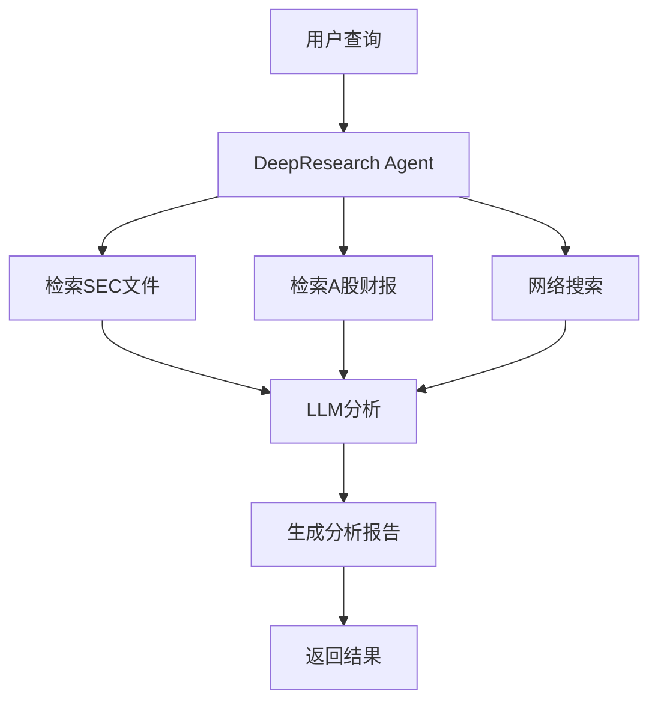
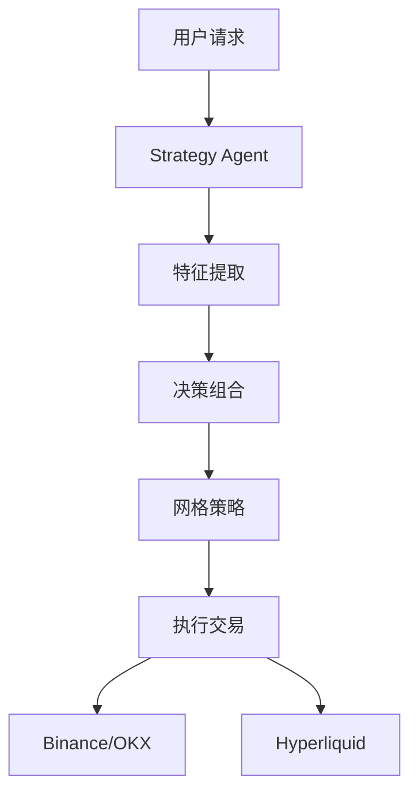
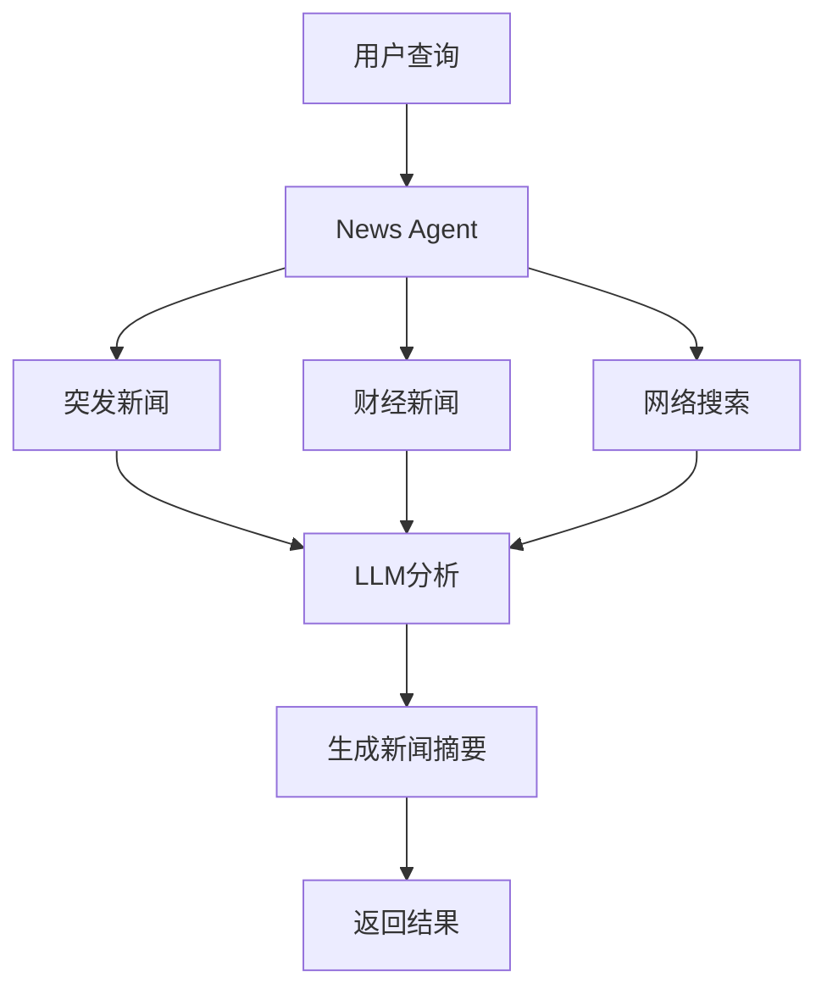
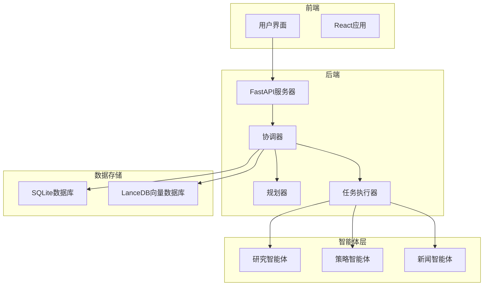
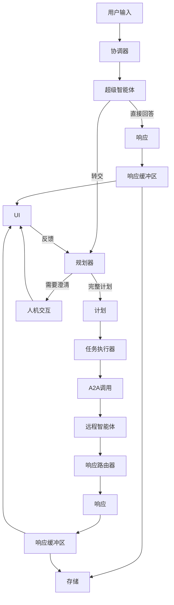

# 项目概述

<cite>
**本文档中引用的文件**  
- [README.md](file://README.md)
- [CORE_ARCHITECTURE.md](file://docs/CORE_ARCHITECTURE.md)
- [CONFIGURATION_GUIDE.md](file://docs/CONFIGURATION_GUIDE.md)
- [main.py](file://python/valuecell/server/main.py)
- [core.py](file://python/valuecell/agents/research_agent/core.py)
- [grid_agent.py](file://python/valuecell/agents/grid_agent/grid_agent.py)
- [core.py](file://python/valuecell/agents/news_agent/core.py)
- [start.sh](file://start.sh)
- [DockerFile](file://docker/DockerFile)
- [root.tsx](file://frontend/src/root.tsx)
- [agent.ts](file://frontend/src/constants/agent.ts)
</cite>

## 目录
1. [简介](#简介)
2. [核心功能](#核心功能)
3. [多智能体系统](#多智能体系统)
4. [系统架构](#系统架构)
5. [技术栈与部署](#技术栈与部署)
6. [用户场景](#用户场景)
7. [配置与集成](#配置与集成)
8. [数据安全与本地存储](#数据安全与本地存储)

## 简介

ValueCell是一个社区驱动的金融应用多智能体平台，旨在构建全球最大的去中心化金融智能体社区。该平台提供一系列顶级投资智能体，帮助用户进行股票选择、研究、跟踪甚至交易。系统将所有敏感信息存储在用户的本地设备上，确保核心数据的安全性。平台支持多种LLM提供商、市场数据源和交易所连接，为开发者和用户提供高度灵活的集成选项。

**Section sources**
- [README.md](file://README.md#L38-L45)

## 核心功能

ValueCell平台的核心功能围绕多智能体系统构建，提供全面的金融分析和交易支持。平台的主要功能包括：

- **多智能体协同**：通过DeepResearch Agent、Strategy Agent和News Retrieval Agent等智能体协同工作，提供从研究到交易的完整解决方案
- **灵活集成**：支持OpenRouter、SiliconFlow、Azure、Google、OpenAI等多种LLM提供商，以及Binance、OKX等主流交易所
- **实时数据**：覆盖美股、加密货币、港股、A股等多个市场，提供实时市场数据
- **自动化交易**：支持多资产、多策略的智能交易，可自动执行用户策略
- **个性化新闻**：支持个性化定时新闻推送，实时跟踪关键信息

**Section sources**
- [README.md](file://README.md#L74-L92)

## 多智能体系统

ValueCell平台的核心是其多智能体系统，由多个专业智能体组成，每个智能体负责特定的金融任务。

### DeepResearch Agent（深度研究智能体）

深度研究智能体负责自动检索和分析基本面文件，生成准确的数据洞察和可解释的摘要。该智能体能够访问SEC文件、A股财报等数据源，利用LLM进行深度分析。



**Diagram sources**
- [core.py](file://python/valuecell/agents/research_agent/core.py#L30-L99)

### Strategy Agent（策略智能体）

策略智能体支持多种加密资产和多策略智能交易，能够自动执行用户策略。该智能体实现了网格交易策略，支持现货和永续合约的双向网格交易。



**Diagram sources**
- [grid_agent.py](file://python/valuecell/agents/grid_agent/grid_agent.py#L25-L49)

### News Retrieval Agent（新闻检索智能体）

新闻检索智能体支持个性化定时新闻推送，能够实时跟踪关键信息。该智能体整合了多个新闻源，包括突发新闻、财经新闻和网络搜索。



**Diagram sources**
- [core.py](file://python/valuecell/agents/news_agent/core.py#L17-L134)

**Section sources**
- [README.md](file://README.md#L81-L85)
- [core.py](file://python/valuecell/agents/research_agent/core.py#L30-L99)
- [grid_agent.py](file://python/valuecell/agents/grid_agent/grid_agent.py#L25-L49)
- [core.py](file://python/valuecell/agents/news_agent/core.py#L17-L134)

## 系统架构

ValueCell采用分层架构设计，包含前端、后端和智能体层，各层之间通过清晰的接口进行通信。



**Diagram sources**
- [main.py](file://python/valuecell/server/main.py#L23-L99)
- [CORE_ARCHITECTURE.md](file://docs/CORE_ARCHITECTURE.md#L19-L70)

### 核心组件交互

系统的核心交互流程包括用户输入处理、智能体协调和响应流式传输。协调器（Orchestrator）作为系统的核心，负责协调整个生命周期。



**Diagram sources**
- [CORE_ARCHITECTURE.md](file://docs/CORE_ARCHITECTURE.md#L84-L104)

**Section sources**
- [CORE_ARCHITECTURE.md](file://docs/CORE_ARCHITECTURE.md#L1-L302)

## 技术栈与部署

ValueCell采用现代化的技术栈，支持多种部署方式，包括本地开发、Docker容器化和桌面应用。

### 技术栈

- **前端**：React 19、TypeScript、Tailwind CSS、Vite
- **后端**：Python 3.12、FastAPI、Uvicorn
- **智能体框架**：Agno、A2A SDK
- **数据库**：SQLite、LanceDB
- **构建工具**：Bun、Uv

### 部署方式

#### 本地开发部署

通过shell脚本启动完整的应用（前端、后端和智能体）：

```bash
# Linux / macOS
bash start.sh

# Windows (PowerShell)
.\start.ps1
```

#### Docker容器化部署

使用Dockerfile进行容器化部署：

```dockerfile
FROM ghcr.io/astral-sh/uv:python3.12-bookworm-slim
WORKDIR /app
COPY . /app
RUN uv sync --locked
EXPOSE 8000
CMD ["uv", "run", "python", "main.py", "--host", "0.0.0.0", "--port", "8000"]
```

#### 桌面应用部署

通过Tauri框架打包为桌面应用，支持macOS、Windows和Linux平台。

**Section sources**
- [start.sh](file://start.sh#L1-L187)
- [DockerFile](file://docker/DockerFile#L1-L25)
- [package.json](file://frontend/package.json#L1-L95)
- [pyproject.toml](file://python/pyproject.toml#L1-L116)

## 用户场景

ValueCell平台支持多种用户场景，从初学者到经验丰富的开发者都能找到合适的使用方式。

### 初学者场景

初学者可以通过下载预编译的应用程序快速开始使用：

1. 从GitHub Releases页面下载最新版本
2. 安装应用程序
3. 配置首选的模型提供商
4. 开始使用智能体进行投资研究

### 开发者场景

开发者可以克隆代码库进行本地开发和贡献：

```bash
git clone https://github.com/ValueCell-ai/valuecell.git
cd valuecell
bash start.sh
```

### 交易场景

用户可以配置实时交易策略：

1. **配置AI模型**：通过Web界面添加AI模型API密钥
2. **配置交易所**：设置Binance/HyperLiquid/OKX等交易所API凭证
3. **创建策略**：结合AI模型和交易所创建自定义策略
4. **监控与控制**：实时启动/停止交易员并监控性能

**Section sources**
- [README.md](file://README.md#L95-L107)
- [root.tsx](file://frontend/src/root.tsx#L48-L72)

## 配置与集成

ValueCell采用三层配置系统，支持灵活的部署和配置。

### 配置优先级

配置解析遵循以下优先级顺序（从高到低）：

1. **环境变量** - 运行时覆盖
2. **.env文件** - 用户级配置
3. **YAML文件** - 系统默认值

### LLM提供商集成

平台支持多种LLM提供商，包括：

- OpenRouter
- SiliconFlow
- Google
- OpenAI
- Azure
- DeepSeek

### 交易所连接

支持与主流交易所的实时路由：

- **Binance**：支持国际站，使用USDT-M期货
- **Hyperliquid**：支持USDC作为保证金货币
- **OKX**：支持USDT保证金合约
- **Coinbase**：支持USDT保证金合约

**Section sources**
- [CONFIGURATION_GUIDE.md](file://docs/CONFIGURATION_GUIDE.md#L5-L629)

## 数据安全与本地存储

ValueCell高度重视用户数据安全，采用本地存储策略确保核心数据安全。

### 本地存储位置

所有敏感数据存储在用户本地设备上，具体位置包括：

- **LanceDB目录**：
  - macOS: `~/Library/Application Support/ValueCell/lancedb`
  - Linux: `~/.config/valuecell/lancedb`
  - Windows: `%APPDATA%\ValueCell\lancedb`
  
- **知识目录**：
  - macOS: `~/Library/Application Support/ValueCell/.knowledge`
  - Linux: `~/.config/valuecell/.knowledge`
  - Windows: `%APPDATA%\ValueCell\.knowledge`
  
- **SQLite数据库文件**：
  - macOS: `~/Library/Application Support/ValueCell/valuecell.db`
  - Linux: `~/.config/valuecell/valuecell.db`
  - Windows: `%APPDATA%\ValueCell\valuecell.db`

### 安全特性

- 所有API密钥存储在本地，不会通过互联网发送到任何第三方
- 支持定期重置API密钥以确保账户安全
- 采用环境变量和配置文件分离的策略，避免敏感信息泄露

**Section sources**
- [README.md](file://README.md#L133-L145)
- [__init__.py](file://python/valuecell/__init__.py#L24-L118)