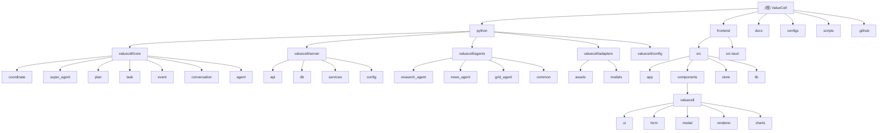

# ValueCell - 项目架构文档

## 变更记录 (Changelog)
- 2025-12-23: Git 同步完成，合并上游 10+ 个新提交（v0.1.19 版本），包含 TradingView 插件、国际化支持、主题设置、模型验证增强等功能
- 2025-12-10: Git 同步完成，合并上游 6 个新提交（v0.1.18 版本），包含 UI 进度条、新 logo、健康检查、API 输入框优化等功能
- 2025-12-09: 配置管理模块文档创建完成，覆盖率提升至 76.2%
- 2025-12-05 20:02: 第五次深度扫描完成，深入探索了数据源适配器、渲染器组件、图表组件、数据库模型、前端表单组件、测试文件和工具类库，覆盖率提升至 75.1%
- 2025-12-05 19:58: 第三次增量扫描完成，新增 CI/CD 工作流和构建脚本文档，覆盖率提升至 27.9%
- 2025-12-05 19:53: 增量扫描完成，新增适配器、Tauri、配置和文档模块的详细文档
- 2025-12-05: 初始架构分析完成，识别核心模块并生成结构图

## 项目愿景

ValueCell 是一个社区驱动的多智能体金融应用平台，致力于构建全球最大的去中心化金融智能体社区。该平台提供顶级的投资智能体团队，帮助用户进行选股、研究、跟踪甚至交易。系统将所有敏感信息存储在用户本地设备上，确保核心数据安全。

## 架构总览

ValueCell 采用前后端分离的架构设计：
- **前端**: 基于 React + Tauri 的桌面应用
- **后端**: Python FastAPI 服务器
- **核心引擎**: 多智能体协调系统，包含研究智能体、策略智能体、新闻智能体等

### 模块结构图



## 模块索引

| 模块路径 | 语言 | 职责描述 | 核心文件 | 测试覆盖 |
|---------|------|---------|---------|---------|
| [python/valuecell/core](./python/valuecell/core/CLAUDE.md) | Python | 智能体协调引擎，管理请求生命周期 | orchestrator.py, super_agent.py, planner.py | ✅ |
| [python/valuecell/server](./python/valuecell/server/CLAUDE.md) | Python | FastAPI 后端服务 | main.py, api/app.py, db/models/ | ❌ |
| [python/valuecell/agents](./python/valuecell/agents/CLAUDE.md) | Python | 专业金融智能体实现 | research_agent/, grid_agent/, news_agent/ | ✅ |
| [python/valuecell/adapters](./python/valuecell/adapters/CLAUDE.md) | Python | 数据源适配器，统一多数据提供商接口 | assets/manager.py, adapters/ | ✅ |
| [python/valuecell/config](./python/valuecell/config/CLAUDE.md) | Python | 配置管理模块，三层覆盖系统 | loader.py, manager.py, constants.py | ✅ |
| [frontend/src](./frontend/src/CLAUDE.md) | TypeScript/React | React 前端应用源码 | root.tsx, routes.ts, components/ | ❌ |
| [frontend/src-tauri] | Rust | Tauri 桌面应用 Rust 后端 | src/main.rs, Cargo.toml | ❌ |
| [configs] | YAML/JSON | 配置文件系统 | config.yaml, agents/, providers/ | ❌ |
| [docs] | Markdown | 项目文档 | CORE_ARCHITECTURE.md | ❌ |
| [.github/workflows] | YAML | GitHub Actions 工作流 | frontend.yml, python.yml | ❌ |
| [scripts] | Shell | 项目构建和部署脚本 | start.sh, prepare_envs.sh | ❌ |

## 运行与开发

### 环境要求
- Python 3.8+
- Node.js 18+
- Rust 1.70+
- Tauri CLI

### 启动步骤

#### 1. 后端服务
```bash
cd python
pip install -r requirements.txt
uvicorn valuecell.server.main:app --reload
```

#### 2. 前端开发
```bash
cd frontend
bun install
bun dev
```

#### 3. 桌面应用
```bash
cd frontend
bun tauri dev
```

#### 4. 一键启动
```bash
./scripts/start.sh
```

## 测试策略

### 测试覆盖情况
- 核心引擎：包含完整的单元测试和集成测试
- 金融智能体：包含故障容错测试
- 数据适配器：包含多适配器对比测试
- 服务器模块：暂无测试文件
- 前端模块：暂无测试文件

### 运行测试
```bash
# Python 测试
cd python
pytest

# 覆盖率报告
pytest --cov=valuecell
```

## 编码规范

### Python
- 遵循 PEP 8 规范
- 使用 Black 进行代码格式化
- 使用 isort 进行导入排序
- 类型注解覆盖所有公共 API

### TypeScript/React
- 遵循 ESLint 规则
- 使用 Prettier 进行代码格式化
- 严格的 TypeScript 配置
- React 19 最新特性

### Rust
- 使用 rustfmt 进行格式化
- 使用 clippy 进行代码检查
- 遵循 Rust API 指南

## AI 使用指引

### 智能体开发
1. 继承 `BaseAgent` 创建新的智能体
2. 实现 `process` 方法定义处理逻辑
3. 创建能力卡片描述功能
4. 注册到智能体管理器

### 提示词编写
1. 使用自然语言描述需求
2. 提供清晰的上下文信息
3. 指定期望的输出格式
4. 使用示例引导模型

### 模型配置
1. 在 `configs/providers/` 配置模型提供商
2. 在 `configs/agents/` 配置智能体使用的模型
3. 支持故障转移和负载均衡
4. 可通过环境变量覆盖配置

## 架构特点

### 1. 多智能体协调
- 超级智能体负责请求分类和路由
- 规划器将自然语言转为执行计划
- 任务执行器异步执行具体任务
- 支持人机协作（HITL）场景

### 2. 数据源抽象
- 统一的适配器接口
- 支持多数据源（Yahoo Finance、AKShare、BaoStock）
- 智能故障转移机制
- 数据缓存和优化

### 3. 前后端分离
- RESTful API 设计
- WebSocket 支持实时通信
- Tauri 实现跨平台桌面应用
- 响应式前端界面

### 4. 本地优先
- 敏感数据本地存储
- 可离线运行核心功能
- 用户完全控制数据
- 支持数据导入导出

## 技术栈详情

### 后端技术
- **FastAPI**: 现代、快速的 Web 框架
- **SQLAlchemy**: 强大的 ORM
- **Pydantic**: 数据验证和序列化
- **agno**: 智能体框架
- **loguru**: 结构化日志
- **ccxt**: 加密货币交易库

### 前端技术
- **React 19**: 最新版本的 React
- **TypeScript**: 类型安全的 JavaScript
- **Tailwind CSS**: 实用优先的 CSS 框架
- **Zustand**: 轻量级状态管理
- **React Query**: 服务器状态管理
- **ECharts**: 数据可视化

### 桌面应用
- **Tauri**: 轻量级跨平台框架
- **Rust**: 高性能系统编程语言
- **Web technologies**: Web 前端技术栈

### 数据存储
- **SQLite**: 本地关系数据库
- **LanceDB**: 向量数据库
- **内存缓存**: 高性能数据访问

## 部署方案

### 开发环境
- 后端：`uvicorn` 开发服务器
- 前端：`bun dev` 热重载
- 数据库：SQLite 本地文件

### 生产环境
- 后端：Gunicorn + Nginx
- 前端：静态文件部署
- 数据库：PostgreSQL（可选）
- 容器化：Docker 支持

### 桌面应用
- 构建：`bun tauri build`
- 发布：GitHub Releases
- 自动更新：内置更新机制

## 性能优化

### 后端优化
- 异步数据库操作
- 连接池管理
- 响应缓存策略
- 请求限流

### 前端优化
- 代码分割和懒加载
- 组件级缓存
- 虚拟滚动
- 图片懒加载

### 智能体优化
- 任务队列管理
- 并发控制
- 超时处理
- 错误重试

## 安全考虑

### 数据安全
- API 密钥加密存储
- 用户数据本地加密
- 安全的会话管理
- 输入验证和清理

### 网络安全
- HTTPS 强制使用
- CORS 配置
- 请求签名验证
- 防重放攻击

### 隐私保护
- 最小数据收集
- 匿名化处理
- 用户控制数据
- 透明的数据政策

## 社区贡献

### 贡献方式
1. Fork 项目仓库
2. 创建功能分支
3. 提交代码变更
4. 发起 Pull Request
5. 代码审查和合并

### 开发指南
- 阅读 [CORE_ARCHITECTURE.md](./docs/CORE_ARCHITECTURE.md)
- 参考 [CONTRIBUTE_AN_AGENT.md](./docs/CONTRIBUTE_AN_AGENT.md)
- 遵循编码规范
- 编写测试用例

### 社区资源
- GitHub Discussions
- 问题反馈
- 功能建议
- 知识分享

## 未来规划

### 短期目标（3个月）
- [ ] 完善测试覆盖率
- [ ] 优化性能瓶颈
- [ ] 增强错误处理
- [ ] 改进用户体验

### 中期目标（6个月）
- [ ] 支持更多数据源
- [ ] 添加机器学习模型
- [ ] 实现智能体市场
- [ ] 开发移动应用

### 长期目标（1年）
- [ ] 构建去中心化网络
- [ ] 支持区块链集成
- [ ] 创建开发者平台
- [ ] 建立生态系统

## 最新版本信息

**当前版本**: v0.1.19 (2025-12-23)

### v0.1.19 更新内容
- ✨ **新增功能**: TradingView 插件支持显示指数和股票信息
- 🌍 **国际化**: 完整的国际化支持（i18n），支持多语言界面
- 🎨 **主题设置**: 通用设置中新增主题选项（Light / Dark / System）
- 🔐 **模型验证**: 增强模型验证和 API 密钥输入 UI
- 🔧 **修复**: 拆分 useEffect 钩子避免重复请求，动态获取 tracker user_id
- 🐛 **Bug 修复**: 修复总权益为零的问题
- 📦 **依赖更新**: 更新前端依赖并重排序 Tailwind CSS 类
- 📊 **数据渲染**: 临时切换所有股票数据渲染到 TradingView

### v0.1.18 历史更新
- ✨ **新增功能**: UI 进度条组件和后端健康检查
- 🎨 **UI 优化**: 全新 ValueCell Logo，调整窗口最小尺寸
- 🔧 **改进**: API 输入框按 Enter 键不再刷新页面
- 📁 **功能增强**: 支持自定义投资组合图片保存位置
- 🤖 **智能体**: 增强 preload_local_agent_classes 支持名称过滤

## 相关链接

- [项目主页](https://github.com/valuecell/valuecell)
- [文档中心](./docs/)
- [API 参考](./docs/api/)
- [示例代码](./examples/)
- [更新日志](./CHANGELOG.md)