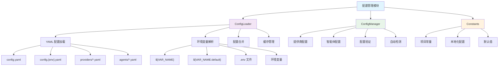

# ValueCell 配置管理模块 - 架构文档

## 模块概述

配置管理模块是 ValueCell 的核心基础设施，提供了一套完整的配置加载、管理和覆盖系统。该模块采用三层覆盖架构，支持多环境配置、环境变量注入、API 密钥管理等高级功能。

## 架构图



## 核心特性

### 1. 三层覆盖系统

配置优先级（从高到低）：
1. **环境变量** - 运行时覆盖，用于部署/CI/CD
2. **.env 文件** - 用户级配置，API 密钥和个人偏好
3. **YAML 文件** - 系统默认配置，提供商能力，模型注册表

### 2. 环境变量支持

支持两种语法：
- `${VAR_NAME}` - 必需变量，未设置会报错
- `${VAR_NAME:default_value}` - 带默认值的可选变量

### 3. 智能提供商检测

自动检测可用的 API 提供商：
- 优先级：OpenRouter → SiliconFlow → Google → OpenAI → OpenAI-Compatible → Azure
- 基于 API 密钥可用性自动选择
- 支持故障转移链

## 文件结构

```
python/valuecell/config/
├── __init__.py          # 模块初始化
├── constants.py         # 核心常量和默认值
├── loader.py           # YAML 配置加载器
└── manager.py          # 高级配置管理器
```

## 核心组件详解

### ConfigLoader (loader.py)

配置加载的核心类，负责：

1. **YAML 文件加载**
   - 主配置文件：`config.yaml`
   - 环境特定配置：`config.{environment}.yaml`
   - 提供商配置：`providers/{provider}.yaml`
   - 智能体配置：`agents/{agent}.yaml`

2. **环境变量解析**
   - 递归解析配置值中的环境变量
   - 支持默认值
   - 类型自动转换（bool、int、float）

3. **深度合并**
   - 支持嵌套字典的递归合并
   - 保持配置结构完整性

4. **缓存机制**
   - 避免重复加载
   - 提高性能

### ConfigManager (manager.py)

高级配置管理器，提供类型安全的配置访问：

1. **数据类定义**
   - `ProviderConfig`: 提供商配置
   - `AgentModelConfig`: 智能体模型配置
   - `AgentConfig`: 完整智能体配置

2. **智能提供商选择**
   ```python
   # 自动检测优先级（v0.1.20 更新）
   preferred_order = [
       "openrouter",
       "siliconflow",
       "google",
       "openai",
       "openai-compatible",
       "azure",
       "ollama",  # v0.1.20 新增本地模型支持
   ]
   ```

3. **配置验证**
   - API 密钥检查
   - 提供商可用性验证
   - 智能体配置完整性检查

4. **故障转移管理**
   - 主提供商失败时自动切换
   - 可配置故障转移链

### Constants (constants.py)

应用核心常量：

1. **国际化支持**
   - 支持语言：英语（美国/英国）、简体中文、繁体中文
   - 时区映射
   - 日期/时间格式
   - 货币符号

2. **地区默认配置**
   - 中国大陆：A股指数
   - 其他地区：全球混合指数

3. **数据库配置**
   - 字符集：utf8mb4
   - 排序规则：utf8mb4_unicode_ci

## 配置示例

### 主配置文件 (config.yaml)

```yaml
app:
  name: "ValueCell"
  version: "0.1.20"

models:
  primary_provider: "openrouter"  # 默认提供商
  defaults:
    temperature: 0.7
    max_tokens: 4096
  # v0.1.20 新增: LLM 等待时间配置
  wait_time:
    enabled: true
    min_wait: 1.0   # 最小等待时间（秒）
    max_wait: 5.0   # 最大等待时间（秒）

providers:
  openrouter:
    enabled: true
    connection:
      api_key_env: "OPENROUTER_API_KEY"
    default_model: "anthropic/claude-3.5-sonnet"

  # v0.1.20 新增: Ollama 本地模型配置
  ollama:
    enabled: true
    connection:
      host: "http://localhost:11434"  # Ollama 服务地址
    default_model: "llama2"
    parameters:
      num_ctx: 4096
      temperature: 0.7
```

### 智能体配置 (agents/research_agent.yaml)

```yaml
name: "research_agent"
enabled: true

models:
  primary:
    provider: "openrouter"
    model_id: "anthropic/claude-3.5-sonnet"
    parameters:
      temperature: 0.5
      max_tokens: 8192
    # 提供商特定的模型映射
    provider_models:
      siliconflow: "deepseek-ai/DeepSeek-V3"
      google: "gemini-2.0-flash"

api_keys:
  finnhub:
    key_env: "FINNHUB_API_KEY"
    required: true
  polygon:
    key_env: "POLYGON_API_KEY"
    required: false

capabilities:
  real_time_data: true
  historical_analysis: true
  news_sentiment: true
```

### 环境变量覆盖 (.env)

```bash
# API 密钥
OPENROUTER_API_KEY=sk-...
FINNHUB_API_KEY=...

# 运行时覆盖
PRIMARY_PROVIDER=siliconflow
RESEARCH_AGENT_MODEL_ID=deepseek-ai/DeepSeek-V3
```

## 使用指南

### 1. 基本使用

```python
from valuecell.config import get_config_manager

# 获取配置管理器
manager = get_config_manager()

# 获取主提供商
provider = manager.primary_provider
config = manager.get_provider_config(provider)

# 获取智能体配置
agent_config = manager.get_agent_config("research_agent")
```

### 2. 环境变量配置

```python
# 在 YAML 中使用环境变量
database:
  host: "${DB_HOST:localhost}"
  port: ${DB_PORT:5432}
  password: "${DB_PASSWORD}"  # 必需变量
```

### 3. 配置验证

```python
# 验证提供商
is_valid, error = manager.validate_provider("openrouter")

# 验证智能体
is_valid, errors = manager.validate_agent("research_agent")
```

## 最佳实践

### 1. API 密钥管理

- **绝不在** YAML 文件中存储实际 API 密钥
- 使用环境变量引用：`${API_KEY_ENV}`
- 在 .env 文件中设置实际值
- 敏感环境变量名使用大写和下划线

### 2. 环境配置

- `config.yaml`：通用默认配置
- `config.development.yaml`：开发环境特定配置
- `config.production.yaml`：生产环境特定配置

### 3. 智能体配置

- 为每个智能体创建独立的 YAML 文件
- 使用提供商特定的模型映射实现故障转移
- 明确标记必需和可选的 API 密钥

### 4. 性能优化

- 配置加载器内置缓存，避免重复加载
- 使用单例模式访问配置管理器
- 批量验证而非逐个验证

## 故障处理

### 1. 配置文件缺失

```python
try:
    config = loader.load_config("nonexistent")
except FileNotFoundError as e:
    logger.error(f"配置文件未找到: {e}")
```

### 2. API 密钥未设置

```python
is_valid, error = manager.validate_provider("openrouter")
if not is_valid:
    logger.warning(error)  # 提供用户友好的错误信息
```

### 3. 环境变量解析失败

- 使用默认值语法：`${VAR:default}`
- 在应用启动时验证必需的环境变量

## 扩展指南

### 1. 添加新提供商

1. 创建 `providers/{new_provider}.yaml`
2. 定义连接参数和模型列表
3. 在 `adapters/models/factory.py` 中注册提供商类
4. 在 ConfigManager 中添加特定逻辑（如需要）

**示例：添加 Ollama 提供商（v0.1.20）**
```yaml
# configs/providers/ollama.yaml
name: "Ollama"
enabled: true
connection:
  host: "http://localhost:11434"
default_model: "llama2"
models:
  - id: "llama2"
    name: "Llama 2"
    context_length: 4096
  - id: "llama3"
    name: "Llama 3"
    context_length: 8192
```

### 2. 添加新智能体

1. 创建 `agents/{new_agent}.yaml`
2. 定义模型需求和 API 密钥
3. 配置能力声明

### 3. 自定义配置验证

```python
def custom_validation(config: Dict) -> Tuple[bool, List[str]]:
    errors = []
    # 自定义验证逻辑
    return len(errors) == 0, errors
```

## 安全考虑

1. **API 密钥保护**
   - 使用环境变量存储
   - 不在日志中打印敏感信息
   - 定期轮换密钥

2. **配置文件权限**
   - 限制配置文件的读取权限
   - 不在版本控制中提交 .env 文件

3. **输入验证**
   - 验证所有用户输入的配置值
   - 使用白名单而非黑名单

## 性能指标

- 配置加载时间：< 10ms
- 内存占用：< 1MB
- 缓存命中率：> 99%（典型使用场景）

## 相关链接

- [配置文件目录](../../../python/configs/)
- [环境变量示例](../../../.env.example)
- [智能体配置文档](../agents/CLAUDE.md)
- [提供商配置文档](../adapters/CLAUDE.md)

## 更新日志

- 2026-01-10: 更新到 v0.1.20，新增 Ollama 本地模型提供商和 LLM 等待时间配置
- 2025-12-09: 初始文档创建，覆盖率提升至 76.2%